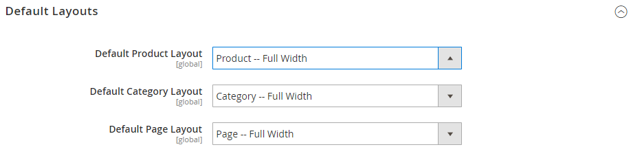

# [!DNL Page Builder] Setup

When enabled in the configuration, [!DNL Page Builder] is the default content creation tool for CMS Pages, Blocks, and Dynamic Blocks. In addition, the _[!UICONTROL Enable Advanced CMS]_ button offers [!DNL Page Builder] as an option for Categories and Products. You can also choose the default [page layout](../content-design/page-layout.md) that you want to use for products, categories, and CMS pages. [!DNL Page Builder] is not available for newsletter content, which uses the WYSIWYG [editor](../content-design/editor.md).

>[!NOTE]
>
>When installed, [!DNL Page Builder] overrides the default setting for the [!UICONTROL Mask for Meta Description] configuration field. The value is changed from `{{name}} {{description}}` to `{{name}}`.
>  
>You can access this setting when you go to [!UICONTROL Stores] > _[!UICONTROL Settings]_ > [!UICONTROL Configuration], expand [!UICONTROL Catalog], and choose [!UICONTROL Catalog] underneath. The [!UICONTROL Mask for Meta Description] field is in the [!UICONTROL Product Fields Auto-generation] section.

>[!NOTE]
>
>An Admin user must have [!UICONTROL Content] permissions for their [role scope](../systems/permissions-user-roles.md) to see [!UICONTROL Edit with Page Builder] buttons and be able to use Page Builder.

For more information about the Content Management Advanced Tools configuration options, see the [_Configuration Reference Guide_](../configuration-reference/general/content-management.md).

## Configure [!DNL Page Builder]

1. On the _Admin_ sidebar, go to **[!UICONTROL Stores]** > _[!UICONTROL Settings]_ > **[!UICONTROL Configuration]**.

1. In the left panel under _[!UICONTROL General]_, choose **[!UICONTROL Content Management]**.

1. Expand  **[!UICONTROL Advanced Content Tools]** and verify that **[!UICONTROL Enable Page Builder]** is set to `Yes`.

   <!-- zoom -->

1. If you are ready to set up [!DNL Google Maps], do the following:

   - If necessary, follow the [Get API Key][1] instructions, and then copy and paste your **[!UICONTROL Google Maps API Key]**.

   - To change the **[!UICONTROL Google Maps Style]**, paste the JSON code that is generated by the [[!DNL Google Maps] APIs Styling Wizard][2].

   >[!NOTE]
   >
   >See [Media - Map](map.md) for more information about using [!DNL Google Maps] in your [!DNL Page Builder] content.

1. To configure the number of guidelines in the [!DNL Page Builder] column grid, do the following:

   - For **[!UICONTROL Default Column Grid Size]**, enter the default number of columns that you want to appear in the grid.

   - For **[!UICONTROL Maximum Column Grid Size]**, enter the largest number of columns that you want to be available in the grid.

   >[!NOTE]
   >
   >See [Layout - Column](column.md) for more information about using the column grid when working with your [!DNL Page Builder] content.

1. When complete, click **[!UICONTROL Save Config]**.

## Configure default layouts

1. On the _Admin_ sidebar, go to **[!UICONTROL Stores]** > _[!UICONTROL Settings]_ > **[!UICONTROL Configuration]**.

1. In the left panel under _[!UICONTROL General]_, choose **[!UICONTROL Web]**.

1. Expand  **[!UICONTROL Default Layouts]** and do the following:

   <!-- zoom -->

   For more information about the Web configuration options, see the [_Configuration Reference Guide_](../configuration-reference/general/web.md#default-layouts).

   - Choose the **[!UICONTROL Default Product Layout]** that you want to use for product pages.

   - Choose the **[!UICONTROL Default Category Layout]** that you want to use for category pages.

   - Choose the **[!UICONTROL Default Page Layout]** that you want to use for CMS pages.

1. When complete, click **[!UICONTROL Save Config]**.

## Disable [!DNL Page Builder]

>[!NOTE]
>
>Disabling [!DNL Page Builder] replaces the Advanced Content Tools with the WYSIWYG [editor](../content-design/editor.md), and might cause display errors in the storefront. Content that you previously created with [!DNL Page Builder] might not be editable from the Admin.

1. On the _Admin_ sidebar, go to **[!UICONTROL Stores]** > _[!UICONTROL Settings]_ > **[!UICONTROL Configuration]**.

1. In the left panel under _[!UICONTROL General]_, choose **[!UICONTROL Content Management]**.

1. Expand  **[!UICONTROL Advanced Content Tools]** and set **[!UICONTROL Enable Page Builder]** to `No`.

1. When prompted to confirm, click **[!UICONTROL Turn Off]**.

   ![Turn off [!DNL Page Builder] - confirm](./assets/disable-page-builder-popup.png)<!-- zoom -->

1. When complete, click **[!UICONTROL Save Config]**.

1. When prompted, [refresh](../systems/cache-management.md) any invalid cache.

[1]: https://developers.google.com/maps/documentation/javascript/get-api-key
[2]: https://mapstyle.withgoogle.com/
