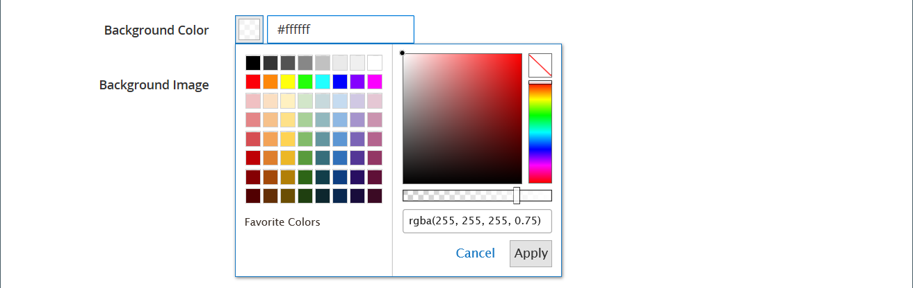

# Media - Slider

Use the _Slider_ content type to add a slideshow of images to the [[!DNL Page Builder] stage](workspace.md#stage). You can upload new images or choose existing images from the gallery or product catalog. A slider can be set to play automatically or be controlled manually with navigation buttons. To associate the slider with a specific promotion, see [Dynamic Block](dynamic-block.md).

{width="700" zoomable="yes"}

{{$include /help/_includes/page-builder-save-timeout.md}}

## Toolboxes

When you are working with the Slider content type, you add and edit individual slides and the slider container that holds one or more slides. Each slide has its own toolbox that you use to design slides on the [!DNL Page Builder] stage.

## Individual slide toolbox

{width="500" zoomable="yes"}

|Tool|Icon|Description|
|--- |--- |--- |
|Move|{width="25"}|Moves the slide to another position on the slider.|
|(label)|Slide #|Identifies the number of the current slide.|
|Settings|{width="25"}|Opens the _[!UICONTROL Edit Slide]_ page, where you can change the properties of the current slide.|
|Duplicate|{width="25"}|Makes a copy of the current slide.|
|Remove|{width="25"}|Deletes the current slide from the slider.|

{style="table-layout:auto"}

## Slider toolbox

|Tool|Icon|Description|
|--- |--- |--- |
|Move|{width="25"}|Moves the slider to another position on the stage.|
|(label)|[!UICONTROL Slider]|Identifies the slider container.|
|Settings|{width="25"}|Opens the _[!UICONTROL Edit Slider]_ page, where you can change the properties of the video and container.|
|Hide|{width="25"}|Hides the current slider.|
|Show|{width="25"}|Shows the  hidden slider.|
|Duplicate|{width="25"}|Makes a copy of the slider.|
|Remove|{width="25"}|Deletes the slider from the stage.|

{style="table-layout:auto"}

## Add an individual slide

1. Open the page, block, or dynamic block where you want to place the slider and expand the **[!UICONTROL Content]** section.

1. In the [!DNL Page Builder] panel, expand **[!UICONTROL Media]** and drag a **[!UICONTROL Slider]** placeholder to a row, column, or tab on the stage.

   In the following example, the background color of the row is yellow (`#fffd16`).

   {width="600" zoomable="yes"}

   The slider container is displayed on the stage with a single, empty slide.

1. Click in the slider container to display the [text editor](../content-design/editor.md) and enter content for the first slide.

   You can also include more complex banner content using the [Content](#content) settings.

1. Click the navigation dot at the bottom of the slider to display the toolbox for the individual slide and choose the _Settings_ ( {width="20"} ) icon.

   Sliders have two toolboxes. Be sure that you are using the slide toolbox at the bottom.

1. Complete the settings, as needed, according to following sections:

   - [[!UICONTROL Appearance]](#appearance)
   - [[!UICONTROL Background]](#background)
   - [[!UICONTROL Content]](#content)
   - [[!UICONTROL Search Engine Optimization]](#seo)
   - [[!UICONTROL Advanced]](#advanced)

1. When complete, click **[!UICONTROL Save]** to apply the settings and return to the [!DNL Page Builder] workspace.

## Add more slides

The following sections describe a series of steps to start with an individual slide and create a responsive slider that features and links to specific products. If you do not already have an individual slide, follow the previous instructions to add an individual slide to the stage.

To add slides, use one or a combination of the following methods:

### Method 1: Duplicate an existing slide

You can save time by duplicating a slide that has already been configured with the needed settings.

1. Click the navigation dot below the slide to display the toolbox and choose the _Duplicate_ ( {width="20"} ) icon.

   {width="500" zoomable="yes"}

1. Click the navigation dot for the new slide and to display the toolbox and choose the _Settings_ ( {width="20"} ) icon.

1. Modify the settings, as needed, according to following sections:

   - [[!UICONTROL Appearance]](#appearance)
   - [[!UICONTROL Background]](#background)
   - [[!UICONTROL Content]](#content)
   - [[!UICONTROL Advanced]](#advanced)

1. When complete, click **[!UICONTROL Save]** to apply the settings and return to the [!DNL Page Builder] workspace.

### Method 2: Add a New Blank Slide

1. Hover over the slider container at the top to display the toolbox and choose the _Add_ ( {width="20"} ) icon.

   {width="500" zoomable="yes"}

   A new blank slide with its own navigation dot and toolbox is added to the slider and displayed on the stage.

   {width="500" zoomable="yes"}

1. Click the navigation dot for the new slide and to display the toolbox and choose the _Settings_ ( {width="20"} ) icon.

1. Modify the settings, as needed, according to following sections:

   - [[!UICONTROL Appearance]](#appearance)
   - [[!UICONTROL Background]](#background)
   - [[!UICONTROL Content]](#content)
   - [[!UICONTROL Advanced]](#advanced)

1. When complete, click **[!UICONTROL Save]** in the upper-right corner to close the _[!UICONTROL Edit Slide]_ page.

### Add widget on a slide

You can add any [widgets type](../content-design/widgets.md#widget-types) to your slide in a [!DNL Page Builder] stage using the following steps:

1. [Create the widget](../content-design/widget-create.md) that you want to see on a slide.

1. Open the page, block, or dynamic block where you want to place the slider and expand the **[!UICONTROL Content]** section.

1. In the [!DNL Page Builder] panel, expand **[!UICONTROL Media]** and drag a **[!UICONTROL Slider]** placeholder to a row, column, or tab on the stage.

1. Click in the slider container to display the [text editor](../content-design/editor.md) toolbar and click the _Insert Widget_ ( {width="20"} ) icon.

1. Select the **[!UICONTROL Widget Type]** you need.

1. Specify the settings, which are different depending on the type of widget

   {width="600" zoomable="yes"}

1. When complete, click **[!UICONTROL Insert Widget]** in the upper-right corner.

1. Modify the other settings as needed.

1. When complete, click **[!UICONTROL Save]** in the upper-right corner.

   {width="600" zoomable="yes"}

### View each slide

To display each slide on the stage, click the next dot below the currently displayed slide.

{width="500" zoomable="yes"}

The slide in the preceding example has a background image, a transparent mobile image, and an inline image that was added from the text editor. This technique works well on mobile devices by turning off the background image, and displaying only the smaller inline image. The product slide in this example has the following additional settings:

| Option | Example setting |
|--- |--- |
|[!UICONTROL Appearance]|`Collage Right`|
|[!UICONTROL Background Color]|`#ffffff` (White)|
|[!UICONTROL Background Image]|The image on this slide was saved from the product page, and uploaded to the gallery.|
|[!UICONTROL Mobile Background Image]|The mobile background image is a transparent image that is 10 pixels square. Using a blank image for mobile effectively replaces the standard background image with an invisible image.|
|[!UICONTROL Background Size]|`Auto`|
|[!UICONTROL Message Text]|`Minerva LumaTech&trade; V-Tee` (Align center) with inserted image scaled at 40% (Align center)|
|[!UICONTROL Link]|`Product`|
|[!UICONTROL Show Button]|`Always`|
|[!UICONTROL Button Text]|`Buy Now`|
|[!UICONTROL Show Overlay]|`Never Show`|
|[!UICONTROL Alignment]|`Center` (to align the button)|
|[!UICONTROL Border]|`Solid`|
|[!UICONTROL Border Color]|`#000000` (Black)|
|[!UICONTROL Border Width]|`1 px`|

{style="table-layout:auto"}

## Change individual slide settings

1. Change the slider display on the stage and view the slide you want to change.

1. On the individual slide toolbox, choose the _Settings_ ( {width="20"} ) icon and complete the settings, as needed, according to following sections.

1. In the upper-right corner, click **[!UICONTROL Save]** to apply the settings and return to the [!DNL Page Builder] workspace.

### [!UICONTROL Appearance]

1. Choose one of the following slide placement types:

   | Type | Description |
   | ---- | ----------- |
   | `Poster` | Centers the slide content in the slider container. The overlay, if used, extends the full width of the slider. |
   | `Collage Left` | Places slide content in a defined area on the left side of the slider container. The overlay, if used, covers only the defined area. |
   | `Collage Center` | Places slide content in a defined area that is centered on the slider container. The overlay, if used, covers only the defined area. |
   | `Collage Right` | Places slide content in a defined area on the right side of the slider container. The overlay, if used, covers only the defined area. |

   {style="table-layout:auto"}

   {width="600" zoomable="yes"}

1. Enter the **[!UICONTROL Slide Name]**.

   When you are working in edit mode, the slide name appears as a tooltip above the navigation dot. The slide name is not visible from the storefront.

   {width="500" zoomable="yes"}

1. Enter the **[!UICONTROL Minimum Height]** for the slide.

   The minimum height can be a number with any valid CSS unit (such as `100px`, `50%`, `50em`, `100vh`) or a calculation (such as `100vh - 237px`).

   For example, you can set the slide's minimum height to cover the full height of the page, then use background images and videos for compelling design options.

   >[!NOTE]
   >
   >When the slide is set to the full height of the page (100vh), the slider that contains the slide also stretches the full height of the page to accommodate the height of the slide.

## [!UICONTROL Background]

There are many options for defining the background display of a slide. You can apply a simple color or background image, and manage more sophisticated effects.

### [!UICONTROL Background Color]

Specify the background color by choosing a swatch, clicking the color picker, or by entering a valid color name or equivalent hexadecimal value. This setting determines the background color of the row. You can also adjust the opacity of the color.

{width="200"}

You can set the value in one of three ways:

- A predefined color name, such as `White`
- The hexadecimal color value for the color, such as `#ffffff`
- The rgba value for the color, with opacity percent, such as `rgba(255, 255, 255, 0.75)`

If you want to choose a color, click the swatch to the left of the _No Color_ box.

{width="600" zoomable="yes"}

If you click the color box to open the color picker again, the box below the slider shows the current red, green, blue, and alpha values (rgba). The last number indicates the current opacity percentage as a decimal. You can use the slider to adjust the opacity, or enter the desired decimal value.

{width="600" zoomable="yes"}

>[!NOTE]
>
>[!DNL Page Builder] also supports a transparency layer, or _alpha channel_, in background images that can be used to create backgrounds with varying degrees of opacity.

### [!UICONTROL Background Type]

A background type can be an image or a video. [!DNL Page Builder] defaults to `Image` and shows various image settings. If you select `Video`, [!DNL Page Builder] swaps the image settings with video settings. Both background type settings are described in the following sections.

{width="200"}

### Image type settings

If you set the _[!UICONTROL Background Type]_ to `Image`, use the following settings to define the background image display.

{width="600" zoomable="yes"}

- **[!UICONTROL Background Image]** - If needed, use the provided tools to choose a background image to apply to the banner:

   | Tool | Description |
   | ---- | ----------- |
   | [!UICONTROL Upload] | Uploads an image file from your local computer to the gallery and then applies it as the background image for the banner. |
   | [!UICONTROL Select from Gallery] | Prompts you to choose an existing image from the gallery as the background image for the banner. |
   | {width="25"} | Allows you to either drag the image to the camera tile or browse to the image in your local file system. |

   {style="table-layout:auto"}

- **[!UICONTROL Background Mobile Image]** - If needed, use the same tools to choose a different background image to be used for display on mobile devices.

- **[!UICONTROL Background Size]** - Choose how the background image is scaled in relation to the width of the banner:

   | Option | Description |
   | ------ | ----------- |
   | `Cover` | The background image covers the full width of the banner. |
   | `Contain` | The background image is limited to the width of the content area. |
   | `Auto` | Applies the size from the current style sheet. |

   {style="table-layout:auto"}

   {width="300"}

- **[!UICONTROL Background Position]** - Choose how the background image is anchored in relation to the banner:

   | Anchor point | Position |
   | ------------ | -------- |
   | `Top` | Left / Center / Right |
   | `Center` | Left / Center / Right |
   | `Bottom` | Left / Center / Right |

   {style="table-layout:auto"}

   The anchor point is like a push pin that attaches the image to the banner at the specified background position.

- **[!UICONTROL Background Repeat]** - If you want to repeat the background image to fill the space, change this setting `Yes`.

### Video type settings

If you set the _Background Type_ to `Video`, use the following settings to define the background image display.

- **[!UICONTROL Video URL]** - Enter a valid video URL. Valid video URLs can be links to:

   - YouTube videos: `https://youtu.be/CoDhMRUUjeI`
   - Vimeo videos: `https://vimeo.com/190156113`
   - Valid video files (`.mp4` is recommended): `https://myvideos.com/spiral.mp4`

   {width="300"}

- **[!UICONTROL Overlay Color]** - Select a color to apply a transparent tint to the video.

- **[!UICONTROL Infinite Loop]** - Set to `No` to make the video play once and stop. When this option is set to `Yes` (default), the video repeats in an infinite loop.

- **[!UICONTROL Lazy Load]** - Set to `No` to make the video load with the page, even when not visible. When this option is set to `Yes` (default), the video loads from the source only when visible on the screen.

- **[!UICONTROL Play Only When Visible]** - Set to `No` to make the video start playing immediately after it loads, regardless of whether it is visible. When this option is set to `Yes` (default), the video starts playing only when it is visible.

- **[!UICONTROL Fallback Image]** - If needed, specify an image to display on the screen before the video loads and if the video does not load for some reason.

## [!UICONTROL Content]

You can modify the slide content directly on the stage or when you are changing the settings. The settings provide more complex content features, such as slide links and buttons, and overlays. The position of the content reflects the [Appearance](#appearance) placement setting.

### Simple content on the stage

1. Click the placeholder or existing text and enter the new text that you want to appear on the slide.

   The editor toolbar appears above the text box.

1. Use the editor toolbar to enter and format text, as well as insert elements, such as links, images, and widgets.

   {width="500" zoomable="yes"}

### Complex content in the settings

1. Click the navigation dot at the bottom of the slider to display the toolbox for the individual slide and choose the _Settings_ ( {width="20"} ) icon.

1. In the _[!UICONTROL Content]_ section, enter the **[!UICONTROL Message Text]** that you want to appear with the slide.

1. Scroll down to the _[!UICONTROL Content]_ section and use the **[!UICONTROL Message Text]** editor to enter and format banner text.

   You can also insert elements, such as text links, images, and widgets.

1. Format the text as needed using the editor toolbar.

   The first slide in this example has a background image, but no message text. The `Buy 3 Get 1 Free` text above the slider is in a Text container (added later).

1. If needed, specify a **[!UICONTROL Link]** for the slide.

   The link is the destination page that appears when the customer clicks the slide area. You can use one of three link types:

   - **[!UICONTROL URL]** - Links to either a relative or fully qualified URL.

   - **[!UICONTROL Product]** - Identifies the destination page based on the product name or SKU. Search for the product by name based on either a partial or full name. Choose the product from the search results list.

      {width="600" zoomable="yes"}

   - **[!UICONTROL Category]** - Identifies the destination page as a specific category or subcategory in the category tree. Search for the category based on either a partial or full name. Choose the category from the expanded section of the displayed tree.

      {width="600" zoomable="yes"}

   - **[!UICONTROL Page]** - Identifies the destination page as a specific content page. Search for the page based on either a partial or full name. Choose the page from the search results list.

      {width="600" zoomable="yes"}

    

   Starting with the 2.4.1 release, [!DNL Page Builder] no longer supports linking the slide and links within the nested text due to issues with display on the storefront. If you are using a link in the _[!UICONTROL Message Text]_, you cannot configure the _[!UICONTROL Link]_ option. If you prefer to use a single link for the whole slide, you can remove all links from the text.

   {width="300"}
   

   If you want to prevent the visitor from navigating away from your store, select the **[!UICONTROL Open in new tab]** checkbox. When the checkbox is cleared, the linked destination opens in the same browser tab, which could effectively navigate the visitor away from your store.

1. If needed, add a button to prompt customers to follow the link.

   The slide _Appearance_ position places a single link or button below the text. Complete the properties of the link or button that you want to add.

   {width="600" zoomable="yes"}

   >[!NOTE]
   >
   >You can also use multiple buttons or links by adding a [block](block.md) to the banner. To avoid conflict, keep all the links or buttons in the separate block, and do not add a link or button directly to the banner.

   - Set **[!UICONTROL Show Button]** to one of the following:

      | Option | Description |
      | ------ | ----------- |
      | `Always` | A button always appears on the slide. |
      | `On Hover` | A button appears on the slide only on hover. |
      | `Never Show` | A button never appears on the slide. |

      {style="table-layout:auto"}

   - Enter the **[!UICONTROL Button Text]** to display on the button.

   - Set **[!UICONTROL Button Type]** to one of the following:

      | Option | Description |
      | ------ | ----------- |
      | `Primary` | Applies the primary button style from the current style sheet. |
      | `Secondary` | Applies the secondary button style from the current style sheet, if applicable. |
      | `Link` | Creates a hyperlink rather than a button. |

      {style="table-layout:auto"}

      The button style from the current theme determines the button format. Typically, a primary button has a more prominent background color than a secondary button.

1. Set **[!UICONTROL Show Overlay]** to one of the following:

   | Option | Description |
   | ------ | ----------- |
   | `Always` | The overlay is always visible. |
   | `On Hover` | The overlay appears only on hover. |
   | `Never Show` | The overlay is not visible. |

   {style="table-layout:auto"}

   You can use an overlay to apply a background color to the active content area that is defined by the Appearance setting. The slide background image remains visible for the full width of the slide.

   {width="600" zoomable="yes"}

   If you choose to show an overlay, set the **[!UICONTROL Overlay Color]**:

   - Click the _No Color_ swatch, and choose a swatch.
   - In the **[!UICONTROL Color]** field, either enter a valid color name, or hexadecimal value.

   {width="600" zoomable="yes"}

## [!UICONTROL Search Engine Optimization] {#seo}

Text for these settings is visible to search engines and improves the way the page is indexed.

- For **[!UICONTROL Alternative Text]**, enter an _alt_ text description for digital accessibility tools to display.

   The use of alt text is an accessibility best practice, and is required by law in some locales. In HTML, the `alt` attribute is a subset of the `image` tag: `<image title="tooltip" alt="description" src="image.jpg">`.

- For **[!UICONTROL Title Attribute]**, enter the text to display as a tooltip on mouseover.

   As a best practice, choose a descriptive, keyword-rich title to improve the way the image is indexed by search engines. In HTML, the `title` attribute is a subset of the `image` tag: `<image title="tooltip" alt="description" src="image.jpg">`.

## [!UICONTROL Advanced]

1. To control the horizontal positioning of content added to the slide, choose the **[!UICONTROL Alignment]**:

   | Option | Description |
   | ------ | ----------- |
   | `Default` | Applies the alignment default setting that is specified in the style sheet of the current theme. |
   | `Left` |  Aligns the content along the left border of the slide, with allowance for any padding that is specified. |
   | `Center` | Aligns the content in the center of the slide, with allowance for any padding that is specified. |
   | `Right` | Aligns the content along the right border of the slide, with allowance for any padding that is specified. |

   {style="table-layout:auto"}

1. Set the **[!UICONTROL Border]** style that is applied to all four sides of the slide:

   | Option | Description |
   | ------ | ----------- |
   | `Default` | Applies the default border style that is specified by the associated style sheet. |
   | `None` | Does not provide any visible indication of the slide borders. |
   | `Dotted` | The container border appears as a dotted line. |
   | `Dashed` | The container border appears as a dashed line. |
   | `Solid` | The container border appears as a solid line. |
   | `Double` | The container border appears as a double line. |
   | `Groove` | The container border appears as a grooved line. |
   | `Ridge` | The container border appears as a ridged line. |
   | `Inset` | The container border appears as an inset line. |
   | `Outset` | The container border appears as an outset line. |

   {style="table-layout:auto"}

1. If you set a border style other than `None`, complete the border display options:

   {width="600" zoomable="yes"}

   | Option | Description |
   | ------ |------------ |
   | [!UICONTROL Border Color] | Specify the color by choosing a swatch, clicking the color picker, or by entering a valid color name or equivalent hexadecimal value. |
   | [!UICONTROL Border Width] | Enter the number of pixels for the border line width. |
   | [!UICONTROL Border Radius] | Enter the number of pixels to define the size of the radius that is used to round each corner of the border. |

   {style="table-layout:auto"}

1. (Optional) Specify the names of **[!UICONTROL CSS classes]** from the current style sheet to apply to the slide.

   Separate multiple class names with a space.

1. Enter values, in pixels, for the **[!UICONTROL Margins and Padding]** to specify the outer margins and inner padding of the slide.

   Enter each corresponding value in the slide diagram.

   | Container area | Description |
   | -------------- | ----------- |
   | [!UICONTROL Margins] | The amount of blank space that is applied to the outside edge of all sides of the slide. |
   | [!UICONTROL Padding] |  The amount of blank space that is applied to the inside edge of all sides of the slide. |

   {style="table-layout:auto"}

## Add a slider title

If you want a title above the slider, simply add a [Text content type] above the slider. Then, format the text as needed.

1. In the [!DNL Page Builder] panel, expand **[!UICONTROL Elements]** and drag a **Text** placeholder to a row, column, or tab set on the stage.

   As you drag, a red guideline marks the insertion point above the slider.

   {width="600" zoomable="yes"}

1. Use the editor to format the text as needed.

   {width="500" zoomable="yes"}

## Change slider settings

1. Hover over the slider container to show the main toolbox and choose the _Settings_ ( {width="20"} ) icon.

   {width="500" zoomable="yes"}

1. Enter the **[!UICONTROL Minimum Height]** for the slide.

   The minimum height can be a number with any valid CSS unit (such as `100px`, `50%`, `50em`, `100vh`) or a calculation (such as `100vh - 237px`).

   For example, you can set the minimum height of a slider to stretch the full height of the page, giving you compelling options for full-page background images and videos.

   {width="300"}

1. If you want the slider to begin when the page loads, set **[!UICONTROL Autoplay]** to `Yes` and set **[!UICONTROL Autoplay Speed]** to the number of milliseconds in the delay between slides.

   By default, the speed is set to 4000 ms, which is four seconds. If you set autoplay to `No`, the first slide appears by default and the customer must click the slide navigation (dots or arrows) to display the next slide in sequence.

   {width="600" zoomable="yes"}

1. To smooth the transition from one slide to the next, set **[!UICONTROL Fade]** to `Yes`.

   With fade, the slides seem to stay in place, but the content changes smoothy from one to the next. Without fade, you see the horizontal movement from one slide to the next.

   {width="600" zoomable="yes"}

1. To make the slideshow repeat indefinitely while the page is open, set **[!UICONTROL Infinite Loop]** to `Yes`.

1. To choose the type of navigation controls for the slider, do the following:

   - To include _Next_ and _Previous_ arrows on the left and right side of each slide, set **[!UICONTROL Show Arrows]** to `Yes`.

   - To include a set of navigation dots below the slider, set **[!UICONTROL Show Dots]** to `Yes`.

   {width="600" zoomable="yes"}

1. Complete the [Advanced](#slider-advanced) slider settings as needed.

1. When complete, click **[!UICONTROL Save]** to apply the settings and return to the [!DNL Page Builder] workspace.

### Advanced - slider {#slider-advanced}

1. To control the positioning of the slides within the parent slider container, choose the **[!UICONTROL Alignment]**:

   | Option | Description |
   | ------ | ----------- |
   | `Default` | Applies the alignment default setting that is specified in the style sheet of the current theme. |
   | `Left` | Aligns the slides along the left border of the slider container, with allowance for any padding that is specified. |
   | `Center` | Aligns the slides in the center of the slider container, with allowance for any padding that is specified. |
   | `Right` | Aligns the slides along the right border of the slider container, with allowance for any padding that is specified. |

   {style="table-layout:auto"}

1. Set the **[!UICONTROL Border]** style that is applied to all four sides of the slider container:

   | Option | Description |
   | ------ | ----------- |
   | `Default` | Applies the default border style that is specified by the associated style sheet. |
   | `None` | Does not provide any visible indication of the container borders. |
   | `Dotted` | The container border appears as a dotted line. |
   | `Dashed` | The container border appears as a dashed line. |
   | `Solid` | The container border appears as a solid line. |
   | `Double` | The container border appears as a double line. |
   | `Groove` | The container border appears as a grooved line. |
   | `Ridge` | The container border appears as a ridged line. |
   | `Inset` | The container border appears as an inset line. |
   | `Outset` | The container border appears as an outset line. |

   {style="table-layout:auto"}

1. If you set a border style other than `None`, complete the border display options:

   | Option | Description |
   | ------ |------------ |
   | [!UICONTROL Border Color] | Specify the color by choosing a swatch, clicking the color picker, or by entering a valid color name or equivalent hexadecimal value. |
   | [!UICONTROL Border Width] | Enter the number of pixels for the border line width. |
   | [!UICONTROL Border Radius] | Enter the number of pixels to define the size of the radius that is used to round each corner of the border. |

   {style="table-layout:auto"}

1. (Optional) Specify the names of **[!UICONTROL CSS classes]** from the current style sheet to apply to the slider container.

   Separate multiple class names with a space.

1. Enter values, in pixels, for the **[!UICONTROL Margins and Padding]** to determine the outer margins and inner padding of the slider container.

   Enter the corresponding values in the diagram.

   | Container area | Description |
   | -------------- | ----------- |
   | [!UICONTROL Margins] | The amount of blank space that is applied to the outside edge of all sides of the container.|
   | [!UICONTROL Padding] | The amount of blank space that is applied to the inside edge of all sides of the container. |

   {style="table-layout:auto"}

## Test the slider

1. Open the page where you have included the slider, set **[!UICONTROL Enable Page]** to `Yes`.

1. In the upper-right corner, click the **[!UICONTROL Save]** arrow and choose **[!UICONTROL Save & Close]**.

1. Find the page in the _Pages_ grid and select **[!UICONTROL View]** in the _[!UICONTROL Action]_ column.

   {width="600" zoomable="yes"}

   When you preview the slider, resize the window so you can see how it appears on a mobile device.

   {width="400" zoomable="yes"}
