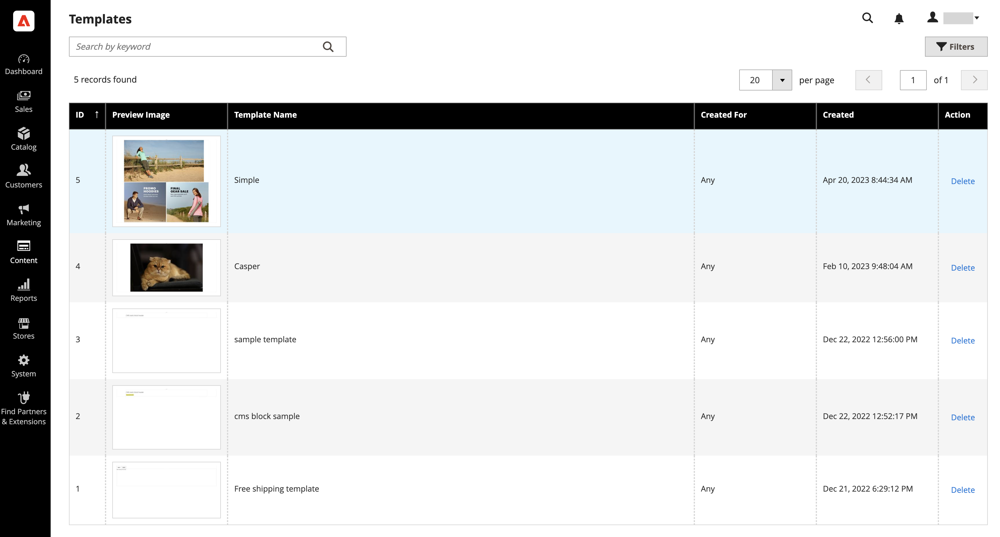

# [!DNL Page Builder] Templates

Templates are containers that save [!DNL Page Builder] content and layouts of existing pages, blocks, dynamic blocks, product attributes, and category descriptions. Using templates saves you time and effort when creating content (or replacing older content). For example, you can save your existing [!DNL Page Builder] content as a template, and then apply that template (with all of its content and layouts) to another area to quickly create [!DNL Page Builder] content.

## Access templates

On the _Admin_ sidebar, go to **[!UICONTROL Content]** > _[!UICONTROL Elements]_ > **[!UICONTROL Templates]**.

<!-- zoom -->

## Save [!DNL Page Builder] content as a template

1. Navigate to the [[!DNL Page Builder] stage](workspace.md#stage) and access the content you want to save as a template.

   This can be a page, block, dynamic block, product attribute, or category description.

1. Above the stage, click **[!UICONTROL Save as Template]** at the top right.

   ![[!DNL Page Builder] stage with Save as Template button](./assets/pb-templates-saveastemplate-button.png)<!-- zoom -->

   This action displays the _[!UICONTROL Save Content as Template]_ dialog.

   ![[!DNL Page Builder] Save as Template dialog](./assets/pb-templates-save-dialog.png)<!-- zoom -->

1. For **[!UICONTROL Template Name]**, enter a unique name for the template.

   A unique name is required so that it can be searched, selected, and applied to another content area as needed.

1. If needed, set **Created For** to assign the template to a particular content area type.

   When you add this assignment, it can be filtered and more easily found when you want to apply that template later. But it does not limit its use to that area. You can use any template anywhere that [!DNL Page Builder] content is allowed.

1. Click **[!UICONTROL Save]**.

   A confirmation message appears indicating that your template is saved.

## Apply a template

You can apply a template to a [!DNL Page Builder] content area (page, block, dynamic block, product attribute, or category description).

1. Navigate to the content area where you want to apply the template.

1. In the content area, click **[!UICONTROL Apply Template]** at the top right.

   ![[!DNL Page Builder] Apply Template button](./assets/pb-templates-applytemplate-button.png)<!-- zoom -->

1. Choose a template from the _[!UICONTROL Apply Template]_ grid and click **[!UICONTROL Apply]** at the end of the row.

   To see the entire template, you can click the template thumbnail image. This action expands the image so you can view the entire template as needed.

   ![[!DNL Page Builder] Apply Template grid](./assets/pb-templates-apply-slideout-nofilters.png)<!-- zoom -->

## Delete a template

1. On the _Admin_ sidebar, go to **[!UICONTROL Content]** > **[!UICONTROL Templates]**.

1. From the _Templates_ page, choose a template and click **[!UICONTROL Delete]** at the end of the row.

   To see the entire template, you can click the template thumbnail image. This action expands the image so you can view the entire template as needed.

1. When prompted, confirm the removal of the template.

## Filter templates

The _Apply Template_ grid and the _Templates_ page grid provide two ways to filter the templates grid:

- Use the search box at the top left to filter the grid by the template name, based on the entered text.

- Click **[!UICONTROL Filters]** to open the filters options, where you can filter templates by:

   - A range of template IDs (**[!UICONTROL ID]**)
   - A range of creation dates (**[!UICONTROL Created]**)
   - The template name (**[!UICONTROL Template Name]**)
   - The designated content area (**[!UICONTROL Created For]**)

![[!DNL Page Builder] Apply Template grid](./assets/pb-templates-apply-slideout-withfilters.png)<!-- zoom -->
