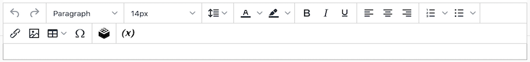
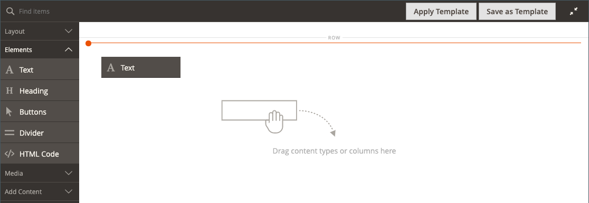
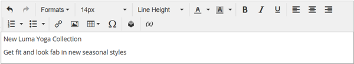

# Elements - Text

Use the _Text_ content type to add a text container with a WYSIWYG (“What You See Is What You Get”) editor in the [[!DNL Page Builder] stage](workspace.md#stage). In addition, you can add links, images, [variables](https://docs.magento.com/user-guide/marketing/variables.html), and widgets to the text from the editor toolbar.

<!-- zoom -->

{{$include /help/_includes/page-builder-save-timeout.md}}

## Text editor tools

You can access the text editor directly from the stage or from a settings page. Changes made directly to the stage are saved automatically. For more information, see [Using the Editor](https://docs.magento.com/user-guide/cms/editor.html).

<!-- zoom -->

## Text container toolbox

<!-- zoom -->

| Tool      | Icon                  | Description    |
| --------- | --------------------- | -------------- |
| Move      | | Moves the text container to another valid place on the page. |
| (label)   | TEXT      | Identifies the current container as a text element.          |
| Settings  |   | Opens the text container properties in edit mode.|
| Hide      |       | Hides the text container. |
| Show      |       | Shows the hidden text container. |
| Duplicate |  | Makes a copy of the text container. |
| Remove    |     | Deletes the text container and its content from the stage. |

{style="table-layout:auto"}

## Add text

1. In the [!DNL Page Builder] panel, expand **[!UICONTROL Elements]** and drag a **[!UICONTROL Text]** placeholder to a row, column, or tab set on the stage.

   <!-- zoom -->

1. Use the editor to enter and format text, as needed.

   For more information, see [Using the Editor](https://docs.magento.com/user-guide/cms/editor.html).

   <!-- zoom -->

## Create a link

The Insert Link button in the editor makes it easy to add a hyperlink to an image in the gallery. However, it can also be used to create an inline link in text, if you have the URL in advance. Unlike the Widget button, the Insert/Edit link button is not integrated with pages, products, or categories in the store.

To create a link for a telephone number or email, see [Adding Custom Variables](https://docs.magento.com/user-guide/marketing/variables-custom.html).

1. In the storefront, navigate to the page that is to be the target destination for the link and copy the link information.

   You can use either the fully qualified URL or a relative URL that omits the reference to your store domain.

   Full URL - `https://mystore.com/women/tops-women/tees-women.html`

   Relative URL - `../women/tops-women/tees-women.html`

1. Select the text in the editor space and click _Insert/edit link_ () on the editor toolbar.

   <!-- zoom -->

1. For **[!UICONTROL URL]**, enter the relative link that you prepared.

1. Set **[!UICONTROL Target]** to `None`.

   This setting opens the page in the same browser window, rather than opening a new tab.

1. For **[!UICONTROL Title]**, enter `Shop Tees`.

   The `Title` link attribute is used by some browsers as a tooltip.

1. To save the link and return to the [!DNL Page Builder] workspace, click **[!UICONTROL OK]**.

   <!-- zoom -->

## Insert an image

1. Place the cursor in the text where you want to insert the image.

1. Click _Insert/edit image_ () on the editor toolbar.

1. For **[!UICONTROL Source]**, click the search icon to use the media storage for locating and selecting an image.

1. For **[!UICONTROL Image Description]**, enter descriptive text for the image.

   This text populates the `alt` link attribute for the image and is used by some browsers for accessibility.

1. Enter the width and height **[!UICONTROL Dimensions]**, in pixels, for rendering the image on the page.

   Keep the **[!UICONTROL Constrain proportions]** checkbox selected to automatically maintain the aspect ratio for the image.

1. To insert the image and then return to the [!DNL Page Builder] workspace, click **[!UICONTROL OK]**.

## Change text settings

1. Hover over the text container to display the toolbox and choose the _Settings_ (  ) icon.

   >[!NOTE]
   >
   >Because the text container is tightly nested inside another container, make sure that you have the correct toolbox.

1. Update the content as needed.

1. Update the _[!UICONTROL Advanced]_ settings as needed.

   - To control the positioning of the text within the parent container, choose an **[!UICONTROL Alignment]**:

      | Option | Description |
      | ------ |------------ |
      | `Default` | Applies the alignment default setting that is specified in the style sheet of the current theme. |
      | `Left` | Aligns the list along the left border of the parent container, with allowance for any padding that is specified. |
      | `Center` | Aligns the list in the center of the parent container, with allowance for any padding that is specified. |
      | `Right` | Aligns the block along the right border of the parent container, with allowance for any padding that is specified. |

      {style="table-layout:auto"}

   - Set the **[!UICONTROL Border]** style that is applied to all four sides of the text container:

      | Option | Description |
      | ------ |------------ |
      | `Default` | Applies the default border style that is specified by the associated style sheet. |
      | `None` | Does not provide any visible indication of the container borders. |
      | `Dotted` | The container border appears as a dotted line. |
      | `Dashed` | The container border appears as a dashed line. |
      | `Solid` | The container border appears as a solid line. |
      | `Double` | The container border appears as a double line. |
      | `Groove` | The container border appears as a grooved line. |
      | `Ridge` | The container border appears as a ridged line. |
      | `Inset` | The container border appears as an inset line. |
      | `Outset` | The container border appears as an outset line. |

      {style="table-layout:auto"}

   - If you set a border style other than `None`, complete the border display options:

      | Option | Description |
      | ------ |------------ |
      | [!UICONTROL Border Color] | Specify the color by choosing a swatch, clicking the color picker, or by entering a valid color name or equivalent hexadecimal value. |
      | [!UICONTROL Border Width] | Enter the number of pixels for the border line width. |
      | [!UICONTROL Border Radius] | Enter the number of pixels to define the size of the radius that is used to round each corner of the border. |

      {style="table-layout:auto"}

   - (Optional) Specify the names of **[!UICONTROL CSS classes]** from the current style sheet to apply to the container.

      Separate multiple class names with a space.

   - Enter values, in pixels, for the **[!UICONTROL Margins and Padding]** to determine the outer margins and inner padding of the text container.

      Enter the corresponding values in the diagram.

      | Container area | Description |
      | -------------- |------------ |
      | [!UICONTROL Margins] | The amount of blank space that is applied to the outside edge of all sides of the container. Options: `Top` / `Right` / `Bottom` / `Left` |
      | [!UICONTROL Padding] | The amount of blank space that is applied to the inside edge of all sides of the container. Options: `Top` / `Right` / `Bottom` / `Left` |

      {style="table-layout:auto"}

1. When complete, click **[!UICONTROL Save]** to apply the settings and return to the [!DNL Page Builder] workspace.
