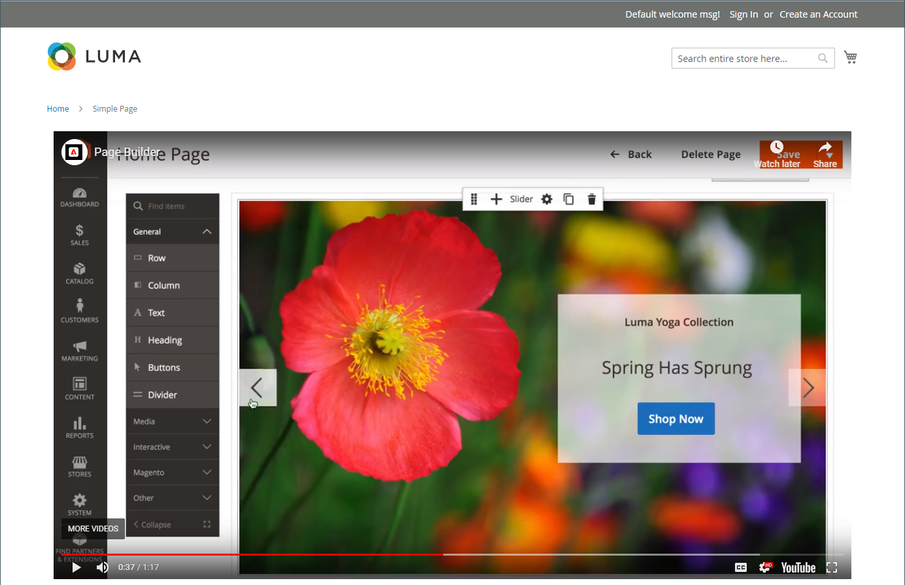
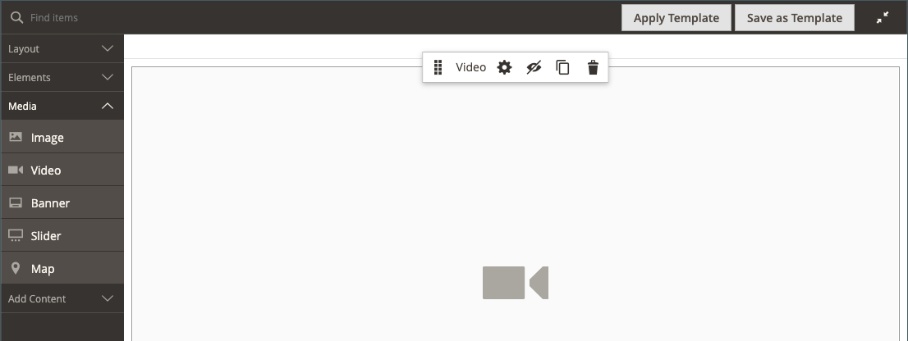
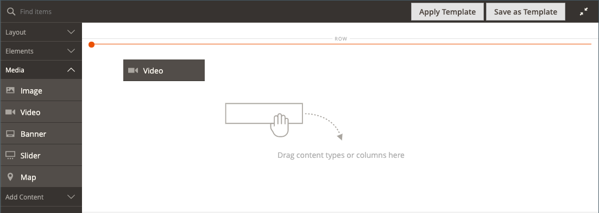
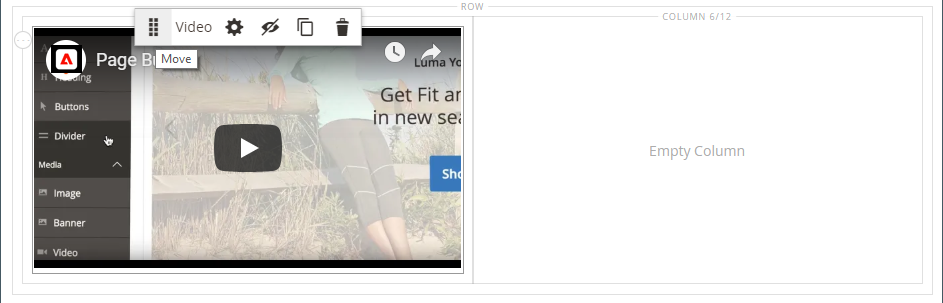
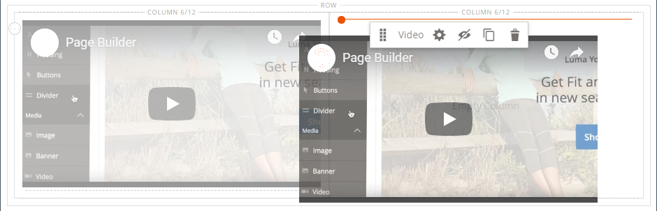

# Media - Video

Use the _Video_ content type to add a video that is hosted on [YouTube][1] or [Vimeo][2] to the [[!DNL Page Builder] stage](workspace.md#stage). It’s easy to embed video in a page or block, and in product and category descriptions.

<!-- zoom -->

{{$include /help/_includes/page-builder-save-timeout.md}}

## Video toolbox

<!-- zoom -->

|Tool|Icon|Description|
|--- |--- |--- |
|Move|<!-- width="25px" -->|Moves the video to another position on the stage.|
|(label)|[!UICONTROL Video]|Identifies the current content container as a video. Hover over the image container to see the toolbox.|
|Settings|<!-- width="25px" -->|Opens the _[!UICONTROL Edit Video]_ page, where you can change the properties of the video and container.|
|Hide|<!-- width="25px" -->|Hides the current video.|
|Show|<!-- width="25px" -->|Shows the  hidden video.|
|Duplicate|<!-- width="25px" -->|Makes a copy of the video.|
|Remove|<!-- width="25px" -->|Deletes the video from the stage.|

{style="table-layout:auto"}

## Add a video

1. Before you begin, navigate to the [YouTube][1] or [Vimeo][2] video that you want to embed, and copy the link.

   As an alternative, you can also copy a direct link to a valid video file. See [Basic video settings](#basic-video-settings) for valid links.

1. In the [!DNL Commerce] Admin, return to the [!DNL Page Builder] workspace where you want to add the video.

1. In the [!DNL Page Builder] panel, expand **[!UICONTROL Media]** and drag a **[!UICONTROL Video]** placeholder to the stage.

   <!-- zoom -->

1. Hover over the video container to display the toolbox and choose the _Settings_ (<!-- width="20px" --> ) icon.

1. For **[!UICONTROL Video URL]**, paste the URL of the video that you copied.

   The URL of the [!DNL Page Builder] video that is used in this example is: `https://www.youtube.com/watch?v=Y0KNS7C5dZA`.

1. To limit the **[!UICONTROL Maximum Width]** of the video, enter the maximum width in pixels.

   If blank, the video is as wide as allowed by the container, allowing for margins and padding.

1. In the upper-right corner, click **[!UICONTROL Save]** to apply the settings and return to the [!DNL Page Builder] workspace.

## Change video settings

1. Hover over the video container to display the toolbox and choose the _Settings_ (<!-- width="20px" --> ) icon.

1. Modify the settings according to the following sections:

   - [Basic](#basic-video-settings)
   - [Advanced](#advanced)

1. In the upper-right corner, click **[!UICONTROL Save]** to apply the settings and return to the [!DNL Page Builder] workspace.

### Basic video settings

1. To change the current video, update the **[!UICONTROL Video URL]**.

   Enter a valid video URL. Valid video URLs can be links to:

   - YouTube videos: `https://youtu.be/CoDhMRUUjeI`
   - Vimeo videos: `https://vimeo.com/190156113`
   - Valid video files (`.mp4` is recommended): `https://myvideos.com/spiral.mp4`

1. To change the width that is allowed for the video in the storefront, enter the new **[!UICONTROL Maximum Width]** in pixels.

   If blank, the video extends the full width of the container, less allowance for margins and padding.

1. To auto-start the video after the page loads, set **[!UICONTROL Autoplay]** to `Yes`.

   If Autoplay is set to `Yes`, the video is muted on playback according to policy. However, even with this setting, mobile devices cannot autoplay your videos. For more information about these policies, refer to the following developer resources:

   - [Autoplay policy from Vimeo](https://vimeo.zendesk.com/hc/en-us/articles/115004485728-Autoplaying-and-looping-embedded-videos)
   - [Autoplay policy from Google (Chrome/YouTube)](https://developer.chrome.com/blog/autoplay/)
   - [Autoplay policy for local videos](https://developer.mozilla.org/en-US/docs/Web/Media/Autoplay_guide)

   If Autoplay is set to `No`, the video plays on user demand only.

### [!UICONTROL Advanced]

1. To control the horizontal positioning of the video within the container, choose an **[!UICONTROL Alignment]**:

   | Option | Description |
   | ------ | ----------- |
   | `Default` | Applies the alignment default setting that is specified in the style sheet of the current theme. |
   | `Left` | Aligns the content along the left border of the video container, with allowance for any padding that is specified. |
   | `Center` | Aligns the content in the center of the video container, with allowance for any padding that is specified. |
   | `Right` | Aligns the content along the right border of the video container, with allowance for any padding that is specified. |

   {style="table-layout:auto"}

- Set the **[!UICONTROL Border]** style that is applied to all four sides of the video container:

   | Option | Description |
   | ------ | ----------- |
   | `Default` | Applies the default border style that is specified by the associated style sheet. |
   | `None` | Does not provide any visible indication of the container borders. |
   | `Dotted` | The container border appears as a dotted line. |
   | `Dashed` | The container border appears as a dashed line. |
   | `Solid` | The container border appears as a solid line. |
   | `Double` | The container border appears as a double line. |
   | `Groove` | The container border appears as a grooved line. |
   | `Ridge` | The container border appears as a ridged line. |
   | `Inset` | The container border appears as an inset line. |
   | `Outset` | The container border appears as an outset line. |

   {style="table-layout:auto"}

- If you set a border style other than `None`, complete the border display options:

   <!-- zoom -->

   | Option | Description |
   | ------ |------------ |
   | [!UICONTROL Border Color] | Specify the color by choosing a swatch, clicking the color picker, or by entering a valid color name or equivalent hexadecimal value. |
   | [!UICONTROL Border Width] | Enter the number of pixels for the border line width. |
   | [!UICONTROL Border Radius] | Enter the number of pixels to define the size of the radius that is used to round each corner of the border. |

   {style="table-layout:auto"}

- (Optional) Specify the names of **[!UICONTROL CSS classes]** from the current style sheet to apply to the video container.

   Separate multiple class names with a space.

- Enter values, in pixels, for the **[!UICONTROL Margins and Padding]** to specify the outer margins and inner padding of the video container.

   Enter each corresponding value in the video container diagram.

   | Container area | Description |
   | -------------- | ----------- |
   | [!UICONTROL Margins] | The amount of blank space that is applied to the outside edge of all sides of the container. |
   | [!UICONTROL Padding] | The amount of blank space that is applied to the inside edge of all sides of the container. |

   {style="table-layout:auto"}

## Move a video

1. Hover over the video container to display the toolbox and choose the _Move_ () icon.

   <!-- zoom -->

1. Select and drag the video to the new position, just below the red guideline.

   <!-- zoom -->

## Remove a video from the stage

1. Hover over the video container to display the toolbox and choose the _Remove_ () icon.

1. When prompted to confirm, click **[!UICONTROL OK]**.

[1]: https://www.youtube.com/
[2]: https://vimeo.com/
