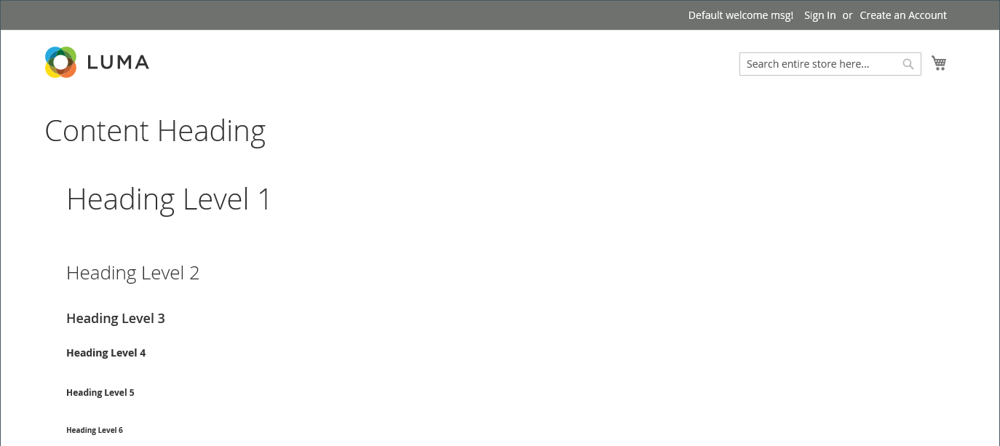
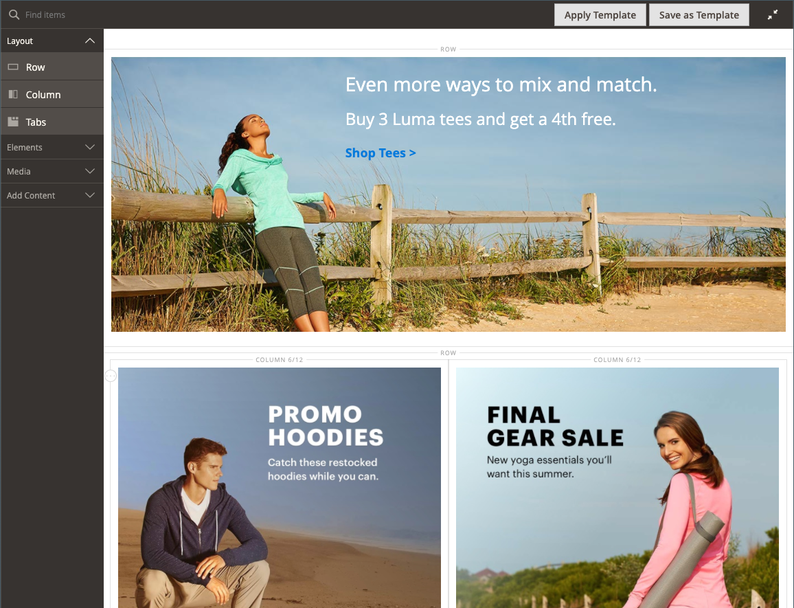
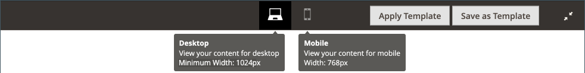
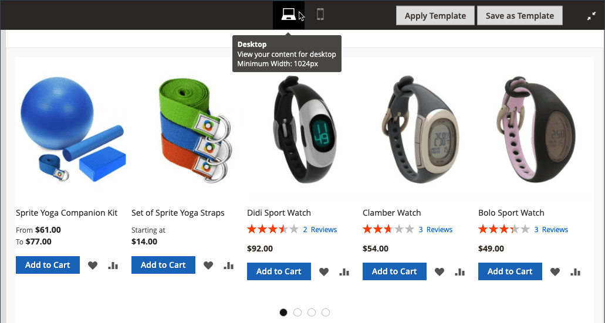
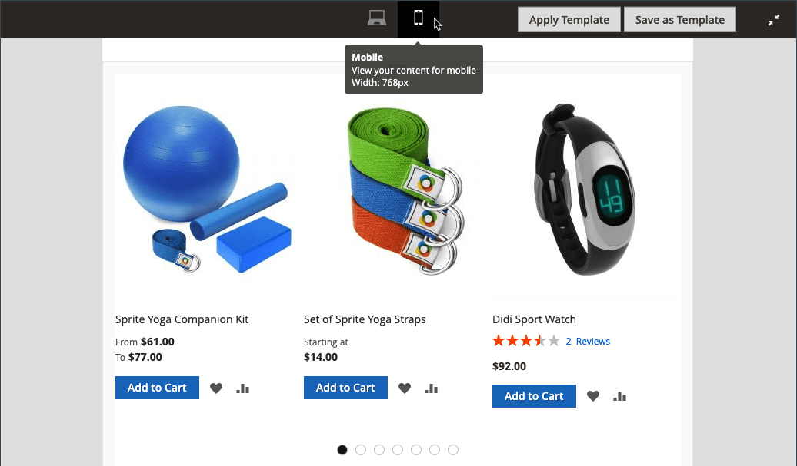
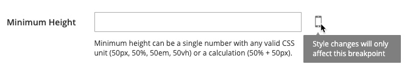
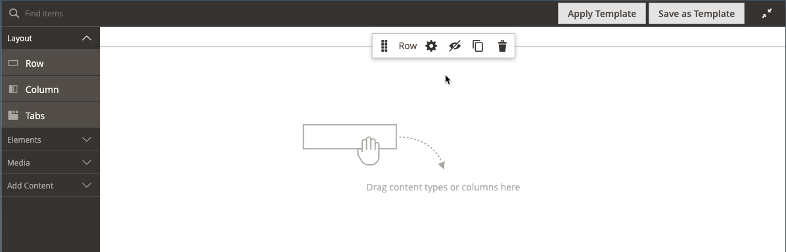

# [!DNL Page Builder] Workspace

When [[!DNL Page Builder] is enabled](setup.md), the _[!UICONTROL Content]_ section and content creation process are modified to take advantage of the advanced [!DNL Page Builder] tools for CMS [pages](https://docs.magento.com/user-guide/cms/page-add.html), [product](https://docs.magento.com/user-guide/catalog/product-content.html) and [category](https://docs.magento.com/user-guide/catalog/categories-content-settings.html) pages, [blocks](https://docs.magento.com/user-guide/cms/block-add.html), and [dynamic blocks](https://docs.magento.com/user-guide/cms/dynamic-blocks.html). This section includes a _Content Heading_ field, a preview of the content, and easy access to the full-screen [!DNL Page Builder] workspace.

![Content section with [!DNL Page Builder] preview](./assets/pb-content-preview.png)<!-- zoom -->

## Content Heading

Because search engines look for level one (H1) headings, adding a level one heading is an easy way to ensure that the page is indexed correctly.

>[!NOTE]
>
>The _[!UICONTROL Content Heading]_ field that appears at the top of the page is a legacy field that supports content that was created with earlier [!DNL Commerce] releases. It is not, however, part of [!DNL Page Builder]. The [!UICONTROL Content Heading] is formatted as an H1 heading according to the style sheet that is associated with the current theme. It is positioned just above the active content area that is defined by the [!DNL Page Builder] stage.

For the best control over the positioning and format of headings of all levels, it is recommended that you leave the _[!UICONTROL Content Heading]_ field empty, and use the [!DNL Page Builder] [Heading](heading.md) content type.

<!-- zoom -->

## Preview

When you expand the _[!UICONTROL Content]_ section and there is existing content created with [!DNL Page Builder], it displays a preview of the content as it would appear in a page. Click **[!UICONTROL Edit with Page Builder]** or inside the content preview area to open the [!DNL Page Builder] workspace, where you can make any needed updates.

<!-- zoom -->

>[!NOTE]
>
>For the product and category forms, this content preview is enabled by default, but can be disabled. If performance suffers due to loading the preview, you can disable the preview in the [Content Management configuration](https://docs.magento.com/user-guide/configuration/general/content-management.html#advanced-content-tools) settings.

## Stage

When you open the [!DNL Page Builder] workspace from the preview, the stage is the primary work area where you can create and format content, and even make quick edits to live content. The stage is initially empty, providing the design surface where you can drag rows, columns, and tabs from the left panel.

>[!NOTE]
>
>Starting with the 2.4.1 release, content editing is now full-screen only for all areas controlled by [!DNL Page Builder]---CMS pages, product and category pages, blocks, and dynamic blocks. Full-screen editing puts the focus on your content and provides a view that better matches the user experience on the storefront.

<!-- zoom -->

{{$include /help/_includes/page-builder-save-timeout.md}}

## Viewports

A _viewport_ is the visible area of a web page that a user sees. In full-screen design mode, the viewport buttons are displayed above the [!DNL Page Builder] stage to show you the content as the site user sees it on the storefront.

<!-- zoom -->
_Viewport buttons_

[!DNL Page Builder] also defines breakpoints for viewports. Breakpoints define minimum and maximum widths within which certain styles are applied. The [!DNL Page Builder] viewports provide the following content breakpoints:

- **Desktop breakpoint**—`min-width: 1024px`. This breakpoint applies styles defined for viewport widths that measure 1024 pixels and wider.
- **Mobile breakpoints**—`max-width: 768px, min-width: 640px`. These breakpoints apply styles defined for viewport widths between 768 pixels and 640 pixels.

[!DNL Page Builder] viewports provide two features: **_content previews_** and **_breakpoint settings_**.

### Content previews

By default, [!DNL Page Builder] provides two viewport previews:

- **Desktop** — Displays the content preview without a predefined width. Desktop-defined styles (using breakpoint minimum width of 1024 pixels) are still applied to the page. But the Desktop viewport width is defined by settings for container content types, like Rows. Selecting the Desktop viewport shows how your content is styled on the storefront when the browser page width is 1024 pixels and wider.

   <!-- zoom -->

- **Mobile** — Displays the content preview at a predefined width of 768 pixels. Unlike the Desktop viewport, the Mobile viewport does show your page content at a width of 768 pixels, along with the styles defined for the breakpoint widths of 768 pixels (maximum) and 640 pixels (minimum).

   <!-- zoom -->

### Breakpoint settings

The viewport buttons also provide the option to apply different breakpoint styles to content types based on the selected viewport. By default, [!DNL Page Builder] provides breakpoint settings for the _[!UICONTROL Minimum Height]_ fields of Rows, Columns, Tabs, Tab Items, Banners, Sliders, and Slides. When you select the Mobile viewport, then open the editor for one of those content types, you can enter field values specific to the Mobile viewport breakpoints. Content type fields that allow specific breakpoint settings display an icon to the right of the field, similar to the following example for a Row:

<!-- zoom -->

## Panel

The [!DNL Page Builder] panel is located to the left of the stage, and contains content types that can be dragged to the stage. A container that is specific to the content type then appears with a toolbox of options. Content types are organized in the panel as follows:

### Layout

The _[!UICONTROL Layout]_ section of the [!DNL Page Builder] panel is used to add rows, columns, or tabs to the stage. When you drag a content type from the panel to the stage, a container appears with a toolbox of options that are specific to the content type.

By default, the [!DNL Page Builder] stage is empty. As you drag layout content types from the panel to the stage, you can place them above, below, or inside other layout containers on the page. Rows can only be added directly to the stage.

![[!DNL Page Builder] panel with layout content types and stage](./assets/pb-stage-toolbox.png)

| Layout content type | Description |
| ------------------- |------------ |
| [Row](row.md) | A new row can only be dragged from the panel to the stage, and positioned either above or below another row, tab, or column group. You can also use the Duplicate option to make a copy of an existing row. |
| [Column](column.md) | A column can be dragged from the panel to the stage, or to rows and tabs. The maximum number of columns that can be added is determined by the number of grid divisions that is specified in the [configuration](setup.md). |
| [Tabs](tabs.md) | A single tab can be dragged from the panel to the stage, or to rows and columns. Additional tabs can be added from the toolbox. |

{style="table-layout:auto"}

### Elements

Use the _[!UICONTROL Elements]_ section of the [!DNL Page Builder] panel to add text, headings, buttons, dividers, and HTML code to any layout container on the [[!DNL Page Builder] stage](workspace.md#stage). When you drag a content type from the panel to either a row or column, or to a tab set on the stage, a container appears. Use the content type toolbox to access the settings that are specific to the type.

![[!DNL Page Builder] panel with Element content types](./assets/pb-elements.png)<!-- zoom -->

| Element content type | Description |
| -------------------- | ----------- |
| [Text](text.md) | Adds a text container and editor to the stage.  |
| [Heading](heading.md) | Adds a heading container to the stage.  |
| [Buttons](buttons.md) | Adds a container for either an individual button, or set of buttons to the stage. |
| [Divider](divider.md) | Adds a container for a divider to the stage. |
| [HTML Code](html-code.md) | Adds a container for HTML code to the stage. |

{style="table-layout:auto"}

### Media

Use the _[!UICONTROL Media]_ section of the [!DNL Page Builder] panel to add images, video, banners, sliders, and [!DNL Google Maps] to any layout container on the [[!DNL Page Builder] stage](workspace.md#stage). When a media content type is dragged from the panel to the stage, a container appears with a toolbox of options that are specific to the content type.

![[!DNL Page Builder] panel with media content types](./assets/pb-media-content-types.png)<!-- zoom -->

| Media content type  | Description                                |
| ------------------- | ------------------------------------------ |
| [Image](image.md)   | Adds an image container to the stage.      |
| [Video](video.md)   | Adds a video container to the stage.       |
| [Banner](banner.md) | Adds a banner container to the stage.      |
| [Slider](slider.md) | Adds a slider container to the stage.      |
| [Map](map.md)       | Adds a [!DNL Google Maps] container to the stage. |

{style="table-layout:auto"}

### Add Content

Use the _[!UICONTROL Add Content]_ section of the [!DNL Page Builder] panel to add existing content to the [[!DNL Page Builder] stage](workspace.md#stage). When you drag a media content type from the panel to the stage, a container appears. Use the content type toolbox to access the _Settings_ that are specific to the type.

![[!DNL Page Builder] panel with Add Content types](./assets/pb-add-content.png)<!-- zoom -->

| Content type                                                     | Description                                  |
| ---------------------------------------------------------------- | -------------------------------------------- |
| [Block](block.md)                                                | Adds an existing block to the stage.         |
| [Dynamic Block](dynamic-block.md)                                | Adds an existing dynamic block to the stage. |
| [Products](products.md)                                          | Adds a list of products to the stage.        |
|  [Product Recommendations](recommendations.md) | Adds a recommendation unit to the stage. |

{style="table-layout:auto"}

## Toolbox

Each content container on the stage has a toolbox of options. The options vary by content type, but typically include Move, Settings, Hide/Show, Duplicate, and Remove.

### Show the toolbox

Hover over the container to display the toolbox and choose an option.

<!-- zoom -->

### Toolbox options

| Option    | Icon                                     | Description  |
| --------- | ---------------------------------------- | ------------ |
| Move      |  | Moves the current content container to another position on the stage. |
| Add       |  | Adds children elements such as a button, slide, or tab. |
| (label)   |           | Identifies the container content type.|
| Settings  |  | Opens the content container properties in edit mode. |
| Hide      |  | Hides the current content container.|
| Show      | | Shows the current content container.|
| Duplicate |  | Makes a copy of the current content container. |
| Remove    |  | Deletes the current content container from the stage. |

{style="table-layout:auto"}
