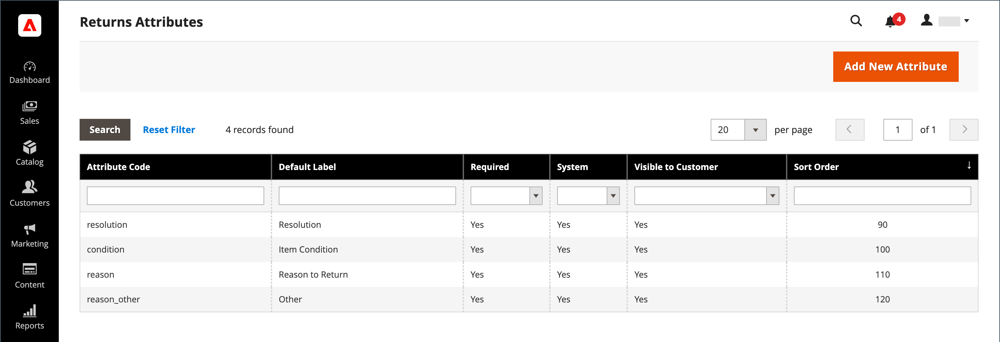
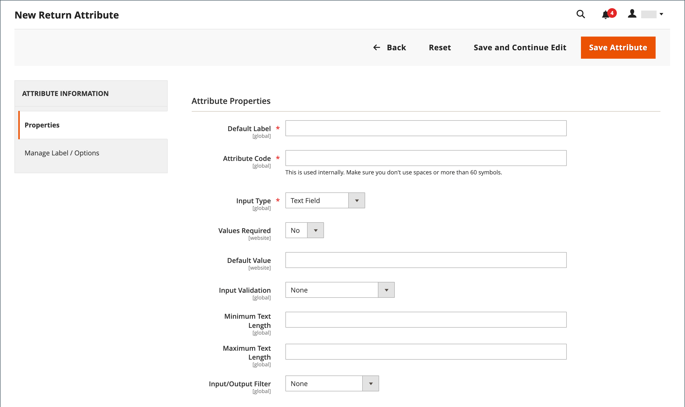
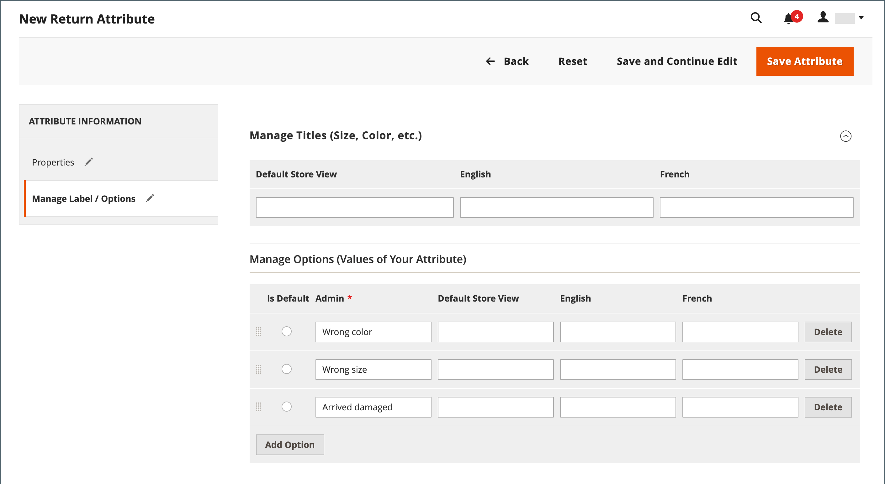

# Returns attribute

{{ee-feature}}

The returns attributes are used to store information that is needed during the product return process. The default attributes include the condition of the returned product, the reason for the return, and a field that indicates how the return was resolved. The process to create a returns attribute is similar to creating a [customer attribute](../customers/attribute-properties.md).

{width="700" zoomable="yes"}

## Create a returns attribute

1. On the _Admin_ sidebar, go to **[!UICONTROL Stores]** > _[!UICONTROL Attributes]_ > **[!UICONTROL Returns]**.

1. In the upper-right corner, click **[!UICONTROL Add New Attribute]**.

   {width="600" zoomable="yes"}

### Define the properties

1. To identify the attribute during data entry, set the **[!UICONTROL Default Label]**.

1. For **[!UICONTROL Attribute Code]**, enter a code that identifies the attribute within the system.

1. To determine the type of input control that is used for data entry, set **[!UICONTROL Input Type]** to one of the following:

   - `Text Field`
   - `Text Area`
   - `Dropdown`
   - `Yes/No`
   - `File`
   - `Image File`

1. To make the field a required item, set **[!UICONTROL Values Required]** to `Yes`.

1. To assign an initial value to the field, enter a **[!UICONTROL Default Value]**.

1. To validate the data entered into the field for accuracy before the record is saved, set **[!UICONTROL Input Validation]** to one of the following:

   - `None`
   - `Alphanumeric`
   - `Alphanumeric with Space`
   - `Numeric Only`
   - `Alpha Only`
   - `URL`
   - `Email`

1. For the `Text Field` and `Text Area` input types, enter the **[!UICONTROL Minimum Text Length]** and **[!UICONTROL Maximum Text Length]**.

1. To apply a preprocessing filter, set **[!UICONTROL Input/Output Filter]** to one of the following:

   - `None`
   - `Strip HTML Tags`
   - `Escape  HTML Entities`

1. To make the attribute visible to customers, set **[!UICONTROL Show on Storefront]** to `Yes` in the _[!UICONTROL Storefront Properties]_ section.

1. (Optional) For **[!UICONTROL Sort Order]**, enter a number to determine where this attribute appears relative to the others in the same part of the page. (`0` = first, `1` = second, `2` = third, and so on.)

### Manage the labels/options

1. In the left panel, choose **[!UICONTROL Manage Labels/Options]**.

1. In the **[!UICONTROL Manage Titles (Size, Color, etc.)]** section, enter the label for each store view.

   {width="600" zoomable="yes"}

1. If the **[!UICONTROL Input Type]** for the attribute is `Dropdown`, manage the options in the **[!UICONTROL Manage Options (Values of Your Attribute)]** section.

   - To add an option, click **[!UICONTROL Add Option]** and enter the label for Admin and each store view.
   - To make an option the selected default, choose **[!UICONTROL Is Default]**.
   - To remove an option, click **[!UICONTROL Delete]**.

1. To save changes, click **[!UICONTROL Save Attribute]**.
