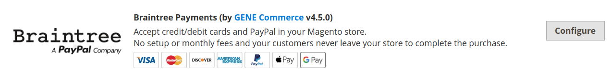
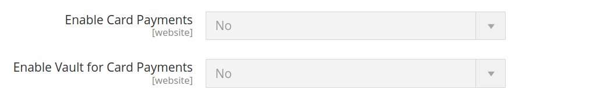
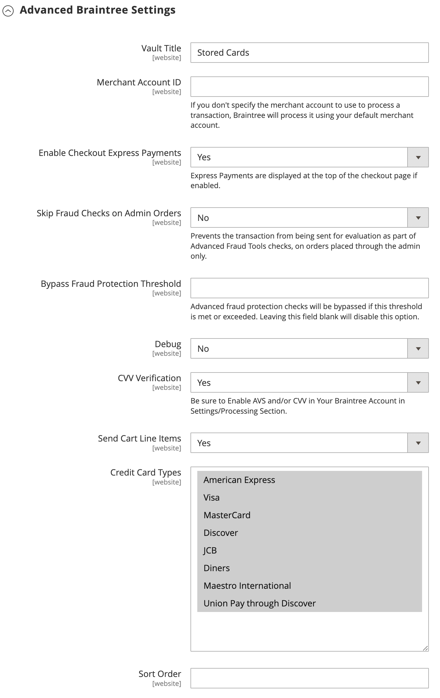
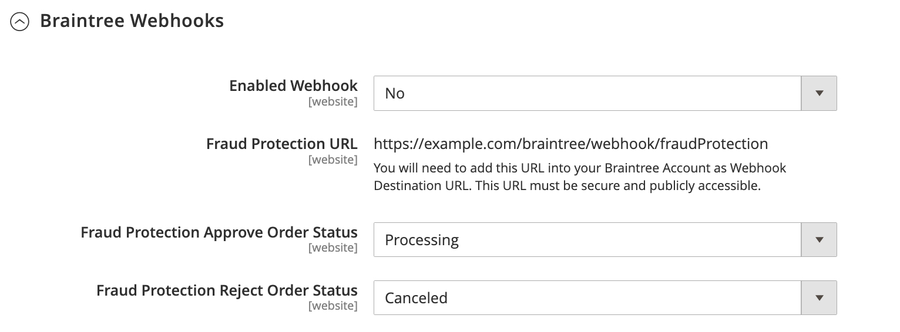
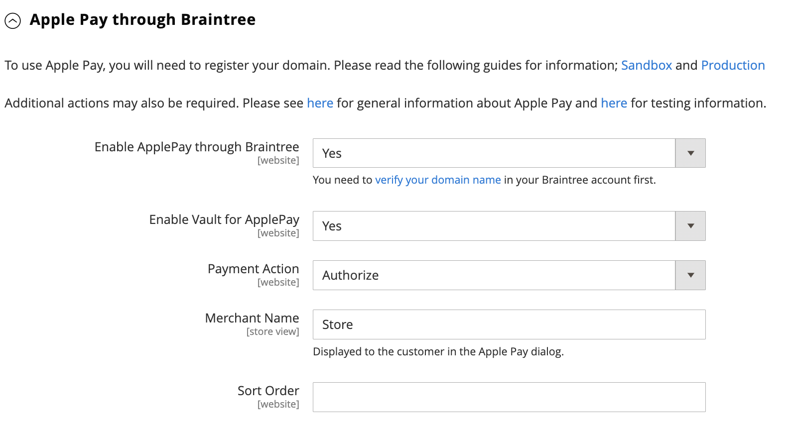
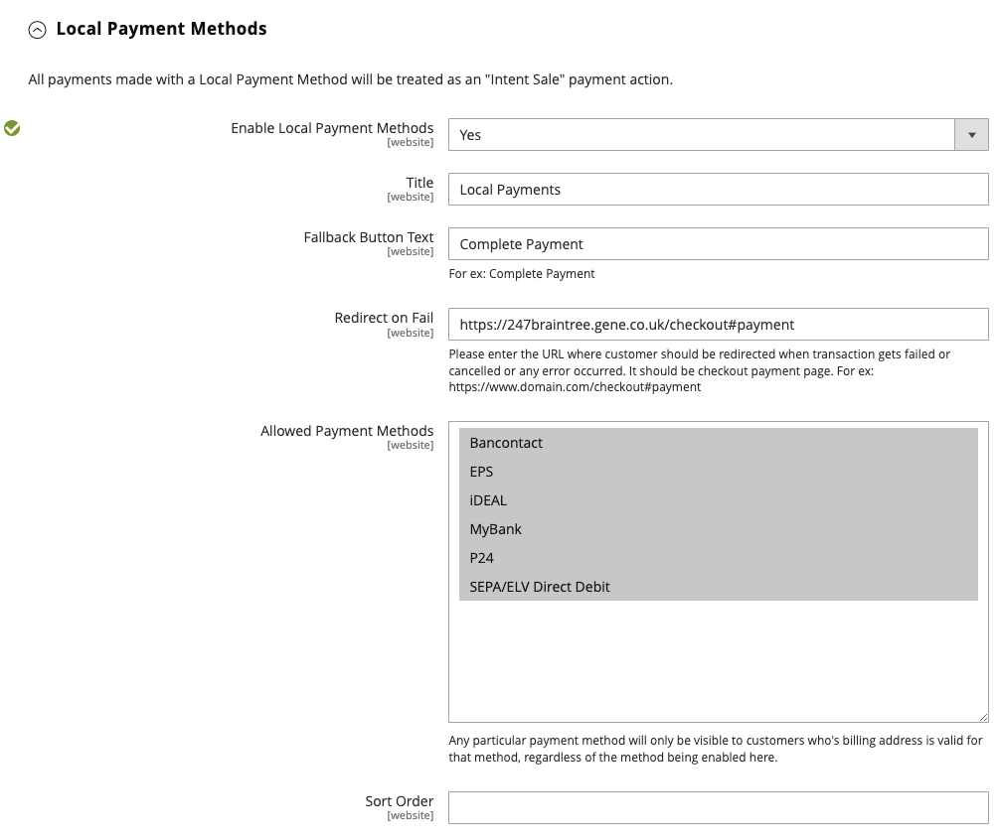
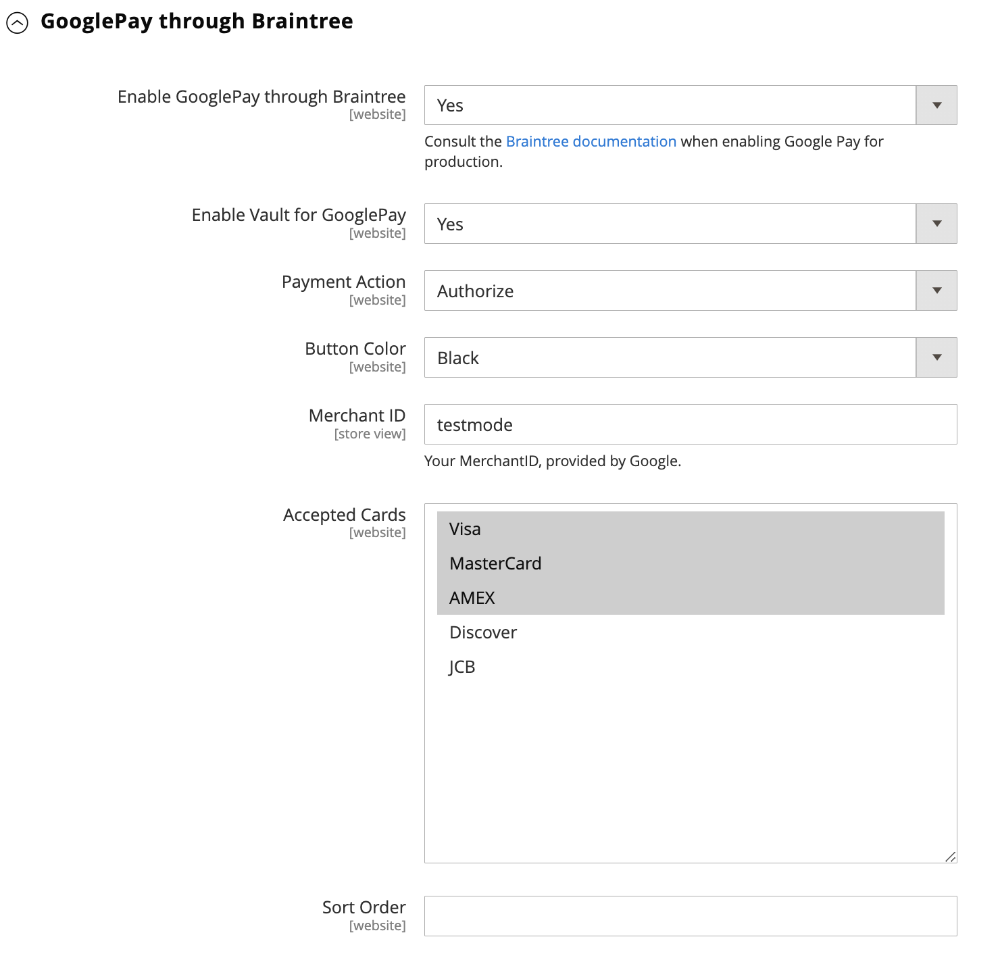
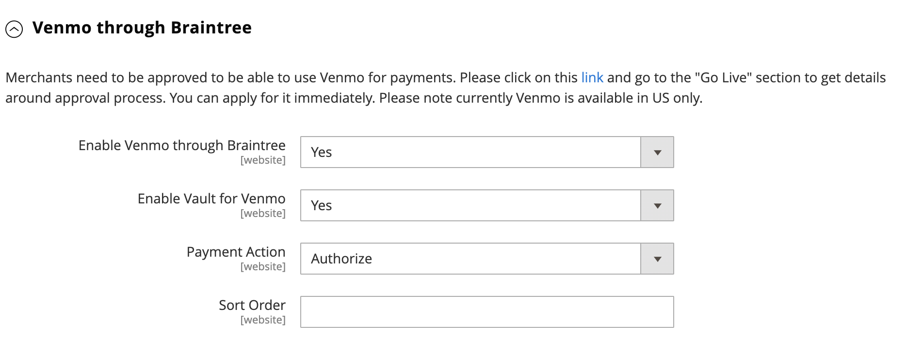
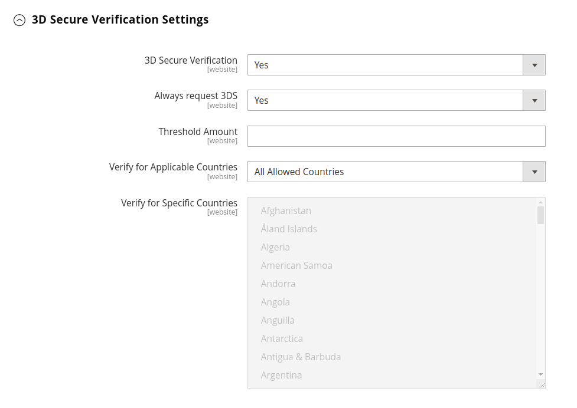
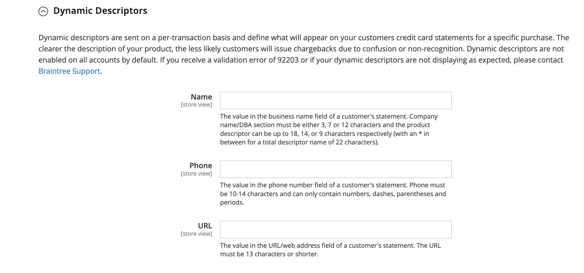

# Braintree

Braintree offers a fully customizable checkout experience with fraud detection and PayPal integration. It supports [!DNL Apple Pay], [!DNL Google Pay], ACH, Venmo, and local payment methods. Braintree reduces the PCI compliance burden for merchants because the transaction takes place on the Braintree system. The Braintree Payments integration is developed by [GENE Commerce](https://www.gene.co.uk/gene-braintree-payments/).

>[!NOTE]
>
>If you are upgrading to 2.4.x from an earlier version of Adobe Commerce or Magento Open Source with the Braintree extension from Commerce Marketplace installed, see the [2.4 upgrade notes](#24-upgrade-notes) at the end of this page.

## Step 1: Get your Braintree credentials

Go to [Braintree Payments][1] and sign up for an account.

## Step 2: Complete the basic settings

1. On the _Admin_ sidebar, go to **[!UICONTROL Stores]** > _[!UICONTROL Settings]_ > **[!UICONTROL Configuration]**.

1. In the left panel, expand **[!UICONTROL Sales]** and choose **[!UICONTROL Payment Methods]**.

   - If your Commerce installation has multiple websites, stores or views, in the upper-left corner, choose the **[!UICONTROL Store View]** where the configuration applies.

   - In the _[!UICONTROL Merchant Location]_ section, verify that **[!UICONTROL Merchant Country]** is set to the location of your business.

1. Under _[!UICONTROL Recommended Solutions]_, in the _[!UICONTROL Braintree Payments] (by [GENE Commerce](https://www.gene.co.uk/gene-braintree-payments/) v4.6.1 - [Release Notes](https://support.gene.co.uk/support/solutions/articles/35000228529)_ section, click **[!UICONTROL Configure]**.

   {width="600" zoomable="yes"}

1. For **[!UICONTROL Title]**, enter a title that identifies Braintree as a payment option during checkout.

1. Set the current operating **[!UICONTROL Environment]** for Braintree transactions to `Sandbox` or `Production`

   When testing the configuration in a sandbox, use only [credit card numbers][2] that are recommended by Braintree. When you are ready to go to production with Braintree, set **[!UICONTROL Environment]** to `Production`.

      {width="600" zoomable="yes"}

1. Set **[!UICONTROL Payment Action]** to one of the following:

     - `Authorize Only` - Approves the purchase and puts a hold on the funds. The amount is not withdrawn from the customer's bank account until the sale is _captured_ by the merchant.|
     - `Intent Sale`  - The amount of the purchase is authorized and immediately withdrawn from the customer's account. **_Note:_** This value was  _Authorize and Capture_ in 2.3.x and earlier releases.|

1. Enter the **[!UICONTROL Sandbox Merchant ID / Merchant ID]** from your Braintree account.

1. Enter the following credentials from your Braintree account:

   - **[!UICONTROL Sandbox Public Key / Public Key]**
   - **[!UICONTROL Sandbox Private Key / Private Key]**

   >[!NOTE]
   >
   >There are separate fields for both **(Sandbox and Production)** environments, and the other fields render based on which environment is selected.

1. Before saving the configuration, click **[!UICONTROL Validate Credentials]** to validate your credentials.

1. Set **[!UICONTROL Enable Card Payments]** to `Yes`.

   {width="600" zoomable="yes"}

   If you want the ability to store customer information securely, so customers don't have to re-enter it each time they make a purchase, set **[!UICONTROL Enable Vault for Card Payments]** to `Yes`.

## Step 3: Complete the advanced settings

1. Expand  the **[!UICONTROL Advanced Braintree Settings]** section.

   {width="550" zoomable="yes"}

1. For **[!UICONTROL Vault Title]**, enter a descriptive title for your reference that identifies the vault where your customer card information is stored.

1. Enter the **[!UICONTROL Merchant Account ID]** from your Braintree account. 

   If you don't specify the merchant account to be used, Braintree processes the transaction using your default merchant account.

1. To provide a faster checkout experience with Express Payment options at the beginning of the checkout process, including PayPal, PayLater, Apple Pay, and Google Pay, set **[!UICONTROL Enable Checkout Express Payments]** to `Yes`.

1. If you want to prevent the transaction from being sent for evaluation as part of Advanced Fraud Tools checks, on orders placed through the Admin, set **[!UICONTROL Skip Fraud Checks on Admin Orders]** to `Yes`.

1. Set the **[!UICONTROL Bypass Fraud Protection Threshold]** so that the `Advanced Fraud Protection` checks are bypassed when the threshold is met or exceeded.

   Leaving this field blank disables this option.

1. If you want the system to save a log file of interactions between your store and Braintree, set **[!UICONTROL Debug]** to `Yes`.

1. To require customers to provide the three-digit security code from the back of a credit card, set **[!UICONTROL CVV Verification]** to `Yes`.

   If using CVV verification, make sure to enable AVS and/or CVV in the _Settings/Processing_ section of your Braintree account.

1. To send the cart line items for all the payment methods, set **[!UICONTROL Send Card Line Items]** to `Yes`.

1. For **[!UICONTROL Credit Card Types]**, select each credit card that is accepted by your store as payment through Braintree.

   To select multiple card types, hold down the Ctrl key (PC) or the Command key (Mac) and click each option.

1. For **[!UICONTROL Sort Order]**, enter a number to determine the sequence in which Braintree appears when listed with other payment methods during checkout.

## Step 4: Complete the Braintree webhook settings

{width="600" zoomable="yes"}

1. Set **[!UICONTROL Enable Webhook]** to `Yes` to enable the webhook functionality for fraud protection, ACH payments, and local payment methods.

1. Copy the URL in the **[!UICONTROL Fraud Protection URL]** field and add it to your Braintree account as the _[!UICONTROL Webhook Destination URL]_. 

   >[!IMPORTANT]
   >
   >This URL must be secure and publicly accessible.

1. Set the **[!UICONTROL Fraud Protection Approve Order Status]** field to determine when fraud protection is approved by Braintree.

   The selected order status is assigned to the Commerce order.

1. Set the **[!UICONTROL Fraud Protection Reject Order Status]** field to determine when fraud protection is rejected by Braintree.

   The selected order status is assigned to the Commerce order.

## Step 5: Complete the country-specific settings

1. Set **[!UICONTROL Payment from Applicable Countries]** to one of the following:

   - `All Allowed Countries` - Customers from all [countries](../getting-started/store-details.md#country-options) specified in your store configuration can use this payment method.
   - `Specific Countries` - After choosing this option, the _[!UICONTROL Payment from Specific Countries]_ list appears. Hold down the Ctrl key (PC) or the Command key (Mac) and select each country in the list where customers can make purchases from your store.

   {width="600" zoomable="yes"}

1. To set up **[!UICONTROL Country Specific Credit Card Types]**:

   - Click **[!UICONTROL Add]**.

   - Set the **[!UICONTROL Country]** and choose each **[!UICONTROL Allowed Credit Card Type]**.

   - Repeat to identify the credit cards that are accepted from each country.

## Step 6: Complete the ACH through Braintree settings

{width="600" zoomable="yes"}

1. To include ACH as a payment option with Braintree, set **[!UICONTROL Enable ACH Direct Debit]** to `Yes`.

1. Customers can vault their single-use ACH Direct Debit payment method and store it for future use. Once vaulted, customers can reuse ACH Direct Debit without needing to re-enter or authenticate their payment information if set **[!UICONTROL Enable Vault for ACH Direct Debit]** to `Yes`.

1. For **[!UICONTROL Sort Order]**, enter a number to determine the sequence in which the Braintree ACH payment option appears when listed with other payment options during the checkout.

## Step 7: Complete the [!UICONTROL Apple Pay] through Braintree settings

{width="600" zoomable="yes"}

1. To include [!DNL Apple Pay] as a payment option with Braintree, set **[!UICONTROL Enable ApplePay through Braintree]** to `Yes`.

   Make sure to [verify your domain name](https://developer.paypal.com/braintree/docs/guides/apple-pay/configuration/javascript/v3) in your Braintree account first.

1. If you want the ability to store customer information securely, so customers don't have to re-enter it each time they make a purchase with Apple Pay, set **[!UICONTROL Enable Vault for ApplePay]** to `Yes`.

1. Set **[!UICONTROL Payment Action]** to one of the following:

   - `Authorize Only` - Approves the purchase and puts a hold on the funds. The amount is not withdrawn from the customer's bank account until the sale is _captured_ by the merchant.
   - `Intent Sale` - The amount of the purchase is authorized and immediately withdrawn from the customer's account.

1. For **[!UICONTROL Merchant Name]**, enter text that specifies the label that is displayed to customers in the Apple Pay dialog.

1. For **[!UICONTROL Sort Order]**, enter a number to determine the sequence in which [!DNL Apple Pay] payment option appears when listed with other payment options during the checkout.

## Step 8: Complete the settings for local payment methods

1. To include local payment methods as a payment option with Braintree, set **[!UICONTROL Enable Local Payment Methods]** to `Yes`.

1. For **[!UICONTROL Title]**, enter the text to use for the label that appears on the checkout payment method section (default value: `Local Payments`).

1. For **[!UICONTROL Fallback Button Text]**, enter the text to use for the button that appears on the fallback Braintree page to take the customer back to the website (for example, `Complete Checkout`).

1. For **[!UICONTROL Redirect on Fail]**, enter the URL where customers should be redirected when local payment method transactions are cancelled, fail, or encounter errors. It should be the checkout payment page (for example, `https://www.domain.com/checkout#payment`).

1. For **[!UICONTROL Allowed Payment Methods]**, select the local payment method to be enabled.

   Options: `Bancontact` / `EPS` / `giropay` / `iDeal` / `Klarna Pay Now` / `SOFORT` / `MyBank` / `P24` / `SEPA/ELV Direct Debit` (not yet supported)

   {width="600" zoomable="yes"}
   
   >[!NOTE]
   >
   >The bundled Braintree extension does not support all the local payment methods listed in the [Braintree developer documentation](https://developer.paypal.com/braintree/docs/guides/local-payment-methods/overview). Other local payment methods are under development to be supported in future releases.

1. For **[!UICONTROL Sort Order]**, enter a number to determine the sequence in which local payment method appears when listed with other payment options during the checkout.

## Step 9: Complete the [!DNL Google Pay] through Braintree settings

{width="600" zoomable="yes"}

1. To include [!DNL Google Pay] as a payment option with Braintree, set **[!UICONTROL Enable GooglePay Through Braintree]** to `Yes`.

1. If you want the ability to store customer information securely, so customers don't have to re-enter it each time they make a purchase with Google Pay, set **[!UICONTROL Enable Vault for GooglePay]** to `Yes`.

1. Set **[!UICONTROL Payment Action]** to one of the following:

    - `Authorize Only` - Approves the purchase and puts a hold on the funds. The amount is not withdrawn from the customer's bank account until the sale is _captured_ by the merchant.
    - `Intent Sale`  - The amount of the purchase is authorized and immediately withdrawn from the customer's account.

1. Set **[!UICONTROL Button Color]** to determine the color of the [!DNL Google Pay] button: `White` or `Black`

1. For **[!UICONTROL Merchant ID]**, enter your MerchantID (provided by Google).

1. For **[!UICONTROL Accepted Cards]**, select the type of cards that a customer can use to place an order using [!DNL Google Pay]. 

   Options: `Visa` / `MasterCard` / `AMEX` / `Discover` / `JCB`

1. For **[!UICONTROL Sort Order]**, enter a number to determine the sequence in which [!DNL Google Pay] appears when listed with other payment options during the checkout.

## Step 10: Complete the Venmo through Braintree settings

1. To include Venmo as a payment option with Braintree, set **[!UICONTROL Enable Venmo through Braintree]** to `Yes`.

1. Set **[!UICONTROL Enable Vault for Venmo]** to `Yes` to enable use of a secure vault to store customers' Venmo account so customer don't need to log in to their Venmo account again for future transactions.

   {width="600" zoomable="yes"}

1. Set **[!UICONTROL Payment Action]** to one of the following:

   - `Authorize Only` - Approves the purchase and puts a hold on the funds. The amount is not withdrawn from the customer's bank account until the sale is _captured_ by the merchant.
   - `Intent Sale`  - The amount of the purchase is authorized and immediately withdrawn from the customer's account.

1. For **[!UICONTROL Sort Order]**, enter a number to determine the sequence in which Venmo appears when listed with other payment options during the checkout.

## Step 11: Complete the PayPal through Braintree settings

   {width="550" zoomable="yes"}

1. To include PayPal as a payment option with Braintree, set **[!UICONTROL Enable PayPal through Braintree]** to `Yes`.

1. Specify your PayPal through Braintree payment method:

   >[!NOTE]
   >
   >Either **[!DNL PayPal Credit]** or **[!DNL PayPal PayLater]** can be enabled. Both methods cannot be enabled at the same.

   - To include [!DNL PayPal Credit] as a payment option with Braintree, set **[!UICONTROL Enable PayPal Credit through Braintree]** to `Yes`.
     
      When **Enable PayPal through Braintree** is set to `Yes`, only this field appears.

      >[!NOTE]
      >
      >PayPal Credit is only available in the United States and United Kingdom. PayPal Credit is disabled if the selected value for the _[!UICONTROL Merchant Country]_ field is not `US` or `UK`. 

   - To include [!DNL PayPal PayLater] as a payment option with Braintree, set **[!UICONTROL Enable PayPal PayLater through Braintree]** to `Yes`.

     When **[!UICONTROL Enable PayPal PayLater through Braintree]** is set to `Yes`, only this field appears.

     You can display PayLater messaging on your site for offers, such as _Pay in 3_, which lets customers pay with three interest-free monthly payments. The Braintree integration can display messages on your site to promote this feature. You cannot promote PayLater offers with any other content, marketing, or materials.

1. For **[!UICONTROL Title]**, enter a title that identifies the Braintree payment by PayPal option during checkout.

1. Set **[!UICONTROL Vault Enabled]** to `Yes` to enable use of a secure vault to store customers' PayPal account. Vaulted PayPal account can be used for future transactions, which reduces the number of steps for customers.

1. Set **[!UICONTROL Send Cart Line Items for PayPal]** to `Yes` to send the line items (order items) to PayPal along with Gift Cards, Gift Wrapping for items, Gift Wrapping for order, Store Credit, Shipping, and Tax as line items.

1. For **[!UICONTROL Sort Order]**, enter a number to determine the sequence in which the Braintree PayPal payment option appears when listed with other payment options during checkout.

1. To display your merchant name differently than what is defined in your [store configuration](../getting-started/store-details.md#store-information), enter the name in the **[!UICONTROL Override Merchant Name]** field as you want it to appear.

1. Set **[!UICONTROL Payment Action]** to one of the following:

   - `Authorize Only` - Approves the purchase and puts a hold on the funds. The amount is not withdrawn from the customer's bank account until the sale is _captured_ by the merchant.
   - `Authorize and Capture` - The amount of the purchase is authorized and immediately withdrawn from the customer's account.

1. Set **[!UICONTROL Payment from Applicable Countries]** to one of the following for Braintree transactions processed by PayPal:

   - `All Allowed Countries` - Customers from all [countries](../getting-started/store-details.md#country-options) specified in your store configuration can use this payment method.
   - `Specific Countries` - After choosing this option, the _[!UICONTROL Payment from Specific Countries]_ list appears. Hold down the Ctrl key (PC) or the Command key (Mac) and select each country in the list where customers can make purchases from your store.

1. To require customers to provide a billing address, set **[!UICONTROL Require Customer's Billing Address]** to `Yes`.

   >[!NOTE]
   >
   >This feature must be enabled for your account by PayPal Technical Support.

1. To save a log file of interactions between your store and PayPal through Braintree, set **[!UICONTROL Debug]** to `Yes`.

1. To display the PayPal button on both the mini cart and shopping cart page, set **[!UICONTROL Display on Shopping Cart]** to `Yes`.

## Step 12: Set the styling settings

1. For **[!UICONTROL Location]**, choose where PayPal buttons and messages are rendered: `Mini-Cart and Cart Page`, `Checkout Page`, or `Product Page`

   {width="600" zoomable="yes"}

### [!UICONTROL Mini-Cart and Cart Page]

The options and settings in this section vary according to the setting in the _[!UICONTROL Location]_ field.

1. Set **[!UICONTROL PayPal Button Type]** to one of three types of buttons: `PayPal Button` / `PayPal Pay Later Button` / `PayPal Credit Button`

**[!UICONTROL PayPal Button]**

The options and settings in this section vary according to the button type selected in the _[!UICONTROL PayPal Button Type]_ field.

1. To show the PayPal button on the storefront at the selected location, set **[!UICONTROL Show PayPal Button]** to `Yes`.

1. For **[!UICONTROL Button Label]**, select the PayPal button label: `Paypal`, `Checkout`, `Buynow`, or `Pay`

1. For **[!UICONTROL Color]**, select the PayPal button color: `Blue`, `Black`, `Gold`, or `Silver`

1. For **[!UICONTROL Shape]**, select the PayPal button shape: `Pill` or `Rectangle`

1. For **[!UICONTROL Size (Deprecated)]**, select the PayPal button size: `Medium`, `Large`, or `Responsive`

>[!NOTE]
>
>The **[!DNL Size(Deprecated)]** configuration field is deprecated and not being used to style the PayPal buttons.

**[!UICONTROL PayLater Messaging]**

1. To show [!DNL PayLater] messaging on the storefront at the selected location, set **[!UICONTROL Show PayLater Messaging]** to `Yes`. 

   This messaging includes the display of [!DNL PayLater] messaging for available offers ([restrictions apply](https://developer.paypal.com/docs/checkout/pay-later/us/)). 

1. For **[!UICONTROL Message Layout]**, select the [!DNL PayLater] message layout: `Text` or `Flex`

1. For **[!UICONTROL Logo]**, select the PayPal logo type: `Inline`, `Primary`, `Alternative`, or `None`

1. For **[!UICONTROL Logo Position]**, select the PayPal logo position: `Left`, `Right`, or `Top`

1. For **[!UICONTROL Text Color]**, select the [!DNL PayLater] message text color: `Black`, `White`, `Monochrome`, or `Grayscale`

When these options are set, you can see the preview of the PayPal buttons and PayLater messages. There are controls that you can use to apply the settings or reset the values:

- To store the selected styling settings for buttons and PayLater messaging and apply them to the current location and current button type, click **[!UICONTROL Apply]**.

- to store the selected styling settings for buttons and PayLater messaging values and apply them to all button types and locations, click **[!UICONTROL Apply to All Buttons]**.

- To return styling settings to the recommended default values for buttons and PayLater messaging and apply them to all button types and locations, click **[!UICONTROL Reset to Recommended Defaults]**.

## Step 13: Complete the 3D verification settings

1. If you want to add a verification step for customers using credit cards that are enrolled in a verification program (such as _Verified by VISA_), set **[!UICONTROL 3D Secure Verification]** to `Yes`.

   During the process, the transaction amount that is submitted for verification is checked against the amount that is sent for authorization.

2. To always challenge the 3D Secure request for all transactions, set **[!UICONTROL Always request 3DS]** to `Yes`.

3. For **[!UICONTROL Threshold Amount]**, enter the minimum order amount that is required to trigger 3D verification.

4. Set **[!UICONTROL Verify for Applicable Countries]** to one of the following:

   - `All Allowed Countries` - Customers from all [countries](../getting-started/store-details.md#country-options) specified in your store configuration can use this payment method.
   - `Specific Countries` - After choosing this option, the _[!UICONTROL Verify for Specific Countries]_ list appears. Hold down the Ctrl key (PC) or the Command key (Mac) and select each country in the list where customers can make purchases from your store.

   {width="600" zoomable="yes"}

## Step 14: Set up the Braintree dynamic descriptors

The following descriptors are used to identify purchases on customer credit card statements. You can reduce the number of charge-backs by clearly identifying the company that is associated with each purchase. If dynamic descriptors are not enabled for your account, contact Braintree support.

{width="600" zoomable="yes"}

1. Enter the dynamic descriptor for the **[!UICONTROL Name]**, **[!UICONTROL Phone]**, and **[!UICONTROL URL]** according to these guidelines:

   - **[!UICONTROL Name]** - There are two parts to the name descriptor, which are separated by an asterisk (*). For example:
      
      `company*myproduct`
      
      The first part of the descriptor identifies the company or DBA, and the second part identifies the product. The length of the `company` and `product` parts of the descriptor can be allocated in the following ways, for a combined length of up to 22 characters.
      
      **_Characters in name descriptor_**
      
      _Option 1:_ `Company` must be three characters, `Product` may be up to 18 characters
      
      _Option 2:_ `Company` must be seven characters, `Product` may be up to 14 characters
      
      _Option 3_: `Company` must be 12 characters, `Product` may be up to nine characters

   - **[!UICONTROL Phone]** - The phone descriptor must be 10 – 14 characters in length, and can include only numbers, dashes, parentheses, and periods. For example:

      `9999999999`
      
      `(999) 999-9999`
      
      `999.999.9999`

   - **[!UICONTROL URL]** - The URL descriptor represents your domain name, and can be up to 13 characters long. For example:

      `company.com`

1. When your Braintree configuration is complete, click **[!UICONTROL Save Config]**.

## 2.4 upgrade notes 

Beginning with Adobe Commerce and Magento Open Source 2.4.0, the Braintree extension is included in the release. If you are migrating to Commerce 2.4.x from a pre-2.4.0 version that has the Marketplace Braintree extension installed, you must uninstall that extension (`paypal/module-braintree` or `gene/module-braintree`) and update any code customizations to use the `PayPal_Braintree` namespace instead of `Magento_Braintree`. Configuration settings from the core Commerce Braintree Payments bundled extension and the extension distributed on Commerce Marketplace persist and payments placed with those previous versions can still be captured, voided, or refunded as normal.

[1]: https://www.braintreepayments.com/
[2]: https://developers.braintreepayments.com/reference/general/testing/php
