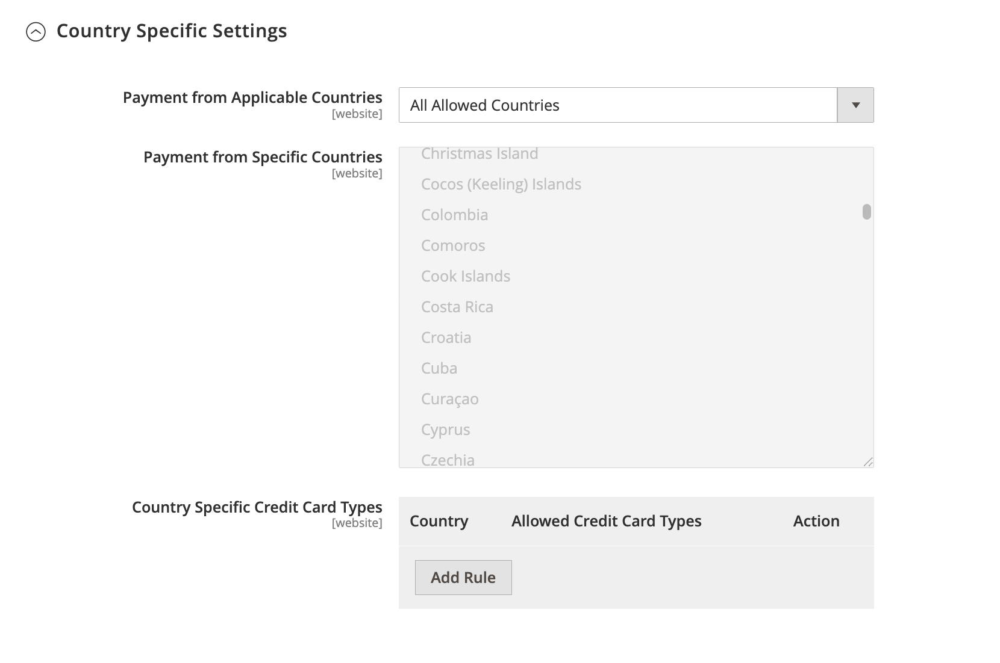
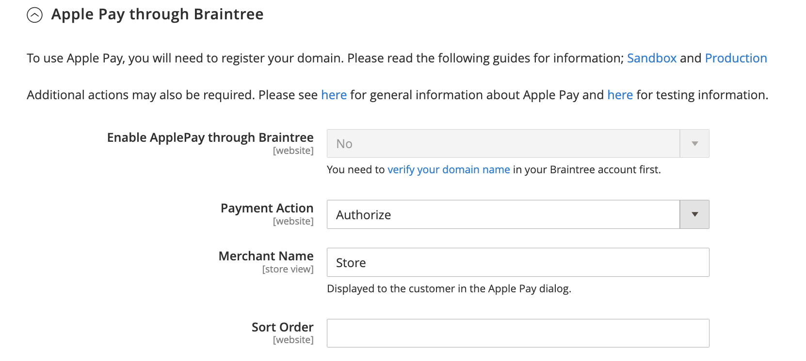
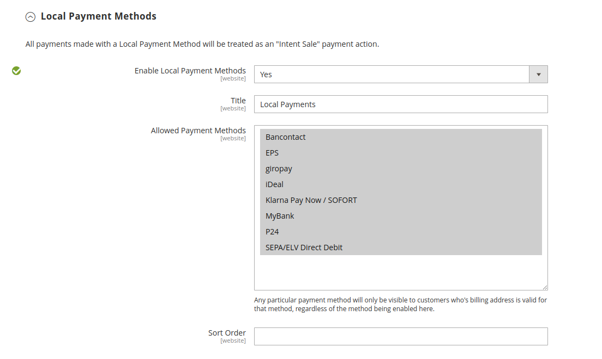
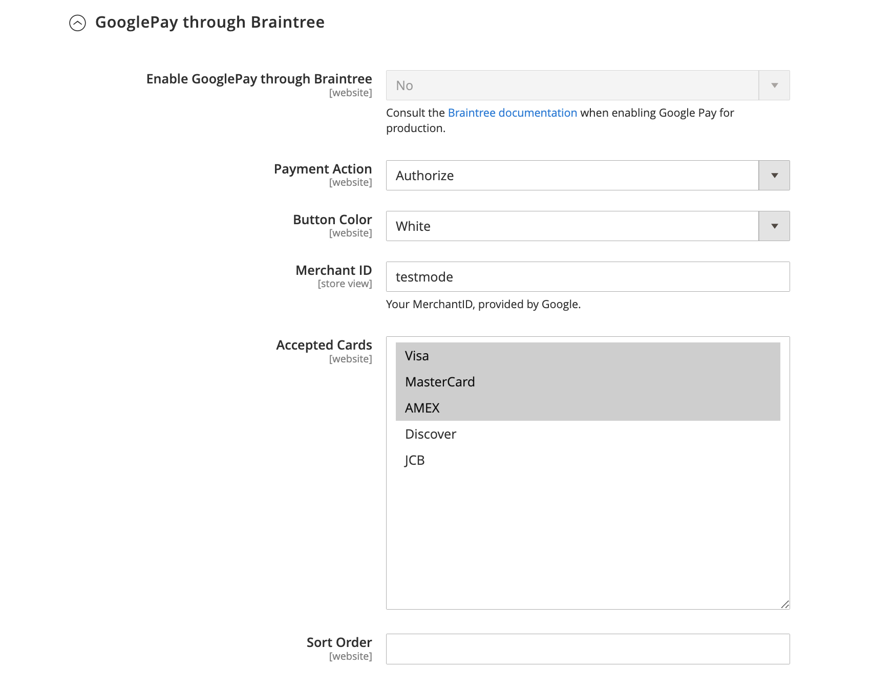
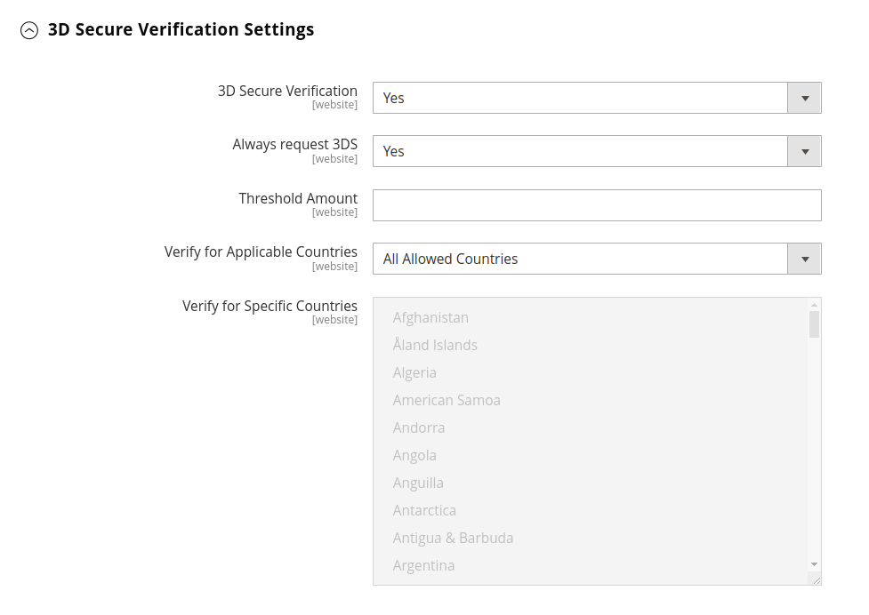

# Braintree

Braintree offers a fully customizable checkout experience with fraud detection, PayPal integration, Apple Pay, Google Pay, ACH, Venmo and Local Payment Methods. Braintree reduces the PCI compliance burden for merchants because the transaction takes place on the Braintree system.

If you are upgrading to 2.4.x from an earlier version of Adobe Commerce and Magento Open Source with the Braintree extension from Commerce Marketplace installed, see the [2.4 upgrade notes](#24-upgrade-notes) at the end of this topic.

## Step 1: Get your Braintree credentials

Go to [Braintree Payments][1] and sign up for an account.

## Step 2: Complete the basic settings

1. On the _Admin_ sidebar, go to **[!UICONTROL Stores]** > _[!UICONTROL Settings]_ > **[!UICONTROL Configuration]**.

1. In the left panel, expand **[!UICONTROL Sales]** and choose **[!UICONTROL Payment Methods]**.

   - If your Commerce installation has multiple websites, stores or views, in the upper-left corner, choose the **[!UICONTROL Store View]** where the configuration applies.

   - In the _Merchant Location_ section, verify that **[!UICONTROL Merchant Country]** is set to the location of your business.

1. Under Recommended Solutions, in the **[!UICONTROL Braintree Payments (by [GENE Commerce](https://www.gene.co.uk/gene-braintree-payments/) v4.5.0)]** section, click **[!UICONTROL Configure]** and do the following:

   <!-- zoom -->

   - Enter a **[!UICONTROL Title]** to identify Braintree as a payment option during checkout.

   - Set the current operating **[!UICONTROL Environment]** for Braintree transactions to one of the following:

      - `Sandbox`
      - `Production`

     When testing the configuration in a sandbox, use only [credit card numbers][2] that are recommended by Braintree. When you are ready to go to production with Braintree, set **[!UICONTROL Environment]** to `Production`.

   - Set **[!UICONTROL Payment Action]** to one of the following:

     -  `Authorize Only` - Approves the purchase and puts a hold on the funds. The amount is not withdrawn from the customer's bank account until the sale is _captured_ by the merchant.|
     - `Intent Sale`  - The amount of the purchase is authorized and immediately withdrawn from the customer's account. **_Note:_** This was  _Authorize and Capture_ in 2.3.x and earlier releases.|

   - Enter the **[!UICONTROL Sandbox Merchant ID / Merchant ID]** from your Braintree account.

   - Enter the following credentials from your Braintree account:

      - **[!UICONTROL Sandbox Public Key / Public Key]**
      - **[!UICONTROL Sandbox Private Key / Private Key]**

   - We have added separate fields for both **(Sandbox and Production)** environments, so Above-mentioned fields will render based on which Environment has been selected.

   - Validate your credentials before saving the config by clicking on **Validate Credentials** button.

     <!-- zoom -->

   - Set **[!UICONTROL Enable Card Payments]** to `Yes`.
   - If you want the ability to store customer information securely, so customers don't have to reenter it each time they make a purchase, set **[!UICONTROL Enable Vault for Card Payments]** to `Yes`.

     <!-- zoom -->

## Step 3: Complete the advanced settings

1. Expand  the **[!UICONTROL Advanced Braintree Settings]** section.

1. For **[!UICONTROL Vault Title]**, enter a descriptive title for your reference that identifies the vault where your customer card information is stored.

1. Enter the **[!UICONTROL Merchant Account ID]** from your Braintree account. If you don't specify which merchant account to be used, Braintree will process the transaction using your default merchant account.

1. **[!UICONTROLSkip Fraud Checks on Admin Orders]** - Prevents the transaction from being sent for evaluation as part of Advanced Fraud Tools checks, on orders placed through the admin only when it set to `Yes`.

1. Set the `Bypass Fraud Protection Threshold` so that the `Advanced Fraud Protection` checks are bypassed when the threshold is met or exceeded.

1. Leaving this field blank disables this option.

1. If you want the system to save a log file of interactions between your store and Braintree, set **[!UICONTROL Debug]** to `Yes`.

1. To require customers to provide the three-digit security code from the back of a credit card, set **[!UICONTROL CVV Verification]** to `Yes`.

   If using CVV verification, make sure to enable AVS and/or CVV in the _Settings/Processing_ section of your Braintree account.

1. To send the cart line items for all the payment methods, set **[!UICONTROL Send Card Line Items]** to `Yes`.

1. For **[!UICONTROL Credit Card Types]**, select each credit card that is accepted by your store as payment through Braintree.

   To select multiple card types, hold down the Ctrl key (PC) or the Command key (Mac) and click each option.

1. For **[!UICONTROL Sort Order]**, enter a number to determine the sequence in which Braintree appears when listed with other payment methods during checkout.

   <!-- zoom -->

## Step 4: Complete the Braintree Webhooks settings

1. **[!UICONTROL Enable Webhook]** - It will enable the webhook functionality for Fraud Protection, ACH payments and Local Payment methods.

2. **[!UICONTROL Fraud Protection URL]** - You will need to add this URL into your Braintree Account as Webhook Destination URL. **This URL must be secure and publicly accessible.**

3. **[!UICONTROL Fraud Protection Approve Order Status]** - When Fraud Protection gets approved by Braintree, selected order status will be assigned to the Magento Order.

4. **[!UICONTROL Fraud Protection Reject Order Status]** - When Fraud Protection gets rejected by Braintree, selected order status will be assigned to the Magento Order.

   <!-- zoom -->

## Step 5: Complete the country-specific settings

1. Set **[!UICONTROL Payment from Applicable Countries]** to one of the following:

   - `All Allowed Countries` - Customers from all [countries](../getting-started/store-details.md#country-options) specified in your store configuration can use this payment method.
   - `Specific Countries` - After choosing this option, the _[!UICONTROL Payment from Specific Countries]_ list appears. Hold down the Ctrl key (PC) or the Command key (Mac) and select each country in the list where customers can make purchases from your store.

   <!-- zoom -->

1. To set up **[!UICONTROL Country Specific Credit Card Types]**:

   - Click **[!UICONTROL Add]**.

   - Set the **[!UICONTROL Country]** and choose each **[!UICONTROL Allowed Credit Card Type]**.

   - Repeat to identify the credit cards that are accepted from each country.

## Step 6: Complete the ACH through Braintree settings

1. To include ACH as a payment option with Braintree, set **[!UICONTROL Enable ACH Direct Debit]** to `Yes`.

2. For **[!UICONTROL Sort Order]**, enter a number to determine the sequence in which Braintree's ACH payment option appears when listed with other payment options during the checkout.

   <!-- zoom -->

## Step 7: Complete the Apple Pay through Braintree settings

1. To include Apple Pay as a payment option with Braintree, set **[!UICONTROL Enable ApplePay through Braintree]** to `Yes`. You need to [verify your domain name](https://developer.paypal.com/braintree/docs/guides/apple-pay/configuration/javascript/v3) in your Braintree account first.

2. Set **[!UICONTROL Payment Action]** to one of the following:

    -  `Authorize Only` - Approves the purchase and puts a hold on the funds. The amount is not withdrawn from the customer's bank account until the sale is _captured_ by the merchant.
    - `Intent Sale`  - The amount of the purchase is authorized and immediately withdrawn from the customer's account.

3. **[!UICONTROL Merchant Name]**, Label that is displayed to customers in the Apple Pay popup.

4. For **[!UICONTROL Sort Order]**, enter a number to determine the sequence in which Apple Pay payment option appears when listed with other payment options during the checkout.

   <!-- zoom -->

## Step 8: Complete the Local Payment Methods settings

1. To include Local Payment Methods as a payment option with Braintree, set **[!UICONTROL Enable Local Payment Methods]** to `Yes`.

2. Set **[!UICONTROL Title]**, Label that appears on the checkout Payment Method section. Default value: Local Payments

3. **[!UICONTROL Allowed Payment Methods]**, Select the local Payment method that needs to be enabled. Options: `Bancontact` / `EPS` / `giropay` / `iDeal` / `Klarna Pay Now` / `SOFORT` / `MyBank` / `P24` / `SEPA/ELV Direct Debit`

4. For **[!UICONTROL Sort Order]**, enter a number to determine the sequence in which Local Payment Method appears when listed with other payment options during the checkout.

   <!-- zoom -->

## Step 9: Complete the GooglePay through Braintree settings

1. To include Google Pay as a payment option with Braintree, set **[!UICONTROL Enable GooglePay Through Braintree]** to `Yes`.

2. Set **[!UICONTROL Payment Action]** to one of the following:

    -  `Authorize Only` - Approves the purchase and puts a hold on the funds. The amount is not withdrawn from the customer's bank account until the sale is _captured_ by the merchant.
    - `Intent Sale`  - The amount of the purchase is authorized and immediately withdrawn from the customer's account.

2. Set **[!UICONTROL Button Color]**, Determines the color of the [!DNL Google Pay] button. Options: `White` / `Black`

3. **[!UICONTROL Merchant ID]**, Your MerchantID, provided by Google must be entered here.

4. **[!UICONTROL Accepted Cards]**, Select the type of cards that a customer can use to place order using [!DNL Google Pay]. Options: `Visa` / `MasterCard` / `AMEX` / `Discover` / `JCB`

5. For **[!UICONTROL Sort Order]**, enter a number to determine the sequence in which Google Pay appears when listed with other payment options during the checkout.

   <!-- zoom -->

## Step 10: Complete the Venmo through Braintree settings

1. To include Venmo as a payment option with Braintree, set **[!UICONTROL Enable Venmo through Braintree]** to `Yes`.

2. Set **[!UICONTROL Payment Action]** to one of the following:

   -  `Authorize Only` - Approves the purchase and puts a hold on the funds. The amount is not withdrawn from the customer's bank account until the sale is _captured_ by the merchant.
   - `Intent Sale`  - The amount of the purchase is authorized and immediately withdrawn from the customer's account.

5. For **[!UICONTROL Sort Order]**, enter a number to determine the sequence in which Google Pay appears when listed with other payment options during the checkout.

   <!-- zoom -->

## Step 11: Complete the PayPal through Braintree settings

1. Identify your PayPal through Braintree configuration:

   - To include PayPal as a payment option with Braintree, set **[!UICONTROL Enable PayPal through Braintree]** to `Yes`.

   - To include PayPal Credit as a payment option with Braintree, set **[!UICONTROL Enable PayPal Credit through Braintree]** to `Yes`.
     - if **Enable PayPal through Braintree** field is set to `Yes` then only this field will appear.
     - PayPal Credit is currently only available in the United States and United Kingdom. PayPal Credit will be disabled if the selected value for the Merchant Country field is not US or UK. This field only available if Merchant Country is US or UK.

   - To include PayPal Pay Later as a payment option with Braintree, set **[!UICONTROL Enable PayPal Pay Later through Braintree]** to `Yes`.
     - if **Enable PayPal through Braintree** field is set to `Yes` then only this field will appear.
     - Display pay later messaging on your site for offers like Pay in 3, which lets customers pay with 3 interest-free monthly payments. We'll show messages on your site to promote this feature for you. You may not promote pay later offers with any other content, marketing, or materials.

   >[!NOTE]
   >
   >Either **PayPal Credit** or **PayPal Pay Later** can be enabled. Both the methods can't be enabled at the same.

   - Enter a **[!UICONTROL Title]** to identify Braintree's payment by PayPal option during checkout.

   - Set **[!UICONTROL Vault Title]** to `Yes` to enable use of a secure vault to store customers' credit card information.

   - For **[!UICONTROL Sort Order]**, enter a number to determine the sequence in which Braintree's PayPal payment option appears when listed with other payment options during checkout.

   - To display your [merchant name](../getting-started/store-details.md#store-information) differently than what is defined in your store configuration, enter the name as you want it to appear in the **[!UICONTROL Override Merchant Name]** field.

1. Set **[!UICONTROL Payment Action]** to one of the following:

   - `Authorize Only` - Approves the purchase and puts a hold on the funds. The amount is not withdrawn from the customer's bank account until the sale is _captured_ by the merchant.
   - `Authorize and Capture` - The amount of the purchase is authorized and immediately withdrawn from the customer's account.

1. Set **[!UICONTROL Payment from Applicable Countries]** to one of the following for Braintree transactions processed by PayPal:

   - `All Allowed Countries` - Customers from all [countries](../getting-started/store-details.md#country-options) specified in your store configuration can use this payment method.
   - `Specific Countries` - After choosing this option, the _[!UICONTROL Payment from Specific Countries]_ list appears. Hold down the Ctrl key (PC) or the Command key (Mac) and select each country in the list where customers can make purchases from your store.

1. To require customers to provide a billing address, set **[!UICONTROL Require Customer's Billing Address]** to `Yes`.

   >[!NOTE]
   >
   >This feature must be enabled for your account by PayPal Technical Support.

1. To save a log file of interactions between your store and PayPal through Braintree, set **[!UICONTROL Debug]** to `Yes`.

1. To display the PayPal button on both the mini shopping cart and shopping cart page, set **[!UICONTROL Display on Shopping Cart]** to `Yes`.

   <!-- zoom -->

### [!UICONTROL Styling]

1. **[!UICONTROL Location]**, where PayPal buttons and messages will be rendered, field does have the following options: `Mini-Cart and Cart Page` / `Checkout Page` / `Product Page`

#### [!UICONTROL Mini-Cart and Cart Page]
This section will render based on what location has been selected for the above **Location** field.

1. **[!UICONTROL PayPal Button Type]**, There are 3 types of button types. Options: `PayPal Button` / `PayPal Pay Later Button` / `PayPal Credit Button`

##### [!UICONTROL PayPal Button]
This section will render based on what button type has been selected for the above **PayPal Button Type** field.

1. To show PayPal button at front-end on selected location, set **[!UICONTROL Show PayPal Button]** to `Yes`.

2. **[!UICONTROL Button Label]**, Select the PayPal button label from the drop-down. Options: `Paypal` / `Checkout` / `Buynow` / `Pay`

3. **[!UICONTROL Color]**, Select the PayPal button color from the drop-down. Options: `Blue` / `Black` / `Gold` / `Silver`

4. **[!UICONTROL Shape]**, Select the PayPal button shape from the drop-down. Options: `Pill` / `Rectangle`

5. **[!UICONTROL Size]**, Select the PayPal button shape from the drop-down. Options: `Medium` / `Large` / `Responsive`

##### [!UICONTROL Pay Later Messaging]

1. To show Pay Later Messaging at front-end on selected location, set **[!UICONTROL Show Pay Later Messaging]** to `Yes`. Displays Pay Later messaging for available offers. Restrictions apply. [Click here to learn more](https://developer.paypal.com/docs/checkout/pay-later/us/).

2. **[!UICONTROL Message Layout]**, Select the pay later message layout from the drop-down. Options: `Text` / `Flex`

3. **[!UICONTROL Logo]**, Select the PayPal Logo type from the drop-down. Options: `Inline` / `Primary` / `Alternative` / `None`

4. **[!UICONTROL Logo Position]**, Select the PayPal logo position from the drop-down. Options: `Left` / `Right` / `Top`

5. **[!UICONTROL Text Color]**, Select the pay later message text color from the drop-down. Options: `Black` / `White` / `Monochrome` / `Grayscale`

    After these fields, you can find the preview of the PayPal buttons and pay later messages along with following buttons which are responsible to apply the settings or reset it to the recommended values.

1. **[!UICONTROL Apply]**, This button is responsible to store selected styling field of buttons and pay later messaging for the current location and current button type

2. **[!UICONTROL Apply to All Buttons]**, This button is responsible to store selected styling field of buttons and pay later messaging values for all the Buttons types and locations.

3. **[!UICONTROL Reset to Recommended Defaults]**, This button is responsible to set recommended default values to all the buttons and pay later messaging for all the Buttons types and locations.

    <!-- zoom -->

## Step 12: Complete the 3D verification settings

1. If you want to add a verification step for customers using credit cards that are enrolled in a verification program such as "Verified by VISA," set **[!UICONTROL 3D Secure Verification]** to `Yes`.

   During the process, the transaction amount that is submitted for verification is checked against the amount that is sent for authorization.

2. To challenge the 3D Secure request always for all the transactions set **[!UICONTROL Always request 3DS]** to `Yes`.

3. For **[!UICONTROL Threshold Amount]**, enter the minimum order amount that is required to trigger 3D verification.

4. Set **[!UICONTROL Verify for Applicable Countries]** to one of the following:

   - `All Allowed Countries` - Customers from all [countries](../getting-started/store-details.md#country-options) specified in your store configuration can use this payment method.
   - `Specific Countries` - After choosing this option, the _[!UICONTROL Verify for Specific Countries]_ list appears. Hold down the Ctrl key (PC) or the Command key (Mac) and select each country in the list where customers can make purchases from your store.

   <!-- zoom -->

## Step 13: Dynamic descriptors

The following descriptors are used to identify purchases on customer credit card statements. You can reduce the number of charge backs by clearly identifying the company that is associated with each purchase. If dynamic descriptors are not enabled for your account, contact Braintree support.

1. Enter the dynamic descriptor for the **[!UICONTROL Name]**, **[!UICONTROL Phone]**, and **[!UICONTROL URL]** according to these guidelines:

   -  **[!UICONTROL Name]** - There are two parts to the Name descriptor, which are separated by an asterisk (*). For example:
      
      `company*myproduct`
      
      The first part of the descriptor identifies the company or DBA, and the second part identifies the product. The length of the Company  and Product parts of the descriptor can be allocated in the following ways, for a combined length of up to 22 characters.
      
      **_Characters in Name descriptor_**
      
      _Option 1:_ Company must be three characters, Product may be up to 18 characters
      
      _Option 2:_ Company must be seven characters, Product may be up to 14 characters
      
      _Option 3_: Company must be 12 characters, Product may be up to nine characters

   - **[!UICONTROL Phone]** - The Phone descriptor must be 10 – 14 characters in length, and can include only numbers, dashes, parentheses, and periods. For example:

      `9999999999`
      
      `(999) 999-9999`
      
      `999.999.9999`

   - **[!UICONTROL URL]** - The URL descriptor represents your domain name, and can be up to 13 characters long. For example:

      `company.com`

1. When your Braintree configuration is complete, click **[!UICONTROL Save Config]**.

## 2.4 upgrade notes 

Before upgrading to Commerce 2.4, we recommended that merchants replace the core Commerce Braintree integration with the official Braintree extension from [Commerce Marketplace](https://marketplace.magento.com/catalogsearch/result/?q=braintree). Beginning with Adobe Commerce and Magento Open Source 2.4.0, the Braintree extension is included in the release.

If you are migrating to Commerce 2.4.x from a pre-2.4.0 version that has the Marketplace Braintree extension installed, you must uninstall that extension (`paypal/module-braintree` or `gene/module-braintree`) and update any code customizations to use the `PayPal_Braintree` namespace instead of `Magento_Braintree`. Configuration settings from the core Commerce Braintree Payments bundled extension and the extension distributed on Commerce Marketplace persist and payments placed with those previous versions can still be captured, voided, or refunded as normal.

[1]: https://www.braintreepayments.com/
[2]: https://developers.braintreepayments.com/reference/general/testing/php
