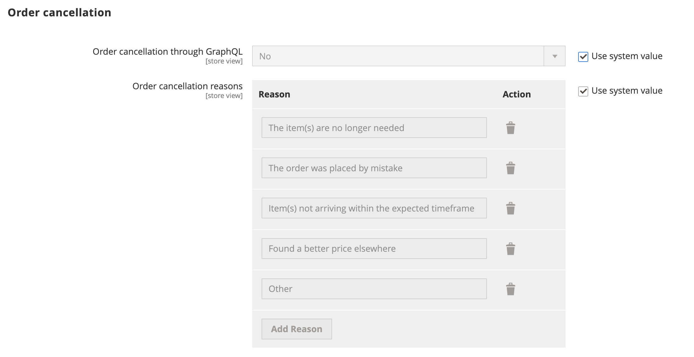
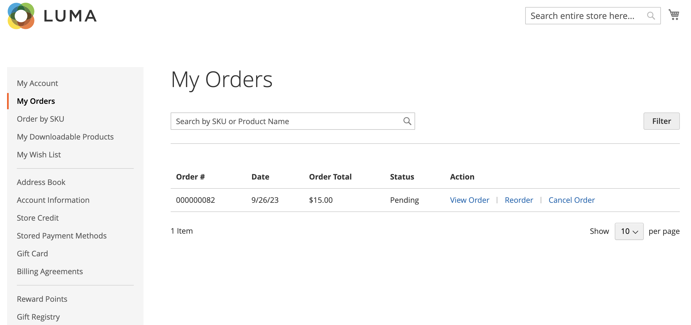
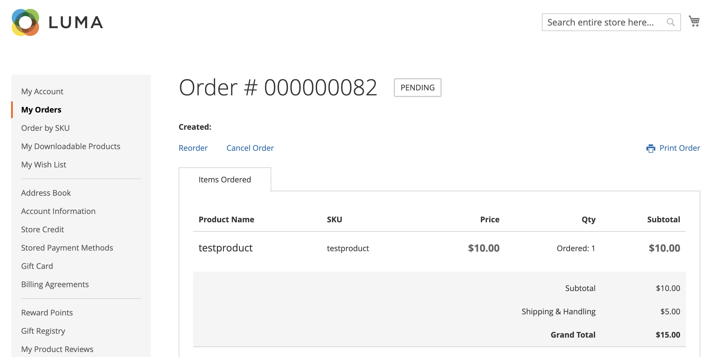
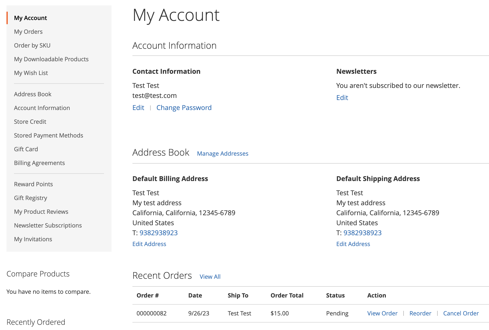

# Allow cancel order

When enabled, you can cancel an order directly from the customer's account. Cancel is disabled by default.

## Criteria for cancellation to be enabled for an order

- The _Allow Cancel Order_ configuration option must be enabled.

- If order is in `Hold`, `Canceled`, `Complete`, or `Closed` status, the cancel option is disabled on the storefront.

- If any of the items in the order have shipped, the cancel option is disabled on the storefront.

- If there is some item paid, the cancel option is enabled and the refund is created for that item.

- If order is in `Pending` or `Processing` status, the cancel option is enabled on the storefront.

## Configure to allow customer cancellation and customize the cancellation reasons

1. On the _Admin_ sidebar, go to **[!UICONTROL Stores]** > _[!UICONTROL Settings]_ > **[!UICONTROL Configuration]**.

1. In the left panel, expand **[!UICONTROL Sales]** and select **[!UICONTROL Sales]**.

1. Expand  the **[!UICONTROL Order cancellation]** section.

   {width="600" zoomable="yes"}

1. Set **[!UICONTROL Order cancellation through GraphQL]** to `Yes`. 

   This setting enables cancel functionality from the customer account on the storefront.

1. In the **[!UICONTROL Order Order cancellation reasons]** you can add, delete, or modify any cancellation reason.

   With this setting, cancellation reasons are displayed on the storefront to the customer when they cancel an order.
   This should have almost one reason set.

1. Click **[!UICONTROL Save Config]**.

## Cancel from the storefront

A customer can initiate the cancel functionality for a specific order from three pages:

- _My Orders_ page

- _Order View_ page

- _My Account_ page

### My Orders

The _Cancel Order_ button is displayed in the My Orders page if the order can be canceled.

{width="700" zoomable="yes"}

### Order view page

The _Cancel Order_ button is displayed in the View Order page if the order can be canceled.

{width="700" zoomable="yes"}

### My Account

The _Cancel Order_ button is displayed in the Recent Orders section of the My Account page, if the order can be canceled.

{width="700" zoomable="yes"}

