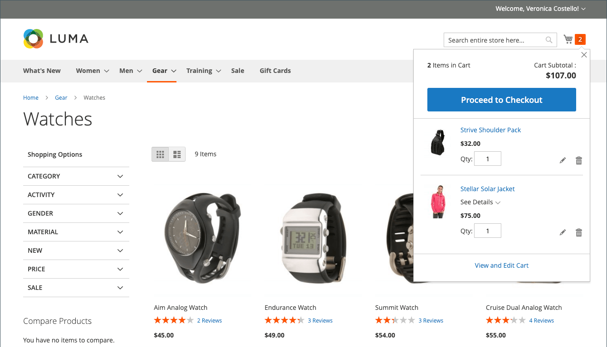
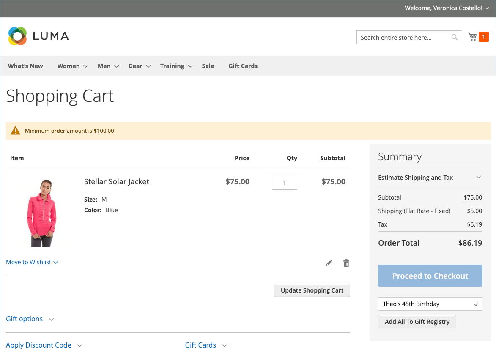
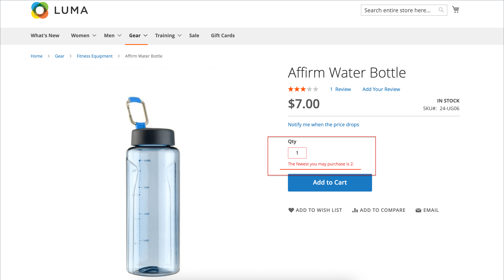
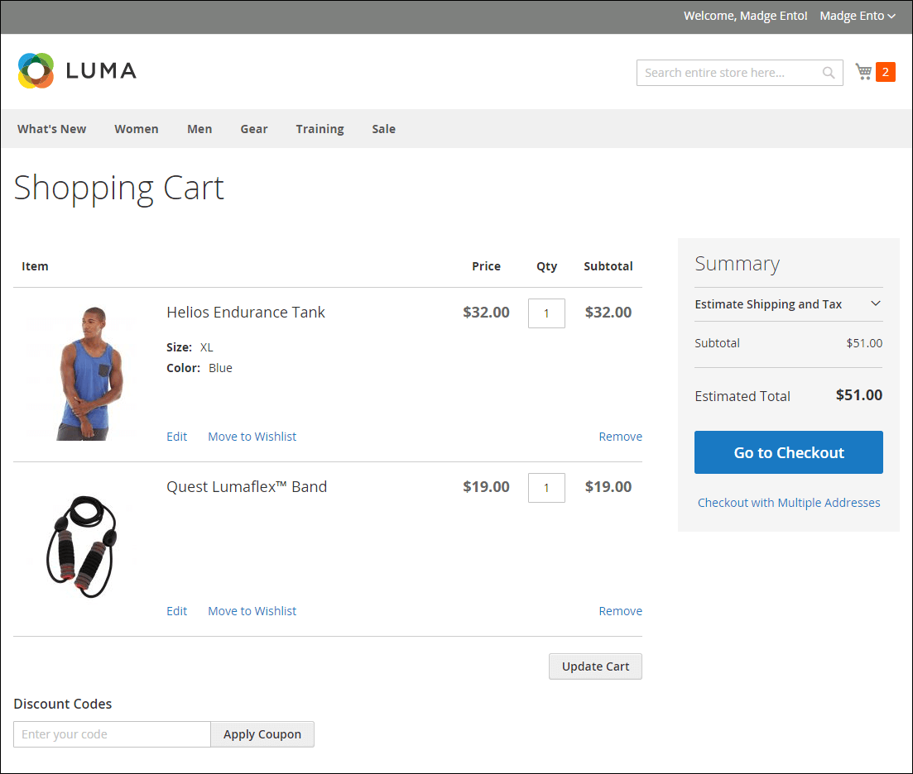
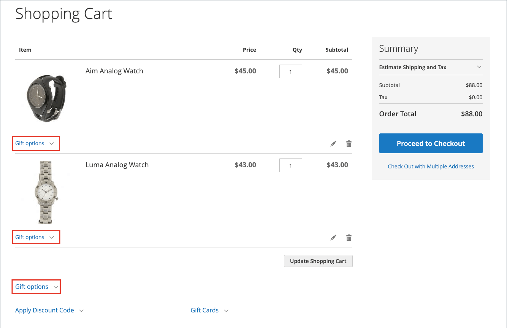
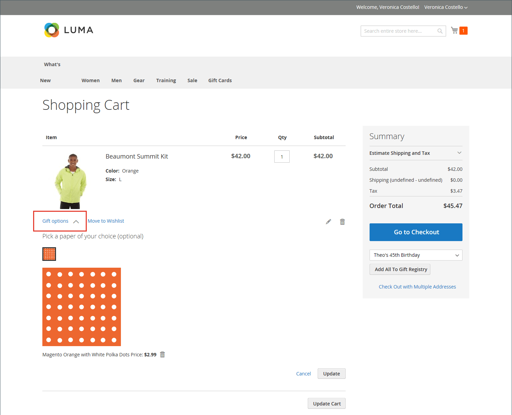
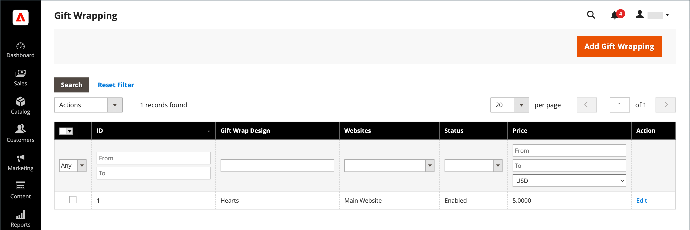
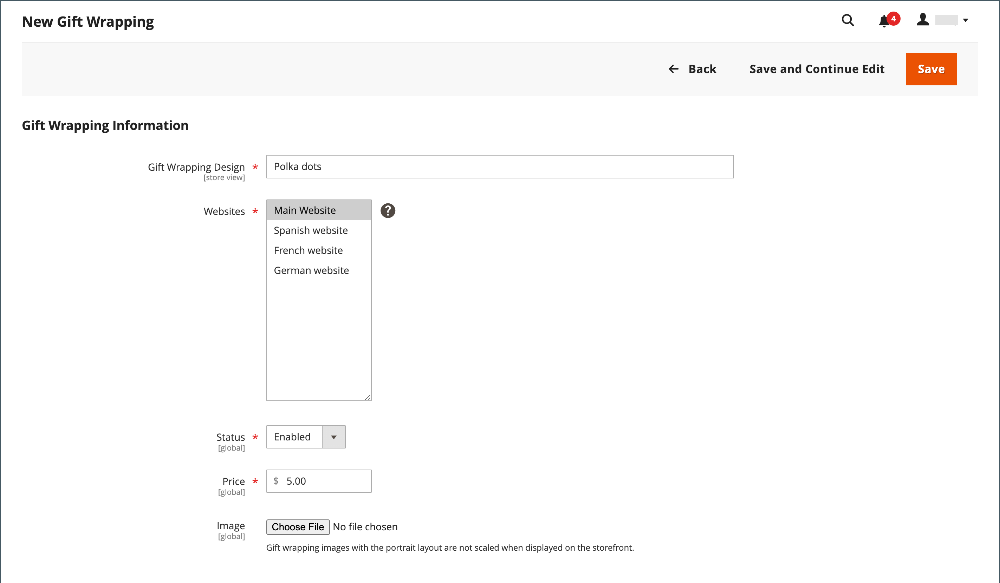
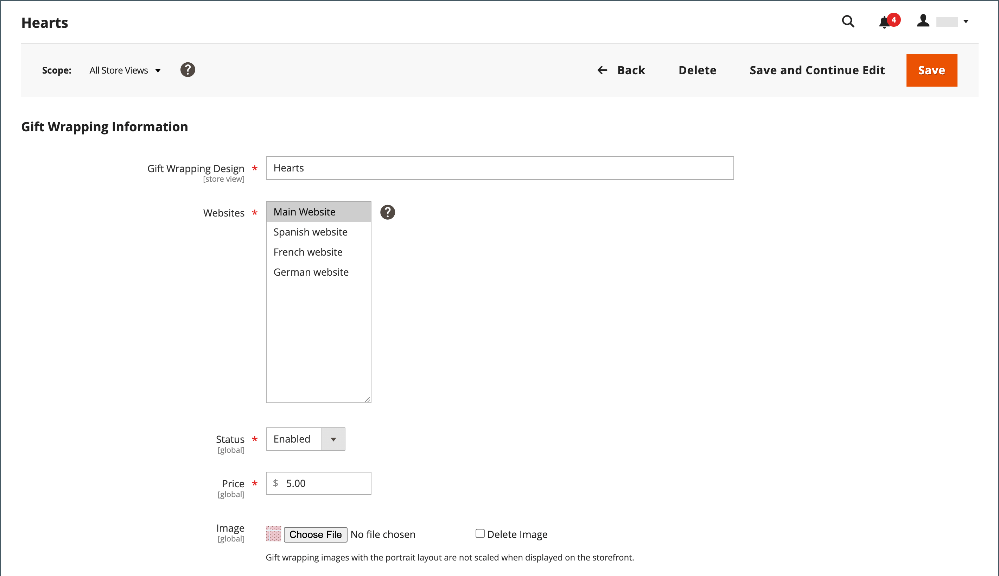

# Cart configuration

The cart configuration determines how the shopping cart functions for your store customers, including when the customer is redirected to the cart page and which images are used for product thumbnails. You can also require an order to reach a minimum amount before the checkout process begins, specify the number of days quoted prices remain valid, and specify the order of items in the _Order Totals_ section.

[**Mini cart**](#mini-cart) - Configure this option to determine if the cart link/icon displays the number of different products (or SKUs) in the cart, or the total quantity of all items.

[**Mini cart link**](#configure-the-cart-link) - Configure this option to determine if the mini cart appears when a customer clicks the number of items in the cart icon at the top of a store page.

[**Redirect to cart**](#redirect-to-cart)- Configure this option to determine if the shopping cart page appears whenever an item is added to the cart, or only when a customer chooses to go to the page.

[**Quote lifetime**](#quote-lifetime) - Configure this option to specify how long a price is valid.

[**Minimum order amount**](#minimum-order-amount) - Configure these options to specify a minimum amount, after discounts are applied, that order subtotals are required to meet and the messaging displayed in the shopping cart.

[**Minimum order quantity**](#minimum-order-quantity) - Configure these options to specify a minimum number of items that are required to place an order.

[**Cart thumbnails**](#cart-thumbnails)  - Configure the cart thumbnail options to determine the thumbnails displayed in the cart for grouped or configurable products.

[**Gift options**](#gift-options) - Configure gift options to determine if customers can add a gift message or greeting card, and if gift wrapping options that are available.

>[!NOTE]
>
>For information about configuring the checkout process, see [Checkout Options](checkout-process.md).

## Mini cart

The _mini cart_ displays a summary of items in the cart. It is enabled by default, and appears when you click the Cart link at the top of the page.
The link can be configured to display the number of different products (or SKUs) in the cart, or the total quantity of all items.

<!-- zoom -->

>[!NOTE]
>
>For a _registered_ customer, there are cases when the Mini Cart may not be synchronized across the multiple devices and browsers automatically. To synchronize the Mini Cart in such cases, the customer can simply open the [Shopping Cart](cart.md) page on that device or browser.

### Configure the mini cart

1. On the _Admin_ sidebar, go to **Stores** > _Settings_ > **Configuration**.

1. In the left panel, expand **Sales** and choose **Checkout**.

1. Expand  the _Mini Cart_ section.

   <!-- zoom -->

1. If the setting is for a specific store view, [choose the store view](https://docs.magento.com/user-guide/configuration/scope-change.html) where the configuration applies.

   When prompted, click **OK** to continue.

1. Set **Display Mini Cart** to one of the following:

   Yes|Displays the mini cart on store pages. The appearance of the sidebar depends upon the theme.
   No|Disables the display of the mini cart on store pages.

1. If the display is enabled, update the other options to configure the display:

   - For **Number of Items to Display Scrollbar**, enter the number of items that can appear in the sidebar before the scrollbar is triggered.
   - For **Maximum Display Recently Added Item(s)**, enter the maximum number of recently added items that you want to appear in the mini cart.

1. Click **Save Config**.

### Configure the cart link

1. On the _Admin_ sidebar, got to **Stores** > _Settings_ > **Configuration**.

1. In the left panel, expand **Sales** and choose **Checkout**.

1. Expand  the **My Cart Link** section.

1. Set **Display Cart Summary** to one of the following settings:

   Display item quantities|This setting displays the total number of products in the cart, adding the quantities for each product.|
   Display number of items in cart|This setting displays the number of product items in the cart, regardless of quantity.|

   <!-- zoom -->

1. Click **Save Config**.

## Redirect to cart

The shopping cart page can be configured to appear whenever an item is added to the cart, or only when customers choose to go to the page. The basic information about the items currently in the cart is always available in the [mini cart](#mini-cart). The decision is a matter of balancing the benefits of letting customers continue shopping, with the benefits of encouraging customers to proceed to checkout. It might be a simple matter of personal preference. However, if you want to back it up with numbers, you can run an A/B test to see which approach produces a higher conversion rate.

**_To configure when the cart appears:_**

1. On the _Admin_ sidebar, go to **Stores** > _Settings_ > **Configuration**.

1. In the left panel, expand **Sales** and choose **Checkout**.

1. Expand  the **Shopping Cart** section.

   <!-- zoom -->

1. If the setting is for a specific store view, [choose the store view](https://docs.magento.com/user-guide/configuration/scope-change.html) where the configuration applies.

   When prompted, click **OK** to continue.

1. Set **After Adding a Product Redirect to Shopping Cart** to one of the following:

   - `Yes` - Displays the shopping cart page immediately after a product is added to the cart.
   - `No` - Disables redirect to the shopping cart after a product addition to the cart.

1. Click **Save Config**.

## Quote lifetime

With the installation and enablement of B2B for Adobe Commerce, you can add support for the _Quotes_ feature. This capability allows authorized buyers to initiate the price negotiation process by submitting a request from the shopping cart. The _Quotes_ grid lists each quote received, and maintains a history of the communication between buyer and seller. For more information about the B2B features, see [Negotiated quotes](../b2b/quotes.md) in the _B2B for Adobe Commerce User Guide_.

You can determine how long a price is valid by setting the cart quote lifetime in the configuration. For example, if a shopper leaves a cart unattended after several days, the quotes price for some items might no longer be the same. By default, the quote lifetime is set to thirty days.

**_To configure the quote lifetime:_**

1. On the _Admin_ sidebar, go to **Stores** > _Settings_ > **Configuration**.

1. In the left panel, expand **Sales** and choose **Checkout**.

1. Expand  the **Shopping Cart** section.

   <!-- zoom -->

1. If the setting is for a specific store view, [choose the store view](https://docs.magento.com/user-guide/configuration/scope-change.html) where the configuration applies.

   When prompted, click **OK** to continue.

1. For **Quote Lifetime (days)**, enter the number of days that a quoted price remains valid.

1. Click **Save Config**.

## Minimum order amount

The configuration allows you to specify a minimum amount, after discounts are applied, that order subtotals are required to meet. Orders shipped to multiple address can be required to meet the minimum order amount per address. The Checkout button becomes available only after the minimum order amount is reached.

<!-- zoom -->

**_To configure a minimum order amount:_**

1. On the _Admin_ sidebar, go to **Stores** > _Settings_ > **Configuration**.

1. In the left panel, expand **Sales** and choose **Sales** underneath.

1. Expand  the **Minimum Order Amount** section.

   <!-- zoom -->

1. To require a minimum order amount, set **Enable** to `Yes`.

1. If the minimum order is enabled, set the following options to configure the requirement:

   - Enter the **Minimum Amount** that is required for the subtotal, after discounts are applied.

   - Set **Include Discount Amount** to one of the following:

      - `Yes` - Requires the subtotal to meet the minimum amount with any discounts included. For example, with a $50 minimum and the cart contains a $60 top with a 25% discount applied, the resulting subtotal used for the requirement is $45 and the cart would not meet the minimum.
      - `No` - Requires the subtotal to meet the minimum amount without any discounts.

   - Set **Include Tax to Amount** to one of the following:

      - `Yes` - Requires the subtotal to meet the minimum amount with tax included.
      - `No` - Requires the subtotal to meet the minimum amount without tax.

1. Optionally, customize minimum order amount message settings:

   - For **Description Message**, enter the text you want to use to customize the message that appears at the top of the cart when the subtotal does not meet the minimum amount.

   - For **Error to Show in Shopping Cart**, enter the text you want to use to customize the shopping cart error message.

   Leave the message description fields empty to use the default messages.

1. If needed, configure minimum order amount setting for multi-address orders:

   - To require that each address in a multi-address order meet the minimum order amount, set **Validate Each Address Separately in Multi-address Checkout** to `Yes`.

   - Optionally, customize minimum order amount message settings:

      - **Multi-address Description Message** - Enter the text you want to use to customize the message that appears at the top of the cart for multi-address orders that do not meet the minimum.

      - **Multi-address Error to Show in Shopping Cart** - Enter the text you want to use to customize the shopping cart error message for multi-address orders that do not meet the minimum, enter the text in the  box.

      Leave the message description fields empty to use the default messages.

1. Click **Save Config**.

## Minimum order quantity

You can set the minimum quantity allowed for an order. The minimum quantity can also be configured according to each customer group.

1. Go to **Stores** > _Settings_ > **Configuration**.

1. In the left panel, expand **Catalog** and choose **Inventory**.

1. Expand  the **Product Stock Options** section.

   <!-- zoom -->

1. For **Minimum Qty Allowed in Shopping Cart**, set the minimum quantity of the product for an order.

   If needed, clear the **Use system value** checkbox to modify these settings.

   - Change the **Customer Group** setting to a specific group and enter the **Minimum Qty** for that group. To add another group and quantity limit, click **Add Minimum Qty**.

   - To set the same minimum quantity limit for all customers, keep the `ALL GROUPS` selection and enter the **Minimum Qty**.

1. Click **Save Config**.

   <!-- zoom -->

## Cart thumbnails

 (Adobe Commerce only)

The thumbnail images displayed in the cart give customers a quick overview of the items they are about to purchase. However, for products with multiple options, the image might not match the variation of the product that is in the cart. If the customer purchases an item in a specific color, ideally, the thumbnail in the cart should match.

The thumbnail image for both grouped and configurable products can be set to display the image from either the "parent" product or from the product variation.

<!-- zoom -->

**_To configure cart thumbnails:_**

1. On the _Admin_ sidebar, go to **Stores** > _Settings_ > **Configuration**.

1. In the left panel, expand **Sales** and choose **Checkout**.

1. Expand  the **Shopping Cart** section.

   <!-- zoom -->

1. Set **Grouped Product Image** to determine the thumbnail that is used in the cart for [grouped products](../catalog/product-create-grouped.md):

   - `Product Thumbnail Itself` - Uses the thumbnail assigned to the product variation that is added to the cart.
   - `Parent Product Thumbnail` - Uses the thumbnail assigned to the parent product.

1. Set **Configurable Product Image** to determine the thumbnail that is used in the cart for [configurable products](../catalog/product-create-configurable.md):

   - `Product Thumbnail Itself` - Uses the thumbnail assigned to the product variation that is added to the cart.
   - `Parent Product Thumbnail` - Uses the thumbnail assigned to the parent product.

1. Click **Save Config**.

## Gift options

The selection of available gift options appears in the cart before the checkout process begins. The gift options configuration determines if customers can add a gift message or greeting card, and if gift wrapping options are available. Each item in the order can have a separate message and gift wrapping. When applied to the entire order, customers can also add a gift receipt and greeting card.

<!-- zoom -->

The Gift Options configuration applies to the entire website, but can be overridden at the product level.

### Enable gift options

1. On the _Admin_ sidebar, go to **Stores** > _Settings_ > **Configuration**.

1. In the left panel, expand **Sales** and choose **Sales** underneath.

1. Expand  **Gift Options** on the page.

    <!-- zoom -->

1. Set the gift message options according to your preference:

   - For **Allow Gift Messages on Order Level**, select `Yes` to enable a single gift message for the whole order.
   - For **Allow Gift Messages for Order Items**, select `Yes` to enable adding separate gift messages for individual items in the customer shopping cart.

1.  (Adobe Commerce only) Set the gift wrapping options according to your preference:

   - For **Allow Gift Wrapping on Order Level**, select `Yes` to enable a single gift wrapping for the entire order.
   - For **Allow Gift Wrapping for Order Items**, select `Yes` to enable adding gift wrapping individually to each item in the customer shopping cart.

   You can also define different [gift wrapping designs](#gift-wrap) so that customers can choose the wrapping.

1.  (Adobe Commerce only) To provide customers with an option to include a gift receipt, set **Allow Gift Receipt** to `Yes`.

1.  (Adobe Commerce only) To provide customers with an option to include a printed card, set **Allow Printed Card** to `Yes`.

1.  (Adobe Commerce only) Enter the **Default Price for Printed Card**.

1. Click **Save Config**.

### Gift wrap

 (Adobe Commerce only)

Gift wrapping is available for any product that can be shipped, and can be offered for individual items or for the entire order. You can charge a separate price for each gift wrap design, and upload a thumbnail image for each design that appears as an option for a product in the cart. When a customer clicks the gift wrap thumbnail, a full-size image appears. During checkout review, the gift wrap charge appears with the other [checkout totals](checkout-totals-sort-order.md) in the _Order Summary_ section.

The gift wrap image should be a swatch that shows the repeating pattern, and can also include a sample of the ribbon that is to be used. You can either scan the paper, or take a photograph of a wrapped package. The uploaded image can be a GIF, JPG, or PNG image, and should be square. In the following example, the uploaded gift wrap image is 230 x 230 pixels.

<!-- zoom -->

#### Add a new gift wrap design

1. On the _Admin_ sidebar, go to **Stores** > _Other Settings_ > **Gift Wrapping**.

   <!-- zoom -->

1. In the upper-right corner, click **Add Gift Wrapping**.

   <!-- zoom -->

1. Enter the name for the **Gift Wrapping Design** to appear during checkout.

   If needed, you can change the **Scope** and configure a different name for each store view.

1. Select the **Websites** where the gift wrap design will be available.

1. Set **Status** to `Enabled`.

   If you have seasonal wrapping option, you can set this to `Disabled` when you do not want the option to be available.

1. Enter the **Price** of the gift wrap design.

   This setting can be overridden by the gift wrap price set at the product level.

1. To upload a thumbnail **Image** of the gift wrapping, click **Choose File** and select the file to upload from your directory.

   A thumbnail of the image appears in the Gift Wrapping Information after the record is saved.

1. Click **Save**.

#### Edit a gift wrap design

1. On the _Admin_ sidebar, go to **Stores** > _Other Settings_ > **Gift Wrapping**.

1. Find the gift wrap record in the list.

1. In the _Action_ column, click **Edit**.

   <!-- zoom -->

1. Make the necessary changes.

1. Click **Save**.

#### Delete gift wrap designs

With the _Gift Wrapping_ grid open, use one of these methods to delete wrap designs.

**_Method 1: Delete a single gift wrap design_**

1. Open the gift wrapping design in edit mode.

1. At the top of the workspace, click **Delete**.

1. When prompted, click **OK** to confirm.

**_Method 2: Delete multiple gift wrap designs_**

1. In the _Gift Wrapping_ grid, select the checkbox of each gift wrap design that you want to delete.

1. Set the **Actions** control to `Delete`.

1. Click **Submit**.

### Gift options tax

 (Adobe Commerce only)

Gift wrapping and printed gift card prices can be configured to include or exclude tax, or to display both options. You can also specify a tax class for these items, at either the global or website level.

**_To configure gift options taxes:_**

1. On the _Admin_ sidebar, go to **Stores** > _Settings_ > **Configuration**.

1. In the left panel, expand **Sales** and choose **Tax**.

1. Expand  the **Tax Classes** section.

   <!-- zoom -->

1. Set **Tax Class for Gift Options** to the applicable tax class.

1. Expand  the **Orders, Invoices, Credit Memos Display Settings** section.

   <!-- zoom -->

1. Set **Display Gift Wrapping Prices** to one of the following:

   - `Excluding Tax`
   - `Including Tax`
   - `Including and Excluding Tax`

1. Set **Display Printed Card Prices** to one of the following:

   - `Excluding Tax`
   - `Including Tax`
   - `Including and Excluding Tax`

1. Click **Save Config**.
