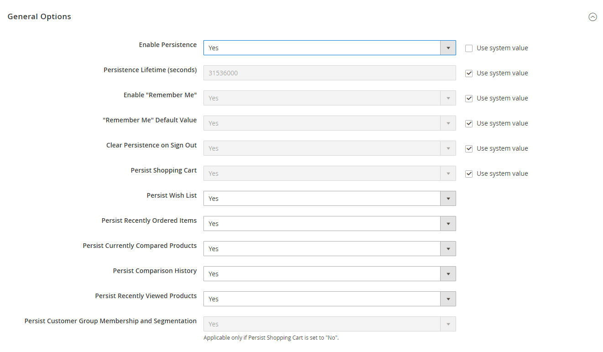

# Cart persistence

A persistent shopping cart tracks unpurchased items that are left in the cart and saves the information for the customer's next visit. Customers who are _remembered_ can have the contents of their shopping carts restored the next time they visit your store.

Using a persistent shopping cart can help reduce the number of abandoned shopping carts and increase sales. It is important to understand that the persistent shopping cart does not expose sensitive account information at any time. While the persistent shopping cart is in use, both registered customers and guest shoppers are required to either log in to an existing account, or create an account before going through checkout. For guest shoppers, a persistent shopping cart is the only way to retrieve information from a previous session.

To manage the use of cart persistence for your site or within specific store views, you can [configure persistent shopping cart](#configure-a-persistent-cart) settings. For more information about how these settings affect the shopper experience in your storefront, see [Persistent cart workflow](#persistent-cart-workflow).

>[!NOTE]
>
>When using a persistent cart, we recommend that you set the lifetime of the server session and the session cookie to a long time period. See [Session Lifetime](https://docs.magento.com/user-guide/customers/customer-online-options.html) for more information.

To use the persistent shopping cart, the customer's browser must be set to allow cookies. There are two types of cookies used for shopping cart operations:

- **Session cookie** – A short-term session cookie exists during a single visit to your site, and expires when the customer leaves, or after a set time period.

- **Persistent Cookie** – A long-term, persistent cookie continues in existence after the end of the session and saves a record of the customer's shopping cart contents for future reference.

## Persistent cart workflow

When the persistent shopping cart is [enabled](#configure-a-persistent-cart), the workflow depends on:

- The values of the _Enable Remember Me_ and _Clear Persistence on Log Out_ settings
- The customer's decision to select or clear the _Remember Me_ checkbox
- When the persistent cookie is cleared

When a persistent cookie is applied, a `Not Jane Smith?` link appears in the page header. This prompt gives the customer the ability to terminate the persistent session and start working as a guest, or to log in as a different customer. The system retains a record of the shopping cart contents, even if the customer later uses different devices to shop in your store. For example, a customer can add an item to the cart from a laptop computer, add more items from a mobile device, and complete the checkout process from a tablet.

There is a separate independent persistent cookie for each browser. If the customer uses multiple browsers while visiting your store during a single, persistent session, changes made in one browser are reflected in any other browser upon page refresh. While the persistent shopping cart is enabled, your store creates and maintains a separate persistent cookie for each browser that is used by a customer to log in or create an account.

### Example: An open session on a shared computer

Jane is finishing her holiday shopping with a persistent session. She adds a present for John to her cart, and something for her mother. Then she goes to the kitchen for a snack.

John sits down at the computer to do some quick shopping while Jane is in the kitchen. Without noticing the `Not Jane Smith?` link at the top of the page, he finds a nice present for Jane and adds it to the cart. When he goes to checkout and logs in as himself, both items in Jane's cart are added to his cart. John is in such a hurry that he does not notice the additional items during _Order Review_, and submits the order. Jane's cart is now empty, and John bought all the gifts.

### Remember Me

Customers can select the _Remember Me_ checkbox on the login page to save the contents of their shopping carts.

| Remember Me? |  Result |
| ------------ |  ------ |
| Selected |Creates a persistent cookie and saves the contents of the shopping cart for the customer's next logged-in session. |
| Not selected | Does not create a persistent cookie and does not save the cart information for the customer's next logged-in session. |

{style="table-layout:auto"}

### Continue persistence on logout - no

| Action | Result |
| ------ | ------ |
| Customer logs in | Invokes the persistent cookie in addition to the session cookie, which is already in use. |
| Customer logs out | Deletes the session cookie but the persistent cookie remains in effect. The next time the customer logs in, it restores the cart items or adds them to any new items placed in the cart. |
| Customer does not log out and the session cookie expires | The persistent cookie remains in effect.|

{style="table-layout:auto"}

### Clear persistence on logout

| Action | Result |
| ------ | ------ |
| Customer logs in | Invokes the persistent cookie in addition to the session cookie, which is already in use. |
| Customer logs out | Deletes both cookies. |
| Customer does not log out but the session cookie expires | The persistent cookie remains in effect. |

{style="table-layout:auto"}

## Persistent cart settings and effects

| Settings | Effect |
|----------|--------|
| **Enable Remember Me** is set to `No`.  **Clear Persistence on Log Out** has any value.  The **Remember Me** checkbox is not available on the login and registration page. | The persistent cookie is not used. |
| **Enable Remember Me** is set to `Yes`.  **Clear Persistence on Log Out** has any value.  **Remember Me** is not selected. | The session cookie is applied as usual; the persistent cookie is not used. |
| **Enable Remember Me** is set to `Yes`.  **Clear Persistence on Log Out** is set to `Yes`.  **Remember Me** is set to `Yes`. | When a customer logs in, both cookies are applied. When a customer logs out, both cookies are deleted. If a customer does not log in but the session cookie expires, the persistent cookie is still used. Apart from logging out, the persistent cookie is deleted when its lifetime runs out or when the customer clicks the `Not Jane Smith` link. |
| **Enable Remember Me** is set to `Yes`.  **Clear Persistence on Log Out** is set to `No`.  **Remember Me** is set to `Yes` | When a customer logs in, both cookies are applied. When a customer logs out, the session cookie is deleted, the persistent session continues. The persistent cookie is deleted when its lifetime runs out or when the customer clicks the `Not Jane Smith` link.|

{style="table-layout:auto"}

## Configure a persistent cart

During the setup of a persistent shopping cart, you can specify the lifetime of the cookies, and which options you want to make available for various customer activities.

For more information about how the customer workflow is determined by these settings, see [Persistent cart workflow](#persistent-cart-workflow).

>[!NOTE]
>
>If the session cookie expires while the customer is logged in, the persistent cookie remains active.

1. On the _Admin_ sidebar, go to **Stores** > _Settings_ > **Configuration**.

1. In the left panel, expand **Customers** and choose **Persistent Shopping Cart**.

1. To enable the persistent shopping cart and display additional options, set **Enable Persistence** to `Yes`.

   <!-- zoom -->

   For more information about each of these configuration settings, see the [Configuration Reference](https://docs.magento.com/user-guide/configuration/customers/persistent-shopping-cart.html)

   >[!NOTE]
   >
   >You might need to clear the **Use system value** checkbox to modify these settings.

1. For **Persistence Lifetime (seconds)**, enter the length of time, in seconds, that you want the persistent cookie to last.

   The default value of 31,536,000 seconds is equal to one year, and is the maximum time allowed.

1. Set **Enable "Remember Me"** to one of the following:

   `Yes` - Displays the _Remember Me_ checkbox on the Login page of your store, so that customers can choose to save their shopping cart information.

   `No` - Persistence can still be enabled, but customers are not given the option to choose if they want to save their information.

1. To preselect the _Remember Me_ checkbox for the customer, set **Remember Me Default Value** to `Yes`.

   The customer can clear this option if they choose.

1. Set **Clear Persistence on Log Out** to one of the following:

   `Yes` - The shopping cart is cleared when a registered customer logs out.

   `No` - The shopping cart is saved when a registered customer logs out.|

   >[!NOTE]
   >
   >If the session cookie expires while the customer is still logged in, the persistent cookie remains in use.

1. Set **Persist Shopping Cart** to one of the following:

   `Yes` - If the session cookie expires, the persistent cookie is preserved. If a guest shopper later logs in or creates an account, the shopping cart is restored.

   `No` - The shopping cart is not preserved for guests after the session cookie expires.

1.  (Adobe Commerce only) Set **Persist Wish List** to determine if the state of customer wish lists is retained when the session ends:

   `Yes` - The wish list contents are saved when the session ends.

   `No` - The wish list is not saved when the session ends.|

1.  (Adobe Commerce only) Set **Persist Recently Ordered Items** to determine if the state of recently ordered items is retained when the session ends:

   `Yes` - The state of Recently Ordered Items is saved when the session ends.

   `No` - The state of Recently Ordered Items is not saved when the session ends.

1. Set **Persist Currently Compared Products** to `Yes` or `No`.

1. Set **Persist Comparison History** to `Yes` or `No`.

1. Set **Persist Recently Viewed Products** to `Yes` or `No`.

1.  (Adobe Commerce only) Set **Persist Customer Group Membership and Segmentation** to determine if the state of the customer's group membership and segmentation criteria are retained when the session ends:

   `Yes` - The state of the customer's group membership and segmentation data is saved when the session ends.

   `No` - The state of the customer's group membership and segmentation data are not saved when the session ends.

1. Click **Save Config**.
