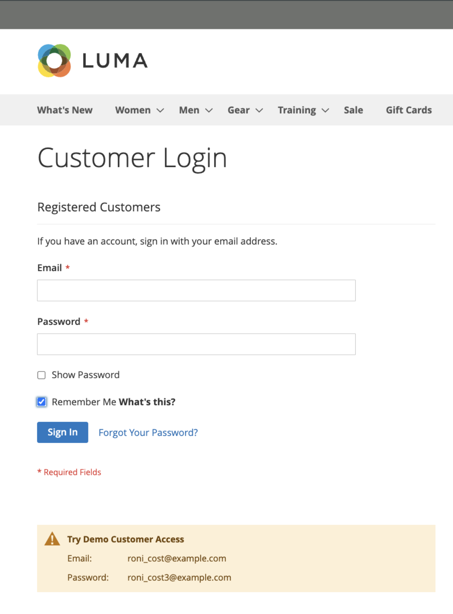
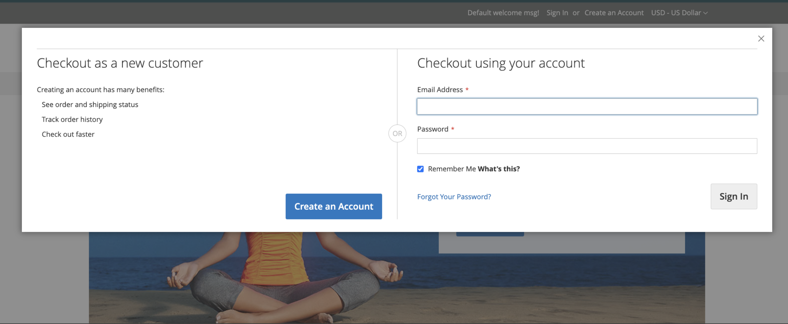

# Cart persistence

A persistent shopping cart saves a reference to the customer's account on the current device, ensuring cart contents remain accessible when the logged-in session expires.

If a customer is _remembered_, the contents of their shopping cart remains accessible on the current device when the logged-in session expires. After the session expires, the customer's shopping cart is accessed using the persistent cart session. If the same customer logs in on another device or browser and adds something to their shopping cart, and then returns to the device with an active persistent session, their shopping cart is updated with the added items.

Using a persistent shopping cart can reduce the number of abandoned shopping carts and increase sales. The persistent shopping cart **does not** expose sensitive account information at any time.

To manage the use of cart persistence for your site or within specific store views, you can [configure persistent shopping cart](#configure-a-persistent-cart) settings. For more information about how these settings affect the shopper experience in your storefront, see [Persistent cart workflow](#persistent-cart-workflow).

>[!NOTE]
>
>The persistent shopping cart capability is available only to customers that are registered and signed-in. Guest shoppers cannot use the persistent shopping cart feature.

## Persistent cart workflow

When the persistent shopping cart is [enabled](#configure-a-persistent-cart), the workflow depends on:

- The values of the _[!UICONTROL Enable Remember Me]_ and _[!UICONTROL Clear Persistence on Log Out]_ settings
- The customer's decision to select or clear the _[!UICONTROL Remember Me]_ checkbox
- When the persistent cookie is cleared

When the customer session expires, a `Not Jane Smith?` link displays in the page header under the following conditions:
- the logged in customer has selected the _[!UICONTROL Remember Me]_ option and a persistent cookie is applied
- the customer logs out when the system is configured with _[!UICONTROL Clear Persistence on Sign Out]_ set to `No`.

The system retains a record of the shopping cart contents on the current device, even if the logged-in session expires. The `Not Jane Smith?` link allows the customer to terminate the persistent session and start working as a guest, or to log in as a different or the same customer. 

If the customer checked the _[!UICONTROL Remember Me]_ checkbox when logging in, your store creates and maintains a separate persistent cookie. This cookie helps keep the customer's shopping cart accessible even after they close the browser or navigate to a different site and their logged in session expires. 

If this same customer visits your store using multiple browsers while logged in or while a persistent session is active, the changes the customer makes to the shopping cart content in one browser are reflected in other browsers when the page is refreshed.

>[!NOTE]
>
>To ensure cart synchronization across multiple devices or browsers, customers must log in on each new device they use for shopping. For logged in customers, the contents of the shopping cart is synchronized across multiple devices and browsers as long as they are logged in under the same account, regardless of the Persistent Cart configuration.

### "Remember Me" checkbox behavior

Customers can select the _[!UICONTROL Remember Me]_ checkbox on the login page, authentication popup, checkout sign-ins or when creating a new account to keep the contents of the shopping cart accessible on the current device when the logged-in session expires.

| Remember Me? |  Result |
| ------------ |  ------ |
| Selected |Creates a persistent cookie and keeps the contents of the shopping cart accessible on the current device when the customer login session expires. |
| Not selected | Does not create a persistent cookie and does not keep the content of the shopping cart accessible on the current device when the login session expires. Note that the shopping cart content is still saved in the customer's account and reloaded the next time the customer logs in.|

{style="table-layout:auto"}

{width="600" zoomable="yes"}
{width="600" zoomable="yes"}
{width="600" zoomable="yes"}

### Clear Persistence on Sign Out behaviour

When the customer logs in or registers with the _Remember Me_ option selected, the configuration of the _Clear Persistence on Sign Out_ option determines the Persistent Cart behavior.

|  | Clear Persistence on Sign Out set to Yes | Clear Persistence on Sign Out set to No |
| ------ | ------ | ------ |
| _Remembered_ customer logs out | Deletes both session and persistent cookies so that the shopping cart content disappears on the current device until the same customer logs back in. | Deletes the session cookie but the persistent cookie remains in effect. The shopping cart content remains accessible on the current device. |
| _Remembered_ customer does not log out but the session cookie expires | The persistent cookie remains in effect, and the shopping cart content is accessible from the current device. | The persistent cookie remains in effect, and the shopping cart content is accessible from the current device. |

### An example of an open session on a shared computer

Jane is finishing her holiday shopping as a _Remembered_ logged in customer. She adds a present for John to her cart, and something for her mother. Then, she goes to the kitchen for a snack and her login session expires.

John sits down at the computer to do some quick shopping while Jane is in the kitchen. Without noticing the `Not Jane Smith?` link at the top of the page, John finds a nice present for Jane and adds it to the cart. When he checks out, he notices that the shipping and billing addresses are pre-filled and thinks that he is signed in. John is in such a hurry that he does not notice the additional items during _Order Review_, and submits the order. Jane's cart is now empty, and John bought all the gifts.

## Configure a persistent cart

During the setup of a persistent shopping cart, you can specify the lifetime of the cookies, and which options you want to make available for various customer activities.

To use the persistent shopping cart, the customer's browser must be set to allow cookies. There are two types of cookies used for shopping cart operations:

- **Session cookie** – A short-term session cookie exists during a single visit to your site. This cookie expires when the customer logs out or when the session expires.

- **Persistent Cookie** – A long-term, persistent cookie continues to exist after the logged-in session ends. This cookie ensures that the contents of a customer's shopping cart remains accessible when the customer logs out or the session expires.

For more information about how the these configuration settings affect the customer workflow, see [Persistent cart workflow](#persistent-cart-workflow).

{{$include /help/_includes/persistent-cart-configuration.md}}
