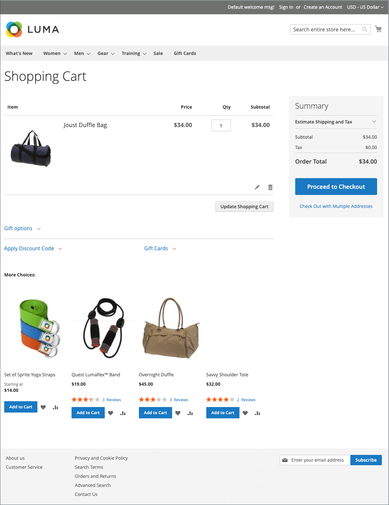

# Shopping cart

The cart is positioned at the end of the path to purchase, at the intersection of _Buy_ and _Abandon_, and is one of the most important pages in your store. The cart is where the order total is calculated, along with discount coupons and estimated shipping and tax. It is a great place to show your trust badges and seals, and an ideal opportunity to offer one last item. You can choose the items to be offered as a cross-sell impulse purchase whenever a specific item appears in the cart.

<!-- zoom -->

- Configure the [shopping cart options](cart-configuration.md) to determine which tools are available to shoppers, and modify the display.
- Configure the [cart persistence](cart-persistent.md) behavior to help shoppers retain the contents of their cart.
- Add the [Order by SKU](order-by-sku.md) widget as a convenience for all shoppers, or only for those in specific customer groups, to enter the SKU and quantity information directly into a page.
