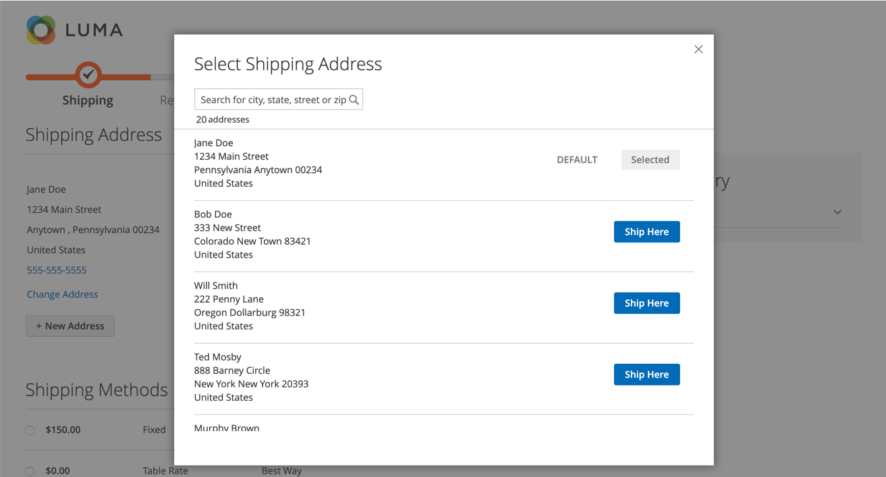
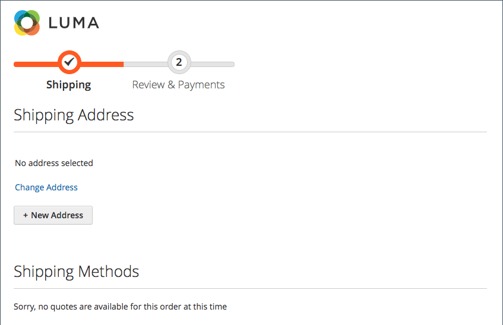
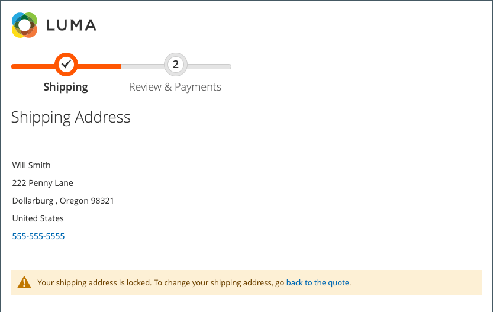
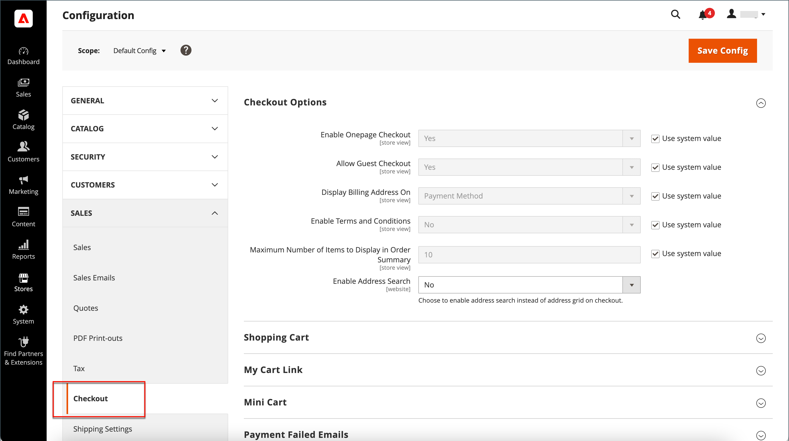

# Address search at checkout

{{ee-feature}}

Your customers could have many saved addresses and information in their address book, especially regular, returning customers or companies entering multiple orders and shipment locations. Displaying many addresses can slow checkout loading and processes considerably, and result in a negative shopping experience. To help increase the responsiveness of checkout, activating and configuring address search for your site is recommended.

>[!NOTE]
>
>Address search is not enabled by default. You can configure this feature to include the functionality on your site.

When this feature is enabled and the customer's number of saved addresses meets or exceeds the configured limit, the _Shipping_ and _Review & Payments_ steps display only one address (the default). The customer can change the selected address by clicking **Change Address** and then searching for the correct address by city, state, street, or zip. This feature also supports address selection for gift registry checkout.

{width="700" zoomable="yes"}

If the customer does not have a default shipping address, the _Shipping_ page displays _No address selected_. In this case, the customer must click **Change Address** to select a saved address or click **New Address** to add and select an address before proceeding with the checkout. If the customer does not have a default billing address, the _Review & Payments_ page displays the address selected for shipping along with the _Change Address_ option.

{width="600" zoomable="yes"}

## Locked address search for quotes

 (Available with Adobe Commerce B2B only)

Enabling address search also affects the checkout for orders that are created from quotes where customer's number of saved addresses meets or exceeds the configured limit. When the quote is complete and the customer proceeds to the checkout, only the selected shipping address is displayed. The page also displays a message that the shipping address is locked and can only be changed in the quote.

{width="600" zoomable="yes"}

## Enable address search

1. On the _Admin_ sidebar, go to **[!UICONTROL Stores]** > _[!UICONTROL Settings]_ > **[!UICONTROL Configuration]**.

1. In the left panel, expand **[!UICONTROL Sales]** and choose **[!UICONTROL Checkout]**.

1. Expand  the **[!UICONTROL Checkout Options]** section.

   {width="700" zoomable="yes"}

   For a detailed description of each of these configuration settings, see [Checkout Options](../configuration-reference/sales/checkout.md#checkout-options) in the _Configuration Reference Guide_.

1. Set **[!UICONTROL Enable Address Search]** to `Yes`.

1. To specify the threshold for including the address search feature, set the **[!UICONTROL Number of Customer Addresses Limit]** option.

   If necessary, clear the **[!UICONTROL Use system value]** checkbox to make this change.

   When the customer's number of saved addresses meets or exceeds this limit, the page displays either the default address (if the customer has one) or _No address selected_ with the _Change Address_ option. The default limit is `10`.

1. Click **[!UICONTROL Save Config]**.
