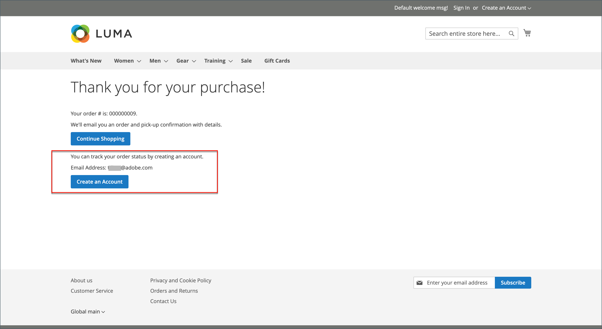

# Guest checkout

Your store can be configured to require shoppers to open an account before making a purchase. The default setting allows guests to make purchases, with an option to register for an account after they complete the checkout process.

{width="600" zoomable="yes"}

**_To disable guest checkout:_**

1. On the _Admin_ sidebar, go to **[!UICONTROL Stores]** > _[!UICONTROL Settings]_ > **[!UICONTROL Configuration]**.

1. On the left panel, expand **[!UICONTROL Sales]** and choose **[!UICONTROL Checkout]**.

1. Expand  the **[!UICONTROL Checkout Options]** section.

   {width="700" zoomable="yes"}

  For a detailed description of each of these configuration settings, see [Checkout Options](../configuration-reference/sales/checkout.md#checkout-options) in the _Configuration Reference Guide_.

1. If the setting is for a specific store view, [choose the store view](../configuration-reference/scope-change.md#set-the-scope) where the configuration applies.

   When prompted, click **[!UICONTROL OK]** to continue.

1. Set **[!UICONTROL Allow Guest Checkout]** to `No`.

   If necessary, clear the **[!UICONTROL Use system value]** checkbox to enable changes to this setting.

1. Click **[!UICONTROL Save Config]**.
