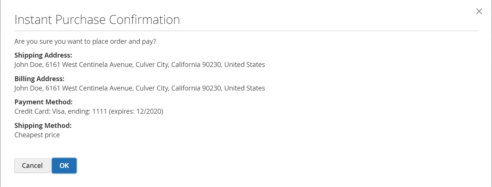
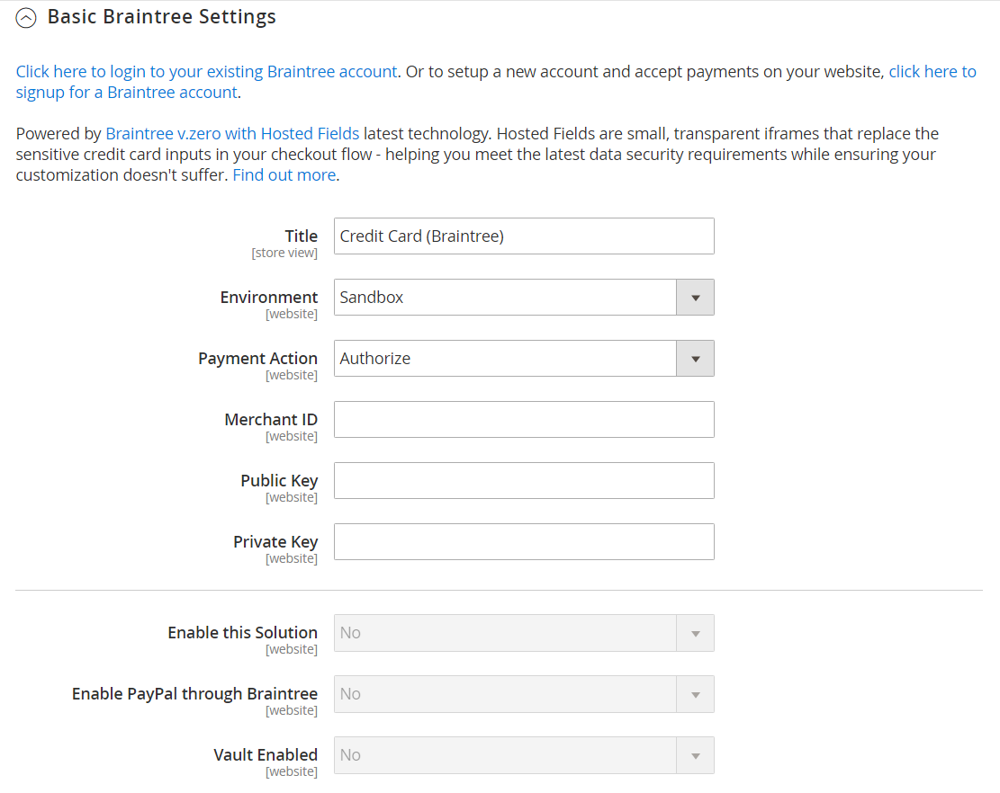

# Instant Purchase

Instant Purchase allows customers to speed through the checkout process using information that is saved in their account. When enabled, the _Instant Purchase_ button appears below the _Add to Cart_ button on the product page for customers who meet the requirements.

<!-- zoom -->

## Customer requirements

- Customer is [signed in](https://docs.magento.com/user-guide/customers/customer-sign-in.html) to their account.

- Customer account has a [default billing and shipping address](https://docs.magento.com/user-guide/customers/account-dashboard-address-book.html).

- At least one [shipping method](delivery.md) is available for the country that is specified in the default shipping address.

- Customer account has a [stored payment](https://docs.magento.com/user-guide/customers/account-dashboard-stored-payment-methods.html) method with vault enabled.

   The following payment methods can be used to provide secure access to saved credit card information:

   - [Braintree Credit Cards](braintree.md) (Instant Purchase cannot be used with Braintree Credit Cards if 3D Secure is enabled.)
   - [Braintree with PayPal Enabled](braintree.md)
   - [PayPal Payflow Pro](paypal-payflow-pro.md)

## Instant Purchase on the storefront

1. On the storefront, the customer goes to the product page of the item to be purchased.

1. Selects the required options and clicks **Instant Purchase**.

   <!-- zoom -->

1. Reviews the **Instant Purchase Confirmation** information and clicks **OK** to complete the transaction.

   A confirmation message and order number appear at the top of the product page.

## Configure Instant Purchase

### Step 1: Open the configuration page

1. On the _Admin_ sidebar, go to **Stores** >  _Settings_ > **Configuration**.

### Step 2: Configure the payment method vault

The following example shows how to configure the Braintree vault.

1. In left panel, expand the **Sales** section and choose **Payment Methods**.

1. Under _Recommended Solutions_, click **Configure** in the _Braintree_ section.

   <!-- zoom -->

1. In the _Basic Braintree Settings_ section, enter the following information from your Braintree seller account:

   - **Merchant ID**
   - **Public Key**
   - **Private Key**

1. Set **Enable this Solution** to `Yes`.

1. If applicable set **Enable PayPal through Braintree** to `Yes`.

1. Set **Vault Enabled** to `Yes`.

   <!-- zoom -->

### Step 3: Enable Instant Purchase

1. In the left panel under the _Sales_ section, choose **Sales**.

1. Expand  the **Instant Purchase** section.

1. If this change is for a specific store view, [choose the store view](https://docs.magento.com/user-guide/configuration/scope-change.html) where the configuration applies.

   When prompted, click **OK** to continue.

1. Set **Enabled** to `Yes`.

1. Enter the **Button Text** that you want to appear on the button.

   The button text can be changed for each store view, or language. By default, the button text is `Instant Purchase`.

   <!-- zoom -->

   For a detailed description of each of these configuration settings, see [Instant Purchase](https://docs.magento.com/user-guide/configuration/sales/sales.html#instant-purchase) in the _Configuration Reference Guide_.

1. Click **Save Config**.

1. When prompted to update the cache, click **Cache Management** in the system message and follow the instructions to flush the cache.
