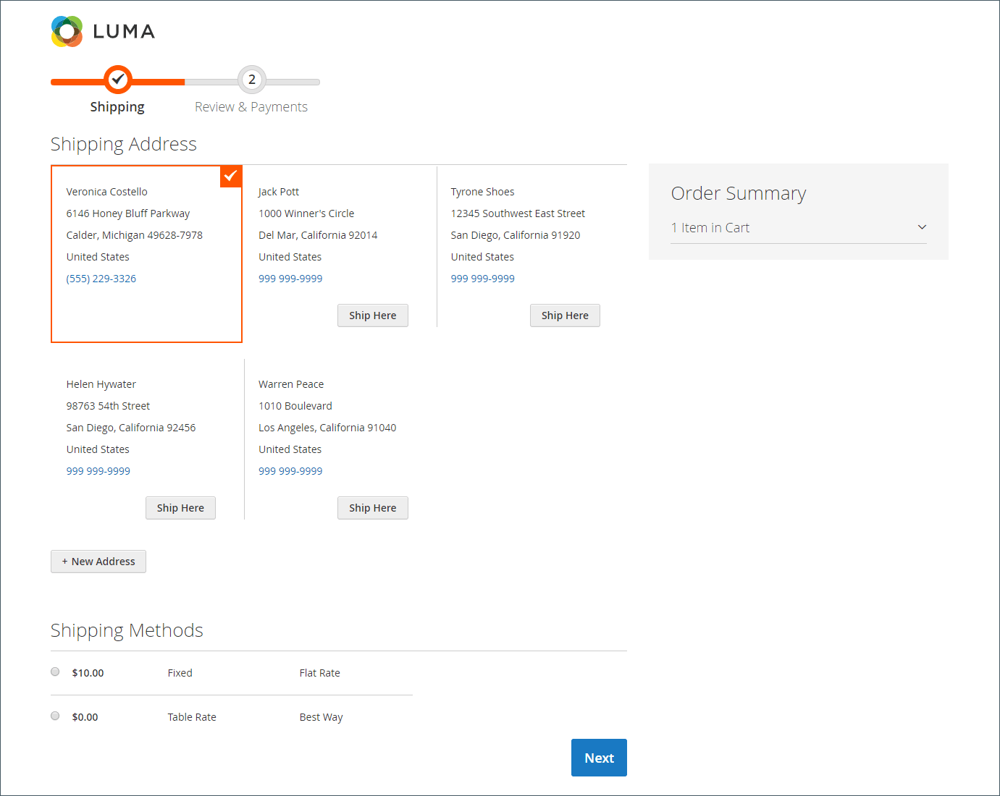
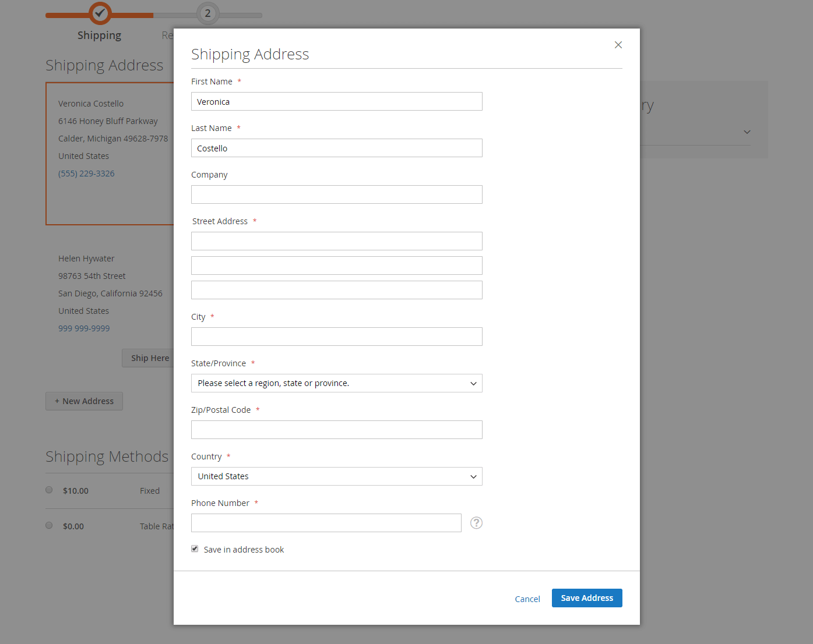
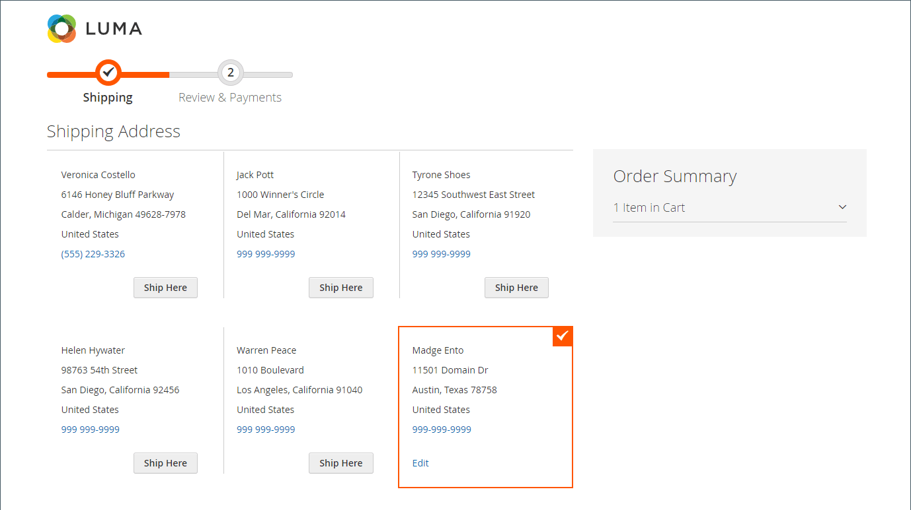
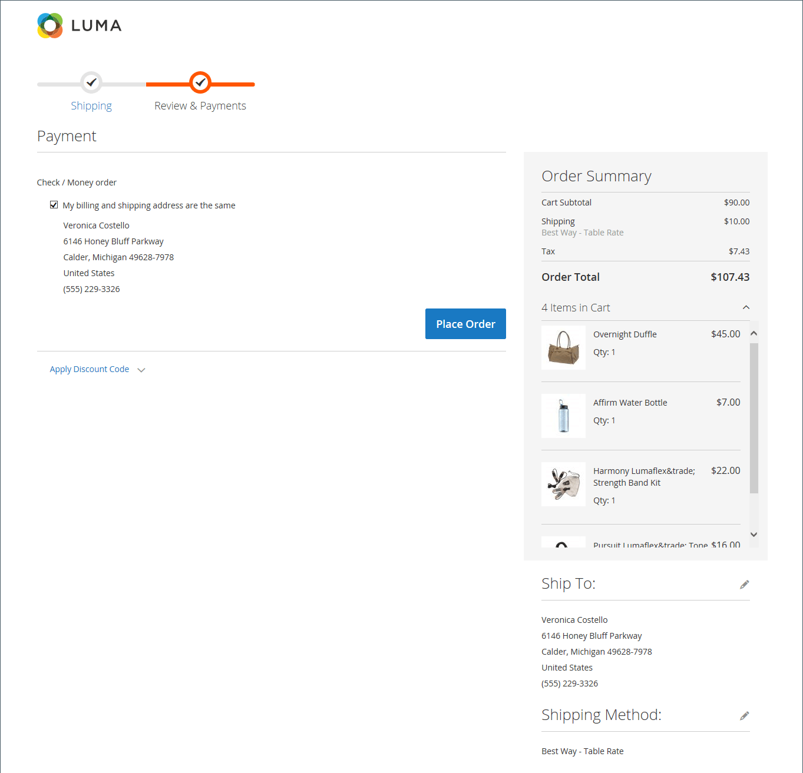
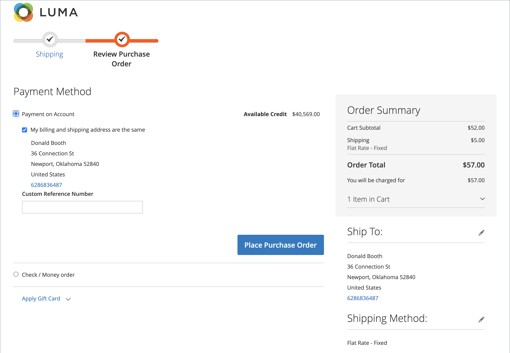
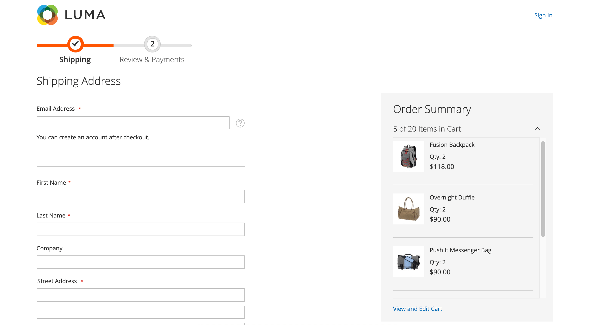
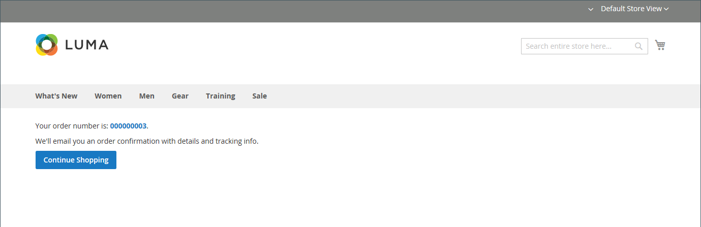

# Checkout

When the checkout process begins, the transaction shifts to a secure, encrypted channel. A padlock symbol appears in the address bar of the browser, and the URL changes from `http` to `https`.

## Process

The goal for the checkout process is to gather the information necessary to complete the transaction. The _Checkout_ page leads the customer through each step of the process. Customers who are logged into their accounts can complete checkout quickly, because much of the information is already in their accounts. Customers associated with a company account that uses purchase orders have a slightly different workflow.

### Shipping

The first step of the checkout process is for the customer to complete the shipping address information, and to choose the shipping method. If the customer has an account, the shipping address is entered automatically, but can be changed if needed.

 (Adobe Commerce only) The format of the street address for the recipient and sender is determined by the properties of the [customer address attribute](https://docs.magento.com/user-guide/stores/attributes-customer-address.html). The input validation setting determines the valid characters that can be used in a shipping address.

The progress bar at the top of the page follows each step of the checkout process, and the Order Summary shows that the information entered so far.

<!-- zoom -->

#### Ship to a different address

1. If there are additional entries in the address book, find the address where the order is to be shipped.

1. To select the address, click **Ship Here**.

#### Add an address

1. At the bottom of the _Shipping Address_ section, click **+ New Address**.

1. Complete the _Shipping Address_ form.

   By default, the customer's first and last name initially appear in the form.

   <!-- zoom -->

1. To save the new address in the address book, select the checkbox at the bottom of the form.

1. Click **Save Address**.

   The new address is now selected as the shipping address.

   <!-- zoom -->

#### Choose the shipping method

1. In the list of [shipping](delivery.md) methods, choose the option that you want to use.

   <!-- zoom -->

1. Click **Next** to continue.

### Review and Payments - Regular Order

During the second step of the checkout process, the customer chooses the [payment method](payments.md), and applies any coupons with promotional codes to the purchase. All information can be reviewed, and edited if needed. If enabled, the customer must agree to the terms and conditions of the sale before placing the order.

>[!NOTE]
>
>Although Commerce allows configuring multiple coupon codes, a customer may apply only one coupon code to the cart. (See the [Coupon Codes](../merchandising-promotions/price-rules-cart-coupon.md) for more information.)

<!-- zoom -->

### Review and Payments - Purchase Order

 (Available with B2B for Adobe Commerce only)

When a customer is associated with a company that has enabled purchase orders, all orders are processed as purchase orders.
Available payment methods are determined by the company account.

1. The customer selects a payment method.

   When using the **Payment on Account** method, the Custom Reference Number field can be used to reference an invoice number.

1. The customer clicks **Place Purchase Order**.

   The purchase order is placed.

If the company has set up [approval rules](../b2b/account-dashboard-approval-rules.md), the purchase order goes through the approval process. Otherwise, it is processed immediately.

<!-- zoom -->

### Number of items displayed in the order summary

Admin users can change the maximum number of items displayed in the order summary at checkout to streamline the display with fewer products. By default, this value is set to 10.

   <!-- zoom -->

1. On the _Admin_ sidebar, go to **Stores** > _Settings_ > **Configuration**.

1. In the left panel, expand **Sales** and choose **Checkout**.

1. Expand  the **Checkout Options** section.

1. For **Maximum Number of Items to Display in Order Summary**, enter the maximum number of items to be displayed.

1. Click **Save Config**.

   With this update, the order summary displayed during checkout is limited to the specified quantity of items.

### Order confirmation

The order confirmation appears after the order is placed. For registered customers, the page includes the order number with a link to the customer's account, and a link to generate a receipt. Registered customers are told to expect order confirmation and tracking information by email. Guests are encouraged to create an account to track the order. Registered customers can generate a receipt by clicking a link.

The order confirmation page is also called the _Success_ page, and is used by analytics programs to track conversions.

<!-- zoom -->

## Checkout options

The checkout options control various attributes for the checkout page, including the layout. There are options that you can configure to place constraints on checkout, including allowing guest checkout and enforcing a terms and conditions agreement. There are also options for controlling the display of information during the checkout process.

<!-- zoom -->

For a detailed description of each of these configuration settings, see [Checkout Options](https://docs.magento.com/user-guide/configuration/sales/checkout.html#checkout-options) in the _Configuration Reference Guide_.

### Change the checkout options

1. On the _Admin_ sidebar, go to **Stores** > _Settings_ > **Configuration**.
1. On the left panel, expand **Sales** and choose **Checkout**.
1. Set any of the following options that you require.
1. Click **Save Config**.

1. Expand  the **Checkout Options** section.

1. If the settings are for a specific store view, [choose the store view](https://docs.magento.com/user-guide/configuration/scope-change.html) where the configuration applies.

   When prompted, click **OK** to continue.

1. Set the checkout options.

1. Click **Save Config**.

### Available checkout options

|Field|[Scope](../getting-started/websites-stores-views.md#scope-settings)|Description|
|--- |--- |--- |
|Enable Onepage Checkout|Store View|Determines if [one-page checkout](checkout-one-page.md) is the default checkout format. Options: Yes / No|
|Allow Guest Checkout|Store View|Determines if guests can go through [checkout without registering](checkout-guest.md) for an account with your store. Options: Yes / No|
|Enable Terms and Conditions|Store View|Determines if customers are required to agree to the [Terms and Conditions](terms-and-conditions.md) of the sale before making a purchase. Options: Yes / No|
|Display Billing Address On|Store View|Determines the location of the Billing Address during checkout. Options: Payment Method / Payment Page|
|Maximum Number of Items to Display in Order Summary|Store View|Determines the maximum number of items that can  appear in the Order Summary during checkout. The default is 10.|
|Enable Address Search|Website| (Adobe Commerce only) Determines if customers can use [address search](checkout-address-search.md) functionality for Shipping, and the Review & Payments steps. When this is enabled, use the Number of Customer Addresses Limit to set the number of saved addresses required to activate this functionality during checkout. Options: Yes / No|
|Number of Customer Addresses Limit|Website| (Adobe Commerce only) When address search is **enabled**, determines the number of saved addresses required to activate this functionality during checkout. When the customer's number of saved addresses meets or exceeds this number, only the default address is rendered on the _Shipping_ and _Review & Payments_ steps. The customer can use a search function to change the selected address. The default is 10.|

{style="table-layout:auto"}
