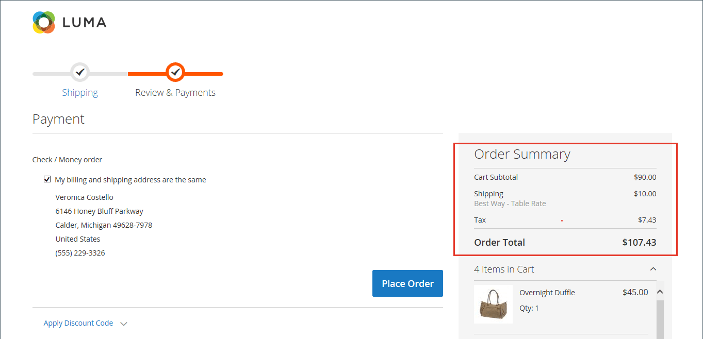

# Sort order for checkout totals

During order review, the total appears at the bottom of the order, with any adjustments for discounts, shipping charges, store credit, and tax. The order of each item determines the sequence of the calculations, and is set in the configuration by a number that is assigned to each item. For example, the Subtotal is the first item in the section, and is assigned a value of 10. The Grand Total appears last, and is assigned a value of 100. All other items in the totals section are assigned a value between those values.

<!-- zoom -->

**_To configure the checkout totals sort order:_**

1. On the _Admin_ sidebar, go to **[!UICONTROL Stores]** > _[!UICONTROL Settings]_ > **[!UICONTROL Configuration]**.

1. In left panel, expand the **[!UICONTROL Sales]** section and choose **[!UICONTROL Sales]** underneath.

1. Expand  the **[!UICONTROL Checkout Totals Sort Order]** section.

   <!-- zoom -->

   For a detailed description of each of these configuration settings, see [Checkout Totals Sort Order](../configuration-reference/sales/sales.md#checkout-totals-sort-order) in the _Configuration Reference Guide_.

1. If the setting is for a specific store view, [choose the store view](../configuration-reference/scope-change.md#set-the-scope) where the configuration applies.

   When prompted, click **[!UICONTROL OK]** to continue.

1. Change the number assigned to each item to determine its order in the _Totals_ section.

   The lower the value, the earlier its placement in the list. In the default configuration, the Subtotal (`10`) is the first and Grand total (`100`) is the last.

   If necessary, clear the **[!UICONTROL Use system value]** checkbox to complete these changes.

1. Click **[!UICONTROL Save Config]**.
