# Issue a credit memo

Before a credit memo can be printed, it must first be generated for an [invoiced order](invoices.md#create-an-invoice). You can issue both online and offline refunds (partial or full) from an open credit memo, depending on the payment method.

-  (Adobe Commerce only) Refunds can be applied to store credit.
-  (Available with B2B for Adobe Commerce) Refunds can be applied to company credit.
- Purchases made by credit card can be refunded either online or offline.
- Purchases made by check or money order must be refunded offline.

Any credit memo with an [open status](order-status.md) has an outstanding refund due.

With credit memos you can:

- Refund the full amount of an invoice.
- Refund a partial amount of an invoice.
- Refund multiple partial amounts of an invoice.
- Refund multiple invoices per order, not to exceed the total order amount.
- Refund a portion of the quantity for one line item, such as three of the five shirts in an order.

See [Create an invoice](invoices.md#create-an-invoice) for more information.

## Payment action setting

The refund workflow for orders paid by credit card is determined by the [Payment Action setting](https://docs.magento.com/user-guide/configuration/sales/payment-methods.html#payment-actions) in the configuration for each available payment method. Refunds cannot be issued until the transaction is settled.

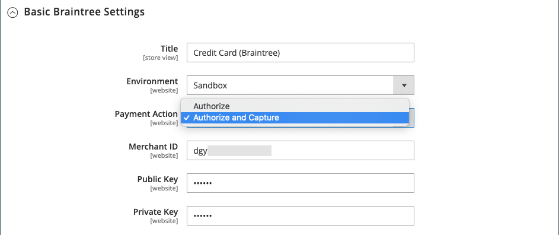<!-- zoom -->

- If the Payment Action for your configured payment method is set to `Authorize`, you must first generate the invoice from the Admin before a credit memo can be created.
- If Payment Action for your configured payment method is set to `Authorize and Capture`, the invoice has already been generated by the payment processor, but the funds aren't available until the transaction is settled. This brief waiting period is recommended by many payment processors as a security measure, and can usually be handled automatically. Transactions can also be settled manually from your merchant account with the payment processor.
-  (Adobe Commerce only) If you create a credit memo for an order that includes gift options, the refund for the gift wrapping and/or printed card appears in the Refund Totals section of the credit memo. To exclude these costs from the amount to be refunded, enter the amount as an Adjustment Fee. If multiple credit memos are issued for the same order, the refund for gift options appears in only the first credit memo.

## Create a credit memo

Determine the type of refund that you want to issue---for a [credit purchase](#issue-a-refund-for-a-credit-purchase) or for [check or money order](#issue-an-offline-refund-for-check-or-money-order)---and generate the credit memo and issue a refund.

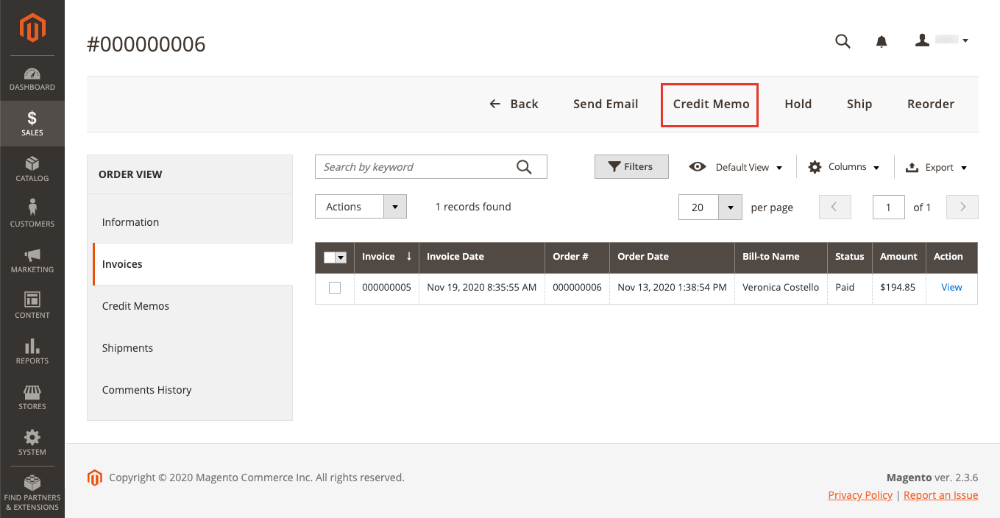<!-- zoom -->

### Issue a refund for a credit purchase

1. On the _Admin_ sidebar, go to **Sales** > **Orders**.

1. Find the order in the grid, and click **View**.

   <!-- zoom -->

1. If the Credit Memo button is visible in the button bar, do one of the following:

   - To issue an `offline` refund, go to step #6.
   - To issue an `online` refund, continue with step #4.

   See [Credit Memos](credit-memos.md) for more information about offline and online refunds.

1. Click **Invoices** in the left panel.

1. Find the invoice in the grid and click **View**.

   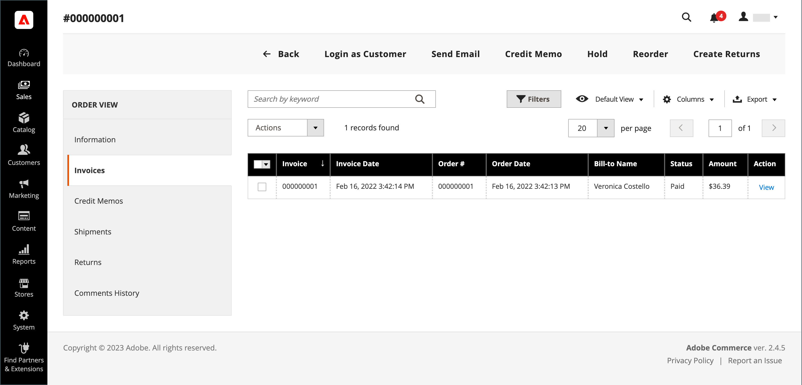<!-- zoom -->

1. Scroll down to the **Invoice Totals** section of the invoice, verify that the invoice is set to `Capture Online`, and click **Submit Invoice**.

   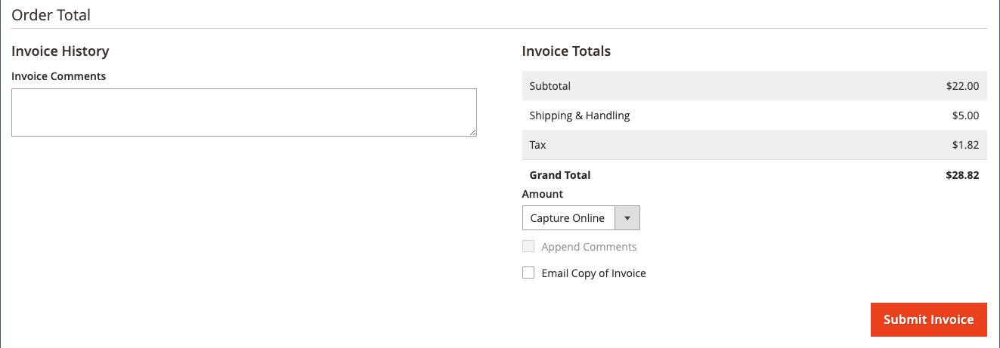<!-- zoom -->

   If that option isn't available, the invoice is already created. Proceed to the next step.

1. In the button bar at the top of the invoice, click **Credit Memo**.

1. Verify the information in the **Items to Refund** section and do the following, if applicable:

   - To return the product to inventory, select the **Return to Stock** checkbox.

      The product returns to stock automatically if _Product Stock Options_ is set to `Automatically Return Credit Memo Item to Stock`. With [Inventory Management enabled](../inventory-management/enable.md), the item returns to the source that sent the shipment.

   - Update the **Qty to Refund**, and click **Update Qty's**.

      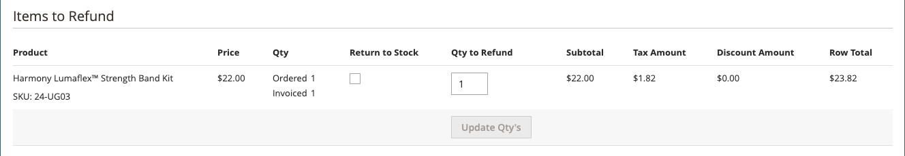<!-- zoom -->

1. Update the **Refunds Totals** section as follows:

   - For **Refund Shipping**, enter any amount that is to be refunded from the shipping fee.

      This field initially shows the total shipping amount from the order that is available for refund. It is equal to the full shipping amount from the order, less any shipping amount that has already been refunded. Like the quantity, the amount can be reduced, but not increased.

   - For **Adjustment Refund**, enter a value to be added to the total amount refunded as an extra refund that does not apply to any particular part of the order (shipping, items, or tax). It can also be used for partial refund with virtual money, such as a gift card, when an administrator wants to refund a non-virtual payment method first.

      The amount entered cannot raise the total refund higher than the paid amount.

   - For **Adjustment Fee**, enter a value to be subtracted from the total amount refunded.

      This amount is not subtracted from a specific section of the order such as shipping, items, or tax.

1. To add a comment, enter the text in the **Credit Memo Comments** box.

   - To send an email notification to the customer, select the **Email Copy of Credit Memo** checkbox.

1. Click **Update Totals**.

1. Do the following, as applicable:

   -  (Adobe Commerce only) To refund the amount to the customer's store credit, select the **Refund to Store Credit** checkbox.

   -  (Available with B2B for Adobe Commerce) To refund the amount to the customer's company credit, select the **Refund to Company Credit** checkbox.

   - To issue on offline refund, click **Refund Offline**.

   - To issue an online refund, click **Refund**.

   -  (Available with B2B for Adobe Commerce) If the purchase was paid with company credit, click **Refund to Company Credit**.

   See [Credit Memos](credit-memos.md) for more information about offline and online refunds.

   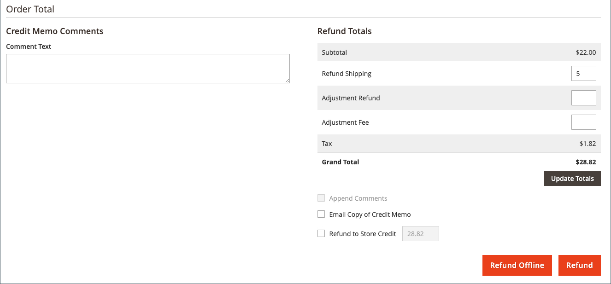<!-- zoom -->

### Issue an offline refund for check or money order

1. On the _Admin_ sidebar, go to **Sales** > **Orders**.

1. Find the completed order in the grid and click the **View** link to open it.

1. In the button bar at the top of the page, click **Invoice**.

1. Scroll down to the bottom of the page and click **Submit Invoice**.

1. In the button bar at the top of the invoice, click **Credit Memo**.

   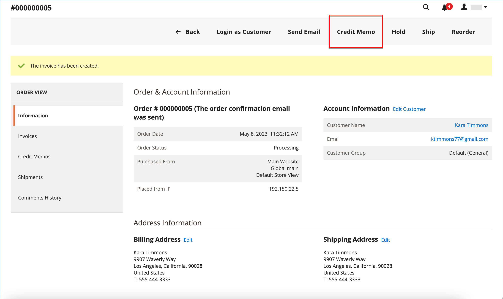<!-- zoom -->

1. Verify the information in the **Items to Refund** section and do the following, if applicable:

   - Select the **Return to Stock** checkbox if you want to return the returned product to inventory.

      With Inventory Management enabled, the inventory quantity returns to the source that sent the shipment. The product returns to stock automatically if [Product Stock Options](../inventory-management/enable.md) is set to `Automatically Return Credit Memo Item to Stock`.

   - Update the **Qty to Refund** and click **Update Qty's**.

      The amount to be credited cannot exceed the maximum amount that is available for refund.

   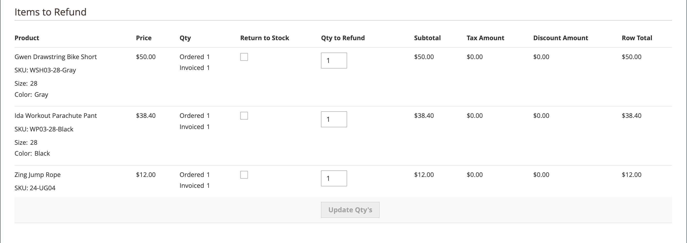<!-- zoom -->

1. Update the **Refunds Totals** section as applicable:

   - For **Refund Shipping**, enter any amount that is to be refunded from the shipping fee.

      This field initially displays the total shipping amount from the order that is available for refund. It is equal to the full shipping amount from the order, less any shipping amount that has already been refunded. Like the quantity, the amount can be reduced, but not increased.

   - For **Adjustment Refund**, enter a value to be added to the total amount refunded as an extra refund that does not apply to any particular part of the order (shipping, items, or tax). It can also be used for partial refund with virtual money, such as a gift card, when an administrator wants to refund a non-virtual payment method first.

      The amount entered cannot raise the total refund higher than the paid amount.

   - For **Adjustment Fee**, enter a value to be subtracted from the total amount refunded.

      This amount is not subtracted from a specific section of the order such as shipping, items, or tax.

   - If the purchase was paid with store credit, select the **Refund to Store Credit** checkbox to credit the amount to the customer account balance.

1. To add a comment, enter the text in the **Credit Memo Comments** box and do the following:

   - To send an email notification to the customer, select the **Email Copy of Credit Memo** checkbox.

   - To include the comments that you have entered in the email, select the **Append Comments** checkbox.

      The status of a credit memo notification appears in the completed credit memo next to the credit memo number.

      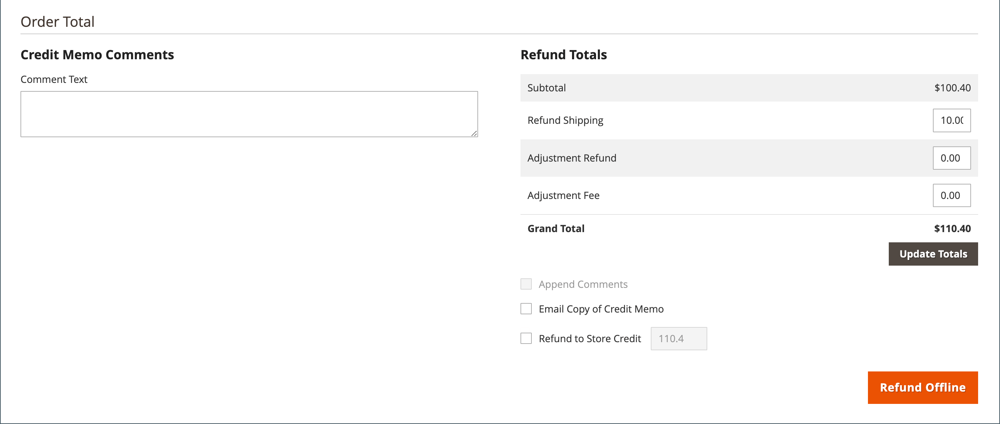<!-- zoom -->

1. To complete the process and issue the refund, click **Refund Offline**.

## Field descriptions

### Order & Account Information

|Field|Description|
|--- |--- |
|Order Number|The order number appears in the _Order & Account Information_, followed by a note that indicates if the confirmation email was sent.|
|Order Date|The date and time the order was placed.|
|Order Status|Indicates the order status as `Complete`.|
|Purchased From|Indicates the website, store, and store view where the order was placed.|
|Placed from IP|Indicates the IP address of the computer from which the order was placed.|

{style="table-layout:auto"}

### Account Information

|Field|Description|
|--- |--- |
|Customer Name|The name of the customer or buyer who placed the order. The customer name is linked to the customer profile.|
|Email|The email address of the customer or buyer. The email address is linked to open a new email message.|
|Customer Group|The name of the customer group or shared catalog to which the customer is assigned.|
|Company Name| (Available with B2B for Adobe Commerce) The name of the company associated with the buyer, and on whose behalf the order is placed. The company name is linked to the company profile.|

{style="table-layout:auto"}

### Address Information

|Field|Description|
|--- |--- |
|Billing Address|The name of the customer or buyer who placed the order, followed by the billing address, telephone number, and [VAT](vat.md), if applicable. The telephone number is linked to autodial on a mobile device.|
|Shipping Address|The name of the person to whose attention the order should be shipped, followed by the shipping address and telephone number. The telephone number is linked to autodial on a mobile device.|

{style="table-layout:auto"}

### Payment & Shipping Method

|Field|Description|
|--- |--- |
|Payment Information|The method of payment to be used for the order, and purchase order number, if applicable, followed by the currency that was used to place the order. If the order is charged to company credit using [Payment on Account](../b2b/enable-basic-features.md#configure-payment-on-account), the amount charged to the account is indicated.|
|Shipping & Handling Information|The shipping method to be used, and any handling fee that is applicable.|

{style="table-layout:auto"}

### Items to Refund

|Field|Description|
|--- |--- |
|Product|The product name, SKU, and options (if applicable).|
|Price|The purchase price of the item. For B2B for Adobe Commerce, this value reflects any discount applied to the item from the shared catalog, if applicable.|
|Qty|The quantity ordered.|
|Return to Stock|Checkbox that indicates if the returned item is to be returned to stock.|
|Qty to Refund|Indicates the number of units returned of the product.|
|Subtotal|The subtotal is the purchase price multiplied by the quantity of product units returned.|
|Tax Amount|The amount of tax that applies to the returned item as a decimal value.|
|Tax Percent|The percentage of tax applied to the returned item as a percentage.|
|Discount Amount|Any discount that applies to the returned item.|
|Row Total|The line item total, including applicable taxes that are due for the returned product level, less discounts.|
|order total||

{style="table-layout:auto"}

### Credit Memo Comments

|Field|Description|
|--- |--- |
|Comment Text|A text box that is used to enter a comment to the customer about the credit memo.|

{style="table-layout:auto"}

### Refund Totals

|Field|Description|
|--- |--- |
|Refund Shipping|The shipping amount to be refunded.|
|Adjustment Refund|An amount that is added to the total amount refunded as an extra refund that does not apply to any particular part of the order, such as shipping, items, or tax. The amount entered cannot raise the total refund higher than the amount paid.|
|Adjustment Fee|An amount that is subtracted from the total amount refunded, such as a restocking fee, or an amount that is related to gift wrapping or gift options.|
|Grand Total|The total amount to be refunded|
|Append Comments|Checkbox that determines if comments are included in the credit memo.|
|Email Copy of Credit Memo|Checkbox that determines if a copy of the credit memo is emailed.|
|Refund to Store Credit| (Adobe Commerce only) Checkbox that determines if the total is to be refunded to [store credit](https://docs.magento.com/user-guide/customers/store-credit-using.html).|
|Subtotal| (Available with B2B for Adobe Commerce) The total of all line items to be refunded.|

{style="table-layout:auto"}

### Refund buttons

The payment method used for the order determines the refund buttons that are available for a credit memo.

| Button | Description |
|--- |--- |
|**Refund**|If the original purchase was paid by credit card through a payment gateway, the refund amount is managed by the payment processor. To manage refunds, see the documentation provided by your payment provider.|
|**Refund Offline**|If the original purchase was paid by check or money order, the refund is paid directly to the customer, by issuing a check, gift card, or cash if you have a brick and mortar storefront. The credit memo serves as a record of the offline transaction.|
|**Refund to Company Credit**| (Available with B2B for Adobe Commerce) If the purchase was charged to company credit, the refund is returned to the [Company Account](../b2b/credit-company.md).|

{style="table-layout:auto"}

## Print a credit memo

To print or view the completed credit memo, you must have a PDF reader installed. You can download [Adobe Reader][1] at no charge.

1. On the _Admin_ sidebar, go to **Sales** > _Operations_ > **Credit Memos**.

1. Use one of the following methods to print the credit memo:

### Method 1: Print current credit memo

1. In the grid, open the credit memo.

1. Click **Print**.

   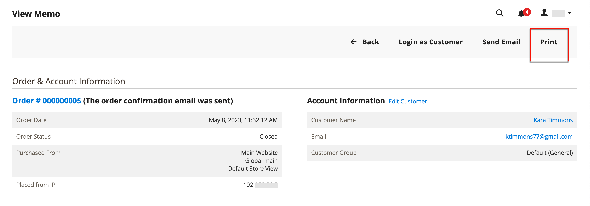<!-- zoom -->

### Method 2: Print multiple credit memos

1. In the list, select the checkbox of each credit memo that you want to print.

1. Set the **Actions** control to `PDF Credit Memos` and click **Submit**.

   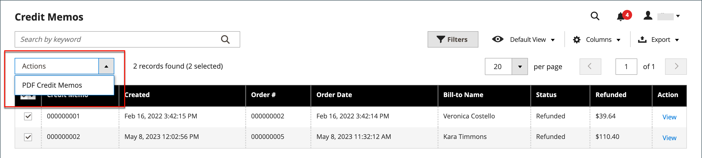<!-- zoom -->

1. When prompted, do one of the following:

   - To save the document, click **Save** and follow the prompts to save the file to your computer. When the download is complete, open the PDF in Adobe Reader and print the document.

   - To view the document, click **Open**. The printed-ready PDF credit memo opens in Adobe Reader. From here, you can either print the credit memo or save it to your computer.

[1]: https://www.adobe.com/acrobat/pdf-reader.html "Get Adobe Reader"
