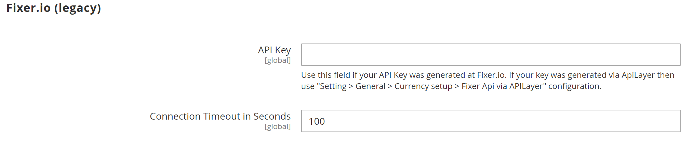

# Currency configuration

Before setting up individual currency rates, you must first set the scope of the [base currency](../configuration-reference/general/currency-setup.md). It is set to global by default, which applies the base currency setting to the entire [store hierarchy](../getting-started/websites-stores-views.md). If you have a multisite Adobe Commerce or Magento Open Source installation, you can manage multiple base currencies by setting the scope to the website level.

You also specify the currencies that you accept and which currency you want to use for the display of [prices](../catalog/catalog-price-scope.md) in your store. In the following diagram, the scope of the base currency is set at the website level, so each website can have a different base currency.

{width="600" zoomable="yes"}

## Step 1: Choose the accepted currencies

1. On the _Admin_ sidebar, go to **[!UICONTROL Stores]** > _[!UICONTROL Settings]_ > **[!UICONTROL Configuration]**.

1. In the upper-left corner, set **[!UICONTROL Scope]** to the store view where the configuration applies.

1. In the left panel under _General_, choose **[!UICONTROL Currency Setup]**.

1. Expand  the **[!UICONTROL Currency Options]** section and set the following options:

   - **[!UICONTROL Base Currency]** — Set to the primary currency that you use for online transactions.

   - **[!UICONTROL Default Display Currency]** — Set to the currency that you use to display pricing in the store view.

   - **[!UICONTROL Allowed Currencies]** — Select all currencies that you accept as payment in the store view. Make sure to also select your primary currency.

      For multiple currencies, hold down the Ctrl key (PC) or the Command key (Mac) and click each option.

   {width="600" zoomable="yes"}

   For a detailed description of each of these configuration settings, see [Currency Options](../configuration-reference/general/currency-setup.md) in the _Configuration Reference Guide_.

1. When prompted to refresh the cache, click _Close_ (  ) in the upper-right corner of the system message.

   You can [refresh the cache](../systems/cache-management.md) later.

1. Define the scope of the base currency:

   - In the left panel, expand **[!UICONTROL Catalog]** and choose **[!UICONTROL Catalog]** underneath.

   - Scroll down and expand  the **[!UICONTROL Price]** section. (This section only appears if the scope is set as **[!UICONTROL Store View:]** _Default config_.)

   - Set **[!UICONTROL Catalog Price Scope]** to either `Global` or `Website`.

   {width="600" zoomable="yes"}

## Step 2: Configure the import connection

1. Scroll to the top of the page.

1. In the left panel, expand **[!UICONTROL General]** and choose **[!UICONTROL Currency Setup]**.

1. Configure your currency service connection:

   There are three service options: _[!UICONTROL Fixer.io (legacy)]_, _[!UICONTROL Fixer Api (APILayer)]_, and _[!UICONTROL Currency Converter API]_

   >[!IMPORTANT]
   >
   >Starting with the 2.4.6 release, the [[!DNL Fixer.io]](https://fixer.io/) service is deprecated and replaced with the [[!DNL Fixer API] (APILayer)](https://apilayer.com/marketplace/fixer-api) service. It is highly recommended that you use an APILayer account instead of a deprecated [!DNL Fixer.io] account.

   - _To connect to the [fixer.io service](https://fixer.io/):_

      - Expand  the **[!UICONTROL Fixer.io]** section.

      - Enter your fixer.io **[!UICONTROL API key]**.

      - For **[!UICONTROL Connection Timeout in Seconds]**, enter the number of seconds of inactivity to allow before the connection times out.

      {width="600" zoomable="yes"}

   - _To connect to the [[!DNL Fixer Api (APILayer)] service](https://apilayer.com/):_

      - Expand  the **[!UICONTROL Fixer Api (APILayer)]** section.

      - Enter your [!DNL APILayer] **[!UICONTROL API key]**.

      - For **[!UICONTROL Connection Timeout in Seconds]**, enter the number of seconds of inactivity to allow before the connection times out.

     {width="600" zoomable="yes"}
   
   - _To connect to the [[!DNL Currency Convertor API] service](https://free.currencyconverterapi.com/):_

      - Expand  the **[!UICONTROL Currency Convertor API]** section.

      - Enter your Currency Convertor **[!UICONTROL API key]**.

      - For **[!UICONTROL Connection Timeout in Seconds]**, enter the number of seconds of inactivity to allow before the connection times out.

      {width="600" zoomable="yes"}

## Step 3: Configure the scheduled import settings

1. Continuing with Currency Setup, expand  the **[!UICONTROL Scheduled Import Settings]** section.

   {width="600" zoomable="yes"}

1. To automatically update currency rates, set **[!UICONTROL Enabled]** to `Yes`.

1. Set the update options:

   - **[!UICONTROL Service]** — Set to the rate provider. The default value is `Fixer.io (legacy)`.

   - **[!UICONTROL Start Time]** — Set to the hour, minute, and second that the rates are updated according to the schedule.

   - **[!UICONTROL Frequency]** — To determine how often the rates are updated, set to one of the following:

      - `Daily`
      - `Weekly`
      - `Monthly`

   - **[!UICONTROL Error Email Recipient]** — Enter the email address of the person who is to receive email notification if an error occurs during the import process.

      To enter multiple email addresses, separate each with a comma.

   - **[!UICONTROL Error Email Sender]** — Set to the [store contact](../getting-started/store-details.md#store-email-addresses) that appears as the sender of the error notification.

   - **[!UICONTROL Error Email Template]** — Set to the email template used for the error notification.

1. When complete, click **[!UICONTROL Save Config]**.

1. When prompted to update the cache, click the **[!UICONTROL Cache Management]** link and refresh the invalid cache.

   {width="600" zoomable="yes"}

## Step 4: Update the currency rates

The currency rates must be updated with the current values before they go into effect. [Update the rates](currency-update.md) manually or to import the rates automatically. 

## Step 5: Customize currency symbols (optional)

Managing Currency Symbols gives you the ability to customize the symbol associated with each currency that is accepted as payment in your store.

{width="600" zoomable="yes"}

1. On the _Admin_ sidebar, go to **[!UICONTROL Stores]** > _[!UICONTROL Currency]_ > **[!UICONTROL Currency Symbols]**.

   Each currency that is enabled for your store appears in the _[!UICONTROL Currency]_ list.

1. Change settings in the list as needed:

   - Enter a custom symbol for each currency that you want to use, or select the **[!UICONTROL Use Standard]** checkbox for each currency.

   - To override the default symbol, clear the _[!UICONTROL Use Standard]_ checkbox and enter the symbol that you want to use.

   >[!NOTE]
   >
   >It is not possible to change the alignment of the currency symbol from left to right.

1. When complete, click **[!UICONTROL Save Currency Symbols]**.

1. When prompted to update the cache, click the **[!UICONTROL Cache Management]** link and refresh any invalid cache.
