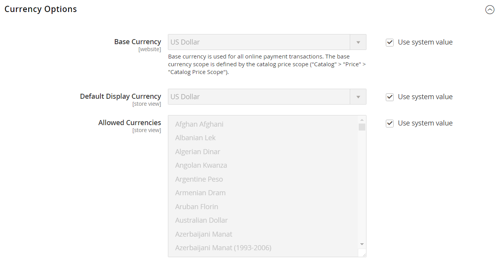
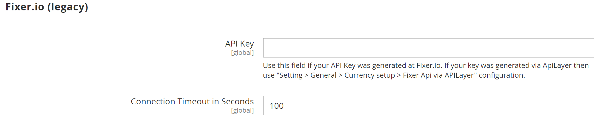
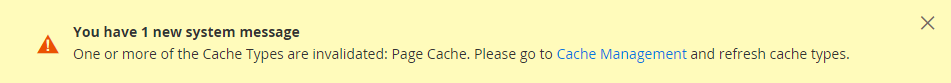
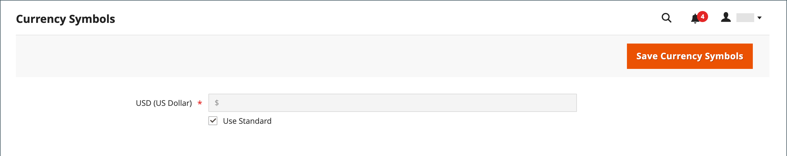

# Currency configuration

Before setting up individual currency rates, you must first set the scope of the [base currency](https://docs.magento.com/user-guide/configuration/general/currency-setup.html). It is set to global by default, which applies the base currency setting to the entire [store hierarchy](../getting-started/websites-stores-views.md). If you have a multisite Adobe Commerce or Magento Open Source installation, you can manage multiple base currencies by setting the scope to the website level.

You also specify the currencies that you accept and which currency you want to use for the display of [prices](../catalog/catalog-price-scope.md) in your store. In the following diagram, the scope of the base currency is set at the website level, so each website can have a different base currency.

<!-- {: "width=600px"} -->

## Step 1: Choose the accepted currencies

1. On the _Admin_ sidebar, go to **Stores** > _Settings_ > **Configuration**.

1. In the upper-left corner, set **Scope** to the store view where the configuration applies.

1. In the left panel under _General_, choose **Currency Setup**.

1. Expand  the **Currency Options** section and set the following options:

   - **Base Currency** — Set to the primary currency that you use for online transactions.

   - **Default Display Currency** — Set to the currency that you use to display pricing in the store view.

   - **Allowed Currencies** — Select all currencies that you accept as payment in the store view. Make sure to also select your primary currency.

      For multiple currencies, hold down the Ctrl key (PC) or the Command key (Mac) and click each option.

   <!-- zoom -->

   For a detailed description of each of these configuration settings, see [Currency Options](https://docs.magento.com/user-guide/configuration/general/currency-setup.html) in the _Configuration Reference Guide_.

1. When prompted to refresh the cache, click **Close** (  in the upper-right corner of the system message.

   You can [refresh the cache](https://docs.magento.com/user-guide/system/cache-management.html) later.

1. Define the scope of the base currency:

   - In the left panel, expand **Catalog** and choose **Catalog** underneath.

   - Scroll down and expand  the **Price** section. (This section only appears if the scope is set as **Store View:** _Default config_.)

   - Set **Catalog Price Scope** to either `Global` or `Website`.

   <!-- zoom -->

## Step 2: Configure the import connection

1. Scroll to the top of the page.

1. In the left panel, expand **General** and choose **Currency Setup**.

1. Configure your currency service connection:

   There are two service options: _fixer.io_ and _Currency Converter API_

   - To connect to the [fixer.io service](https://fixer.io/):

      - Expand  the **Fixer.io** section.

      - Enter your fixer.io **API key**.

      - For **Connection Timeout in Seconds**, enter the number of seconds of inactivity to allow before the connection times out.

      <!-- zoom -->

   - To connect to the [Currency Convertor API service](https://free.currencyconverterapi.com/):

      - Expand  the **Currency Convertor API** section.

      - Enter your Currency Convertor **API key**.

      - For **Connection Timeout in Seconds**, enter the number of seconds of inactivity to allow before the connection times out.

      <!-- zoom -->

## Step 3: Configure the scheduled import settings

1. Continuing with Currency Setup, expand  the **Scheduled Import Settings** section.

   <!-- zoom -->

1. To automatically update currency rates, set **Enabled** to `Yes`.

1. Set the update options:

   - **Service** — Set to the rate provider. The default value is `Fixer.io`.

   - **Start Time** — Set to the hour, minute, and second that the rates are updated according to the schedule.

   - **Frequency** — To determine how often the rates are updated, set to one of the following:

      - `Daily`
      - `Weekly`
      - `Monthly`

   - **Error Email Recipient** — Enter the email address of the person who is to receive email notification if an error occurs during the import process.

      To enter multiple email addresses, separate each with a comma.

   - **Error Email Sender** — Set to the [store contact](https://docs.magento.com/user-guide/stores/store-email-addresses.html) that appears as the sender of the error notification.

   - **Error Email Template** — Set to the email template used for the error notification.

1. When complete, click **Save Config**.

1. When prompted to update the cache, click the **Cache Management** link and refresh the invalid cache.

   <!-- zoom -->

## Step 4: Update the currency rates

The currency rates must be updated with the current values before they go into effect. Follow the instructions to [update the rates](currency-update.md) manually or to import the rates automatically. 

## Step 5: Customize currency symbols (optional)

Manage Currency Symbols gives you the ability to customize the symbol associated with each currency that is accepted as payment in your store.

<!-- zoom -->

1. On the _Admin_ sidebar, go to **Stores** > _Currency_ > **Currency Symbols**.

1. Each currency that is currently enabled for your store appears in the Currency list.

1. Enter a custom symbol for each currency that you want to use, or select the **Use Standard** checkbox for each currency.

1. To override the default symbol, clear the **Use Standard** checkbox and enter the symbol that you want to use.

   >[!NOTE]
   >
   >It is not possible to change the alignment of the currency symbol from left to right.

1. When complete, click **Save Currency Symbols**.

1. When prompted to update the cache, click the **Cache Management** link and refresh any invalid cache.

   <!-- zoom -->
