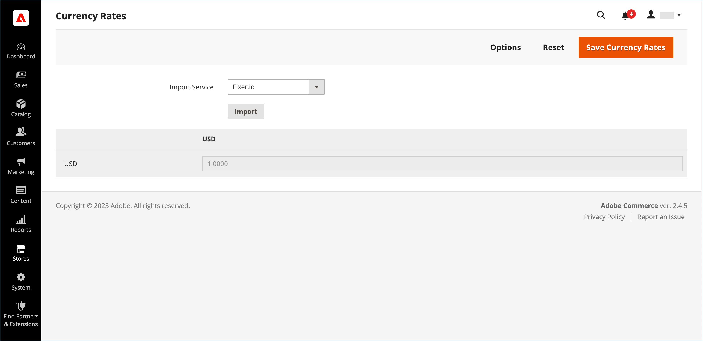
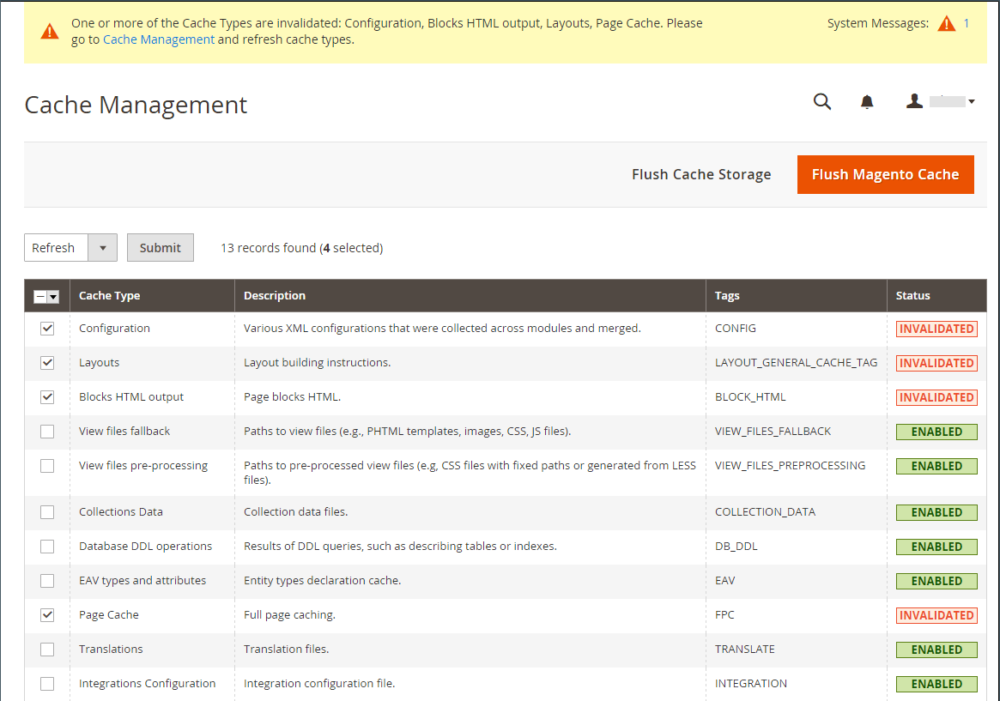

# Update currency rates

Currency rates can be set manually, or imported into the store. To ensure that your store has the most current rates, you can configure the currency rates to be updated automatically on schedule.

Before importing currency rates, complete the [currency rate setup](currency-configuration.md) to specify the currencies that you accept, and to establish the import connection and schedule.

<!-- zoom -->

## Update a currency rate manually

1. On the _Admin_ sidebar, go to **[!UICONTROL Stores]** > _[!UICONTROL Currency]_ > **[!UICONTROL Currency Rates]**.

1. Click the rate that you want to change and enter the new value for each currency supported.

1. When complete, click **[!UICONTROL Save Currency Rates]**.

## Import currency rates

1. On the _Admin_ sidebar, go to **[!UICONTROL Stores]** > _[!UICONTROL Currency]_ > **[!UICONTROL Currency Rates]**.

1. Set **[!UICONTROL Import Service]** to the currency rate provider.

   The default provider is fixer.io.

1. Click **[!UICONTROL Import]**.

   The updated rates appear in the _[!UICONTROL Currency Rates]_ list. If the rates have changed since the last update, the old rate appears below for reference.

1. When complete, click **[!UICONTROL Save Currency Rates]**.

1. When prompted to update the cache, click the **[!UICONTROL Cache Management]** link and refresh the invalid cache.

   <!-- zoom -->

## Import currency rates on schedule

1. Make sure that [Cron](https://docs.magento.com/user-guide/system/cron.html) is enabled for your store.

1. Complete the [Currency Rate Setup](currency-configuration.md) to specify the currencies that you accept, and to establish the import connection and schedule.

1. To verify that the rates are imported on schedule, check the _[!UICONTROL Currency Rates]_ list.

1. Wait for the time period of the frequency setting established for the schedule and check the rates again.
