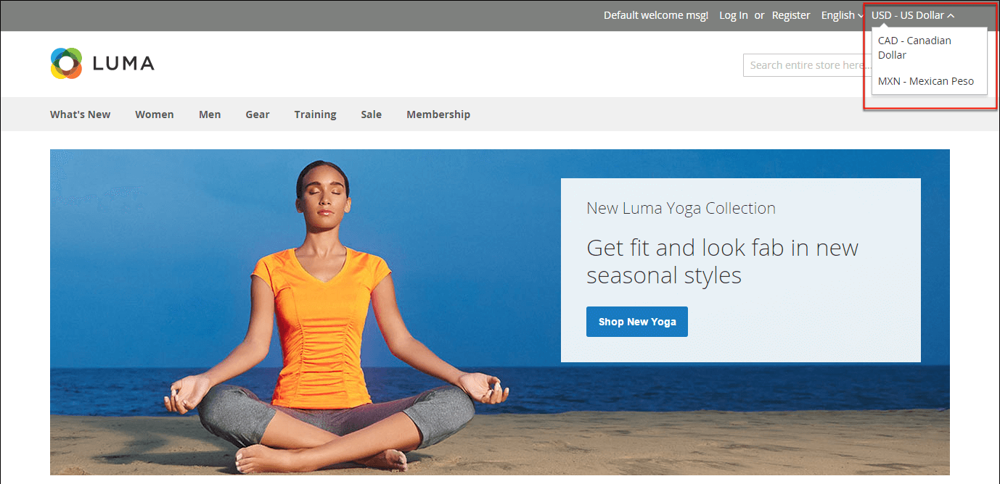

# Currency

Adobe Commerce gives you the ability to accept currencies from more than 200 countries around the world. If the store supports multiple currencies, a _currency chooser_ appears in the header after currency rates are [updated](currency-update.md).

>[!NOTE]
>
>If you accept payment in multiple currencies, make sure to monitor the currency rate settings, because any fluctuation can impact your profit margin.

Currency symbols appear in product prices and sales documents such as orders and invoices. You can customize the currency symbols as needed, and also set the display of the price separately for each store or view.

{width="700" zoomable="yes"}
