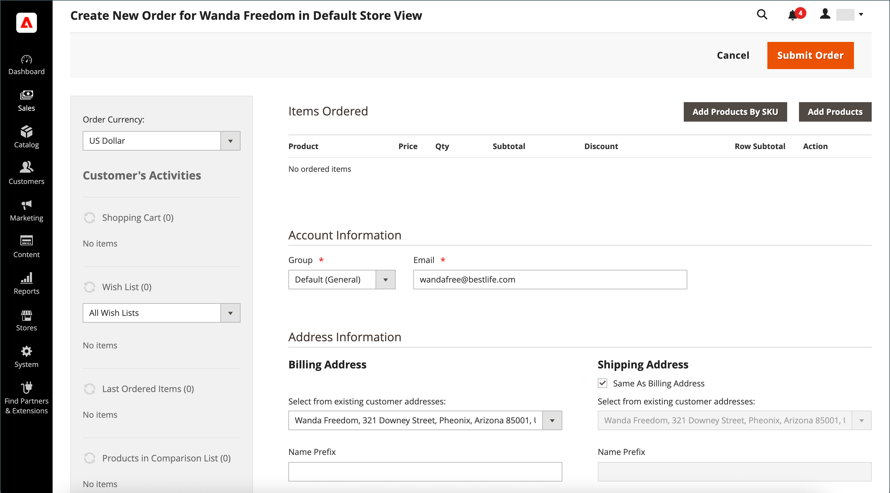
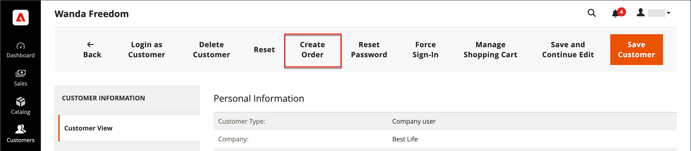
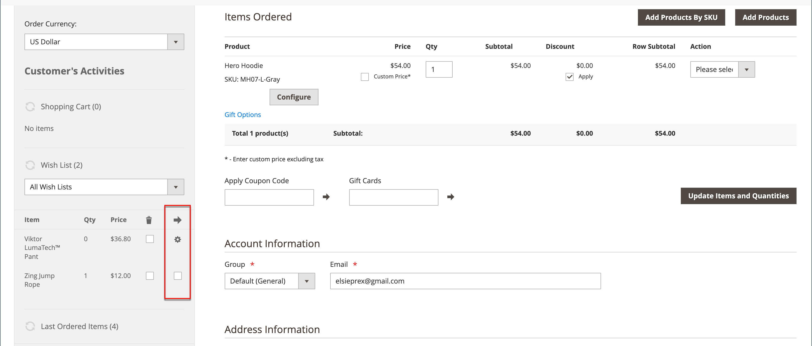
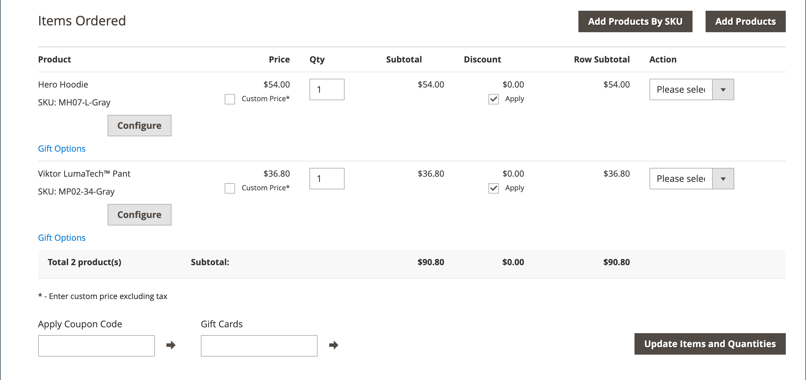
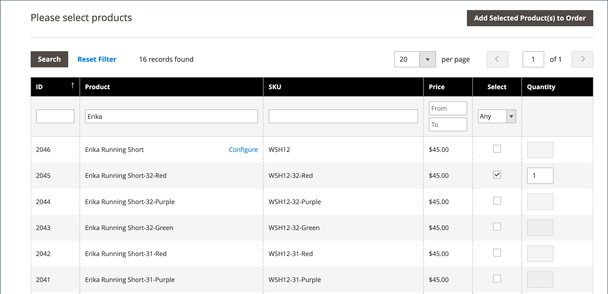
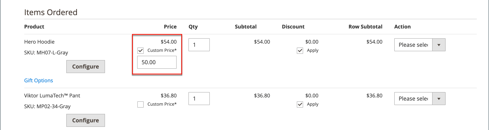
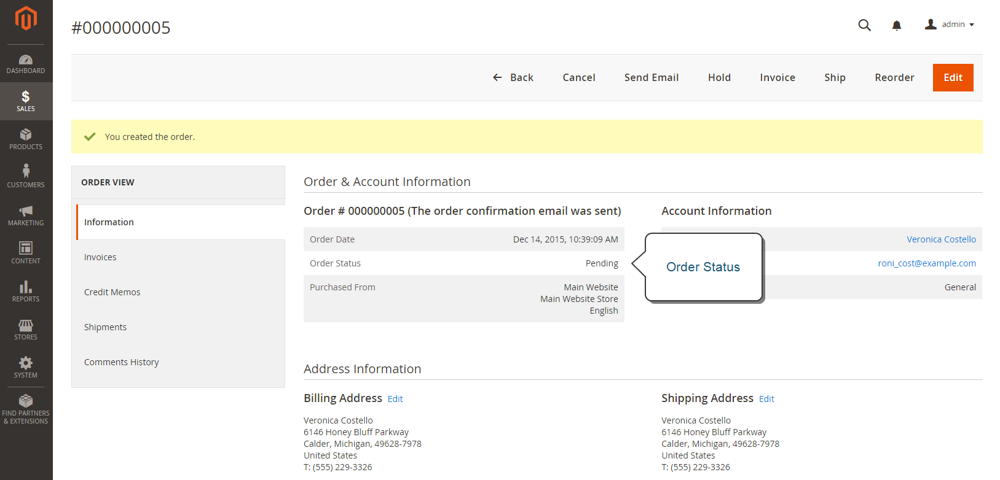

# Create an order

For registered customers who need assistance, you can create an entire order directly from the Admin. The Create New Order form includes all the information that is needed to complete the normal checkout process, with activity summaries from the customer's account dashboard.

<!-- zoom -->

## Step 1: Create a new order

1. On the _Admin_ sidebar, click **Customers**.

1. Find the customer in the grid.

1. In the _Action_ column, click **Edit**.

1. In the workspace header, click **Create Order**.

   <!-- zoom -->

   You can also create a new order in the [Order workspace](orders.md#orders-workspace) by clicking **Create New Order**.

## Step 2: Add products

If your store has multiple views, choose the store view where the order is to be placed.

### Add products from the Customer's Activities sidebar

You can transfer items to the cart from a customer's wish list, as well as recently viewed, compared, or ordered items.

1. Expand  one of the following sections:

   - **Wish List**
   - **Last Ordered Items**
   - **Products in Comparison List**
   - **Recently Compared Products**
   - **Recently Viewed Products**

1. Select the checkbox of each product in the left panel.

1. Scroll down and click **Update Changes**.

   The item appears in the order form.

   <!-- zoom -->

### Add products from the catalog

1. Click **Add Products**.

   <!-- zoom -->

1. In the grid, select the checkbox of each product to be added to the cart and enter the **Qty** to be purchased.

   <!-- zoom -->

1. Configure available product options:

   - Click **Configure**.

   - Complete the options as needed.

   - Click **OK**.

   - Click **Add Selected Product(s) to Order** to update the cart.

1. If a product is configured for [gift options](../catalog/product-gift-options.md), set the options as needed.

1. Override the price of an item if necessary:

   - Select the **Custom Price** checkbox and enter the new price in the box below.

   - To update the cart totals, click **Update Items and Quantities**.

   <!-- zoom -->

1. Complete the following sections as needed for the order:

   - Order Currency
   - Apply Coupon Codes / Gift Card Code
   - Payment Method
   - Shipping Method
   - Order Comments

>[!NOTE]
>
>See the [Payment Services Guide](https://experienceleague.corp.adobe.com/docs/commerce-merchant-services/payment-services/create-order.html) for more information about payment methods to support this functionality when the Payment Services extension is installed and configured.

## Step 3: Submit the order

Click **Submit Order**.

A confirmation is sent to the customer and the customer can view the order details from their account.

<!-- zoom -->
