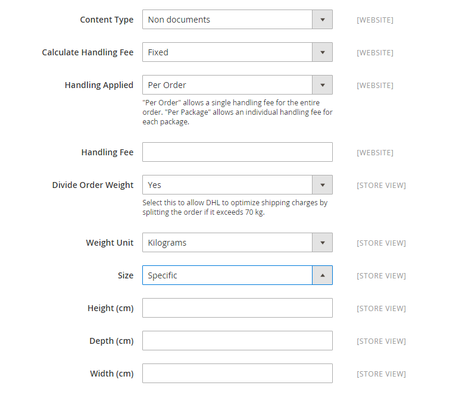

# DHL

DHL offers integrated international services and tailored, customer-focused solutions for managing and transporting letters, goods, and information.

## Step 1: Enable DHL

1. On the _Admin_ sidebar, go to **[!UICONTROL Stores]** > _[!UICONTROL Settings]_ > **[!UICONTROL Configuration]**.

1. In the left panel, expand **[!UICONTROL Sales]** and choose **[!UICONTROL Delivery Methods]**.

1. Expand  the **[!UICONTROL DHL]** section.

   >[!NOTE]
   >
   >If necessary, first clear the **[!UICONTROL Use system value]** checkbox to change the following settings as described.

1. Set **[!UICONTROL Enabled for Checkout]** to `Yes`.

1. Usually, you can accept the default **[!UICONTROL Gateway URL]**.

   If DHL has given you an alternate URL, enter that value in this field.

1. Use the credentials provided by DHL to complete the following fields:

   - **[!UICONTROL Access ID]**
   - **[!UICONTROL Password]**
   - **[!UICONTROL Account Number]**

{width="600" zoomable="yes"}

## Step 2; Enter package description and handling fee

1. In the **[!UICONTROL Content Type]** list, select the option that best describes the type of package you ship:

   - `Documents`
   - `Non documents`

1. Configure the handling fee options according to your requirements.

   The handling fee is optional, and appears as an extra charge that is added to the DHL shipping cost. If you want to include a handling fee, do the following:

   - For **[!UICONTROL Calculate Handling Fee]**, select the method you want to use to calculate handling fees:

      - `Fixed`
      - `Percentage`

   - For **[!UICONTROL Handling Applied]**, select how you want the handling fees applied:

      - `Per Order`
      - `Per Package`

   - For **[!UICONTROL Handling Fee]**, enter the amount to be charged, based on the method you have chosen to calculate the amount.

      For example, if the charge is based on a fixed fee, enter the amount as a decimal, such as `4.90`. However, if the handling fee is based on a percentage of the order, enter the amount as a percentage. For example, if you are charging six percent of the order, enter the value as `.06`.

   - To allow the total order weight to be broken up to ensure an accurate calculation of shipping charges, set **[!UICONTROL Divide Order Weight]** to `Yes`.

   - Set the **[!UICONTROL Weight Unit]** of the package to one of the following:

      - `Pounds`
      - `Kilograms`

   - Set the **[!UICONTROL Size]** of a typical package to one of the following:

      - `Regular`
      - `Specific`

      If you choose `Specific`, enter the **[!UICONTROL Height]**, **[!UICONTROL Depth]**, and **[!UICONTROL Width]** of the package in centimeters.

   {width="600" zoomable="yes"}

## Step 3: Specify allowed delivery methods

1. For **[!UICONTROL Allowed Methods]**, choose each method that you want to be available to customers.

   To select multiple methods, hold down the Ctrl key (PC) or the Command key (Mac) and click each option.

   To display the correct list of delivery methods, you must first specify the [Country of Origin](../configuration-reference/sales/shipping-settings.md).

1. For **[!UICONTROL Ready Time]**, enter the number of hours after an order is submitted that a package is ready to ship.

1. Edit the **[!UICONTROL Displayed Error Message]** as needed.

   This message appears when a selected method is unavailable.

1. If you want to provide a [Free Shipping](shipping-free.md) option through DHL, set the free shipping options.

   - For **[!UICONTROL Free Method]**, choose the method you prefer to use for free shipping.

   - Set **[!UICONTROL Free Shipping Amount Threshold]**:

      `Enable` - If offering Free Shipping with Minimum Order, enter the **[!UICONTROL Minimum Order Amount for Free Shipping]**.

      `Disable` - Does not apply free DHL shipping to any orders.

      This setting is similar to the one for the standard _Free Shipping_ method, but appears in the DHL section so customers know which method is used for their order.

   - For **[!UICONTROL Free Shipping Amount Threshold]**, enter the minimum amount for an order to qualify for free shipping.

      {width="600" zoomable="yes"}

## Step 4: Specify the applicable countries

1. Set **[!UICONTROL Ship to Applicable Countries]** to one of the following:

   - `All Allowed Countries`
   - `Specific Countries`

   If shipping to specific countries, select each country from the **[!UICONTROL Ship to Specific Countries]** list.

1. Set **[!UICONTROL Show Method if Not Applicable]**:

   `Yes` - Shows DHL as a shipping method during checkout, even if not applicable to the order.

   `No` - Shows DHL as a shipping method during checkout only if applicable.

1. To create a log file with the details of DHL shipments made from your store, set **[!UICONTROL Debug]** to `Yes`.

1. For **[!UICONTROL Sort Order]**, enter a number to determine the sequence in which DHL appears when listed with other delivery methods during checkout.

   `0` = first, `1` = second, `2` = third, and so on.

1. Click **[!UICONTROL Save Config]**.

   {width="600" zoomable="yes"}
