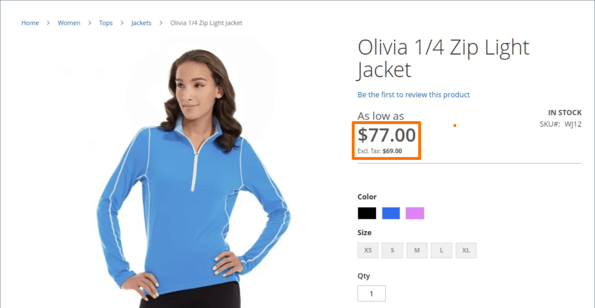

# Price display settings

The price display settings determine if product and shipping prices include or exclude tax, or show two versions of the price; one with, and the other without tax.

If the product price includes tax, the tax appears only if there is a tax rule that matches the tax origin or if a customer address matches the tax rule. Events that can trigger a match include when a customer creates an account, logs in, or generates a tax and shipping estimate from the shopping cart.

>[!IMPORTANT]
>
>Showing prices that include and exclude tax can be confusing to the customer. To avoid triggering a warning message, see the [guidelines](international-tax-guidelines.md) for your country and [recommended settings](taxes.md#warning-messages) to avoid warning messages.

<!-- zoom -->

For a detailed description of each of these configuration settings, see [Price Display Settings](https://docs.magento.com/user-guide/configuration/sales/tax.html#price-display-settings) in the _Configuration Reference Guide_.

## Configure price display settings

When configuration of calculation for taxes, rates, and classes is finished, taxes are calculated according to those settings. However, the display of taxes in the catalog, shopping cart, orders, invoices, and credit memos should also be configured to support the customer experience on the storefront.

It is a best practice to display prices with the associated taxes (either including taxes, or both the including taxes and excluding taxes) so that customers know how these calculations are applied before placing an order.

### Step 1: Configure catalog prices display settings

1. On the _Admin_ sidebar, go to **[!UICONTROL Stores]** > _[!UICONTROL Settings]_ > **[!UICONTROL Configuration]**.

1. In the left panel, expand **[!UICONTROL Sales]** and choose **[!UICONTROL Tax]**.

1. Expand  the **[!UICONTROL Price Display Settings]** section.

1. For **[!UICONTROL Display Product Prices in Catalog]**, choose one of the following:

   - `Excluding Tax`
   - `Including Tax`
   - `Including and Excluding Tax`

   >[!NOTE]
   >
   >If you set this option to `Including Tax`, the tax appears only if there is a tax rule that matches the tax origin or if there is a customer address that matches the tax rule. Events that can trigger a match include customer account creation, login, or the use of the Tax and Shipping estimation tool in the shopping cart.

1. For **[!UICONTROL Display Shipping Prices]**, choose one of the following:

   - `Excluding Tax`
   - `Including Tax`
   - `Including and Excluding Tax`

If you choose to display both prices (with and without tax), the storefront looks similar to the following:

   <!-- zoom -->

### Step 2: Configure shopping cart display settings

1. Expand  the **[!UICONTROL Shopping Cart Display Settings]** section.

   <!-- zoom -->

1. For **[!UICONTROL Display Prices]**, choose one of the following:

   - `Excluding Tax`
   - `Including Tax`
   - `Including and Excluding Tax`

1. For **[!UICONTROL Display Subtotal]**, choose one of the following:

   - `Excluding Tax`
   - `Including Tax`
   - `Including and Excluding Tax`

1. For **[!UICONTROL Display Shipping Amount]**, choose one of the following:

   - `Excluding Tax`
   - `Including Tax`
   - `Including and Excluding Tax`

1.  (Adobe Commerce only) For **[!UICONTROL Display Gift Wrapping Prices]**, choose one of the following:

   - `Excluding Tax`
   - `Including Tax`
   - `Including and Excluding Tax`

1.  (Adobe Commerce only) For **[!UICONTROL Display Printed Card Prices]**, choose one of the following:

   - `Excluding Tax`
   - `Including Tax`
   - `Including and Excluding Tax`

1. For each of these remaining options, toggle to `Yes` or `No` according to your preference:

   - **[!UICONTROL Include Tax in Order Total]**
   - **[!UICONTROL Display Full Tax Summary]**
   - **[!UICONTROL Display Zero Tax Subtotal]**

### Step 3: Configure order, invoice, and credit memo display settings

1. Expand  the **[!UICONTROL Orders, Invoices, Credit Memos Display Settings]** section.

   <!-- zoom -->

1. For **[!UICONTROL Display Prices]**, choose one of the following:

   - `Excluding Tax`
   - `Including Tax`
   - `Including and Excluding Tax`

1. For **[!UICONTROL Display Subtotal]**, choose one of the following:

   - `Excluding Tax`
   - `Including Tax`
   - `Including and Excluding Tax`

1. For **[!UICONTROL Display Shipping Amount]**, choose one of the following:

   - `Excluding Tax`
   - `Including Tax`
   - `Including and Excluding Tax`

1.  (Adobe Commerce only) For **[!UICONTROL Display Gift Wrapping Prices]**, choose one of the following:

   - `Excluding Tax`
   - `Including Tax`
   - `Including and Excluding Tax`

1.  (Adobe Commerce only) For **[!UICONTROL Display Printed Card Prices]**, choose one of the following:

   - `Excluding Tax`
   - `Including Tax`
   - `Including and Excluding Tax`

1. For each of these remaining options, toggle to `Yes` or `No` according to your preference:

   - **[!UICONTROL Include Tax in Order Total]**
   - **[!UICONTROL Display Full Tax Summary]**
   - **[!UICONTROL Display Zero Tax Subtotal]**

1. When complete, click **[!UICONTROL Save Config]**.
