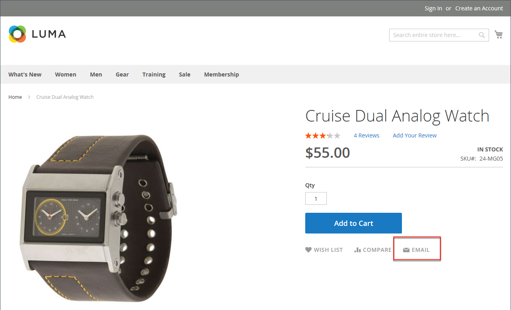
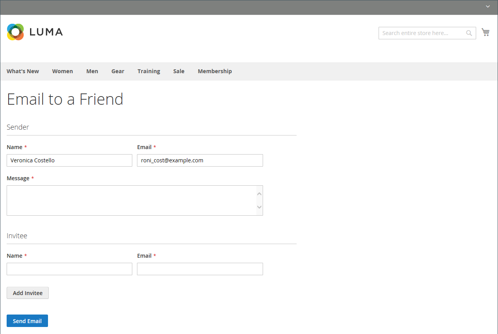

# Email a friend

The Email link makes it easy for your customers to share links to products with their friends. In the demo Luma store, the Email link appears as an envelope icon. The message template can be customized for your voice and brand. To prevent spamming, you can limit the number of recipients for each email, and the number of products that can be shared over a one-hour period.

<!-- zoom -->

## Configure email-a-friend

1. On the _Admin_ sidebar, go to **Stores** > _Settings_ > **Configuration**.

1. In the left panel, expand **Catalog** and choose **Email to a Friend**.

1. Expand  the **Email Templates** section and set the options:

    <!-- zoom -->

    For a detailed description of each of these configuration settings, see [Email Templates](https://docs.magento.com/user-guide/configuration/catalog/email-to-a-friend.html) in the _Configuration Reference Guide_.

    To change the default setting of any field, clear the **Use system value** checkbox to make the field editable.

    - Set **Enabled** to `Yes`.

    - Set **Select Email Template** to the template you want to use as the basis of the messages.

    - If you want to require that only registered customers can send email to friends, set **Allow for Guests** to `No`.

    - In the **Max Recipients** field, enter the maximum number of friends who can be on the distribution list for a single message.

    - In the **Max Products Sent in 1 Hour** field, enter the maximum number of products that can be shared by a single user with friends over a one-hour time period.

    - Set **Limit Sending By** to one of the following methods to identify the sender of emails:

      `IP Address`  - (Recommended) Identifies the sender by the IP address of the computer that is used to send the emails.

      `Cookie (unsafe)` - Identifies the sender by browser cookie. This method is less effective because the sender can delete the cookie to bypass the limit.

1. When complete, click ** Save Config**.

## Send email to a friend on the storefront

When this feature is configured, store customers follow these steps to share product information with friends.

1. On a catalog page, the customer clicks the **Email** link.

1. If the feature is configured only for registered users, does one of the following:

   - Logs in to your customer account.
   - Signs up for a new account.

1. Completes the **Message** and enters the recipient **Name** and **Email Address**.
   
   If needed, the customer can add more recipients:

    - Clicks **Add Invitee**.

    - Enters the **Name** and **Email Address** of the additional person.

      They can send the message to as many additional people as the configuration allows. They can remove the added invitee by clicking the **Remove** link.

1. When ready to send the message, clicks **Send Email**.

    <!-- zoom -->
