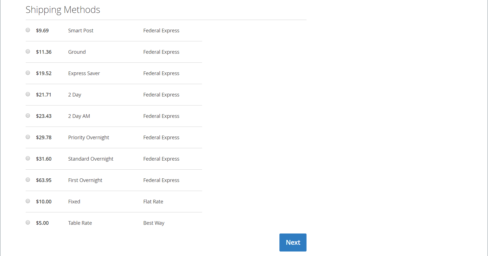
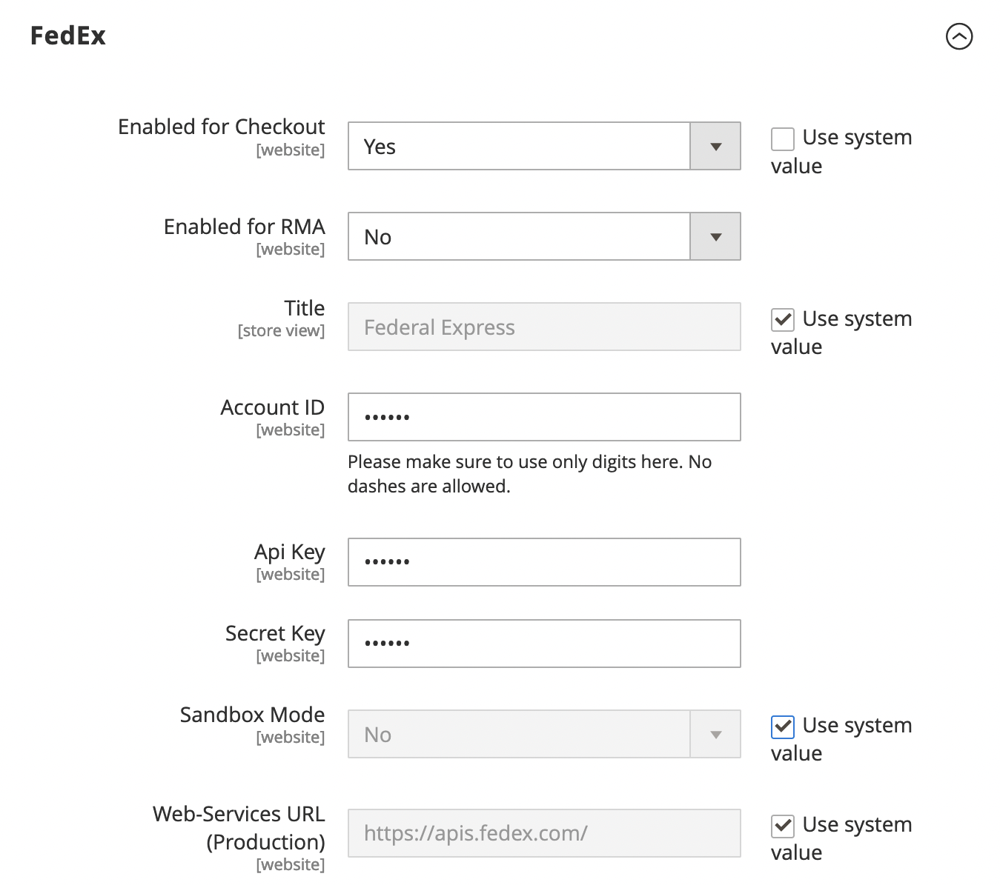
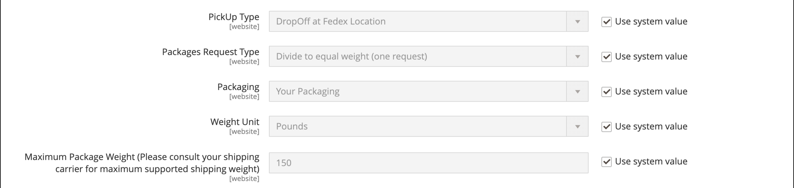
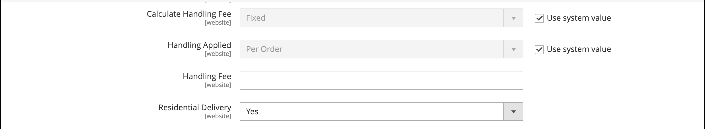
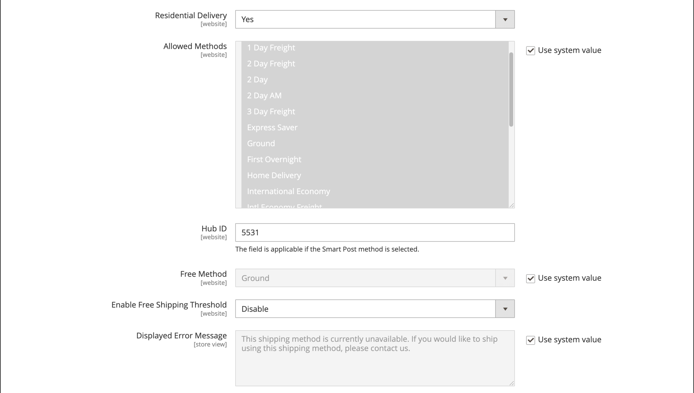
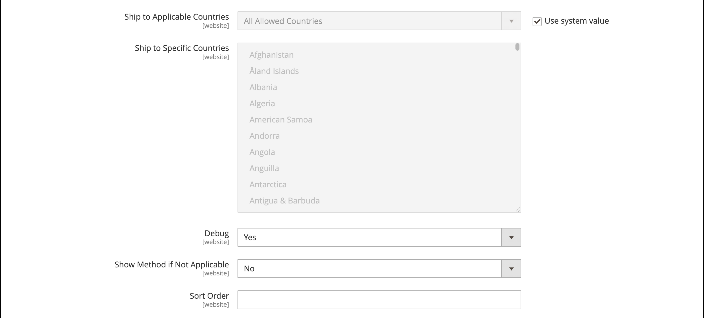

# FedEx

FedEx is one of the world's largest shipping service companies, providing air, freight, and ground shipping services with several levels of priorities.

<!-- zoom -->

>[!NOTE]
>
>FedEx can use [dimensional weight](carriers.md#dimensional-weight) to determine some shipping rates. However, Adobe Commerce and Magento Open Source support only weight-based shipping cost calculation.

## Step 1: Register for FedEx Web Services Production

You must create a [FedEx merchant account][1] and register for FedEx Web Services Production Access. After creating a FedEx account, read through the production account information page, then click the Obtain Production Key link at the bottom of the page to register and obtain a key.

>[!NOTE]
>
>Make sure to copy or write down the authentication key. You need it to set up FedEx in your Commerce shipping settings.

## Step 2: Enable FedEx for Your Store

1. On the _Admin_ sidebar, go to **[!UICONTROL Stores]** > _[!UICONTROL Settings]_ > **[!UICONTROL Configuration]**.

1. In the left panel, expand **[!UICONTROL Sales]** and choose **[!UICONTROL Delivery Methods]**.

1. Expand  the **[!UICONTROL FedEx]** section.

1. Set **[!UICONTROL Enabled for Checkout]** to `Yes`.

1. Enter an appropriate **[!UICONTROL Title]** to identify the FedEx shipping method during checkout.

1. Enter the following information from your FedEx account:

   - **[!UICONTROL Account ID]**
   - **[!UICONTROL Meter Number]**
   - **[!UICONTROL Key]**
   - **[!UICONTROL Password]**

1. If you have set up a FedEx sandbox and want to work in the testing environment, set **[!UICONTROL Sandbox Mode]** to `Yes`.

   >[!NOTE]
   >
   >Remember to set Sandbox Mode to `No` when you are ready to offer FedEx as a shipping method to your customers.

   <!-- zoom -->

## Step 3: Package description and handling fee

1. Select the **[!UICONTROL Packages Request Type]** to the option that best describes your preference when splitting an order into multiple shipments:

   - `Divide to equal weight (one request)`
   - `Use origin weight (few requests)`

1. Select the type of **[!UICONTROL Packaging]** typically used to ship products from your store.

1. Set **[!UICONTROL Dropoff]** to the pick-up method used for delivery.

   - `Regular Pickup` - If you have a high volume of shipments, it can be cost effective to make arrangements with FedEx for regular pickups.

   - `Request Courier` - You must call and request a FedEx courier to pick up shipments.

   - `Drop Box` - You must drop off shipments at your nearby FedEx drop off box.

   - `Business Service Center` - You must drop off shipments at your local FedEx business service center.

   - `Station` - You must drop off shipments at your local FedEx station.

1. Set **[!UICONTROL Weight Unit]** to the unit of measurement that is used in your locale.

   - `Pounds`
   - `Kilograms`

1. Enter the **[!UICONTROL Maximum Package Weight]** allowed for FedEx shipments.

   The default FedEx maximum weight is 150 lbs. Consult your shipping carrier for more information. We recommend using the default value, unless you have made special arrangements with FedEx. See also: [Dimensional Weight](carriers.md#dimensional-weight).

   <!-- zoom -->

1. Configure the handling fee options according to your requirements.

   The handling fee is optional and is not visible during checkout. If you want to include a handling fee, do the following:

   - Set **[!UICONTROL Calculate Handling Fee]**:

      - `Fixed Fee`
      - `Percentage`

   - For **[!UICONTROL Handling Applied]**, choose one of the following methods for managing handling fees:

      - `Per Order`
      - `Per Package`

   - Enter the **[!UICONTROL Handling Fee]** as either a `fixed` amount or `percentage`, depending on the method of calculation.

1. Set **[!UICONTROL Residential Delivery]** to one of the following, depending on whether you sell Business-to-Consumer (B2C) or Business-to-Business (B2B).

   - `Yes` - For B2C residential deliveries.
   - `No` - For B2B residential deliveries.

   <!-- zoom -->

## Step 4: Allowed methods and applicable countries

1. Set **[!UICONTROL Allowed Methods]** to each method of shipment that you want to offer.

   When choosing methods, consider your FedEx account, the frequency and size of your shipments, and if you allow international shipments. You can offer as many or as few methods as you want, such as:

   - Europe First Priority
   - Delivery day options: 1 Day Freight, 2 Day Freight, 2-Day, 2-Day AM, 3 Day Freight
   - Domestic options–Express Saver, Ground, First, Overnight, Home Delivery, Standard Overnight
   - International options–International Economy, Intl Economy Freight, International First, International Ground, International, Priority Intl
   - Priority options–Freight, Priority Overnight
   - Smart Post–If offering the Smart Post method (enter the **Hub ID**)
   - Freight options–Freight, National Freight

1. If you want to provide a [Free Shipping](shipping-free.md) option through FedEx, set the free shipping options.

   - Set **[!UICONTROL Free Method]** to the method you want to use for free shipping. If you do not want to offer free shipping through FedEx, choose `None`.

   - To require a minimum order amount that qualifies an order for free shipping with FedEx, set **[!UICONTROL Enable Free Shipping Threshold]** to `Enable`. Then, enter the minimum value in **[!UICONTROL Free Shipping Amount Threshold]**.

   This is similar to the standard Free Shipping method, but appears in the FedEx section during checkout, so customers know which method is used for their order.

1. If needed, change the **[!UICONTROL Displayed Error Message]**.

   This text box is preset with a default message, but you can enter a different message that you want to appear if FedEx becomes unavailable.

   <!-- zoom -->

1. Set **[!UICONTROL Ship to Applicable Countries]**:

   - `All Allowed Countries` - Customers from all [countries](../getting-started/store-details.md#country-options) specified in your store configuration can use this delivery method.

   - `Specific Countries` - When you choose this option, the _Ship to Specific Countries_ list appears. Select each country in the list where this delivery method can be used.

1. If you want to keep a log of all communication between your store and the FedEx system, set **[!UICONTROL Debug]** to `Yes`.

1. Set **[!UICONTROL Show Method if Not Applicable]**:

    - `Yes` - Shows all FedEx shipping methods to customers, regardless of their availability.
    - `No` - Shows only the FedEx shipping methods that apply to the order.

1. For **[!UICONTROL Sort Order]**, enter a number to determine the sequence in which FedEx appears when listed with other delivery methods during checkout.

   `0` = first, `1` = second, `2` = third, and so on.

1. Click **[!UICONTROL Save Config]**.

   <!-- zoom -->

>[!NOTE]
>
>Commerce always declares the full order price to FedEx when calculating shipping charges. This behavior cannot be changed.

[1]: https://www.fedex.com/login/web/jsp/contactInfo1.jsp
