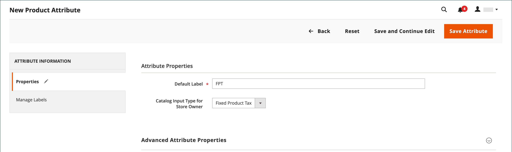
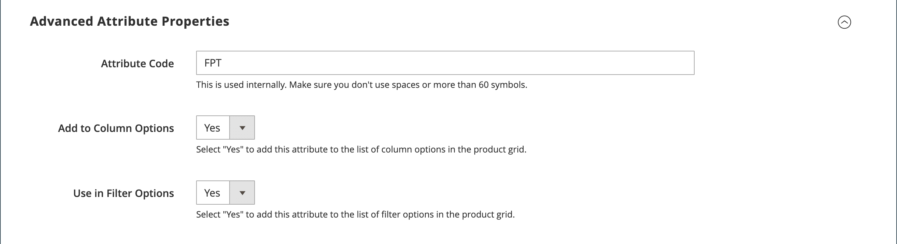
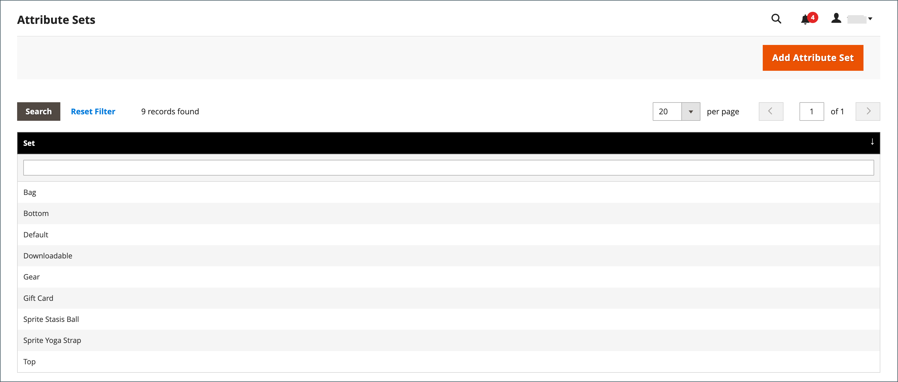
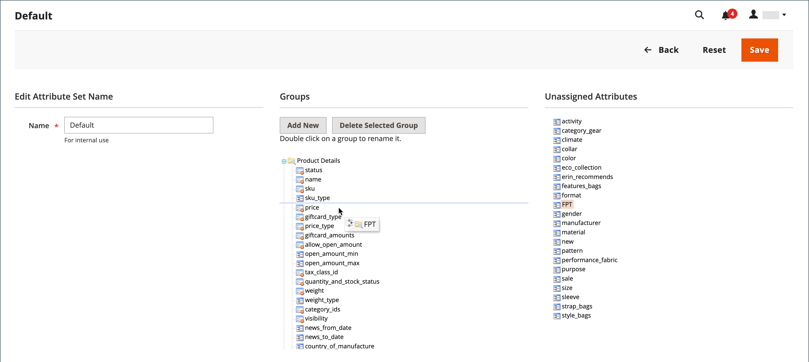
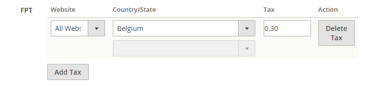

# Fixed Product Tax (FPT)

Some tax jurisdictions have a fixed tax that must be added to certain types of products. You can set up a _fixed product tax_ (FPT) as needed for your store's tax calculations. For example, in some countries FPT can be used to set up a Waste Electrical and Electronic Equipment Directive (WEEE) tax, also known as _ecological tax_ or _eco tax_, that is collected on certain types of electronics to offset the cost of recycling. This tax is a fixed amount, rather than a percentage of the product price.

Fixed product taxes apply at the item level, based on the product. In some jurisdictions this tax is subject to an additional % tax calculation. Your tax jurisdiction might also have rules about how the product price appears to customers, either with or without tax. Be sure that you understand the rules and set your FPT display options accordingly.

Exercise caution when quoting FPT prices in email, because the difference in price can affect customer confidence in their orders. For example, if you display Order Review prices without showing FPT, customers who buy items with associated FPT will see a total that includes the FPT tax amount, but without an itemized breakdown. The difference in price might lead some customers to abandon their carts because the total differs from the amount expected.

## FPT display prices

|FPT|Display setting and calculation|
|--- |--- |
|Not Taxed|**Excluding FPT**|FPT appears as a separate row in the cart, and the  value is used in appropriate tax calculations.
| |**Including FPT**|FPT is added to the base price of an item; but is not included in tax-rule-based calculations.|
| |**Excluding FPT, FPT Description, Final Price**|Prices appear without FPT amount or description. FPT is not included in tax-rule-based calculations.|
|Taxed|**Excluding FPT**|FPT appears as a separate row in the cart, and the  value is used in appropriate tax calculations.|
| |**Including FPT**|FPT is included in the price of an item, and no change to tax calculations is required.|
| |**Excluding FPT, FPT Description, Final Price**|Prices appear without the FPT amount or description. However, FPT is included in tax-rule-based calculations.|

## Configure FPT

The Fixed Product Tax (FPT) [input type](../catalog/attributes-input-types.md) creates a section of fields for managing tax for each region.

The following instructions show how to set up a fixed product tax for your store, using "eco tax" as an example. After setting the scope for the tax and the countries and states where the tax applies, and depending on the options you choose, the input fields can change according to the local requirements. To learn more, see [Create product attributes](../catalog/attribute-product-create.md).

### Step 1: Enable fixed product tax

1. On the _Admin_ sidebar, go to **Stores** > _Settings_ > **Configuration**.

1. In the left panel, expand **Sales** and choose **Tax**.

1. Expand  the **Fixed Product Taxes** section.

1. Set **Enable FPT** to `Yes`.

1. To determine how fixed product taxes are used in store prices, choose the FPT setting for each of the following price display locations:

   - **Display Prices in Product Lists**
   - **Display Prices on Product View Page**
   - **Display Prices in Sales Modules**
   - **Display Prices in Emails**

   Options (same for each):

   - `Including FPT Only`
   - `Including FPT and FPT description`
   - `Excluding FPT. Including FPT description and final price`
   - `Excluding FPT`

1. Set **Apply Tax to FPT** as needed.

1. Set **Include FPT in Subtotal** as needed.

   <!-- zoom -->

   For a detailed description of each of these configuration settings, see [Fixed Product Taxes](https://docs.magento.com/user-guide/configuration/sales/tax.html#fixed-product-taxes) in the _Configuration Reference Guide_.

1. When complete, click **Save Config**.

### Step 2: Create an FPT attribute

1. On the _Admin_ sidebar, go to **Stores** > _Attributes_ > **Product**.

1. In the upper-right corner, click **Add New Attribute** and do the following:

   - Enter a **Default Label** to identify the attribute.

   - Set **Catalog Input for Store Owner** to `Fixed Product Tax`.

   <!-- zoom -->

1. Expand  the **Advanced Attribute Properties** section and set the property options:

   - **Attribute Code** - Enter a unique identifier in lowercase, without spaces or special characters. The maximum length is 30 characters. You can leave the field blank to the text from the Default Label field.

   - **Add to Column Options** - If you want the FPT field to appear in the [grid](../catalog/products.md), set to `Yes`.

   - **Use in Filter Options** - If you want to be able to [filter](../getting-started/admin-workspace.md) products in the grid based on the value of the FPT field, set to `Yes`.

   <!-- zoom -->

1. (Optional) In the left panel, choose **Manage Labels** and enter a label to use instead of the default label for each store view.

   <!-- zoom -->

1. When complete, click **Save Attribute**.

1. When prompted, refresh the [cache](https://docs.magento.com/user-guide/system/cache-management.html).

### Step 3: Add the FPT attribute to an attribute set

1. On the _Admin_ sidebar, go to **Stores** > _Attributes_ > **Attribute Set**.

1. In the list, click the attribute set to open the record in edit mode.

   <!-- zoom -->

1. Drag the FPT attribute from the list of **Unassigned Attributes** on the right to the **Groups** list in the center column.

   Each group folder corresponds to a section of product information. You can place the attribute wherever you want it to appear when the product is open in edit mode.

   <!-- zoom -->

1. When complete, click **Save**.

1. Repeat this step for each attribute set that needs to include fixed product tax.

### Step 4: Apply FPT to specific products

1. On the _Admin_ sidebar, go to **Catalog** > **Products**.

1. Open the product that needs a fixed product tax in edit mode.

1. Find the **FPT** section of fields that you added to the attribute set and click **Add Tax**.

1. Specify the applicable tax for the product:

   <!-- zoom -->

   - If your Commerce instance has multiple websites, choose the appropriate **Website** and base currency. In this example, the field is set by default to `All Websites [USD]`.

   - Set **Country/State** to the region where the fixed product tax applies.

   - For **Tax**, enter the fixed product tax as a decimal amount.

1. To add more fixed product taxes, click **Add Tax** and repeat the process.

1. When complete, click **Save**.
