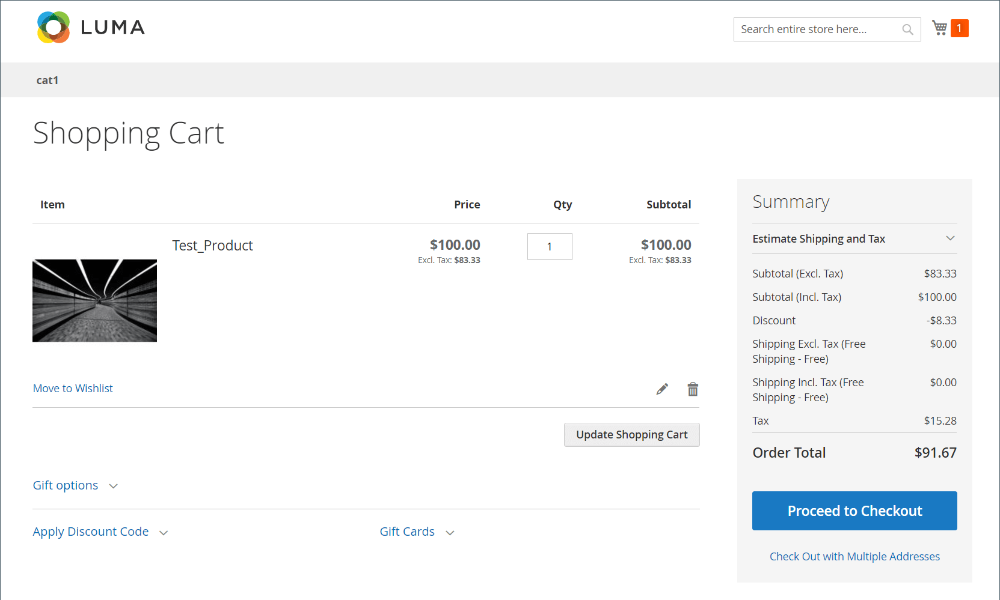

# Hidden tax calculation

_Hidden Tax_ is the amount of VAT that a discount amount has. It is non-zero when all of these conditions are true:

- Catalog prices include tax
- The VAT rate is not zero
- There is a discount present

When there is a discount that has tax embedded in it, Commerce computes a _hidden tax_ that is added back for calculating the discounted price.

`discountedItemPrice = fullPriceWithoutTax - discountAmountOnFullPriceWithoutTax + vatAmountOnDiscountedPrice + hiddenTax`

## Example

1. Full price of item, with tax included: $100
1. VAT at: 20%
1. Discount of 10% applied on item price-excluding taxes:

### Invalid Expected Result

- Item price after tax without discount=100 USD
- Item price before tax without discount=100/1.2=83.33 USD
- Discount=83.33 \ *0.1=8.33 USD
- Tax=(83.33-8.33) \ *0.2=**15 USD (invalid)**
- Order Total Excluding Tax=83.33-8.33=**75 USD (invalid)**
- Order Total Including Tax=75+15=**90 USD (invalid)**

### Valid Actual Result in Cart

{width="700" zoomable="yes"}

### Valid Calculations

1. Full price of the item without taxes is: $100 / 1.2 = **$83.33**

1. VAT amount on the full item price is: $100 - $83.33 = $16.67

   _Can also be calculated as: $100 \ * (1 - 1/1.2)._

1. Discount of 10% on $83.33 is: **$8.33** (when you don&#39;t discount tax)

1. Discounted price of item with tax is: $100 - $8.33 = $91.67

   >[!NOTE]
   >
   >This equation illustrates the customer's perception of how discounts are applied.

1. Discounted price of the item without taxes is: $91.67 / 1.2 = $76.39

1. VAT amount on the discounted price is: $91.67 - $76.39 = **$15.28 (valid)**

   _Can also be calculated as: $91.67 \ * (1 - 1/1.2)._

1. Hidden tax or _Discount Tax Compensation_ is the difference between the VAT amount of the full price versus discounted price: $16.67 - $15.28 = **$1.39**

   _Another way to look at it: hidden tax is the VAT amount carried within the $8.33 discount: $8.33 \* (1 - 1/1.2)._

1. How the customer usually understands the discounted price (Order Total):

   _Full price of item including taxes **less** the discount amount: $100 - $8.33 = $91.67_

1. **How Commerce calculates the discounted price** (see earlier for formula):

   _$83.33 - $8.33 + 15.28 + 1.39 = **$91.67***_
