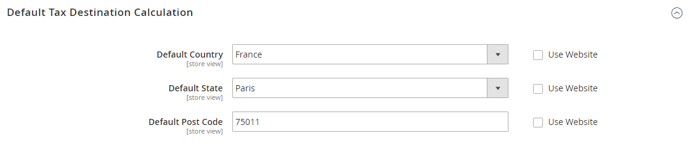

# Tax guidelines by country

## U.S. tax configuration

These recommended settings can be used for most tax configurations for stores within the United States.

|Tax option|Recommendation|
|--- |--- |
|Load catalog prices|Excluding tax|
|FPT|No, because FPT is not taxed.|
|Tax based on|Shipping origin|
|Tax Calculation|On total|
|Tax shipping?|No|
|Apply Discount|Before tax|
|Comment|All tax zones are the same priority; ideally, a zone for state and one or more zones for zip code lookup.|

{style="table-layout:auto"}

### Tax classes

| Tax class | Recommended setting |
|--- |--- |
| Tax class for shipping | None |

{style="table-layout:auto"}

### Calculation settings

| Option | Recommended setting |
|--- |--- |
| [!UICONTROL Tax Calculation Method Based On] | `Total` |
| [!UICONTROL Tax Calculation Based On] | `Shipping Origin` |
| [!UICONTROL Catalog Prices] | `Excluding Tax` |
| [!UICONTROL Shipping Prices] | `Excluding Tax` |
| [!UICONTROL Apply Customer Tax] | `After Discount` |
| [!UICONTROL Apply Discount on Prices] | `Excluding Tax` |

{style="table-layout:auto"}

### Default tax destination calculation

| Option | Recommended setting |
|--- |--- |
| [!UICONTROL Default Country] | `United States` |
| [!UICONTROL Default State] | State where business is located. |
| [!UICONTROL Default Post Code ]| The postal code that is used in your tax zones. |

{style="table-layout:auto"}

### Price display settings

| Option | Recommended setting |
|--- |--- |
| [!UICONTROL Display Product Prices in Catalog] | `Excluding Tax` |
| [!UICONTROL Display Shipping Prices] | `Excluding Tax` |

{style="table-layout:auto"}

### Shopping cart display settings

| Option | Recommended setting |
|--- |--- |
| [!UICONTROL Display Prices] | `Excluding Tax` |
| [!UICONTROL Display Subtotal] | `Excluding Tax` |
| [!UICONTROL Display Shipping Amount] | `Excluding Tax` |
| [!UICONTROL Display Gift Wrapping Prices] | `Excluding Tax` |
| [!UICONTROL Display Printed Card Prices] | `Excluding Tax` |
| [!UICONTROL Include Tax in Grand Total] | `Yes` |
| [!UICONTROL Display Full Tax Summary] | `Yes` |
| [!UICONTROL Display Zero Tax Subtotal] | `Yes` |

{style="table-layout:auto"}

### Orders, invoices, credit memos, and display settings

| Option | Recommended setting |
|--- |--- |
| [!UICONTROL Display Prices] | `Excluding Tax` |
| [!UICONTROL Display Subtotal] | `Excluding Tax` |
| [!UICONTROL Display Shipping Amount] | `Excluding Tax` |
| [!UICONTROL Include Tax in Grand Total] | `Yes` |
| [!UICONTROL Display Full Tax Summary] | `Yes` |
| [!UICONTROL Display Zero Tax Subtotal] | `Yes` |

{style="table-layout:auto"}

### Fixed product taxes (FPT)

| Option | Recommended setting |
|--- |--- |
| [!UICONTROL Enable FPT] | `No`, except in California. |

{style="table-layout:auto"}

## UK tax configuration

These recommended settings can be used for most tax configurations for stores within the United Kingdom.

### UK B2C tax configuration

|Tax option|Recommendation|
|--- |--- |
|Load catalog prices|Excluding tax|
|FPT|Yes, including FPT and description|
|Tax based on|[!UICONTROL Shipping Address]|
|Tax Calculation|On total|
|Tax shipping?|Yes|
|Apply Discount|Before tax, discount on prices, including tax.|
|Comment|For merchants marking up supplier invoices (including VAT).|

{style="table-layout:auto"}

### U.K. B2B tax configuration

|Tax option|Recommendation|
|--- |--- |
|Load catalog prices|Excluding tax|
|FPT|Yes, including FPT and description|
|Tax based on|[!UICONTROL Shipping Address]|
|Tax Calculation|On item|
|Tax shipping?|Yes|
|Apply Discount|Before tax, discount on prices, including tax.|
|Comment|For B2B merchants to provide simpler VAT supply chain considerations. Tax calculation on row is also valid; however, check with your taxing jurisdiction. Setup assumes that a merchant is in the supply chain and that goods sold are used by other vendors for VAT rebates and so on. This definition makes it easy to discern tax by item for faster rebate generation.   **_Note:_** Some jurisdictions require different rounding strategies not currently supported by Commerce, and that not all jurisdictions allow item or row level tax.|

{style="table-layout:auto"}

## Canada tax configuration

>[!IMPORTANT]
>
>Merchants that are in a GST/PST province (Montreal) should create one tax rule and show a combined tax amount. Be sure to consult a qualified tax authority if you have any questions.

|Tax option|Recommendation|
|--- |--- |
|Load catalog prices|Excluding tax|
|FPT|Yes, including FPT, description, and apply tax to FPT.|
|Tax based on|Shipping origin|
|Tax Calculation|On total|
|Tax shipping?|Yes|
|Apply Discount|Before tax|

{style="table-layout:auto"}

The following example shows how to set up GST tax rates for Canada and PST tax rates for Saskatchewan, with tax rules that calculate and display the two tax rates. This information outlines an example configuration; be sure to verify the correct tax rates and rules for your tax jurisdictions. When setting up taxes, set the store scope to apply the configuration to all applicable stores and websites.

- Fixed product tax is included for relevant goods as a product attribute.
- In Quebec, PST is referred to as TVQ. If you want to set up a rate for Quebec, make sure to use TVQ as the identifier.

### Step 1: Complete tax calculation settings

1. On the _Admin_ sidebar, go to **[!UICONTROL Stores]** > _[!UICONTROL Settings]_ > **[!UICONTROL Configuration]**.

1. For a multisite configuration, set **[!UICONTROL Store View]** to the website and store that is the target of the configuration.

1. In the left panel, expand **[!UICONTROL Sales]** and choose **[!UICONTROL Tax]**.

1. Click to expand each section on the page and complete the following settings:

#### Tax Calculation Settings

|Field|Recommended setting|
|--- |--- |
|[!UICONTROL Tax Calculation Method Based On]|`Total`|
|[!UICONTROL Tax Calculation Based On]|`Shipping Address`|
|[!UICONTROL Catalog Prices]|`Excluding Tax`|
|[!UICONTROL Shipping Prices]|`Excluding Tax`|
|[!UICONTROL Apply Customer Tax]|`After Discount`|
|[!UICONTROL Apply Discount on Prices]|`Excluding Tax`|
|[!UICONTROL Apply Tax On]|`Custom Price` (if available)|

{style="table-layout:auto"}

#### Tax Classes

|Field|Recommended setting|
|--- |--- |
|[!UICONTROL Tax Class for Shipping]|`Shipping` (shipping is taxed)|

{style="table-layout:auto"}

#### Default Tax Destination Calculation

|Field|Recommended setting|
|--- |--- |
|[!UICONTROL Default Country]|`Canada`|
|[!UICONTROL Default State]|(as appropriate)|
|[!UICONTROL Default Postal Code]|`*` (asterisk)|

{style="table-layout:auto"}

#### Shopping Cart Display Settings

|Field|Recommended setting|
|--- |--- |
|[!UICONTROL Include Tax in Grand Total]|`Yes`|
|[!UICONTROL Display Full Tax Summary]|`Yes`|
|[!UICONTROL Display Zero in Tax Subtotal]|`Yes`|

{style="table-layout:auto"}

#### Fixed Product Taxes

|Field|Recommended setting|
|--- |--- |
|[!UICONTROL Enable FPT]|`Yes`|
|All FPT display settings|`Including FPT and FPT description`|
|[!UICONTROL Apply Discounts to FPT]|`No`|
|[!UICONTROL Apply Tax to FPT]|`Yes`|
|[!UICONTROL Include FPT in Subtotal]|`No`|

{style="table-layout:auto"}

### Step 2: Set up Canadian Goods & Services Tax (GST)

To print the GST number on invoices and other sales documents, include it in the name of the applicable tax rates. The GST appears as part of the GST amount on any order summary.

#### Manage Tax Zones & Rates

|Field|Recommended setting|
|--- |--- |
|[!UICONTROL Tax Identifier]|`Canada-GST`|
|[!UICONTROL Country]|`Canada`|
|[!UICONTROL State]|`*` (asterisk)|
|[!UICONTROL Zip/Post is Range]|`No`|
|[!UICONTROL Zip/Post Code]|`*` (asterisk)|
|[!UICONTROL Rate Percent]|`5.0000`|

{style="table-layout:auto"}

### Step 3: Set up Canadian Provincial Sales Tax (PST)

Set up another tax rate for the applicable province.

#### Tax Rate Information

|Field|Recommended setting|
|--- |--- |
|[!UICONTROL Tax Identifier]|`Canada-SK-PST`|
|[!UICONTROL Country]|`Canada`|
|[!UICONTROL State]|`Saskatchewan`|
|[!UICONTROL Zip/Post is Range]|`No`|
|[!UICONTROL Zip/Post Code]|`*` (asterisk)|
|[!UICONTROL Rate Percent]|`5.0000`|

{style="table-layout:auto"}

### Step 4: Create a GST tax rule

To avoid compounding the tax and to correctly display the calculated tax as separate line items for GST and PST, set different priorities for each rule and select the **Calculate off subtotal only** checkbox. Each tax appears as a separate line item, but the tax amounts are not compounded.

#### Tax Rule Information

|Field|Recommended setting|
|--- |--- |
|Name|`Retail-Canada-GST`|
|[!UICONTROL Customer Tax Class]|`Retail Customer`|
|[!UICONTROL Product Tax Class]|`Taxable GoodsShipping`|
|[!UICONTROL Tax Rate]|`Canada-GST`|
|[!UICONTROL Priority]|`0`|
|[!UICONTROL Calculate off subtotal only]|Select this checkbox.|
|[!UICONTROL Sort Order]|`0`|

{style="table-layout:auto"}

### Step 5: Create a PST Tax Rule for Saskatchewan

For this tax rule, make sure to set the priority to 0 and select the **Calculate off subtotal only** checkbox. Each tax appears as a separate line item, but the tax amounts are not compounded.

#### Tax Rule Information

|Field|Recommended setting|
|--- |--- |
|[!UICONTROL Name]|`Retail-Canada-PST`|
|[!UICONTROL Customer Tax Class]|`Retail Customer`|
|[!UICONTROL Product Tax Class]|`Taxable GoodsShipping`|
|[!UICONTROL Tax Rate]|`Canada-SK-PT`|
|[!UICONTROL Priority]|`1`|
|[!UICONTROL Calculate off subtotal only]|Select this checkbox.|
|[!UICONTROL Sort Order]|`0`|

{style="table-layout:auto"}

### Step 6: Save and test the results

1. When complete, click **[!UICONTROL Save Config]**.

1. Return to your storefront and create a sample order to test the results.

## EU tax configuration

The following example depicts a store based in France that sells 100k+ Euros in France and 100k+ Euros in Germany.

- Tax calculations are managed at the website level.
- Currency conversion and tax display options are controlled individually at the store view level (Select the Use Website checkbox to override the default).
- By setting the default tax country, you can dynamically show the correct tax for the jurisdiction.
- Fixed product tax is included for relevant goods as a product attribute.
- It might be necessary to edit the catalog to ensure that it shows up in the correct category/website/store view.

### Step 1: Create three product tax classes

For this example, it is assumed that multiple VAT-Reduced product tax classes are not needed.

1. Create a VAT-Standard product tax class.

1. Create a VAT-Reduced product tax class.

1. Create a VAT-Free product tax class.

### Step 2: Create tax rates for France and Germany

Create the following tax rates:

|Tax rates|Settings|
|--- |--- |
|France-StandardVAT|Country: France  State/Region: *  ZIP/Postal Code: *  Rate: 20%|
|France-ReducedVAT|Country: France  State/Region: *  ZIP/Postal Code: *  Rate: 5%|
|Germany-StandardVAT|Country: Germany  State/Region: *  ZIP/Postal Code: * Rate: 19%|
|Germany-ReducedVAT|Country: Germany  State/Region: *  ZIP/Postal Code: *  Rate: 7%|

{style="table-layout:auto"}

### Step 3: Set up the tax rules

Create the following tax rules:

|Tax rules |Settings|
|--- |--- |
|Retail-France-StandardVAT |Customer Class: Retail Customer  Tax Class: VAT-Standard  Tax Rate: France-StandardVAT  Priority: 0  Sort Order: 0|
|Retail-France-ReducedVAT|Customer Class: Retail Customer  Tax Class: VAT Reduced  Tax Rate: France-ReducedVAT  Priority: 0  Sort Order: 0|
|Retail-Germany-StandardVAT|Customer Class: Retail Customer  Tax Class: VAT-Standard  Tax Rate: Germany-StandardVAT  Priority: 0  Sort Order: 0|
|Retail-Germany-ReducedVAT|Customer Class: Retail Customer  Tax Class: VAT-Reduced  Tax Rate: Germany-ReducedVAT  Priority: 0  Sort Order: 0|

{style="table-layout:auto"}

### Step 4: Set up a store view for Germany

1. On the _Admin_ sidebar, go to **[!UICONTROL Stores]** > _[!UICONTROL Settings]_ > **[!UICONTROL All Stores]**.

1. Under the default website, create a store view for **[!UICONTROL Germany]**.

1. Next, do the following:

   - On the _Admin_ sidebar, go to **[!UICONTROL Stores]** > _[!UICONTROL Settings]_ > **[!UICONTROL Configuration]**.

   - In the upper-left corner, set **[!UICONTROL Default Config]** to the French store.

   - On the General page, expand  the **[!UICONTROL Countries Options]** section, and set the default country to `France`.

   - Complete the locale options as needed.

1. In the upper-left corner, choose the German **[!UICONTROL Store View]**.

1. On the _General_ page, expand  **[!UICONTROL Countries Options]** and set the default country to `Germany`.

1. Complete the locale options as needed.

### Step 5: Configure tax settings for France

Complete the following general tax settings:

|Field|Recommended setting|
|--- |--- |
|[[!UICONTROL Tax Classes]](../configuration-reference/sales/tax.md#tax-classes)||
|[!UICONTROL Tax Class for Shipping]|`Shipping` (shipping is taxed)|
|[[!UICONTROL Calculation Settings]](../configuration-reference/sales/tax.md#calculation-settings)||
|[!UICONTROL Tax Calculation Method Based On]|`Total`|
|[!UICONTROL Tax Calculation Based On]|`Shipping Address`|
|[!UICONTROL Catalog Prices]|`Including Tax`|
|[!UICONTROL Shipping Prices]|`Including Tax`|
|[!UICONTROL Apply Customer Tax]|`After Discount`|
|[!UICONTROL Apply Discount on Prices]|`Including Tax`|
|[!UICONTROL Apply Tax On]|`Custom Price if available`|
|[[!UICONTROL Default Tax Destination Calculation]](../configuration-reference/sales/tax.md#default-tax-destination-calculation)||
|[!UICONTROL Default Country]|`France`|
|[!UICONTROL Default State]||
|[!UICONTROL Default Postal Code]|`*` (asterisk)|
|[[!UICONTROL Fixed Product taxes]](../configuration-reference/sales/tax.md#fixed-product-taxes)||
|[!UICONTROL Enable FPT]|`Yes`|
|[!UICONTROL All FPT Display Settings]|`Including FPT and FPT description`|
|[!UICONTROL Apply Discounts to FPT]|`No`|
|[!UICONTROL Apply Tax to FPT]|`Yes`|
|[!UICONTROL Include FPT in Subtotal]|`Yes`|

{style="table-layout:auto"}

### Step 6: Configure tax settings for Germany

1. On the _Admin_ sidebar, go to **[!UICONTROL Stores]** > _[!UICONTROL Settings]_ > **[!UICONTROL Configuration]**.

1. In the upper-right corner, set **[!UICONTROL Store View]** to the view to the German store and click **[!UICONTROL OK]** to confirm.

1. In the left panel, expand **[!UICONTROL Sales]** and choose **[!UICONTROL Tax]**.

1. In the **[!UICONTROL Default Tax Destination Calculation]** section, do the following:

   - Clear the **[!UICONTROL Use Website]** checkbox after each field,

   - To match your site's Shipping Settings [point of origin](shipping-settings.md#point-of-origin), update the following values:

      - Default Country
      - Default State
      - Default Post Code

      This setting ensures that tax is calculated correctly when product prices include tax.

      {width="600" zoomable="yes"}

1. When complete, click **[!UICONTROL Save Config]**.
