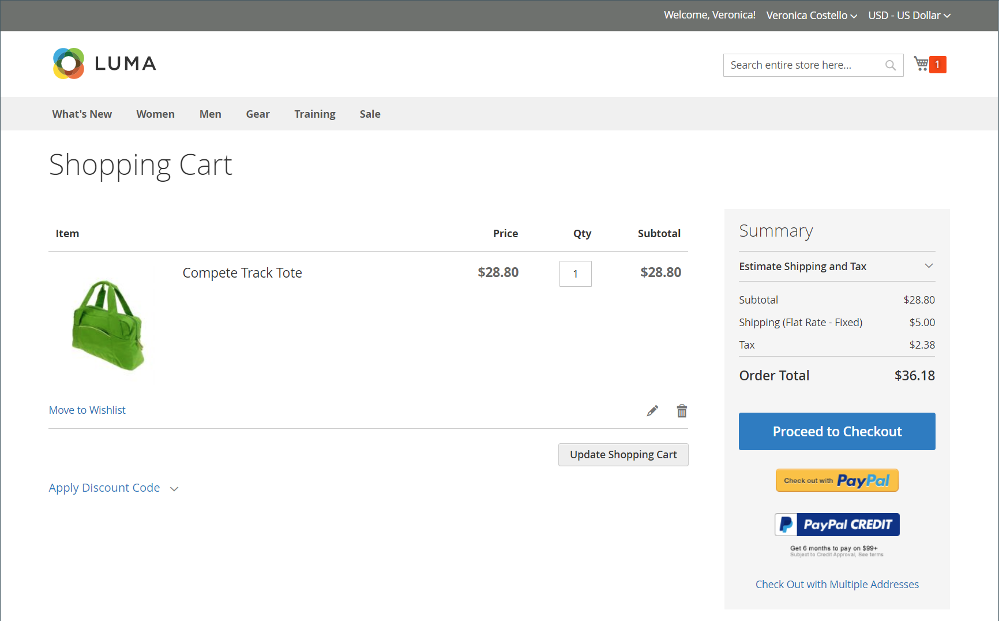

# Introduction to stores and purchase experience

Adobe Commerce and Magento Open Source provide a comprehensive set of features to construct and manage your online stores and the purchasing experience for your customers. Within your Commerce instance, you can manage the store hierarchy of websites, stores, and views. You can also configure the taxes and currency rates required to run stores for multiple locales, including tax classes for products and customer groups.

## Store structure

A single instance of Adobe Commerce or Magento Open Source can support multiple sites, stores, or store views that use different attributes and content. A typical scenario is to set up stores with different options in different domains. For example, you might want one set of categories and products on one domain and another set of categories and products on a different domain in another language. Merchants can configure the websites, stores, and store views in the Admin.

When the [hierarchy](stores.md) is defined, you can apply configuration settings according to [scope](../getting-started/websites-stores-views.md#scope-settings) so that each site, store, and store view provides the product catalog and storefront experience you want.

## Point of purchase

Adobe Commerce and Magento Open Source reduce ordering errors by automatically verifying the SKU and availability of all items before an order is submitted. You can configure the [cart](cart.md) and [checkout options](checkout-process.md) to provide an optimal purchase experience, from the transaction through the delivery. Customers who are logged into their accounts can complete checkout quickly, because much of the information is already in their accounts. The _Checkout_ page leads the customer through each step of the process for completing the order transaction. If you activate [Instant Purchase](checkout-instant-purchase.md), customers can speed through the checkout process using information that is saved in their account.

>[!TIP]
>
> With the installation and enablement of Adobe Commerce B2B, you can configure _Quick Order_ for customers associated with a company account. This function reduces the order process to several clicks when they know the name or SKU of the products they want to order. You can also configure support for Negotiable Quotes for your company accounts. For more information about the B2B features, see the [Adobe Commerce B2B User Guide](https://experienceleague.adobe.com/docs/commerce-admin/b2b/introduction.html).

## Shopping assistance

Customers sometimes need assistance to complete a purchase. Some customers like to shop online, but prefer to order by phone. You can offer immediate assistance to both guests and customers who have registered for an account with your store.

- [Manage the shopping cart](shopping-assisted-cart-manage.md)
- [Create orders](customer-account-create-order.md) for registered customers
- [Update orders](order-update.md)

{width="700" zoomable="yes"}

Learn about seller-assisted shopping by watching this video:

>[!VIDEO](https://video.tv.adobe.com/v/343662/?quality=12&learn=on)

## Order management and operations

In the Admin, merchants can access information at each stage of the order workflow and process orders:

- The [Orders](orders.md) page provides merchants with an easy-to-access list of all current orders, and includes tools to edit and process existing orders, and create orders on behalf of customers. 

- The [Invoices](invoices.md) page lists An invoice is based on a temporary sales order and provides a permanent record of the order.

- The [Shipments](shipments.md) page lists the shipment record of each invoice that is ready to be shipped.

- The [Credit Memos](credit-memos.md) page allows merchants to process and manage a credit memo, which is a document that shows the amount that is owed to the customer. The amount can be applied toward a purchase, or refunded to the customer.

-  (Adobe Commerce only) The [Returns](returns.md) page lists the current returned merchandise requests (RMAs) and is used to enter new return requests.

- The [Transactions](transactions.md) page lists all payment activity that has taken place between your store and a payment system, and provides access to more detailed information.

## Shipping and delivery

Studies show that stores offering customers a choice of several [delivery methods](delivery.md) have higher conversion rates than stores that use a single method. The Admin provides various tools that merchants can use to set up multiple delivery methods and [shipping carriers](carriers.md), and to print [shipping labels](shipping-labels.md).
