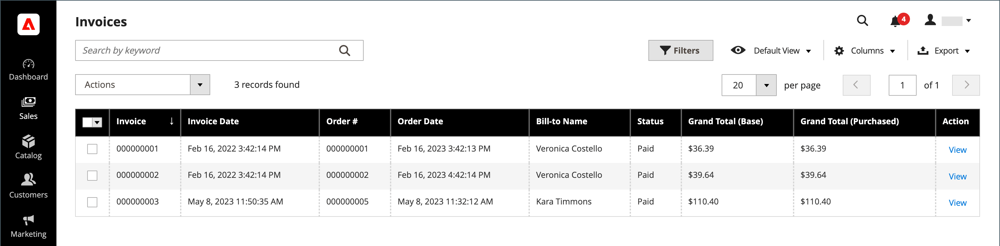
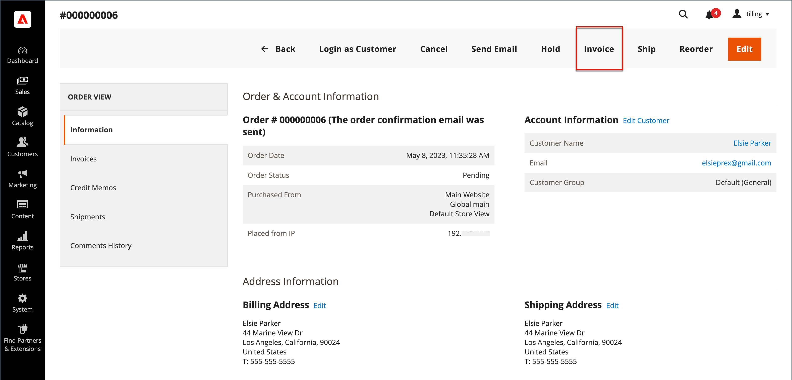
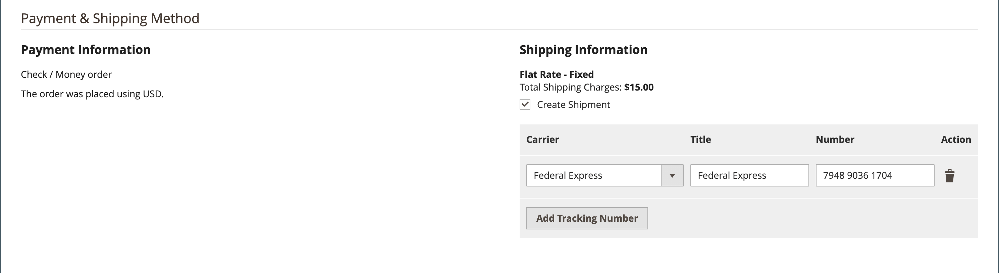
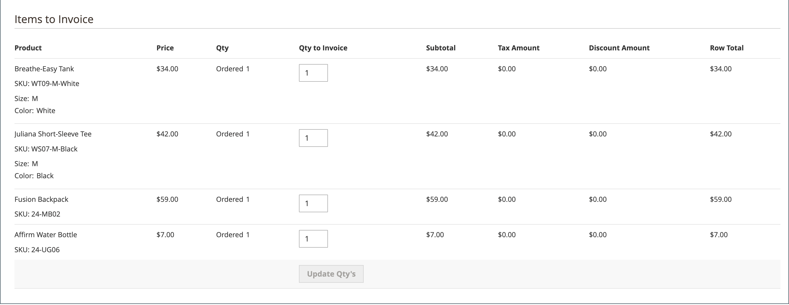
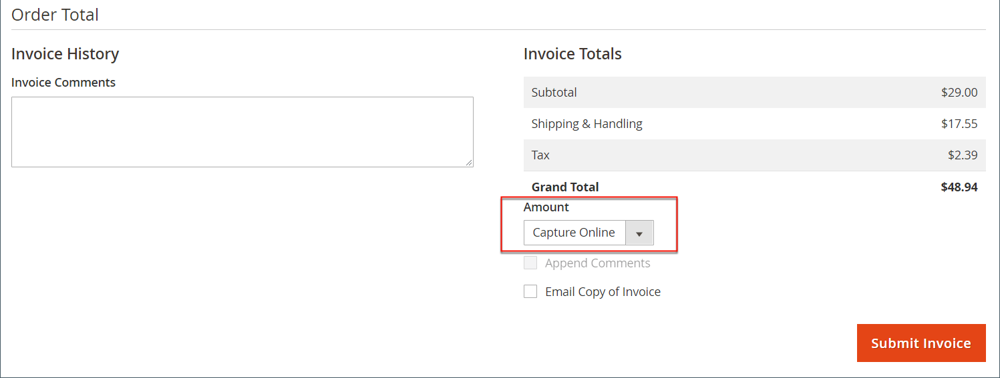
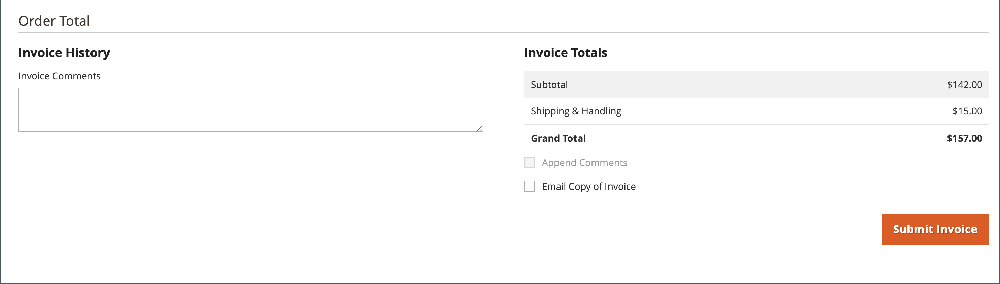
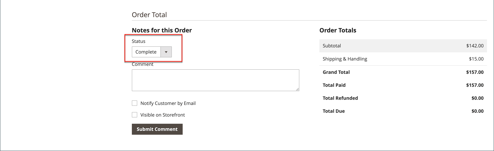
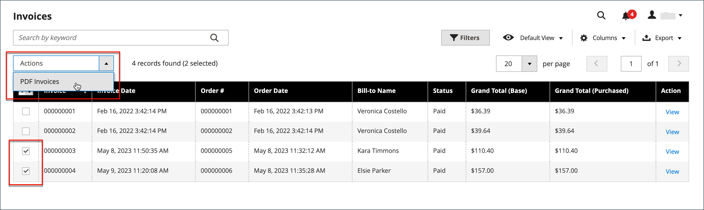

# Invoices

An invoice is a record of the record of payment for an order. Multiple invoices can be [created](#create-an-invoice) for a single order, and each can include as many or as few of the purchased products that you specify. You can also create [print-ready PDF invoices](#print-invoices) as sales documents for your customers.

On the _Admin_ sidebar, go to **[!UICONTROL Sales]** > _Operations_ > **Invoices** to open the _Invoices_ grid and access your created invoices.

{width="700" zoomable="yes"}

## Column descriptions

|Column|Description|
|--- |--- |
|[!UICONTROL Select]|Select the checkboxes for the quotes to be subject to an action, or use the selection control in the column header. Options: `Select All` / `Deselect All`|
|[!UICONTROL Invoice]|A unique numeric identifier that is assigned when an invoice is submitted from the Admin. When viewing the invoice detail, this number appears at the top of the page, instead of the quote name.|
|[!UICONTROL Invoice Date]|The date and time the administrator first submitted the invoice.|
|[!UICONTROL Order#]|A unique numeric identifier that is assigned when an order is placed by a buyer. When viewing the invoice details, this number appears as a link in the Order & Account Information block.|
|[!UICONTROL Order Date]|The date and time the customer first successfully placed an order.|
|[!UICONTROL Bill-to Name]|The name of the person who is responsible to pay for the order.|
|[!UICONTROL Status]|Indicates the current state of an invoice. The status can be changed only by action on the part of either the buyer or seller.|
|[!UICONTROL Grand Total (Base)]|The total price of products to be purchased. The total amount appears in the base currency of the website and in the currency of the storefront.|
|[!UICONTROL Grand Total (purchase)]|The grand total of products purchased in the order. The total amount appears in the base currency of the website and in the currency of the storefront.|
|[!UICONTROL Purchased From]|The website/store/store view from which the invoice was created.|
|[!UICONTROL Billing Address]|The billing address of the customer who placed the order.|
|[!UICONTROL Shipping Address]|The address where the order is to be shipped.|
|[!UICONTROL Customer Name]|The first and last name of the customer receiving the invoice.|
|[!UICONTROL Email]|The email address of the customer receiving the invoice.|
|[!UICONTROL Customer Group]|The customer group assigned to customer receiving the invoice.|
|[!UICONTROL Payment Method]|The method of payment to be used for the payment.|
|[!UICONTROL Shipping Information]|The method to be used to ship the order.|
|[!UICONTROL Subtotal]|The order subtotal, without shipping and handling, and tax.|
|[!UICONTROL Shipping and Handling]|The amount charged for shipping and handling.|
|[!UICONTROL Action]|**[!UICONTROL View]** - opens the invoice in edit mode.|

{style="table-layout:auto"}

## Create an invoice

Creating an invoice for an order moves it to a state in which it cannot be canceled or changed. A new invoice page looks similar to a completed order, with some additional fields. Every activity that is related to an order is noted in the Comments section of the invoice.

Normally, orders are invoiced and captured when the shipping process starts. If the method of payment is a purchase order, or if the [payment action](../configuration-reference/sales/payment-methods.md#payment-actions) is set to `Authorize and Capture`, the order is invoiced and payment is captured during checkout. You can generate an invoice with a packing slip, and also print shipping labels from your carrier account. A single order can be divided into partial shipments, which are invoiced separately, if necessary.

When the state of new orders is set to `Processing`, the option to _Automatically Invoice All Items_ becomes available in the configuration. Some credit card payment methods complete the invoicing step as part of the process when the [payment action](../configuration-reference/sales/payment-methods.md#payment-actions) is set to `Authorize and Capture`. In such a case, the Invoice button does not appear, and the order is ready to ship.

>[!NOTE]
>
>Invoices are not created automatically for orders placed by using `Gift Card`, `Store Credit`, `Reward Points`, or other offline payment methods.

An invoice for the order must be generated before it can be printed. To view or print the PDF, first download and install a PDF reader such as [Adobe Acrobat Reader][1].

**_To invoice an order:_**

1. On the _Admin_ sidebar, go to **[!UICONTROL Sales]** > _[!UICONTROL Operations]_ > **[!UICONTROL Orders]**.

1. Find the sales order with the status of `Processing` in the grid. Then, do the following:

1. In the _Action_ column, click **[!UICONTROL View]**.

1. In the header of the sales order, choose the **[!UICONTROL Invoice]** option.

   >[!NOTE]
   >
   >The _[!UICONTROL Invoice]_ option does not appear when the [payment action](../configuration-reference/sales/payment-methods.md#payment-actions) for your specific [payment method](../configuration-reference/sales/payment-methods.md) is set to `Authorize and Capture`, which auto-generates an invoice. This is also the case if the order is placed and the payment action for your payment method is set to `Authorize` and the order is invoiced.

   {width="700" zoomable="yes"}

   The new invoice page looks similar to a completed order page, with additional fields that can be edited.

1. If the items are ready to ship, generate a packing slip for the shipment at the same time that you create the invoice:

   - In the _Shipping Information_ section, click the **[!UICONTROL Create Shipment]** checkbox to select it.

      The shipment record is created at the same time that the invoice is generated.

   - Include a tracking number:

      - Click **[!UICONTROL Add Tracking Number]**.
      - Enter the tracking information: _[!UICONTROL Carrier]_, _[!UICONTROL Title]_, and _[!UICONTROL Number]_

      {width="600" zoomable="yes"}

   - Optionally, generate a partial invoice:

      - In the _Items to Invoice_ section, update the **[!UICONTROL Qty to Invoice]** column to include only specific items on the invoice.
      - Then, click **[!UICONTROL Update Qty's]**.

        {width="600" zoomable="yes"}

1. If an online payment method was used for the order, set **[!UICONTROL Amount]** to the appropriate option.

1. To notify customers by email when the invoice is generated, do the following:

   - Select the **[!UICONTROL Email Copy of Invoice]** checkbox.

   - Enter any **[!UICONTROL Invoice Comments]**. To include the comments in the notification email, mark the **[!UICONTROL Append Comments]** checkbox.

1. When complete, click **[!UICONTROL Submit Invoice]** at the bottom of the page.

   **_Online payment method:_**

   {width="600" zoomable="yes"}

   **_Offline payment method:_**

   {width="600" zoomable="yes"}

   The status of the order changes from `Pending` to `Complete`.

   {width="600" zoomable="yes"}

## Print invoices

Invoices can be printed individually or as a batch. However, before an invoice can be printed, it must first be generated for the order. You can upload a high-resolution logo for a print-ready PDF invoice, and include the [Order ID](../stores-purchase/sales-documents.md#add-reference-ids) in the header. To customize the invoice template with your logo and address, see [PDF Logo Requirements](../stores-purchase/sales-documents.md#image-formats).

>[!NOTE]
>
>To view or print the PDF, you must have a PDF reader. You can download [Adobe Reader][1] at no charge.

### Print a single invoice

1. On the _Admin_ sidebar, go to **[!UICONTROL Sales]** > _[!UICONTROL Operations]_ > **[!UICONTROL Invoices]**.

1. In the _[!UICONTROL Invoices]_ grid, locate the invoice and click **[!UICONTROL View]** in the _Action_ column.

1. At the top of the invoice, click **[!UICONTROL Print]** to generate a PDF of the invoice.

1. Save the generated PDF to a file or print it.

### Print multiple invoices

1. On the _Admin_ sidebar, go to **[!UICONTROL Sales]** > _[!UICONTROL Operations]_ > **[!UICONTROL Invoices]**.

1. In the _[!UICONTROL Invoices]_ grid, select the checkbox for each invoice to be printed.

1. Set the **[!UICONTROL Actions]** control to `PDF Invoices`.

   {width="600" zoomable="yes"}

The invoices are saved in a single PDF file that can be sent to a printer or saved.

## Troubleshooting resources

For help with troubleshooting invoice issues, see the following _Commerce Support Knowledge Base_ articles:

- [Can't invoice bundle products virtual and simple](https://experienceleague.adobe.com/docs/commerce-knowledge-base/kb/support-tools/patches/v1-0-9/mdva-30889-magento-patch-can-t-invoice-bundle-products-virtual-and-simple.html)
- [Invoice without store credit info](https://experienceleague.adobe.com/docs/commerce-knowledge-base/kb/support-tools/patches/v1-0-8/mdva-31150-magento-patch-invoice-without-store-credit-info.html)
- [Tax appears on invoice with 100% discount](https://experienceleague.adobe.com/docs/commerce-knowledge-base/kb/support-tools/patches/v1-0-22/mdva-35773-tax-appears-on-invoice-with-100-discount.html)
- [Order invoices don't send automatically](https://experienceleague.adobe.com/docs/commerce-knowledge-base/kb/support-tools/patches/v1-0-13/mdva-32545-magento-patch-order-invoices-don-t-send-automatically.html)

[1]: https://www.adobe.com/acrobat/pdf-reader.html "Get Adobe Reader"
