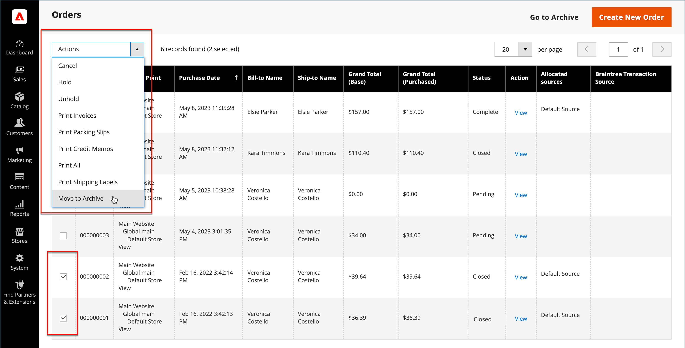
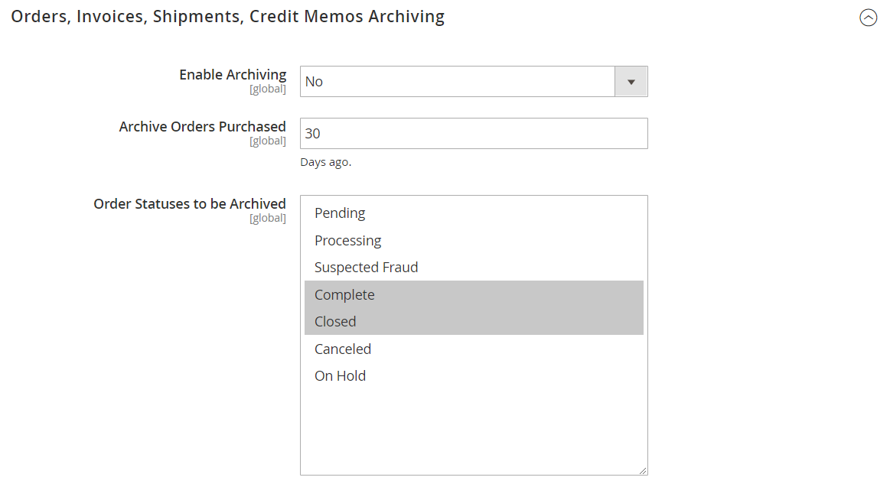
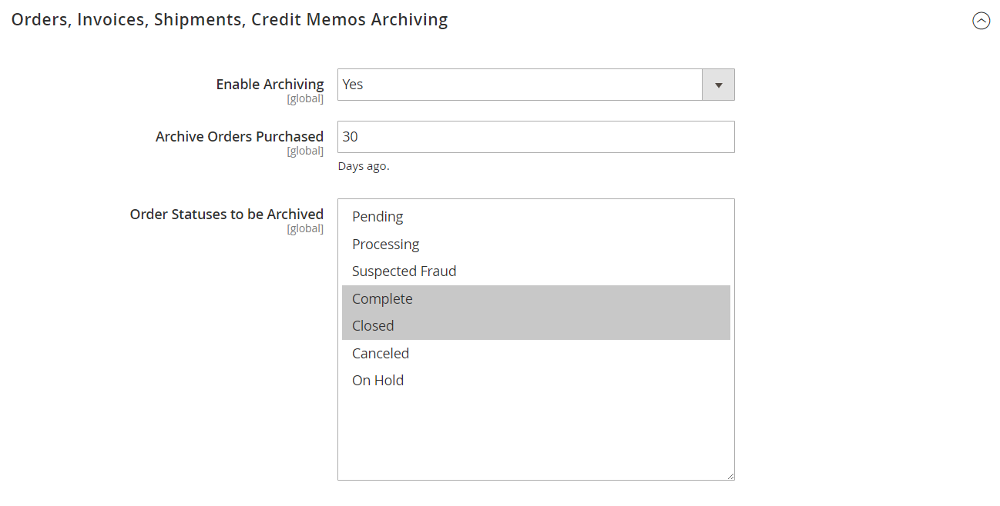
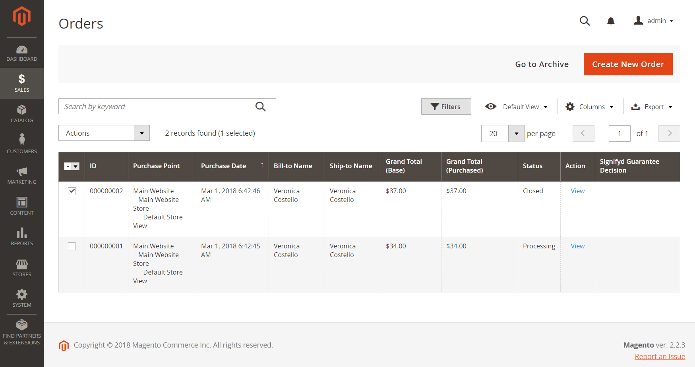
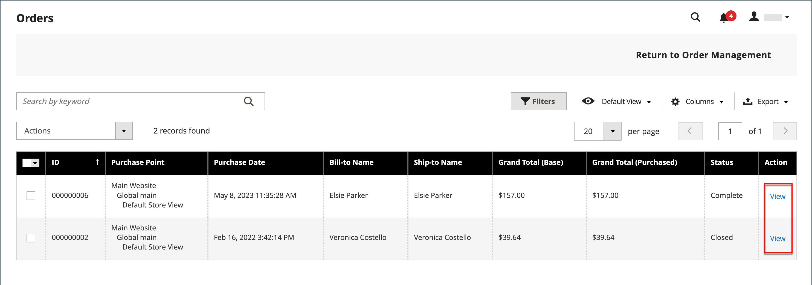
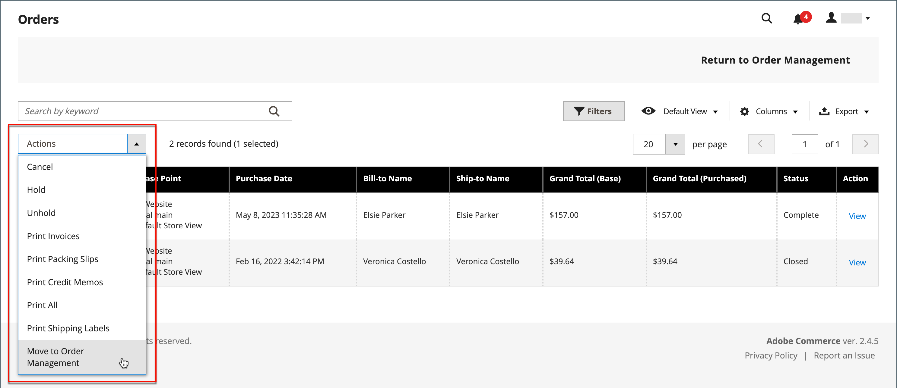

# Archive orders

{{ee-feature}}

Archiving orders regularly improves performance and keeps your workspace free of unnecessary information, so you can focus on current business. Invoices, shipments, and credit memos can be archived automatically or manually, and can be viewed at any time.

>[!NOTE]
>
>The _Archive_ option appears in the Sales menu only when archiving is [enabled](https://docs.magento.com/user-guide/configuration/sales/sales.html).

<!-- zoom -->

## Configure the order archive

Your store can be configured to archive orders, invoices, shipments, and credit memos after a set number of days. You can move orders and their associated documents to the archive, or restore them to their previous state. Archived orders are not deleted and remain available from the Admin. Archived data can be exported to a CSV file and opened in a spreadsheet. When enabled, the _Archive_ action appears at the top of the workspace.

>[!NOTE]
>
>Adobe Commerce Support recommends enabling Order archiving to save MySQL disk space and improve checkout performance. See [Best practices for order placement performance ](https://support.magento.com/hc/en-us/articles/360048170772) in Adobe Commerce Support Knowledge Base.

1. On the _Admin_ sidebar, go to **Stores** > _Settings_ > **Configuration**.

1. In the _Sales_ section on the left panel, choose **Sales**.

1. Expand the **Orders, Invoices, Shipments, Credit Memos Archiving** section.

   <!-- zoom -->

1. Set **Enable Archiving** to `Yes`.

   >[!NOTE]
   >
   >If you later decide to turn archiving off, all archived orders are restored to the previous state.

1. Set **Archive Orders Purchased** to the number of days to wait before completed orders are archived.

   By default, orders are archived 30 days after the purchase.

1. In the **Order Statuses to be Archived** list, select each order status to use for identifying orders to archive. 

   To select multiple items, hold down the Ctrl (Windows) or Command (Mac) key as you click each item.

1. Click **Save Config**.

1. When prompted, refresh any invalid cache.

## View archived documents

1. In the _Sales_ menu under _Archive_, choose any of the following:

   - Orders
   - Invoices
   - Shipments
   - Credit Memos

1. Click any archived document in the list to view details.

## Apply an action to an archived document

Select each document to be the target of the action. Then, choose one of the following actions:

- Cancel
- Hold
- Unhold
- Print
- Move to Orders Management

## Manually archive documents

1. Select the type of the document to archive from the following:

   - Orders
   - Invoices
   - Shipments
   - Credit Memos

1. Mark the checkbox of each item that you want to archive.

1. In the upper-right corner, set **Actions** to `Move to Archive`.

1. Click **Submit** to archive the selected documents.

## Restore archived documents

1. Choose the type of document that you want to restore.

1. Select documents using one of the following options:

   - To select all visible documents, in the upper-left corner, click **Select Visible**.

   - Manually select the checkbox of each document that you want to restore.

1. In the upper-right, set **Action** to `Move to Orders Management`.

1. Click **Submit** to restore the documents.

## Export archived documents

1. Choose the type of document that you want to export.

1. In the upper-right menu, set **Export to:** to one of the following values:

   - CSV
   - Excel

1. Click **Export**.

Your store can be configured to archive orders, invoices, shipments, and credit memos after a set number of days. You can move orders and their associated documents to the archive, or restore them to their previous state. Archived orders are not deleted and remain available from the Admin. Archived data can be exported to a CSV file and opened in a spreadsheet. When enabled, the "Archive" command appears at the top of the workspace.

## Configure the order archive

1. On the Admin menu, click **Stores**.

1. In the _Settings_ section, choose **Configuration**.

1. In the _Sales_ section of the Configuration panel on the left, choose **Sales**.

1. Expand  the **Orders, Invoices, Shipments, Credit Memos Archiving** section.

   <!-- zoom -->

1. Configure the archive:

   - Set **Enable Archiving** to `Yes`.

      >[!NOTE]
      >
      >If you later decide to turn archiving off, all archived orders are restored to the previous state.

   - Set **Archive Orders Purchased** to the number of days to keep an order in the grid before it is archived. By default, this waiting period is set to 30 days.

   - In the **Order Statuses to be Archived** list, select each order status to use for identifying orders to archive. To select multiple items, hold down the Ctrl (Windows) or Command (Mac) key as you click each item.

1. Click **Save Config**.

1. When prompted, refresh any invalid cache.

## View archived documents

1. In the _Sales_ menu under _Archive_, choose any of the following:

   - Orders
   - Invoices
   - Shipments
   - Credit Memos

1. Click any archived document in the list to view details.

## Apply an action to an archived document

Select each document to be the target of the action and choose one of the following actions:

- Cancel
- Hold
- Unhold
- Print
- Move to Orders Management

## Manually archive documents

1. Select the type of the document to archive from the following:

   - Orders
   - Invoices
   - Shipments
   - Credit Memos

1. Mark the checkbox of each item that you want to archive.

1. In the upper-right corner, set **Actions** to `Move to Archive`.

1. Click **Submit** to archive the selected documents.

## Restore archived documents

1. Choose the type of document that you want to restore.

1. Select documents using one of the following options:

   - To select all visible documents, in the upper-left corner, click **Select Visible**.

   - Manually select the checkbox of each document that you want to restore.

1. In the upper-right, set **Action** to `Move to Orders Management`.

1. Click **Submit** to restore the documents.

## Export archived documents

1. Choose the type of document that you want to export.

1. In the upper-right menu, set **Export to:** to one of the following values:

   - CSV
   - Excel

1. Click **Export**.

## Manually archive an order

1. On the _Admin_ sidebar, click **Sales**.

1. In the _Operations_ section, choose **Orders**.

1. To select the order on the grid, select the checkbox in the first column.

   <!-- zoom -->

1. Set the **Actions** control to `Move to Archive`.

   Then, look for the message that order has been archived.

>[!TIP]
>
>To specify a list of order statuses that can be archived, see [Configure the order archive](#configure-the-order-archive).

## View an archived order

1. Open the archive view using one of the following methods:

    - In the button bar above the Orders grid, click **Go to Archive**.

    - On the _Admin_ sidebar, click **Sales**.

    - In the _Archive_ section, choose **Orders**.

   >[!NOTE]
   >
   >Like the Orders page, the title of the archived orders page is "Orders." The only noticeable difference is the option in the button bar to _Return to Order Management_. The URL of the page also indicates that you are in the order archive.

1. In the _Action_ column, click **View**.

   <!-- zoom -->

## Restore an archived order

1. On the _Admin_ sidebar, go to **Sales** > _Operations_ > **Orders**.

1. In the button bar, click **Go to Archive**.

1. Find the record to restore, and click the checkbox to select it.

   <!-- zoom -->

1. Set the **Actions** control value to **Move to Order Management**.

 Look for the message that the archived order has been removed from the archive.

## Export archived order

1. On the _Admin_ sidebar, go to **Sales** > _Operations_ > **Orders**.

1. In the action menu, click **Export** and select the desired format.
