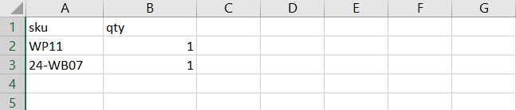
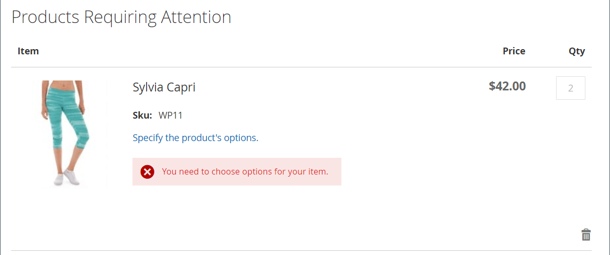

# Order by SKU

{{ee-feature}}

A 'SKU' is a 'Stock Keeping Unit'. SKUs generally help online sellers identify the most important product characteristics such as: size, color, price, and material. Product IDs are different from SKUs:

   - The `Product ID` is sequential series of numbers that are used internally to identify products and are not available to customers.
   - The `SKU` is generated by the seller, normally based on the product name and attributes for marketing or internal tracking. For example: A blue, cotton T-shirt, size medium: T-COT-MED-BL. The SKU may be changed by the seller if necessary.

Normally, a SKU includes a set of abbreviations indicating the distinguishing characteristics of the product. The maximum SKU length is 64 characters. SKUs are important to effectively track and manage inventory, so setting them up correctly is critical for e-commerce.

_Order by SKU_ is a [widget](../content-design/widgets.md) that can be displayed in the store as a convenience for all shoppers, or made available to only those in specific customer groups. Shoppers can either enter the SKU and quantity information directly into the Order by SKU block, or upload a csv file from their customer account. Regardless of the configuration, order by SKU is always available to store administrators.

<!-- zoom -->

## Configure order by SKU

1. On the _Admin_ sidebar, go to **[!UICONTROL Stores]** > _[!UICONTROL Settings]_ > **[!UICONTROL Configuration]**.

1. In the left panel, expand the **[!UICONTROL Sales]** section and choose **[!UICONTROL Sales]** underneath.

1. Expand  the **[!UICONTROL Order by SKU Settings]** section.

1. Set **[!UICONTROL Enable Order by SKU on my Account in Storefront]** to one of the following:

    - `Yes, for Everyone` – The Order by SKU block is available in the store for every shopper.
    - `Yes, for Specified Customer Groups` – Order by SKU is available only to members of a specific customer group, such as `Wholesale`.
    - `No` – The Order by SKU block does not appear in the storefront, and the Order by SKU page is not available in the  customer account.

      <!-- zoom -->

1. Click **[!UICONTROL Save Config]**.

 (B2B for Adobe Commerce only) _**To enable the Order by SKU function, disable the Quick Order function:**_

1. Go to **[!UICONTROL Stores]** > _[!UICONTROL Settings]_ > **[!UICONTROL Configuration]**.

1. In the left panel under _[!UICONTROL General]_, choose **[!UICONTROL B2B Features]**

1. Expand  the **[!UICONTROL B2B Features]** section.

1. Set **[!UICONTROL Enable Quick Order]** to `No`.

   The [Quick Order feature](../b2b/quick-order.md) allows customers and guests to quickly place orders based on SKU or product name.

## Storefront experience

When the functionality is configured for the store, customers can order by SKU from any page that includes the _Order by SKU_ widget or from their account dashboard.

### Order by SKU from the page block

1. In the _Order by SKU_ block, the customer enters the **[!UICONTROL SKU]** and **[!UICONTROL Qty]** of the item to be ordered.

1. To add another item, clicks **[!UICONTROL Add Row]** and repeat the process.

1. Clicks **[!UICONTROL Add to Cart]**.

### Order by SKU from a customer account

1. From the storefront, the customer logs in to their account.

1. In the panel on the left, chooses **[!UICONTROL Order by SKU]**.

1. Adds individual items according to preference:

   _**Adds each item by SKU:**_

      - Enters the **[!UICONTROL SKU]** and **[!UICONTROL Qty]** of the item to be ordered.

      - To add additional items as needed, clicks _Add Row_  and repeats for as many items as necessary.

      - Clicks **[!UICONTROL Add to Cart]**.

   _**Uploads a CSV file of multiple items:**_

      - Prepares an [import data CSV](../systems/data-csv.md) (Comma Separated Value) file that includes columns for `SKU` and `Qty`.

      <!-- zoom -->

      - To upload the CSV file, clicks **[!UICONTROL Choose File]** and select the file to upload.

      - Clicks **[!UICONTROL Add to Cart]**.

      If any of the products have additional options, the customer is prompted from the shopping cart that the product requires attention.

      <!-- zoom -->

      >[!NOTE]
      >
      >If there are duplicate SKUs, the quantities are combined into one line item in the shopping cart. The customer can change the quantity of any item and click **[!UICONTROL Update Shopping Cart]** to recalculate the totals.

