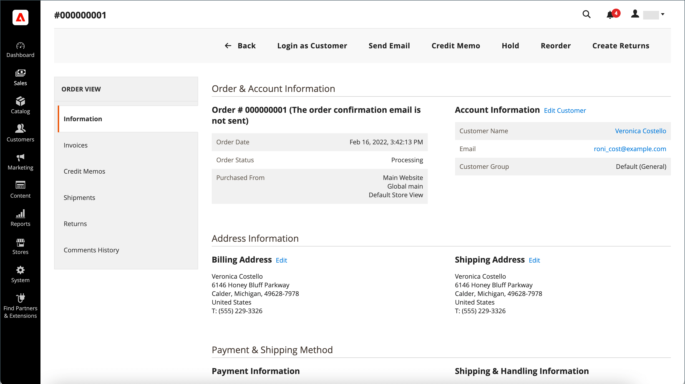
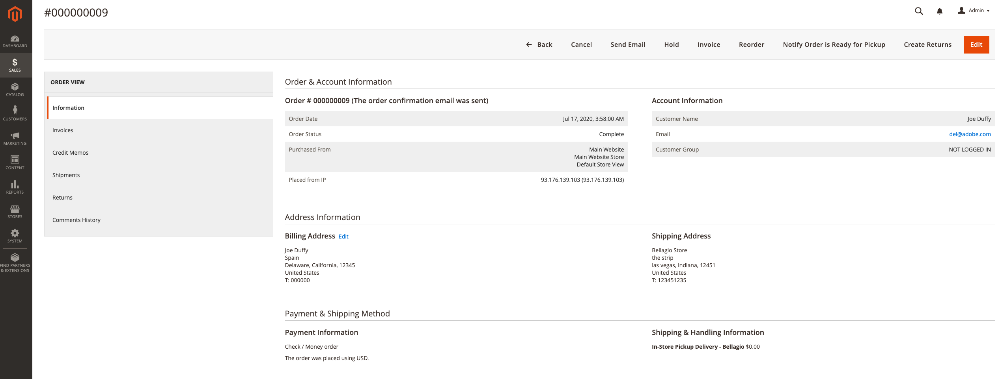
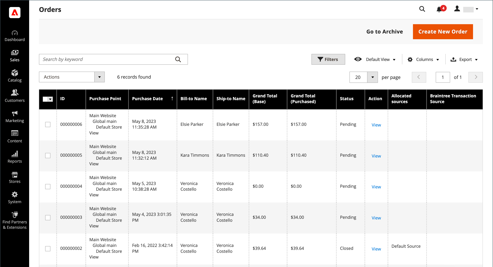
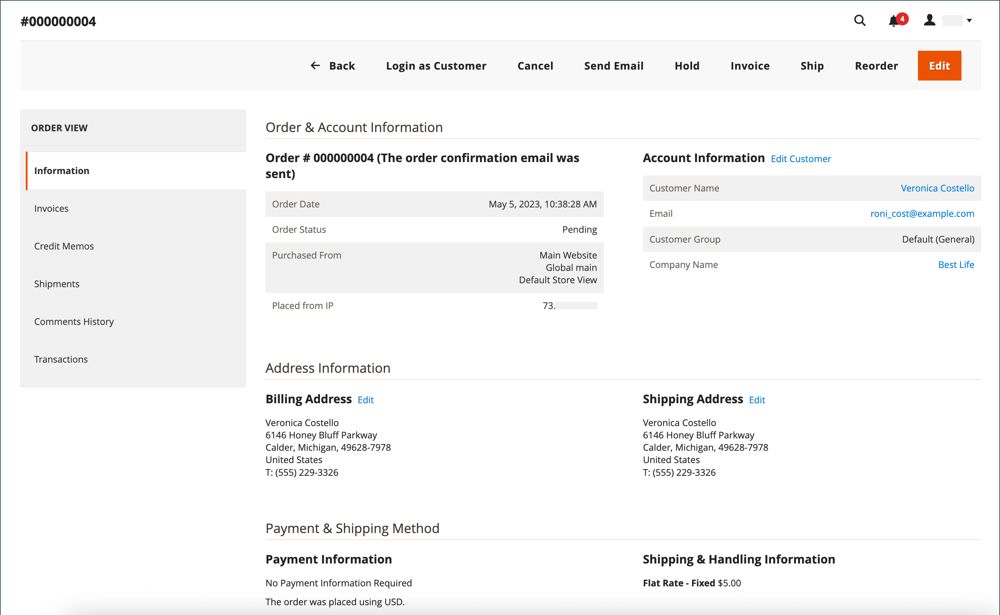
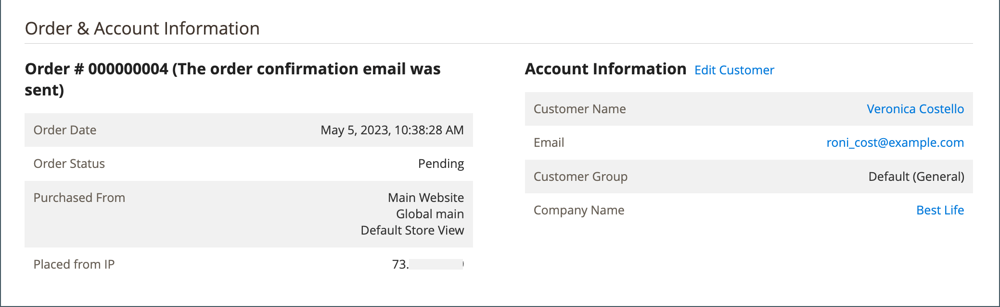
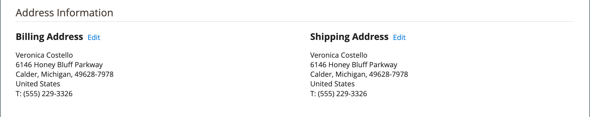
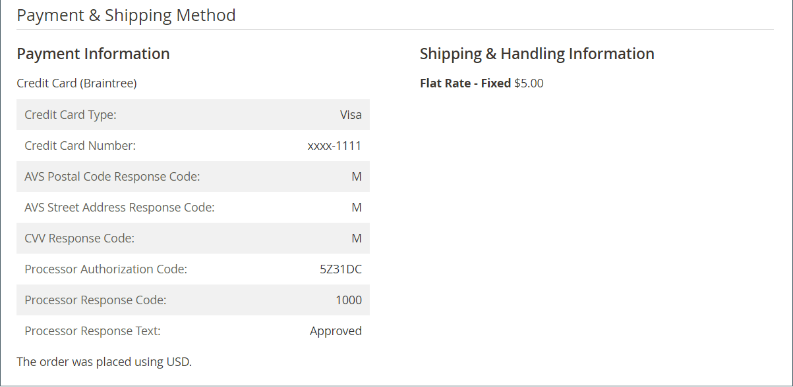
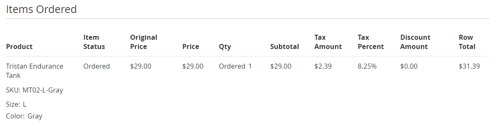
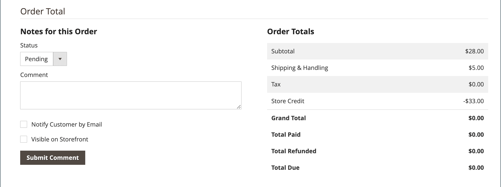

# Order workflow and processing

When a customer places an order, a sales order is created as a temporary record of the transaction. In the Orders grid, sales orders initially have a status of "Pending," and can be canceled at any time until the payment is processed. After payment is confirmed, the order can be invoiced and shipped.

**Step 1: Place Order** - The checkout process begins when the shopper clicks **[!UICONTROL Go to Checkout]** on the shopping cart page or [reorders](reorders-allow.md) directly from their customer account.

**Step 2: Order Pending** - The initial sales order status is `Pending`. In this state, the payment has not been processed and the order can still be edited or canceled. This occurs when the payment method is configured for authorization mode.

**Step 3: Receive Payment** - The order status changes to `Processing` when payment is received or authorized. Depending on the payment method, you might receive notification when the transaction is authorized or processed. This occurs automatically when the payment method is configured for capture or intent sale mode.

**Step 4: Invoice Order** - An order is typically invoiced after payment is received. The payment method determines which invoicing options are needed for the order. After the invoice is generated and submitted, a copy is sent to the customer. If the payment method is configured with the `capture` or `intent sale` payment action, an invoice is generated automatically when payment is authorized and captured.

>[!NOTE]
>
>Invoices are not created automatically for orders placed by using `Gift Card`, `Store Credit`, `Reward Points`, or other offline payment methods.

**Step 5: Book a Single Shipment** - The order status changes to `Complete` when the shipment detail is complete, the shipment is booked, and either the packing slip and shipping label are printed or the _Notify Ready for Pickup_ button is clicked (in-store delivery method). The customer receives notification and the package is shipped. If tracking numbers are used, the shipment can be tracked from the customer's account.

>[!NOTE]
>
>For details about order status and payment method configuration options, see [Order status](order-status.md) and [Payments](payments.md).

## View an order

1. On the _Admin_ sidebar, go to **[!UICONTROL Sales]** > _[!UICONTROL Operations]_ > **[!UICONTROL Orders]**.

1. Find the order in the grid.

1. In the _[!UICONTROL Action]_ column, click **[!UICONTROL View]**.

1. Check order status:

   - A `Pending` order can be modified, put on hold, canceled, or invoiced and shipped.

   - A `Processing` order can no longer edit the substance of or cancel the order, but the billing and shipping address can be edited.

   - A `Completed` order can be reordered.

The customer's email may be edited at any point in the order workflow by editing the customer. The email cannot be edited if the order was placed by a guest.

The left panel for an open order provides access to different types of information that is related to the order.

<!-- zoom -->

Example of an order with an in-store delivery method.

<!-- zoom -->

## Process an order

When a customer places an order, a sales order is created as a temporary record of the transaction. The sales order has a status of `Pending` until payment is received. While in `Pending` status, orders can be edited or canceled up until the time that payment is received and an invoice is generated. An easy way to think of it is that orders become invoices, and invoices become shipments. The Orders grid lists all orders, regardless of where they are in the workflow. To learn how to help customers with an order, see [Update an order](order-update.md).

<!-- zoom -->

To open a `Pending` order, click **[!UICONTROL Edit]** in the upper-right corner.

>[!NOTE]
>
>Orders can be edited only while in `Pending` status. The Edit button is not visible for orders in a different status or for orders that are based on a [negotiated quote](../b2b/quotes.md).

<!-- zoom -->

Review the following sections in the sales order, using the field descriptions for reference.

### Process an order

To open a `Pending` order, click **[!UICONTROL Edit]** in the upper-right corner.

>[!NOTE]
>
>Orders can be edited only while in `Pending` status. The Edit button is not visible for orders in a different status or for orders that are based on a [negotiated quote](../b2b/quotes.md).

<!-- zoom -->

Review the following sections in the sales order, using the field descriptions for reference.

### Order view descriptions

|Tab|Description|
|--- |--- |
|[!UICONTROL Information]|Display detailed information about the order and account, including the billing and shipping addresses, payment and delivery methods, items orders, totals, and notes.|
|[!UICONTROL Invoices]|Lists each invoice that is associated with the order.|
|[!UICONTROL Credit Memos]|Lists each credit memo that is associated with the order.|
|[!UICONTROL Shipments]|Lists each shipment record that is associated with the order.|
|[!UICONTROL Comments History]|Lists all notes that are related to the order.|

{style="table-layout:auto"}

>[!NOTE]
>
>An Admin user must have **[!UICONTROL Sales / Archive]** [permissions](https://docs.magento.com/user-guide/system/permissions-user-roles.html) for their role scope to see the _Invoices_, _Credit Memos_, and _Shipments_ order tabs.

### Button bar

|Button|Description|
|--- |--- |
|**[!UICONTROL Back]**|Returns to the Orders page without saving changes.|
|**[!UICONTROL Cancel]**|Cancels the sales order.|
|**[!UICONTROL Send Email]**|Sends an email about the order to the customer.|
|**[!UICONTROL Hold]** / **[!UICONTROL Unhold]**|Changes the status of the sales order to `On Hold`. To release the hold on the sales order, choose **[!UICONTROL Unhold]**.|
|**[!UICONTROL Invoice]**|Creates an invoice from the sales order by converting the order to an invoice.|
|**[!UICONTROL Ship]**|Creates a shipment record for the order.|
|**[!UICONTROL Notify Order is Ready for Pickup]**|Appears only when an order is placed as an in-store delivery. Notifies the customer that order is ready for pickup.|
|**[!UICONTROL Reorder]**|Creates a sales order based on the current order.|
|**[!UICONTROL Edit]**|Opens a pending order in edit mode. The Edit button isn't visible for orders with a status of `Processing`, or orders that are based on negotiated quotes.|

{style="table-layout:auto"}

### Cancel an order

You can [cancel](order-update.md) orders that are not yet invoiced. A [credit memo](credit-memos.md) must be issued if a customer wants to cancel an order after it is invoiced (payment is captured).

If an order is `Pending` or `Processing` and the payment is not captured or not entirely captured, you can [void the order](#void-an-order) instead of canceling it.

To restore a canceled order, click the **[!UICONTROL Reorder]** button and a new order is created with the status `Pending`.

>[!NOTE]
>
>Canceling an order also produces a void, but voiding an order does not trigger a cancellation.

### Void an order

Only sales orders that are not invoiced, have a status of `Processing`, and a [payment integration setting of `Authorize`](https://docs.magento.com/user-guide/configuration/sales/payment-methods.html#payment-actions), can be [voided](order-update.md#void-a-processing-order). After you void an order, you can cancel it.

### [!UICONTROL Order and Account Information]

<!-- zoom -->

#### Order information

|Field|Description|
|--- |--- |
|[!UICONTROL Order Number]|The order number appears at the top of the sales order, followed by a note that indicates if the confirmation email was sent.|
|[!UICONTROL Order Date]|The date and time the order was placed.|
|[!UICONTROL Purchased From]|Indicates the website, store, and store view where the order was placed.|
|[!UICONTROL Placed from IP]|Indicates the IP address of the computer from which the order was placed.|
|[!UICONTROL Order Placed from Quote]| (Available with B2B for Adobe Commerce) Indicates the [quote](../b2b/quotes.md) from which the order was generated, if applicable. The quote name is linked to the quote.|

{style="table-layout:auto"}

#### Account information

|Field|Description|
|--- |--- |
|[!UICONTROL Customer Name]|The name of the customer or buyer who placed the order. The Customer Name is linked to the customer profile.|
|[!UICONTROL Email]|The email address of the customer or buyer. The email address is linked to open a new email message.|
|[!UICONTROL Customer Group]|The name of the customer group or shared catalog to which the customer is assigned.|
|[!UICONTROL Company Name]| (Available with B2B for Adobe Commerce) The name of the company with which the buyer is associated, and on whose behalf the order is placed. The company name is linked to the [company profile](../b2b/account-companies.md).|

{style="table-layout:auto"}

### [!UICONTROL Address Information]

<!-- zoom -->

|Field|Description|
|--- |--- |
|[!UICONTROL Billing Address]|The name of the customer or buyer who placed the order, followed by the billing address, telephone number, and [VAT](vat.md), if applicable. The telephone number is linked to autodial on a mobile device.|
|[!UICONTROL Shipping Address]|The name of the person to whose attention the order should be shipped, followed by the shipping address and telephone number. The telephone number is linked to autodial on a mobile device.|

{style="table-layout:auto"}

### [!UICONTROL Payment & Shipping Method]

<!-- zoom -->

|Field|Description|
|--- |--- |
|[!UICONTROL Payment Information]|The method of payment to be used for the order, and purchase order number, if applicable, followed by the currency that was used to place the order. If the order is charged to company credit using [Payment on Account](../b2b/enable-basic-features.md#configure-payment-on-account), the amount charged to the account is indicated.|
|[!UICONTROL Shipping & Handling Information]|The shipping method to be used, and any handling fee that is applicable.|

{style="table-layout:auto"}

### Review items ordered

<!-- zoom -->

In the **[!UICONTROL Order Total]** section, do the following:

1. Enter a **[!UICONTROL Comment]** to include with the order.

1. If you want to email the comment to the customer, select the **[!UICONTROL Notify Customer by Email]** checkbox.

1. If you want the comment to be visible in the customer account, select the **[!UICONTROL Visible on Storefront]** checkbox.

   <!-- zoom -->

1. If you are ready to invoice the order, click **[!UICONTROL Invoice]** and follow the instructions to [create an invoice](invoices.md#create-an-invoice).

#### [!UICONTROL Items Ordered]

|Field|Description|
|--- |--- |
|[!UICONTROL Product]|The product name, SKU, and options if applicable.|
|[!UICONTROL Item Status]|Indicates the status of the item. Value: `Ordered`|
|[!UICONTROL Original Price]|The original catalog price of the item before discounts.|
|[!UICONTROL Price]|The purchase price of the item. This value reflects any discount applied to the item from the shared catalog, if applicable.|
|[!UICONTROL Qty]|The quantity ordered.|
|[!UICONTROL Subtotal]|The subtotal is the purchase price multiplied by the quantity.|
|[!UICONTROL Tax Amount]|The amount of tax that applies to the item as a decimal value.|
|[!UICONTROL Tax Percent]|The percentage of tax applied to this item as a percentage.|
|[!UICONTROL Discount Amount]|The discount that applies to this item. The discount value is zero if the order is based on a quote.|
|[!UICONTROL Row Total]|The line item total, including applicable taxes that are due at the product level, less discounts.|

{style="table-layout:auto"}

#### [!UICONTROL Notes for this Order]

|Field|Description|
|--- |--- |
|[!UICONTROL Status]|Displays the status of the sales order.|
|[!UICONTROL Comment]|A text box that is used to enter a comment to the customer that accompanies the order.  **[!UICONTROL Notify Customer by Email]** - Select the checkbox if you want to send the comment to the customer as a separate email.  **[!UICONTROL Visible on Storefront]** - Select the checkbox if you want the comment to be visible from the customer's account.  **[!UICONTROL Submit Comment]** - Submits the comment and sends by email, if applicable.|

{style="table-layout:auto"}

#### [!UICONTROL Order Totals]

|Field|Description|
|--- |--- |
|[!UICONTROL Shipping & Handling]|The amount charged for shipping and handling fees.|
|[!UICONTROL Tax]|The amount of tax applied to the order, if applicable.|
|[!UICONTROL Grand Total]|The order total.|
|[!UICONTROL Total Paid]|The total amount paid toward the order, if applicable.|
|[!UICONTROL Total Refunded]|The total amount refunded from the order, if applicable.|
|[!UICONTROL Total Due]|The total amount that is due.|
|[!UICONTROL Store Credit]| (Adobe Commerce only) The amount of available store credit that is applied to the order, if applicable.|
|[!UICONTROL Catalog Total Price]| (Available with B2B for Adobe Commerce) The total price of the items in the quote without tax, according to pricing in the shared catalog or standard catalog that is used as the basis of the quote. If the storefront display currency differs from the base currency, the value appears in both currencies, with the storefront display in square brackets.|
|[!UICONTROL Negotiated Discount]| (Available with B2B for Adobe Commerce) The discount that is the result of a quote negotiated between buyer and seller. If the storefront display currency differs from the base currency, the value appears in both currencies, with the storefront display in square brackets.|
|[!UICONTROL Subtotal]| (Available with B2B for Adobe Commerce) The Catalog Total Price less the Negotiated Discount.|

{style="table-layout:auto"}

## Order processing demo

Watch this video to learn about order processing and status:

>[!VIDEO](https://video.tv.adobe.com/v/343935/?quality=12)
