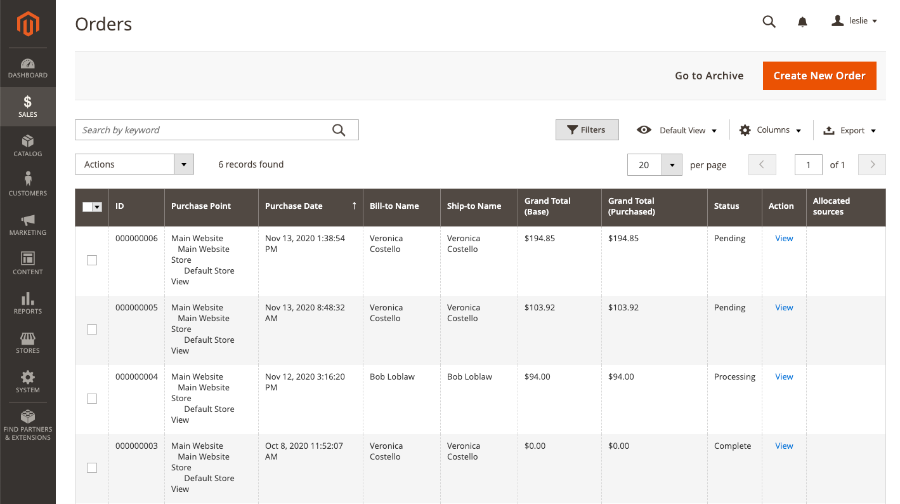

# Scheduled order operations

Use [Cron](../systems/cron.md) jobs to schedule the following order processing tasks:

{width="700" zoomable="yes"}

## Set pending payment order lifetime

The lifetime of orders with pending payments is determined by the _Orders Cron Settings_ configuration. The default value is set to 480 minutes, which is eight hours.

1. On the _Admin_ sidebar, go to **[!UICONTROL Stores]** > _[!UICONTROL Settings]_ > **[!UICONTROL Configuration]**.

1. In the left panel, expand the **[!UICONTROL Sales]** section and choose **[!UICONTROL Sales]** underneath.

1. Expand  the **[!UICONTROL Orders Cron Settings]** section.

   {width="600" zoomable="yes"}

1. For **[!UICONTROL Pending Payment Order Lifetime (minutes)]**, enter the number of minutes before a pending payment expires.

1. Click **[!UICONTROL Save Config]**.

## Enable scheduled grid updates and reindexing

The Grid Settings configuration schedules updates to the following order management grids, and reindexes the data as scheduled by [Cron](../systems/cron.md):

- [Orders](orders.md#orders-workspace)
- [Invoices](invoices.md)
- [Shipments](shipments.md)
- [Credit Memos](credit-memos.md)

By scheduling these tasks, you can avoid the locks that occur when data is saved and reduce processing time. When enabled, any updates take place only during the scheduled cron job. For best results, Cron should be configured to run once every minute.

**_To enable the updates and reindexing:_**

[!BADGE PaaS only]{type=Informative url="https://experienceleague.adobe.com/en/docs/commerce/user-guides/product-solutions" tooltip="Applies to Adobe Commerce on Cloud projects (Adobe-managed PaaS infrastructure) and on-premises projects only."} When [Production mode](https://experienceleague.adobe.com/docs/commerce-operations/configuration-guide/setup/application-modes.html#production-mode) (the default mode used in Adobe Commerce on cloud infrastructure) is enabled, run the following command:

`bin/magento config:set dev/grid/async_indexing 1`

When [Default mode](https://experienceleague.adobe.com/docs/commerce-operations/configuration-guide/setup/application-modes.html#default-mode) is enabled, complete the following steps:

1. On the _Admin_ sidebar, go to **[!UICONTROL Stores]** > _[!UICONTROL Settings]_ > **[!UICONTROL Configuration]**.

1. In the left panel, expand the **[!UICONTROL Advanced]** section and choose **[!UICONTROL Developer]**.

1. Expand  the **[!UICONTROL Grid Settings]** section.

1. Set **[!UICONTROL Asynchronous Indexing]** to `Enable`.

   {width="600" zoomable="yes"}

1. Click **[!UICONTROL Save Config]**.
