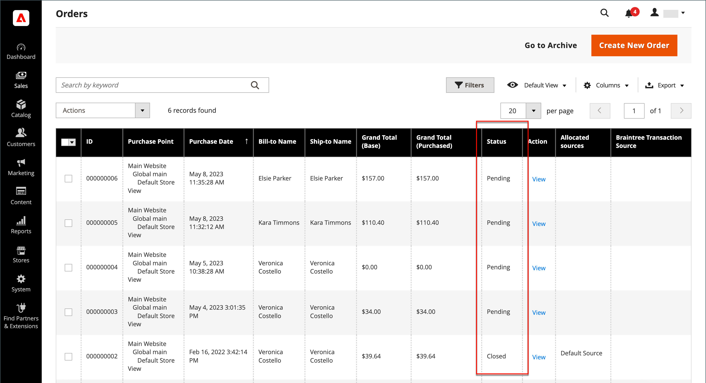
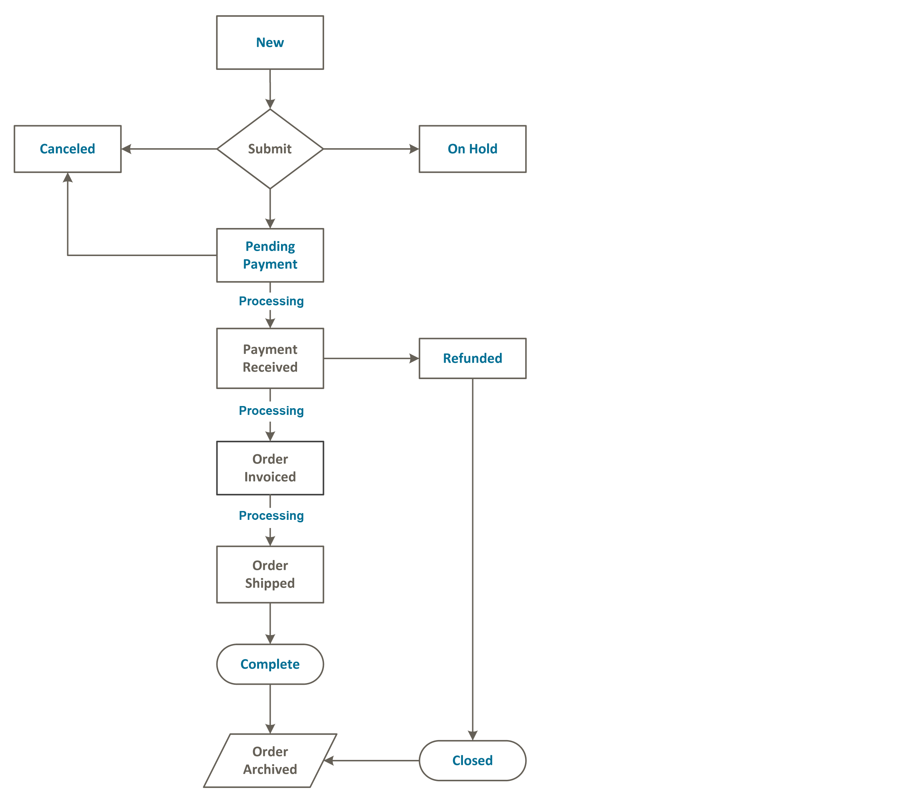
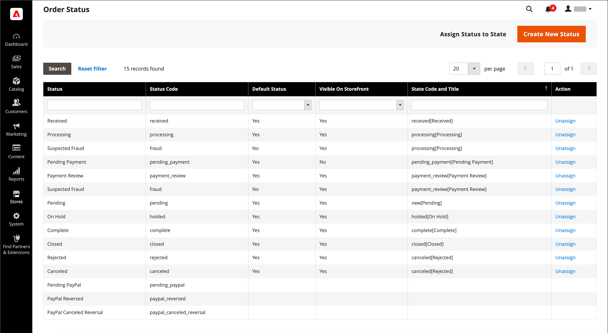
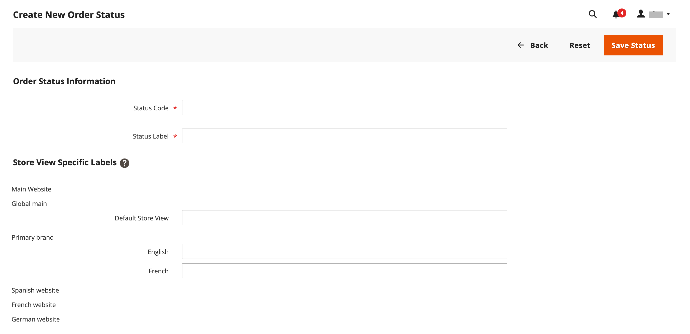
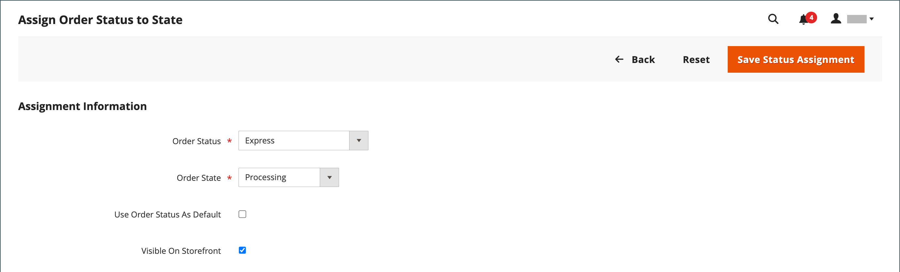
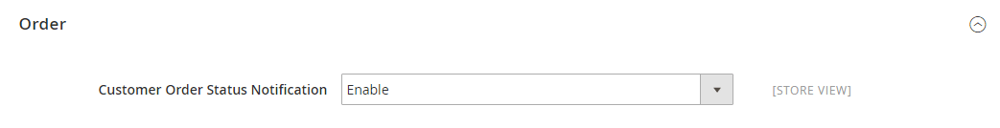

# Order status

All orders have an order status that is associated with a stage in the order processing [workflow](order-processing.md). The status of each order is shown in the _Status_ column of the _Orders_ grid. Your store has a set of predefined order status and order state settings. The order state describes the position of an order in the workflow.

{width="700" zoomable="yes"}

>[!TIP]
>
>A partially refunded order remains in `Processing` status until **_all_** ordered items (including refunded items) are shipped. The order status does not change to `Complete` when even one order item is not yet shipped.

## Order status workflow

## Predefined status

|Order Status|Status Code||
|--- |--- |--- |
|Processing|`processing`|When the state of new orders is set to 'Processing', the _Automatically Invoice All Items_ option becomes available in the configuration. Invoices are not created automatically for orders placed by using Gift Card, Store Credit, Reward Points, or other offline payment methods.|
|Suspected Fraud|`fraud`|Sometimes orders paid via PayPal or another payment gateway are marked as _Suspected Fraud_. This status means that the order does not have invoice issued and the confirmation email is also not sent.|
|Pending Payment|`pending_payment`|This status is used if the order is created and PayPal or similar payment method is used. It means that the customer was directed to the payment gateway website, but no return information has been received yet. This status changes when customer pays.|
|Payment Review|`payment_review`|This status appears when PayPal payment review is turned on.|
|Pending|`pending`|This status indicates that no invoice and shipments have been submitted.|
|On Hold|`holded`|This status can only be assigned manually. You can put any order on hold.|
|Open|`STATE_OPEN`|This status means that an order or credit memo is still open and may need further action.|
|Complete|`complete`|This status means that the order is created, paid,  and shipped to customer.|
|Closed|`closed`|This status indicates that an order was assigned a credit memo and the customer has received a refund.|
|Canceled|`canceled`|This status is assigned manually in the Admin or, for some payment gateways, when the customer does not pay within the specified time.|
|PayPal Canceled Reversal|`paypay_canceled_reversal`|This status means that PayPal canceled the reversal.|
|Pending PayPal|`pending_paypal`|This status means that the order was received by PayPal, but payment has not yet been processed.|
|PayPal Reversed|`paypal_reversed`|This status means that PayPal reversed the transaction.|

{style="table-layout:auto"}

## Custom order status

In addition to the preset order status settings, you can create your own custom order status settings, assign them to order states, and set a default order status for order states. The order state indicates the position of the order within the order processing workflow and the order status defines the state of the order. For example, you might need a custom order status such as `packaging"`, `backordered`, or a status that is specific to your needs. You can create a descriptive name for the custom status and assign it to the associated order state in the workflow.

>[!NOTE]
>
>Only default custom order status values are used in the order workflow. Custom status values that are not set as default can be used only in the comments section of the order.

{width="700" zoomable="yes"}

### Create a custom order status

1. On the _Admin_ sidebar, go to **[!UICONTROL Stores]** > _[!UICONTROL Settings]_ > **[!UICONTROL Order Status]**.

1. In the upper-right corner, click **[!UICONTROL Create New Status]**.

   {width="600" zoomable="yes"}

1. Update the _[!UICONTROL Order Status Information]_ section:

   - Enter a **[!UICONTROL Status Code]** for internal reference. The first character must be a letter (a-z), and the rest can be any combination of letters and numbers (0-9). Use the underscore character instead of a space.

   - For **[!UICONTROL Status Label]**, enter a label that identifies the status setting in both the Admin and storefront.

1. In the _[!UICONTROL Store View Specific Labels]_ section, enter any labels that are needed for different store views.

1. Click **[!UICONTROL Save Status]**.

### Assign an order status to a state

1. On the _Order Status_ page, click **[!UICONTROL Assign Status to State]**.

   {width="600" zoomable="yes"}

1. Update the **[!UICONTROL Assignment Information]** section, do the following:

   - Choose the **[!UICONTROL Order Status]** that you want to assign. They are listed by status label.

   - Set **[!UICONTROL Order State]** to the place in the workflow where the order status belongs.

      >[!NOTE]
      >
      >**_[!UICONTROL Order State]_** list includes the default assigned order statuses. For example, the `Pending` default order status is displayed instead of the `New` order state value.

   - To make this status the default for the order state, select the **[!UICONTROL Use Order Status as Default]** checkbox.

      >[!NOTE]
      >
      >Only the default order statuses are used in the order workflow. Non-default statuses can only be set in the **[!UICONTROL Order Comments]** section in the Admin.

   - To make this status visible from the storefront, select the **[!UICONTROL Visible On Storefront]** checkbox.

   {width="600" zoomable="yes"}

1. Click **[!UICONTROL Save Status Assignment]**.

### Edit an existing order status

1. In the _[!UICONTROL Order Status]_ grid, open the status record in edit mode.

1. Update the status settings as needed.

1. Click **[!UICONTROL Save Status]**.

### Remove an order status from an assigned state

>[!NOTE]
>
>A status setting cannot be unassigned from a state if the status is in use.

1. In the _[!UICONTROL Order Status]_ grid, find the order status record to be unassigned.

1. In the _[!UICONTROL Action]_ column on the far right of the row, click the **[!UICONTROL Unassign]** link.

   A message appears at the top of the workspace that the order status has been unassigned. Although the order status label still appears in the list, it is no longer assigned to a state. Order status settings cannot be deleted.

>[!NOTE]
>
>If the default order status is unassigned from the order state, _**another**_ order status is _**set  automatically**_ as a default for this order state.

## Notification

Customers can track the status of their orders by [RSS feed](../merchandising-promotions/social-rss.md) if the Order RSS feed is enabled in the configuration. When enabled, a link to the RSS feed appears on each order.

### Enable order status notification

1. On the _Admin_ sidebar, go to **[!UICONTROL Stores]** > _[!UICONTROL Settings]_ > **[!UICONTROL Configuration]**.

1. In the left panel, expand **[!UICONTROL Catalog]** and choose **[!UICONTROL RSS Feeds]** underneath.

1. Expand  the **[!UICONTROL Order]** section.

1. Set **[!UICONTROL Customer Order Status Notification]** to `Enable`.

   {width="600" zoomable="yes"}

1. When complete, click **[!UICONTROL Save Config]**.

### Configure new order email notifications

1. On the _Admin_ sidebar, go to **[!UICONTROL Stores]** > _[!UICONTROL Settings]_ > **[!UICONTROL Configuration]**.

1. In the left panel, expand **[!UICONTROL Sales]** and choose **[!UICONTROL Sales Emails]** underneath.

1. Expand  the **[!UICONTROL Order]** section.

   {width="600" zoomable="yes"}

1. Set **[!UICONTROL New Order Confirmation Email Sender]** to one of the following:

    - `General Contact`
    - `Sales Representative`
    - `Customer Support`
    - `Custom Email 1`
    - `Custom Email 2`

1. Choose the templates that you want to use for each customer type:

    - **[!UICONTROL New Order Confirmation Template]** - Choose a template to use for customers with a registered store account.
    - **[!UICONTROL New Order Confirmation Template for Guest]** - Choose a template to use for guest customers without a registered store account.

1. To notify another person (such as a business manager) about the new order, enter the email address to **[!UICONTROL Send Order Email Copy To]**.

   You can add multiple email addresses if more than one recipient is required.

1. Set the **[!UICONTROL Send Order Email Copy Method]** to one of the following:

   - `Bcc` - Only one email about the new order is sent to both customer and the additional recipient, but the customer does not see that the email they received was also sent to the additional recipient.
   - `Separate Email` - Two separate emails are sent---one to the recipient and one to the customer.

1. When complete, click **[!UICONTROL Save Config]**.
