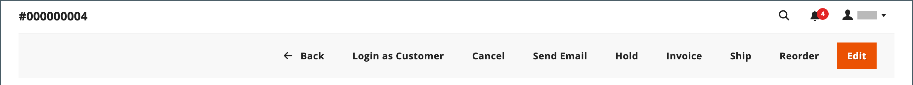
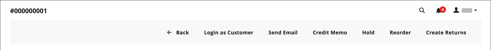
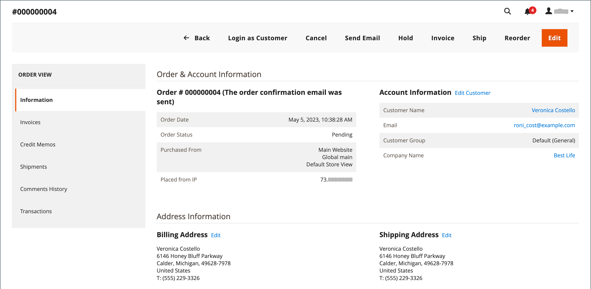

# Update an order

When helping a customer who has placed an order, you must determine the status of the order. The available options for a `Pending` order are different from the options for a `Processing` order. For more information, see [Process an order](order-processing.md).

## Pending orders

After a customer places an order, but before the payment is received, the order is in `Pending` status. You can edit the order, place it on hold, or cancel it entirely. The button bar of a pending order lists the available actions for an order.

{width="600" zoomable="yes"}

If you modify substantial parts of an order, the original order is canceled and a new order is generated. You can, however, change the billing or shipping address without generating a new order.

|Button|Description|
|--- |--- |
|**[!UICONTROL Back]**|Returns to the Orders page without saving changes.|
|**[!UICONTROL Login as Customer]**|Allows an admin user to assist customers with their orders.|
|**[!UICONTROL Cancel]**|Cancels the pending order.|
|**[!UICONTROL Send Email]**|Sends an email about the pending order to the customer.|
|**[!UICONTROL Hold]** / **[!UICONTROL Unhold]**|Changes the status of the pending order to `On Hold`. To release the hold, choose _[!UICONTROL Unhold]_.|
|**[!UICONTROL Invoice]**|Creates an [invoice](invoices.md#create-an-invoice) from the pending order by converting the order to an invoice, and changes the order status to `processing`.|
|**[!UICONTROL Ship]**|Creates a [shipment](shipments.md#create-a-shipment) record for the order.|
|**[!UICONTROL Reorder]**|Creates a new pending order that is a duplicate of the current pending order.|
|**[!UICONTROL Edit]**|Opens a pending order in edit mode. The Edit button is only available for pending orders, or for orders based on negotiated [quotes](../b2b/quotes.md).|

{style="table-layout:auto"}

## Processing orders

An order enters a `Processing` state when:

* The payment for an order is received/captured and the invoice is generated--when the payment action is set to `Authorize and Capture`.
* An order transaction is authorized, but payment is not yet captured--when the payment action is set to `Authorize`.

The [payment action configuration](../configuration-reference/sales/payment-methods.md#payment-actions) determines which order actions are available after an order is created.

You cannot substantially change a `Processing` order, but you can edit the billing and shipping address.

{width="600" zoomable="yes"}

>[!NOTE]
>
>When the payment action of the payment method is set to `Authorize and Capture`, an invoice is automatically created when the customer places an order. In this circumstance, you can refund funds using a [credit memo](credit-memo-create.md), but cannot [cancel](#cancel-a-pending-order) or [void](#void-a-processing-order) the order.

|Button|Description|
|--- |--- |
|**[!UICONTROL Back]**|Returns to the Orders page without saving changes.|
|**[!UICONTROL Send Email]**|Sends an email about the order to the customer.|
|**[!UICONTROL Void]**|[Voids](#void-a-processing-order) an order transaction, or a partial order transaction.|
|**[!UICONTROL Credit Memo]**|Initiates the process to create a [credit memo](credit-memo-create.md).|
|**[!UICONTROL Hold]** / **[!UICONTROL Unhold]**|Changes the status of the sales order to `On Hold`. To release the hold on the sales order, choose _[!UICONTROL Unhold]_.|
|**[!UICONTROL Reorder]**|Creates a new pending order based on the current order.|
|**[!UICONTROL Create Returns]**| (Adobe Commerce only) Initiates the process to [return](returns.md) one or more items from the order.|

{style="table-layout:auto"}

## Void a processing order

When an order is still in a `Processing` status and the payment integration is set to `Authorize` (not `Authorize and Capture`), you can only void a transaction or cancel an order. [Canceling an order](#cancel-a-pending-order) also voids the authorization.

When an order is placed using a payment method with the payment action set to `Authorize and Capture` you can refund the funds via credit memo,  but cannot cancel it because it is invoiced and payment is captured.

Your payment method determines your available payment actions. See [Payment actions](../configuration-reference/sales/payment-methods.md#payment-actions) for more information.

**_To void an order:_**

1. On the _Admin_ sidebar, go to **[!UICONTROL Sales]** > _[!UICONTROL Operations]_  > **[!UICONTROL Orders]**.

1. In the **[!UICONTROL Action]** column for the order to be edited, click **[!UICONTROL View]**.

1. Click **[!UICONTROL Void]** to void the order.

1. At the prompt, click **[!UICONTROL OK]** to void the order.

You can issue any needed refunds using a [credit memo](credit-memo-create.md) after funds have been captured. You can also create a [return merchandise authorization (RMA)](returns.md) issued for product returns. To learn more, see [Processing an Order](order-processing.md).

## Edit a pending order

1. On the _Admin_ sidebar, go to **[!UICONTROL Sales]** > _[!UICONTROL Operations]_  > **[!UICONTROL Orders]**.

1. In the **[!UICONTROL Action]** column for the order to be edited, click **[!UICONTROL View]**.

1. Click **[!UICONTROL Edit]**.

    {width="600" zoomable="yes"}

1. At the prompt, click **[!UICONTROL OK]** to continue editing.

1. Update the order as needed.

1. Apply your changes:
   * To save changes made to the billing or shipping address, click **[!UICONTROL Save]**.
   * To save changes made to line items, and reprocess the order, click **[!UICONTROL Submit Order]**.

## Place an order on hold

If the customer's preferred method of payment is not available or if the item is temporarily out of stock, you can place the order on hold.

1. In the _Orders_ grid, find the `Pending` order that you want to place on hold.

1. In the _Action_ column, click **[!UICONTROL View]**.

1. Click **[!UICONTROL Hold]** to place the order on hold.

To remove the hold on an order, edit the order again and click **[!UICONTROL Unhold]**.

## Cancel a pending order

Canceling an order changes its status from `Pending` to `Canceled`.

1. In the _[!UICONTROL Orders]_ grid, find the pending order to be canceled.

1. In the _[!UICONTROL Action]_ column, click **[!UICONTROL View]**.

1. Click **[!UICONTROL Cancel]** to cancel the order.

The status of the order is now `Canceled`.
