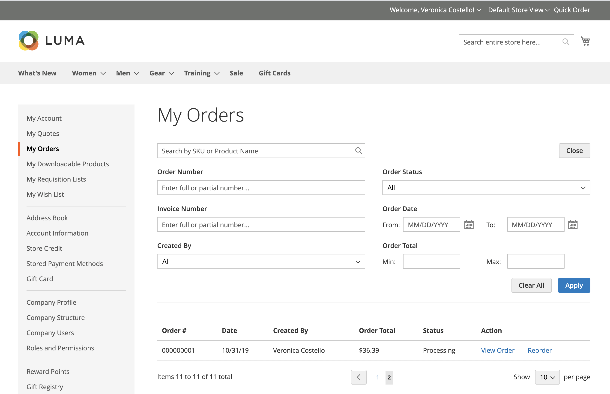
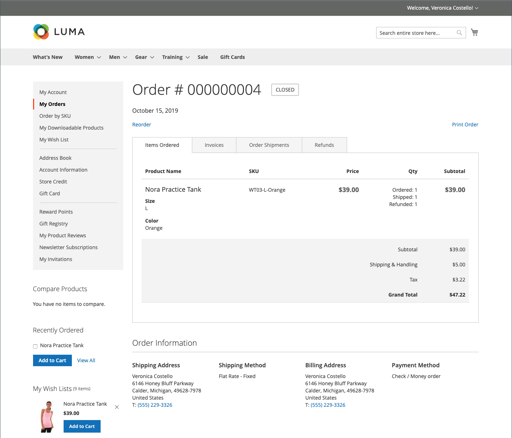
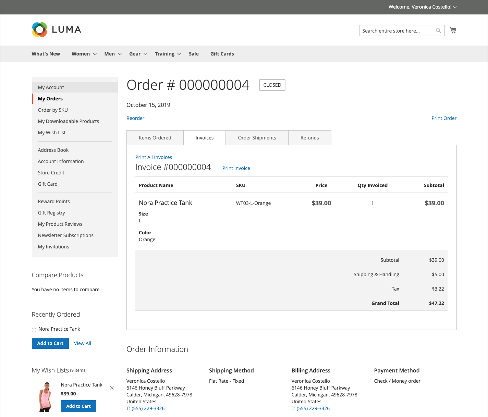
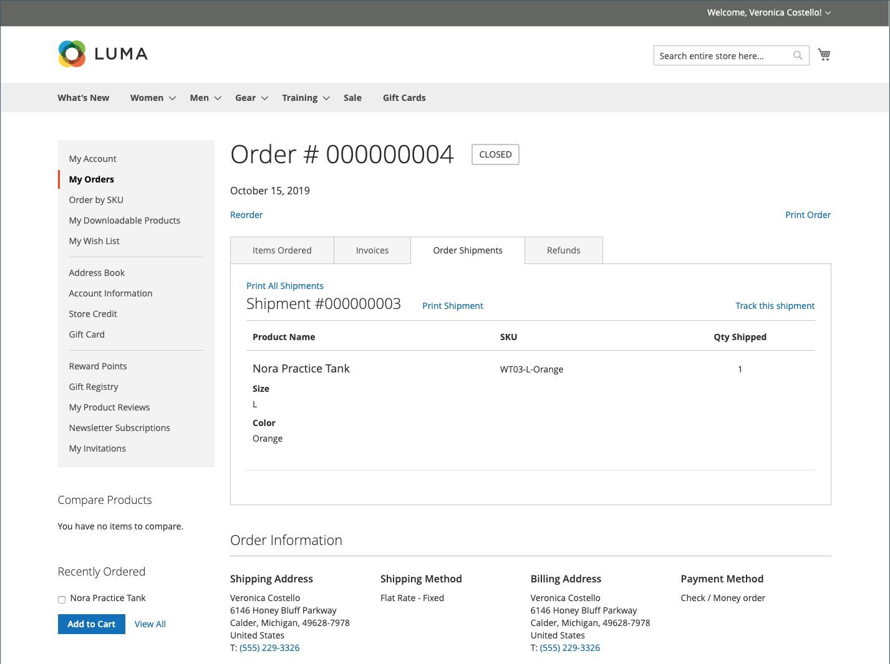
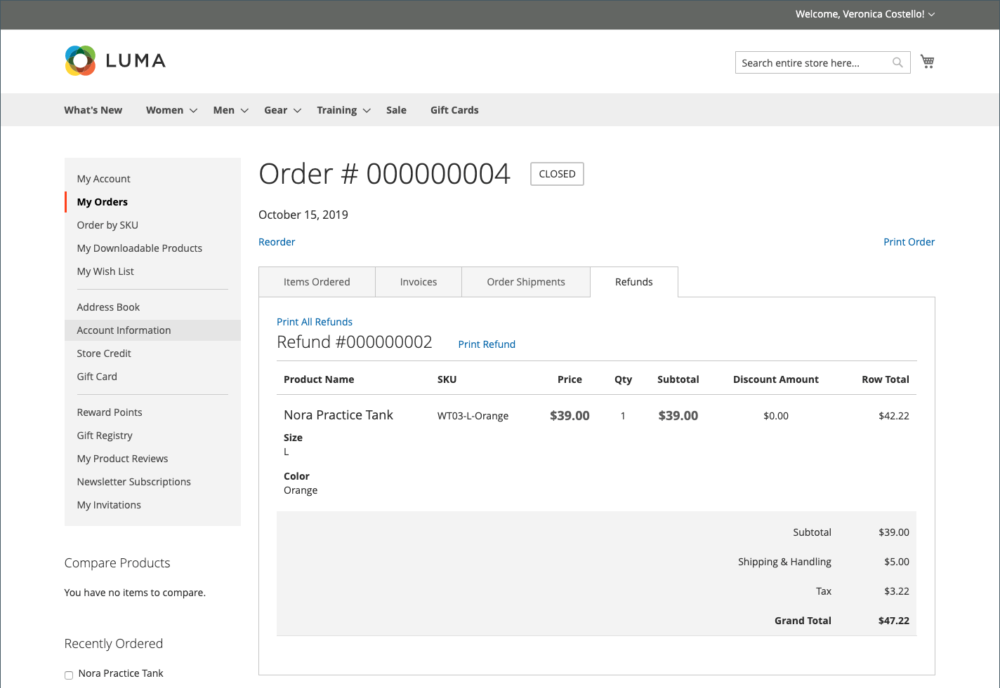
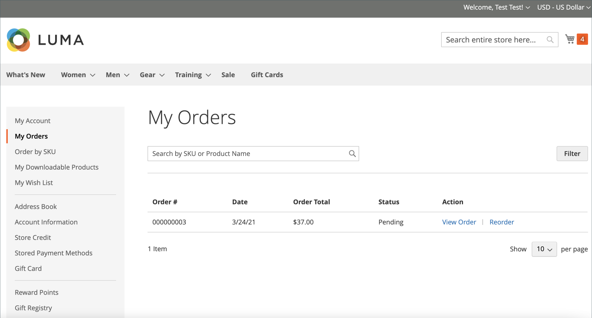
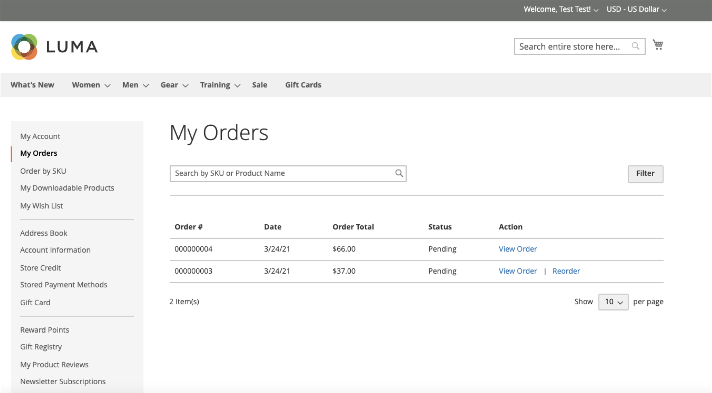

# Storefront order management

Customers have access to all of their orders from their account. Orders can be viewed, filtered, tracked, and resubmitted as new orders. Depending on the status of the order, customers can print their orders, invoices, shipments, and refund records.

## Filter orders

{{b2b-feature}}

Your initial _[!UICONTROL My Orders]_ results also contain matching orders from subordinate users from all websites within the commerce instance. A customer that is associated with a company account can filter the orders list to quickly find records within the results. To show the filter options, the customer clicks **[!UICONTROL Filter]**, and clicks **[!UICONTROL Close]** to hide the filters.

<!-- zoom -->

| Filter | Description |
| ------ | ----------- |
| [!UICONTROL SKU or Product Name] | Enters either a SKU or product name. |
| [!UICONTROL Order Number] | Can be either a full or partial order number. |
| [!UICONTROL Order Status] | Chooses a value from the dropdown to filter by status. |
| [!UICONTROL Invoice Number] | Enters either a full or partial invoice number. |
| [!UICONTROL Order Date] | Sets one or both date fields to filter by order date. |
| [!UICONTROL Created by] | Filters company orders by the order creator. |
| [!UICONTROL Order Total] | Sets min, max, or both values to filter by order total. |

## View an order

A customer finds the order in the list and clicks **[!UICONTROL View Order]**. From the open order, they can do any of the following:

<!-- zoom -->

### View recently ordered products

The **[!UICONTROL Recent Orders]** block is displayed in the sidebar and on the **[!UICONTROL My Account]** page for customers who are logged in after placing an order. It displays five products from the last purchase.

The customer can re-add products to the cart by selecting the products and clicking **[!UICONTROL Add to Cart]**. They can also view the last order by clicking **[!UICONTROL View all]**, which redirects to the _[!UICONTROL My Account]_ page and the **[!UICONTROL Recent Orders]** block.

### Print order

1. The customer clicks **[!UICONTROL Print Order]**.

1. Follows the instructions in the Print dialog to complete the printing.

### Print invoices

1. On the **[!UICONTROL Invoices]** tab, the customer clicks one of the following:

   - **[!UICONTROL Print All Invoices]**

   - **[!UICONTROL Print Invoice]**

   <!-- zoom -->

1. Uses the Print dialog to complete the printing.

### Print shipments

1. On the **[!UICONTROL Order Shipments]** tab, the customer clicks one of the following:

   - **[!UICONTROL Print All Shipments]**

   - **[!UICONTROL Print Shipment]**

   <!-- zoom -->

1. Uses the Print dialog to complete the printing.

### Track a shipment

1. On the **[!UICONTROL Order Shipments]** tab, click **[!UICONTROL Track this Shipment]**.

   Any tracking information that is available appears in a popup window.

1. When ready, the customer clicks **[!UICONTROL Close Window]**.

### Print refunds

1. On the **Refunds** tab, the customer clicks one of the following:

   - **Print All Refunds**

   - **Print Refund**

   <!-- zoom -->

1. Uses the Print dialog to complete the printing.

Reorders are available to customers when the [_Allow Reorder_]() configuration option is enabled.

A customer can initiate the reorder functionality for a specific order from two pages:

- My Orders page
- Order View page

## Reorders

The _[!UICONTROL Reorder]_ link is displayed in the list with orders near the _[!UICONTROL View]_ link.

<!-- zoom -->

**Case 1.** All products from the order are available for reorder

The customer is redirected to the shopping cart, and all products are added to the cart.

**Case 2.** Some/all products from the order are not available for reorder

>[!NOTE]
>
>It is possible to reorder `Not Visible Individually` products.

The _[!UICONTROL Reorder]_ link does not appear on the _[!UICONTROL My Orders]_ and _[!UICONTROL View Order]_ pages.

<!-- zoom -->

>[!TIP]
>
>If the cart is not empty and the customer clicks **[!UICONTROL Reorder]** (from the [!UICONTROL My Orders] or [!UICONTROL Order View] page), the existing products remain in the cart with the added reorder products.
