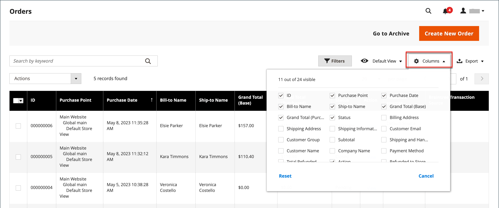
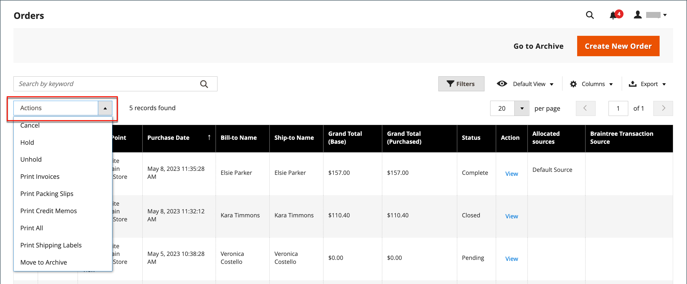
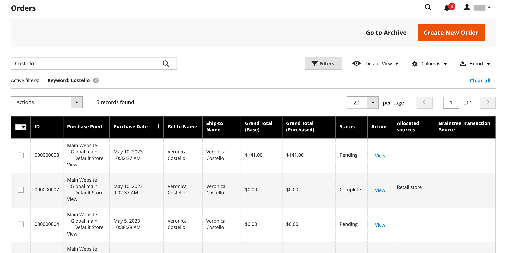
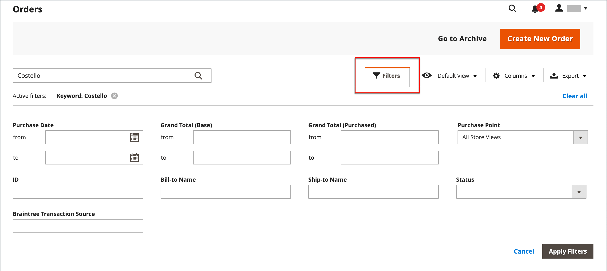

# Orders

The _Orders_ grid lists all current orders and tracks their progress and [order status](order-status.md) through the [workflow](order-processing.md). An easy way to understand the basic process is that an order becomes an [invoice](invoices.md), and an invoice becomes a [shipment](shipments.md). The grid represents the first stage of the process, and is where you can [update](order-update.md) existing orders and create orders.

Usually, orders are created when customers complete the checkout process from the storefront. However, if a customer needs assistance, you can also access their [shopping cart](shopping-assisted-cart-manage.md) or [create an order](customer-account-create-order.md) either from the _Orders_ grid or directly from their customer account.

## Orders workspace

The Orders workspace lists all current orders, and gives you the ability to edit existing orders and [create](customer-account-create-order.md) orders. Each row in the grid represents a customer order, and each column represents an attribute, or data field. Use the standard [controls](../getting-started/admin-grid-controls.md) to sort and filter the list, find orders, and apply [actions](../getting-started/admin-actions-control.md) to selected orders. Use the tabs above the pagination controls to filter the list, change the default view, change and rearrange columns, and export data.

<!-- zoom -->

### Grid layout

The selection of columns and their order in the grid can be changed according to your preference. The new layout can be saved as a grid _view_. By default, only nine of 20 available columns are included in the grid.

<!-- zoom -->

#### Change the column selection

In the upper-right corner, click the **Columns** (  ) control and do the following:

- Select the checkbox of any column that you want to add to the grid.
- Clear the checkbox of any column that you want to remove from the grid.

#### Reset the column selection

1. Click the **Columns** (  ) control.

1. To reset the grid columns, click **Reset**.

   The grid layout changes to display only [default columns](#column-descriptions).
   
#### Move a column

1. Click and hold the header of the column.

1. Drag the column to the new position and release.

#### Save a grid view

1. Click the **View** (  ) control.

1. Click **Save Current View**.

1. Enter a **name** for the view.

1. Click the arrow (  ) to save all changes.

    The name of the view now appears as the current view.

#### Change the view

Click the **View** (  ) control. Then, do one of the following:

- To use a different view, click the name of the view.

- To change the name of a view, click the **Edit** (  ) icon. Then, update the name.

### Workspace controls

|Control|Description|
|--- |--- |
|Create New Order|Creates an order. See [Creating an Order](customer-account-create-order.md) for more information.|
|Go to Archive|Displays the list of archived orders.|
|Search|Initiates a search for orders based on the current filters.|
|Filters|Defines a set of search parameters used to filter the records that appear in the grid.|
|Default View|Determines the default column layout of the grid.|
|Columns|Determines the selection of columns and their order in the grid. The column layout can be changed and saved as a _view_. By default, only some of the columns are included in the grid.|
|Export|Exports the selected records as a CSV or Excel XML file.|

{style="table-layout:auto"}

### Actions

To apply an action to specific orders, mark the checkbox in the first column of each order. To select or deselect all orders, use the control at the top of the column.

<!-- zoom -->

|Control|Description|
|--- |--- |
|Actions|Lists all actions that can be applied to selected orders. To apply an action to an order or group of orders, select the checkbox in the first column of each order.  Order actions: Cancel / Hold / Unhold / Print [Invoices](invoices.md) / Print [Packing Slips](https://docs.magento.com/user-guide/marketing/sales-document-pdf-logo.html) / Print [Credit Memos](credit-memos.md) / Print All / Print [Shipping Labels](shipping-labels.md) / Move to [Archive](order-archive.md)  (Adobe Commerce only)|
|Mass Actions|Can be used to select multiple records as the target of action. Select the checkbox in the first column of each record that is subject to the action. Options: Select All / Unselect All / Select Visible / Unselect Visible|
|Submit|Applies the current action to the selected order records.|
|Edit|Opens the order in edit mode.|

{style="table-layout:auto"}

### Column descriptions

|Column|Description|
|--- |--- |
|Select|Select the checkbox to select the quotes to be subject to an action, or use the selection control in the column header. Options: Select All / Deselect All|
|ID|A unique, sequential number that is assigned when a new order is saved for the first time.|
|Purchase Point|Identifies the store view where the order was placed.|
|Purchase Date|The date and time when the order was placed. It is always displayed according to the default time zone.|
|Bill-to Name|The name of the person who is responsible to pay for the order.|
|Ship-to Name|The name of the person to whom the order is to be shipped.|
|Grand Total (Base)|The grand total of the order.|
|Grand Total (Purchased)|The grand total of products purchased in the order.|
|Status|The current order status.|
|Action|_View_ opens the order in edit mode.|
|Allocated sources| The sources allocated to that specific order.|

{style="table-layout:auto"}

Additional columns available:

|Column|Description|
|--- |--- |
|Billing Address|The billing address of the customer who placed the order.|
|Shipping Address|The address where the order is to be shipped.|
|Shipping Information|The method that is to be used to ship the order.|
|Customer Email|The email address of the person who placed the order.|
|Customer Group|The customer group to which the person who placed the order is assigned.|
|Subtotal|The order subtotal, without shipping and handling, and tax.|
|Shipping and Handling|The amount charged for shipping and handling.|
|Customer Name|The first and last name of the customer who placed the order.|
|Payment Method|The method of payment to be used for the order.|
|Total Refunded|Any amount from the order that is to be refunded to the customer.|
|Refunded to Store Credit| (Adobe Commerce only) Any amount from the order that is to be refunded to the customer's store credit.|
|Company Name| (Available with B2B for Adobe Commerce) The name of the company who placed the order.|

{style="table-layout:auto"}

## Order search

The Search box in the upper left of the Orders grid can be used to find specific orders by keyword, or by filtering the order records in the grid.

<!-- zoom -->

### Search for a match

1. Enter a search term into the page search box.

1. Click _Search_ (  ) to display the results.

### Filter the search

1. Click the _Filters_ (  ) tab to display the selection of search filters.

1. Complete as many of the filters as needed to describe the orders that you want to find.

1. Click **Apply Filters** to display the results.

   <!-- zoom -->

### Search filters

|Filter|Description|
|--- |--- |
|Purchase Date|Filters the search based on the date purchased. To find orders within a range of dates, enter both the **from** and **to** dates.|
|ID|Filters the search based on order ID.|
|Grand Total (Base)|Filters the search based on the Grand Total of each order, which includes any credits applied to the order.|
|Grand Total (Purchased)|Filters the search based on Grand Total of items purchased in each order.|
|Bill-to Name|Filters the search according to the name of the person who is responsible to pay for the order.|
|Ship-to Name|Filters the search according to name of the person to whom each order is shipped .|
|Purchase Point|Filters the search by website, store, or store view where the order was placed.|
|Status|Filters the search based on order status. Options: Canceled / Closed / Complete / Suspected Fraud / On Hold / Payment Review / PayPal Canceled Reversal / PayPal Reversed / Pending / Pending Payment / Pending PayPal / Processing|
|Braintree Transaction Source|Filters the search based on transaction source.|

{style="table-layout:auto"}

### Search tools

|Tool|Description|
|--- |--- |
|Apply Filters|Applies all filters to the search results.|
|Cancel|Cancels the current search.|
|Clear All|Clears all search filters.|

{style="table-layout:auto"}

## Troubleshooting resources

For help with troubleshooting order issues, see the following Commerce Support articles:

- [Virtual product multi-ship orders](https://support.magento.com/hc/en-us/articles/360044461831)
- [Orders display error](https://support.magento.com/hc/en-us/articles/360046802271)
- [PayPal duplicate orders 10415 error](https://support.magento.com/hc/en-us/articles/360050572151)
- [New orders are sent to archive](https://support.magento.com/hc/en-us/articles/360026405051)
- [Orders not displayed in the Orders grid in the Admin](https://support.magento.com/hc/en-us/articles/360025277272)
- [Order status - incorrect shipment created via REST API](https://support.magento.com/hc/en-us/articles/360050518952)