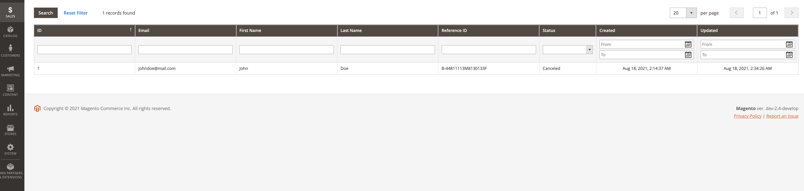
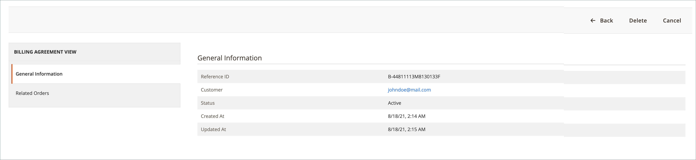
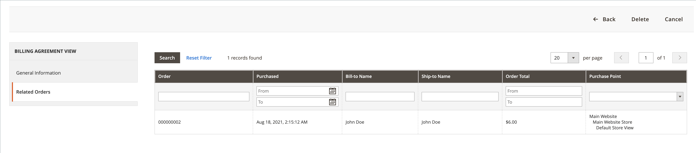

# PayPal billing agreements

To simplify the checkout process, customers can enter into a billing agreement with PayPal as the payment service provider. During checkout, the customer chooses the billing agreement as the payment method. The payment system verifies the billing agreement by its unique number and charges the customer account. With a billing agreement in place, it is no longer necessary for the customer to enter payment information for each purchase. Customers can manage their billing agreements from the dashboard of their customer account, where the status of each is shown as _Active_ or _Canceled_. When a billing agreement is canceled, it cannot be reactivated.

## Billing agreement workflow

1. **Customer signs up for a billing agreement**. After a billing agreement is in place, additional billing agreements can be added only from the customer account. There is no limit to the number of billing agreements that a customer can create. Customers can use any of the following methods to sign up for billing agreements:

   - **Sign up in customer account** - Customers can sign up for a billing agreement from their customer accounts.
   - **Sign up at checkout** - Customers who pay for a purchase with PayPal Express Checkout can  mark a checkbox to create a billing agreement. Although the billing agreement is not used for the current order, it becomes available as a payment method option the next time the customer places an order.   
   - **Sign up by store administrator** - Upon customer request, the store administrator can create a sales order using the customer billing agreement.

1. **PayPal verifies and records agreement**. When the customer places the order with payment by billing agreement, the billing agreement reference ID and sales order payment details are transferred to PayPal and recorded in the customer account, along with reference information. If the payment is authorized, an order is created in Commerce. The billing agreement reference ID is sent to the customer and to the store.

## Manage billing agreements

The _[!UICONTROL Billing Agreements]_ page lists all billing agreements between your store and its customers. Merchants can filter the records by the customer or billing agreement information including billing agreement reference ID, status, and creation date. Each record includes general information about the billing agreement, and all sales orders that have used it as a payment method. You can view, cancel, or delete customer billing agreements. A canceled billing agreement can be deleted only by the store administrator.

<!-- zoom -->

### View a billing agreement

1. On the _Admin_ sidebar, go to **[!UICONTROL Sales]** > _[!UICONTROL Operations]_ > **[!UICONTROL Billing Agreements]**.

1. Find the billing agreement in the list and click to open it.

Each billing agreement page consists of two tabs: _[!UICONTROL General Information]_ and _[!UICONTROL Related Orders]_.

#### General Information

This tab includes the general information about the billing agreement:

- [!UICONTROL Reference ID]: A unique numeric identifier that is assigned to current billing agreement.
- [!UICONTROL Customer]: Customer's account assigned to current billing agreement.
- [!UICONTROL Status]: Payment agreement status.
- [!UICONTROL Created At]: Creation date.
- [!UICONTROL Updated At]: Update date.

<!-- zoom -->

#### Related Orders

This tab displays the list of the orders placed using the current billing agreement.

<!-- zoom -->

### Cancel a billing agreement

1. On the _Admin_ sidebar, go to **[!UICONTROL Sales]** > _[!UICONTROL Operations]_ > **[!UICONTROL Billing Agreements]**.

1. Find the billing agreement in the list and click to open it.

1. In the top-right corner, click **[!UICONTROL Cancel]**.

1. To confirm the action, click **[!UICONTROL OK]**.

### Delete a billing agreement

1. On the _Admin_ sidebar, go to **[!UICONTROL Sales]** > _[!UICONTROL Operations]_ > **[!UICONTROL Billing Agreements]**.

1. Find the billing agreement in the list and click to open it.

1. In the top-right corner, click **[!UICONTROL Delete]**.

1. To confirm the action, click **[!UICONTROL OK]**.

### Column descriptions

|Column|Description|
|--- |--- |
|[!UICONTROL ID]|A unique numeric identifier that is assigned to each billing agreement|
|[!UICONTROL Email]|A customer's contact email|
|[!UICONTROL First Name]|A customer's first name|
|[!UICONTROL Last Name]|A customer's last name|
|[!UICONTROL Reference ID]|A unique, numeric reference identifier that is assigned to each billing agreement|
|[!UICONTROL Status]|Payment agreement status. Options: `Active` or `Canceled`|
|[!UICONTROL Created]|Creation date|
|[!UICONTROL Updated]|Update date|

{style="table-layout:auto"}
