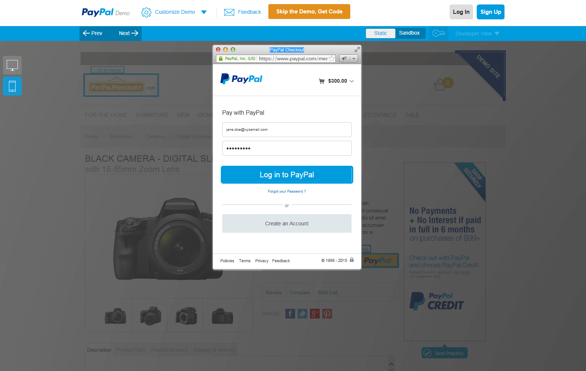
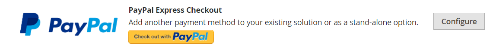
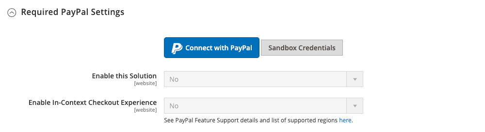
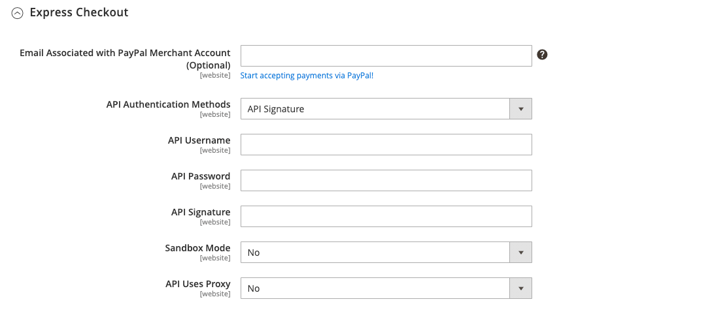
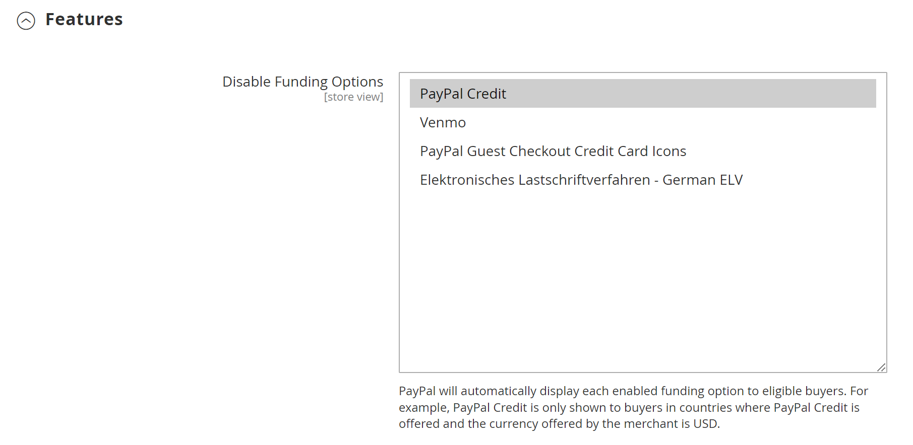

# PayPal Express Checkout

PayPal Express Checkout helps boost sales by giving your customers the ability to pay by credit card or from the security of their personal PayPal accounts. During checkout, the customer is redirected to the secure PayPal site to complete the payment information. The customer is then returned to your store to complete the remainder of the checkout process. Choosing Express Checkout adds the familiar PayPal button to your store, which has been reported to increase sales.

>[!IMPORTANT]
>
>**PSD2 Requirements:**  
>As of September 14, 2019, European banks might decline payments that do not meet [PSD2](../getting-started/compliance-payment-services-directive.md) requirements. No action is needed for PayPal Express Checkout to comply with PSD2 because all requirements are handled by PayPal.

Customers with current PayPal accounts can make a purchase in a single step by clicking the _[!UICONTROL Check out with PayPal]_ button. Express Checkout can be used as a standalone, or with one of the PayPal all-in-one solutions. If you already accept credit cards online, you can offer Express Checkout as an extra option to attract new customers who prefer to pay with PayPal.

>[!NOTE]
>
>PayPal has deprecated support for the sale of digital goods through PayPal Express Checkout and recommends that you use either [PayPal Payments Standard](paypal-payments-standard.md) or another PayPal payment gateway to process any order that includes [virtual products](../catalog/product-create-virtual.md).

## Requirements

- Merchant: [Business PayPal account][1]
- Customer: [Personal PayPal account][2]

## Express checkout workflow

Unlike other payment methods, PayPal Express Checkout allows the customer to check out at the beginning of the usual checkout workflow from the product page, the mini cart, and the shopping cart.

1. **Customer places order** - The customer clicks/taps the _[!UICONTROL Check out with PayPal]_ button.
1. **Customer is redirected to PayPal site** - The customer is redirected to the PayPal site to complete the transaction.
1. **Customer logs in to their PayPal account** - The customer must log in to their PayPal account to complete the transaction. The payment system uses the billing and shipping information from their PayPal account.
1. **Customer returns to the checkout page** - The customer is redirected back to the checkout page in your store to review the order.
1. **Customer places order** - The customer places the order, and the order information is submitted to PayPal.
1. **PayPal settles the transaction** - PayPal receives the order and settles the transaction.

>[!NOTE]
>
>PayPal Express Checkout does not support orders with multiple-addresses.

## In-context checkout

PayPal's _In-Context Checkout_ makes it easier than ever to pay online. Customers never lose sight of your store during this simplified one- or two-click seamless checkout. In-context checkout works equally well on Macs and PCs, and offers a consistent experience on desktop computers, tablets, and mobile devices. To learn more, see [In-Context Checkout in Express Checkout][5].

{width="700" zoomable="yes"}

[_PayPal in-context checkout demo_][6]

When you configure your store for [!DNL PayPal Express Checkout], you can enable this option.

## Configure your PayPal account

Before you set up PayPal Express Checkout in the Commerce Admin, you must configure your merchant account on the PayPal website.

1. Log in to your PayPal Advanced account at [manager.paypal.com][3].

1. Go to **[!UICONTROL Service Settings]** > **[!UICONTROL Hosted Checkout Pages]** > **[!UICONTROL Set Up]** and make the following settings:

   - **[!UICONTROL AVS]**: `No`
   - **[!UICONTROL CSC]**: `No`
   - **[!UICONTROL Enable Secure Token]**: `Yes`

1. Click **[!UICONTROL Save Changes]**.

1. Set up another user (recommended by PayPal):

   - Go to [manager.paypal.com][3] and log in to your account.

   - To set up another user, follow the instructions.

   - Click **[!UICONTROL Update]**.

## Set up PayPal Express Checkout in Commerce

You can have two PayPal solutions active at the same time: PayPal Express Checkout, plus an all-in-one solution. If you enable a different solution, the one used previously is automatically deactivated.

>[!NOTE]
>
>Click **[!UICONTROL Save Config]** at any time to save your progress.

### Step 1: Begin the configuration

1. On the _Admin_ sidebar, go to **[!UICONTROL Stores]** > _[!UICONTROL Settings]_ > **[!UICONTROL Configuration]**.

1. In the left panel, expand **[!UICONTROL Sales]** and choose **[!UICONTROL Payment Methods]**.

1. If your installation has multiple websites, stores, or views, set **[!UICONTROL Store View]** to the store view where you want to apply this configuration.

1. In the _[!UICONTROL Merchant Location]_ section, select the **[!UICONTROL Merchant Country]** where your business is located.

   This setting determines the selection of PayPal Solutions that appear in the configuration.

   {width="600" zoomable="yes"}

1. Under _[!UICONTROL Recommended Solutions]_, click **[!UICONTROL Configure]** for **[!UICONTROL PayPal Express Checkout]**.

   {width="600"}

### Step 2: Enable and connect your PayPal account

1. If needed, expand  the **[!UICONTROL Required PayPal Settings]** section.

   {width="600" zoomable="yes"}

1. Connect your account for test or production:

   - For testing (development) mode, click **[!UICONTROL Sandbox Credentials]** and enter your [PayPal sandbox][7] credentials.
   - For production mode, click **[!UICONTROL Connect with PayPal]** and enter you production account credentials.

   When your connection is validated, you can proceed.

1. Set **[!UICONTROL Enable this Solution]** to `Yes`.

1. To enable [PayPal In-Context Checkout](#in-context-checkout):

   - Set **[!UICONTROL Enable In-Context Checkout Experience]** to `Yes`.

   - Enter your PayPal **[!UICONTROL Merchant Account ID]**.

      Your Merchant Account ID is in your PayPal business account profile.

>[!NOTE]
>
>[PayPal Credit](paypal.md#paypal-credit-and-pay-later) is enabled by default for this payment option.

### Step 3: Complete the required PayPal settings

1. If needed, expand  the **[!UICONTROL Express Checkout]** section.

   {width="600" zoomable="yes"}

1. (Optional) Enter the **[!UICONTROL Email Associated with PayPal Merchant Account]**.

   >[!IMPORTANT]
   >
   >Email addresses are case-sensitive. To receive payment, the email address you enter must match the email address specified in your PayPal merchant account.

   If you do not have a PayPal account, click **[!UICONTROL Start accepting payments via PayPal]**.

1. Set **[!UICONTROL API Authentication Methods]** to one of the following:

   - `API Signature` - This PayPal authentication method is the easiest to implement, and is based on your user name, password, and a unique string of characters and numbers that identifies your account. API Signature credentials do not expire.
   - `API Certificate` - This PayPal authentication method is more secure, is based on your user name, password, and a downloadable certificate. API Credentials expire after three years, and must be renewed.

   If necessary, complete the following:

   - **[!UICONTROL API Username]**
   - **[!UICONTROL API Password]**
   - **[!UICONTROL API Signature]**

1. If you are using credentials from your sandbox account, set **[!UICONTROL Sandbox Mode]** to `Yes`.

   When testing the configuration in a sandbox, use only [credit card numbers][4] that are recommended by PayPal. When you are ready to go to production, return to the configuration and set Sandbox Mode to `No` and connect to your production PayPal account.

1. If your system uses a proxy server to establish the connection between Commerce and the PayPal payment system, set **[!UICONTROL API Uses Proxy]** to `Yes` and complete the following:

   - **[!UICONTROL Proxy Host]**
   - **[!UICONTROL Proxy Port]**

At the end of this sequence of steps, the required PayPal settings are complete. You can continue with the Basic and Advanced Settings or click **[!UICONTROL Save Config]** and return later to adjust the configuration

### Step 4: Set up Advertise PayPal Credit / Advertise PayPal PayLater (optional)

Starting with the 2.4.3 release, PayPal PayLater is supported in deployments that include PayPal. This feature allows shoppers to pay for an order in bi-weekly installments instead of paying the full amount at time of purchase. The PayPal Credit experience is deprecated.

Set **[!UICONTROL Enable PayPal PayLater Experience]** to one of the following:

- `Yes` - To set up Advertise PayPal PayLater
- `No` - To set up Advertise PayPal Credit

>[!NOTE]
>
>The **[!UICONTROL Enable PayPal PayLater Experience]** setting does not disable the [!DNL PayPal PayLater] feature and does not remove **_[!UICONTROL PayPal PayLater]_** buttons from the storefront. To disable both **_[!UICONTROL PayPal PayLater]_** and **_[!UICONTROL PayPal Credit]_** buttons on the storefront, you must select the `PayPal Credit` value for the **[!UICONTROL Disable Funding Options]** setting ([!UICONTROL Advanced Settings] under [!UICONTROL Frontend Experience Settings]).

#### Advertise PayPal Credit

1. Expand  the **[!UICONTROL Advertise PayPal Credit]** section.

1. To get your account information, click **[!UICONTROL Get Publisher ID from PayPal]** and follow the instructions.

1. Enter your **[!UICONTROL Publisher ID]**.

   {width="600" zoomable="yes"}

1. Expand  the **[!UICONTROL Home Page]** section.

1. To place a banner on the page, set **[!UICONTROL Display]** to `Yes`.

1. Set **[!UICONTROL Position]** to one of the following:

   - `Header (center)`
   - `Sidebar (right)`

1. Set **[!UICONTROL Size]** to one of the following:

   - `190 x 100`
   - `234 x 60`
   - `300 x 50`
   - `468 x 60`
   - `728 x 90`
   - `800 x 66`

   {width="600" zoomable="yes"}

1. Expand  the remaining sections and repeat the previous steps:

   - [!UICONTROL Catalog Category Page]
   - [!UICONTROL Catalog Product Page]
   - [!UICONTROL Checkout Cart Page]

#### Advertise PayPal PayLater

1. Expand  the **[!UICONTROL Advertise PayPal PayLater]** section.

1. Set **[!UICONTROL Enable PayPal PayLater]** to `Yes`.

1. Expand  the **[!UICONTROL Home Page]** section.

1. To place a banner on the page, set **[!UICONTROL Display]** to `Yes`.

1. Set **[!UICONTROL Position]** to one of the following:

   - `Header (center)`
   - `Sidebar`

1. Set **[!UICONTROL Style Layout]** to one of the following:

   - `Text`
   - `Flex`

1. For [!UICONTROL Style Layout] **[!UICONTROL Text]** only, set **[!UICONTROL Logo Type]** to one of the following:

   - `Primary`
   - `Alternative`
   - `Inline`
   - `None`

1. For [!UICONTROL Style Layout] **[!UICONTROL Text]** only, set **[!UICONTROL Logo Position]** to one of the following:

   - `Left`
   - `Right`
   - `Top`

1. For [!UICONTROL Style Layout] **[!UICONTROL Text]** only, set **[!UICONTROL Text Color]** to one of the following:

   - `Black`
   - `White`
   - `Monochrome`
   - `Grayscale`

1. For [!UICONTROL Style Layout] **[!UICONTROL Text]** only, set **[!UICONTROL Text Size]** to one of the following:

   - `10px`
   - `11px`
   - `12px`
   - `13px`
   - `14px`
   - `15px`
   - `16px`

1. For [!UICONTROL Style Layout] **[!UICONTROL Flex]** only, set **[!UICONTROL Ratio]** to one of the following:

   - `1x1`
   - `1x4`
   - `8x1`
   - `20x1`

1. For [!UICONTROL Style Layout] **[!UICONTROL Flex]** only, set **[!UICONTROL Color]** to one of the following:

   - `Blue`
   - `Black`
   - `White`
   - `White No Border`
   - `Gray`
   - `Monochrome`
   - `Grayscale`

   {width="600" zoomable="yes"}

1. Expand  the remaining sections and repeat the previous steps:

   - [!UICONTROL Catalog Product Page]
   - [!UICONTROL Checkout Cart Page]
   - [!UICONTROL Checkout Payment Step]
   - [!UICONTROL Catalog Category Page]

### Step 5: Complete the basic settings

1. Expand  the **[!UICONTROL Basic Settings - PayPal Express Checkout]** section.

   {width="600" zoomable="yes"}

1. For **[!UICONTROL Title]**, enter a title that identifies this payment method during checkout.

   It is recommended that you use the title _PayPal_ for all store views.

1. If you offer multiple payment methods, enter a number for **[!UICONTROL Sort Order]** to determine the sequence in which PayPal Express Checkout appears when listed with the other payment methods.

   This number is relative to the other payment methods. (`0` = first, `1` = second, `2` = third, and so on.)

1. Set **[!UICONTROL Payment Action]** to one of the following:

   - `Authorization` - Approves the purchase and puts a hold on the funds. The amount is not withdrawn until it is _captured_ by the merchant.
   - `Sale` - The amount of the purchase is authorized and immediately withdrawn from the customer's account.
   - `Order` - The amount of the order is not captured or authorized in the customer balance, bank account, or credit card at PayPal. The Order payment action represents an agreement between the PayPal payment system and the merchant. It enables the merchant to capture one or more amounts up to the ordered total from the customer buyer account, over a period of up to 29 days. After the funds are ordered, the merchant can capture them at any time during the following 29-day period. Capturing of the order amount can be done only from the Commerce Admin by creating one or more invoices.

1. To display the _[!UICONTROL Check out with PayPal]_ button on the product page, set **[!UICONTROL Display on Product Details Page]** to `Yes`.

1. If the payment action is set to `Order`, complete the following

   - **[!UICONTROL Authorization Honor Period (days)]** - Determines how long the primary authorization remains valid. The value should be equal to the corresponding value in your PayPal merchant account. The default value in your PayPal merchant account is `3`. To increase this number, you must contact PayPal. The authorization becomes invalid at 11:49 p.m., U.S. Pacific Time, of the last day.

   - **[!UICONTROL Order Valid Period (days)]** - Determines how long the order remains valid. When the order becomes invalid, you can no longer create invoices for it. Specify the value equal to the Order Valid Period value in your PayPal merchant account. The default value in your PayPal merchant account is `29`. To change this number, you must contact PayPal.

   - **[!UICONTROL Number of Child Authorizations]** - Specifies the maximum number of authorizations for a single order, which determines the maximum number of online partial invoices that you can create for an order. This value should be equal to the corresponding setting in your PayPal merchant account. The default number of child authorizations in your PayPal account is `1`. To increase this number, you must contact PayPal.

### Step 6: Complete the advanced settings

1. Expand  the **[!UICONTROL Advanced Settings]** section.

   {width="600" zoomable="yes"}

1. Set **[!UICONTROL Display on Shopping Cart]** to `Yes`.

1. Set **[!UICONTROL Payment Applicable From]** to one of the following:

   - `All Allowed Countries` - Customers from all countries specified in your store configuration can use this payment method.
   - `Specific Countries` - After choosing this option, the _[!UICONTROL Payment from Specific Countries]_ list appears. To select multiple countries, hold down the Ctrl key (PC) or the Command key (Mac) and click each item.

1. To write communications with the payment system into the log file, set **[!UICONTROL Debug Mode]** to `Yes`.

   The log file for PayPal Payments Advanced is `_payflow_advanced.log`.

   >[!NOTE]
   >
   >In accordance with PCI Data Security Standards, credit card information is not recorded in the log file.

1. To enable host authenticity verification, set **[!UICONTROL Enable SSL Verification]** to `Yes`.

1. To display a full summary of the customer order by line item from the PayPal site, set **[!UICONTROL Transfer Cart Line Items]** to `Yes`.

1. To include up to ten shipping options in the summary, set **[!UICONTROL Transfer Shipping Options]** to `Yes`. (This option appears only if line items are set to transfer.)

1. To determine the type of image used for the PayPal acceptance button, set **[!UICONTROL Shortcut Buttons Flavor]** to one of the following:

   - `Dynamic` - (Recommended) Displays an image that can be dynamically changed from the PayPal server.
   - `Static` - Displays a specific image that cannot be dynamically changed.

1. To allow customers without PayPal accounts to make a purchase with this method, set **[!UICONTROL Enable PayPal Guest Checkout]** to `Yes`.

1. Set **[!UICONTROL Require Customer's Billing Address]** to one of the following:

   - `Yes` - Requires the customer's billing address for all purchases.
   - `No` - Does not require the customer's billing address for any purchases.
   - `For Virtual Quotes Only` - Requires the customer's billing address for virtual quotes only.

   >[!NOTE]
   >
   >This feature must be enabled for the merchant account through PayPal technical support.

1. (Optional) Set the **[!UICONTROL Billing Agreement Signup]** to allow customers to sign a [billing agreement](paypal-billing-agreements.md) with your store in the PayPal payment system when there are no active billing agreements available in the customer account:

   - `Auto` - The customer can either sign a billing agreement during the Express Checkout flow or use another method of payment.
   - `Ask Customer` - The customer can decide whether to sign a billing agreement during the Express Checkout flow.
   - `Never` - The customer cannot sign a billing agreement during the Express Checkout flow.

   >[!NOTE]
   >
   >Merchants must ask [PayPal Merchant Technical Support](https://developer.paypal.com/support/) to enable billing agreements in their accounts. The _Billing Agreement Signup_ parameter is enabled only after PayPal confirms that billing agreements are enabled for your merchant account.

1. To allow the customer to complete the transaction from the PayPal site without returning to your store for Order Review, set **[!UICONTROL Skip Order Review Step]** to `Yes`.

1. Complete the additional sections, as needed for your store:

   - [PayPall Billing Agreement Settings](#paypal-billing-agreement-settings)
   - [Settlement Report Settings](#settlement-report-settings)
   - [Frontend Experience Settings](#frontend-experience-settings)
   - [Customize Smart Buttons](#customize-smart-buttons)
   - [Features](#features)

1. When complete, click **[!UICONTROL Save Config]**.

#### PayPal Billing Agreement Settings

A [billing agreement](paypal-billing-agreements.md) is a sales agreement between the merchant and customer that has been authorized by PayPal for use with multiple orders. During the checkout process, the Billing Agreement payment option appears only for customers who have already entered into a billing agreement with your company. After PayPal authorizes the agreement, the payment system issues a unique reference ID to identify each order that is associated with the agreement. Similar to a purchase order, there is no limit to the number of billing agreements a customer can set up with your company.

1. Expand  the **[!UICONTROL PayPal Billing Agreement Settings]** section.

   {width="600" zoomable="yes"}

1. Set **[!UICONTROL Enabled]** to `Yes`.

1. For **[!UICONTROL Title]**, enter a title that identifies the PayPal Billing Agreement method during checkout.

1. If you offer multiple payment methods, enter a number in the **[!UICONTROL Sort Order]** field to determine the sequence in which Billing Agreement appears when listed with other payment methods during checkout.

1. Set **[!UICONTROL Payment Action]** to one of the following:

   - `Authorization` - Approves the purchase and puts a hold on the funds. The amount is not withdrawn until it is "captured" by the merchant.
   - `Sale` - The amount of the purchase is authorized and immediately withdrawn from the customer's account.

1. Set **[!UICONTROL Payment Applicable From]** to one of the following:

   - `All Allowed Countries` - Customers from all countries specified in your store configuration can use this payment method.
   - `Specific Countries` - After choosing this option, the _[!UICONTROL Payment from Specific Countries]_ list appears. To select multiple countries, hold down the Ctrl key (PC) or the Command key (Mac) and click each one.

1. To record communications with the payment system in the log file, set **[!UICONTROL Debug Mode]** to `Yes`.

   >[!NOTE]
   >
   >The log file is stored on the server and is accessible only to developers. In accordance with PCI Data Security Standards, credit card information is not recorded in the log file.

1. To enable SSL verification, set **[!UICONTROL Enable SSL Verification]** to `Yes`.

1. To display a summary of each line item in the customer's order on your PayPal payments page, set **[!UICONTROL Transfer Cart Line Items]** to `Yes`.

1. To allow customers to initiate a billing agreement from the dashboard of their customer account, set **[!UICONTROL Allow in Billing Agreement Wizard]** to `Yes`.

#### Settlement Report Settings

1. Expand  the **[!UICONTROL Settlement Report Settings]** section.

   {width="600" zoomable="yes"}

1. For **[!UICONTROL SFTP Credentials]**, do the following:

   - If you have signed up for the PayPal Secure FTP Server, enter the following SFTP login credentials:

      - Login
      - Password

   - To run test reports before _going live_ with Express Checkout on your site, set **[!UICONTROL Sandbox Mode]** to `Yes`.

   - Enter the **[!UICONTROL Custom Endpoint Hostname or IP Address]**.

      By default, the value is: `reports.paypal.com`

   - Enter the **[!UICONTROL Custom Path]** where reports are saved.

      By default, the value is: `/ppreports/outgoing`

1. To generate reports according to a schedule, complete the **[!UICONTROL Scheduled Fetching]** settings:

   - Set **[!UICONTROL Enable Automatic Fetching]** to `Yes`.

   - Set **[!UICONTROL Schedule]** to one of the following:

      - `Daily`
      - `Every 3 Days`
      - `Every 7 Days`
      - `Every 10 Days`
      - `Every 14 Days`
      - `Every 30 Days`
      - `Every 40 Days`

      PayPal retains each report for 45 days.

   - Set **[!UICONTROL Time of Day]** to the hour, minute, and second when you want the reports to be generated.

#### Frontend Experience Settings

Use the Frontend Experience Settings to choose which PayPal logos appear on your site, and to customize the appearance of your PayPal merchant pages.

1. Expand  the **[!UICONTROL Frontend Experience Settings]** section.

   {width="600" zoomable="yes"}

1. Select the **[!UICONTROL PayPal Product Logo]** that you want to appear in the PayPal block in your store.

   The PayPal logos are available in four styles and two sizes:

   - `No Logo`
   - `We Prefer PayPal (150 x 60 or 150 x 40)`
   - `Now Accepting PayPal (150 x 60 or 150 x 40)`
   - `Payments by PayPal (150 x 60 or 150 x 40)`
   - `Shop Now Using PayPal (150 x 60 or 150 x 40)`

1. To customize the appearance of your PayPal merchant pages, do the following:

   - Enter the name of the **[!UICONTROL Page Style]** that you want to apply to your PayPal merchant pages:

      - `paypal` - Uses the PayPal page style.
      - `primary` - Uses the page style that you identified as the _primary_ style in your account profile.
      - `your_custom_value` - Uses a custom payment page style, which is specified in your account profile.

   - For **[!UICONTROL Header Image URL]**, enter the URL of the image that you want to appear in the upper-left corner of the payment page. The maximum file size is 750 pixels wide by 90 pixels high.

      >[!NOTE]
      >
      >PayPal recommends that the image resides on a secure (https) server. Otherwise, a browser may warn that _the page contains both secure and nonsecure items_.

   - To set the color for your pages, enter the six-character hexadecimal code, without the `#` symbol, for each of the following:

      - **[!UICONTROL Header Background Color]** - Background color for the checkout page header.
      - **[!UICONTROL Header Border Color]** - Color for two-pixel border around the header.
      - **[!UICONTROL Page Background Color]** - Background color for the checkout page and around the header and payment form.

#### Customize Smart Buttons

The _Smart Payment Buttons_ feature allows you to customize the PayPal button, which can be displayed on the Checkout, Product Detail, Cart, and Mini Cart pages. PayPal's internal research suggests that the default options are highly recognizable and might lead to increase purchase rates, but their defaults might not match your store styling. You can choose:

- The size, color, and shape of the PayPal button
- The text that appears on the PayPal button
- The layout, when multiple buttons are displayed (horizontal or vertical)

To customize buttons, expand  each of the following sections and adjust the settings:

- **[!UICONTROL Checkout Page]**
- **[!UICONTROL Product Pages]**
- **[!UICONTROL Cart Page]**
- **[!UICONTROL Mini Cart]**

{width="600" zoomable="yes"}

**_To configure the button display for each page type:_**

1. Expand  the section.

1. Set **[!UICONTROL Customize Button]** to `Yes`.

1. To set the text that PayPal displays on the Smart Payment Button, set **[!UICONTROL Label]** to one of the following:

   - `Checkout` - PayPal Checkout
   - `Pay` - PayPal Checkout
   - `Buy Now` - Buy Now with PayPal
   - `PayPal` - PayPal
   - `Installment`  - PayPal
   - `Credit` - PayPal Credit

1. Set **[!UICONTROL Layout]** to one of the following:

   - `Vertical` - (Default) Displays PayPal Smart Buttons vertically. The buyer must either log in to PayPal or create a PayPal account regardless of whether **[!UICONTROL Enable Guest Checkout]** is selected.
   - `Horizontal` - Displays PayPal Smart Buttons horizontally. When **[!UICONTROL Enable Guest Checkout]** is selected, the **[!UICONTROL Pay with Debit Card or Credit Card]** button displays on the PayPal pop-up window. Otherwise, the buyer must either log in to PayPal or create a PayPal account.

1. Set **[!UICONTROL Size]** to one of the following:

   - `Medium` - 250 pixels by 35 pixels.
   - `Large` - 350 pixels by 40 pixels.
   - `Responsive` - (Default) Adjusts to the width of the container. The minimum width is 100 pixels, and the maximum width is 500 pixels. The height dynamically adjusts based on the width.

1. Set **[!UICONTROL Shape]** to one of the following:

   - `Pill` - (Default) The button is shaped like a pill (long in the center and curved on the ends).
   - `Rectangle` - Squared shape, without curves, in a rectangle.

1. Set **[!UICONTROL Color]** to one of the following:

   - `Gold` (Default)
   - `Blue`
   - `Silver`
   - `Black`

#### Features

Features settings allow you to disable certain features related to this PayPal solution.

1. Expand  the **[!UICONTROL Features]** section.

   {width="600" zoomable="yes"}

1. Set the **[!UICONTROL Disable Funding Options]** to determine which other PayPal funding options are displayed on the _Checkout_ page.

   Selected options are not displayed on the _Checkout_ page. Unselected options are displayed only if PayPal supports the store currency and the buyer location. Options include:

   - PayPal Credit
   - Venmo
   - PayPal Guest Checkout Credit Card Icons
   - Elektronisches Lastschriftverfahren - German ELV

[1]: https://www.paypal.com/webapps/mpp/how-to-sell-online
[2]: https://www.paypal.com/webapps/mpp/buying-online
[3]: https://manager.paypal.com/
[4]: https://www.paypalobjects.com/en_AU/vhelp/paypalmanager_help/credit_card_numbers.htm
[5]: https://www.paypal.com/rs/webapps/mpp/express-checkout
[6]: https://demo.paypal.com/us/demo/navigation?merchant=bigbox&amp;page=incontextProductCheckout
[7]: https://developer.paypal.com/docs/api-basics/sandbox/
