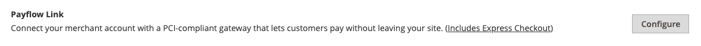
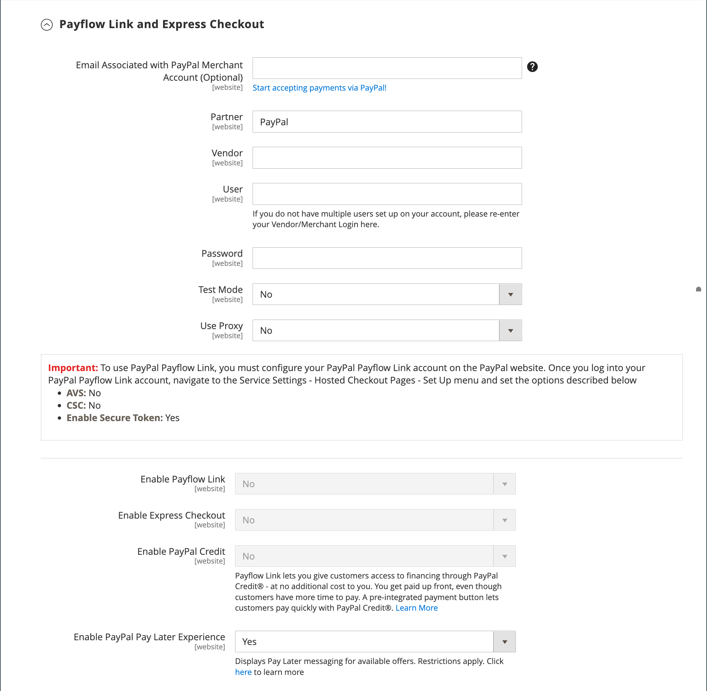

# PayPal Payflow Link

PayPal Payflow Link is available for merchants in the United States and Canada only. Customers are not required to have a personal PayPal account, and enter their credit card information in a form that is hosted by PayPal. The information is never stored on your Adobe Commerce or Magento Open Source server. Payflow Link cannot be used for orders that are created from the Admin.

Credit memos are supported for both online and offline refunds. However, multiple online refunds are not supported.

>[!IMPORTANT]
>
>**PSD2 Requirements:**  
>As of September 14, 2019, European banks might decline payments that do not meet [PSD2](../getting-started/compliance-payment-services-directive.md) requirements. To comply with PSD2, PayPal Payflow Link must be integrated with Cardinal Commerce. To learn more, see [3-D Secure for Payflow](https://developer.paypal.com/api/nvp-soap/payflow/3d-secure-overview/).

## Requirements

- [PayPal Business Account][1] The PayPal Payflow Pro gateway links the merchant account at PayPal with the merchant website, acting as both a gateway and a merchant account.

- If you manage multiple Commerce websites, you must have a separate PayPal merchant account for each website.

## Customer workflow

1. **Customer goes to the checkout** - During checkout, the customer chooses to pay with PayPal Payflow link and enters the credit card information. The customer is not required to have a personal PayPal account.
1. **Customer chooses Pay Now** - The customer taps the Pay Now button to submit the order.
1. **Customer enters credit card information** - The customer enters the credit card information on a form that is hosted by PayPal. If the customer clicks the _Cancel Payment_ link, the customer returns to the Payment Information stage of checkout and the order status changes to _Canceled_.
1. **Customer submits the order** - The credit card information is submitted directly to PayPal and is not retained anywhere on the Commerce site.

## Order workflow

1. **PayPal receives request** - PayPal receives the request from the customer to Pay Now.
1. **PayPal verifies the payment information** - PayPal verifies the credit card information, and assigns the appropriate status:
   - **Payment Verified:** If verified, the _Pending Payment_ status is initially assigned to the order until the transaction is settled.
   - **Processing** - The transaction was successful.
   - **Pending Payment** - The system did not receive a response from PayPal.
   - **Canceled** - The transaction was not successful for some reason.
   - **Suspected Fraud** - The transaction did not pass some of the [PayPal fraud filters](paypal.md#paypal-fraud-management-filters). The system receives the response from PayPal that the transaction is under review by Fraud Service.
   - **Cancel Payment:** If the customer clicks the _Cancel Payment_ link, the customer returns to the Payment Information stage of checkout and the order status changes to _Canceled_.
1. **Customer is redirected to confirmation page**  - If the transaction is completed successfully, the customer is redirected to the order confirmation page in your store. If the transaction fails on any reason, an error message appears on the checkout page and the customer is directed to repeat the checkout process. These situations are managed by PayPal.
1. **Merchant fulfills order** - The merchant invoices and ships the order as usual.

## Configure your PayPal account

1. Log in to your [PayPal business account][2].

1. Configure the [Hosted Checkout Pages][4] using PayPal Manager with the following settings:

   - Under **[!UICONTROL Security Options]**, complete the following settings:

      **[!UICONTROL AVS]**: `No`

      **[!UICONTROL CSC]**: `No`

      **[!UICONTROL Enable Secure Token]**: `Yes`

   - Choose **[!UICONTROL Customize]**, and then choose **[!UICONTROL Layout C]**.

      Layout C shows only credit and debit card fields, and can either be framed on your site or used as a stand-alone popup. The size is fixed at 490 x 565 pixels, with extra space for error messages. On some systems, this setting corrects an issue with transparent redirect.

1. When the configuration settings are complete, click **[!UICONTROL Save and Publish]**.

1. Set up an extra user (recommended by PayPal):

   - In the second row of the main menu, click **[!UICONTROL Manage Users]**.

   - To add another user to the account, click **[!UICONTROL Add User]**.

   - Complete the required fields in the following sections of the _Add User_ form:

      - [!UICONTROL Admin Confirmation]
      - [!UICONTROL User Information]
      - [!UICONTROL User Login Information]
      - [!UICONTROL Assign Privilege to User]

   - Click **[!UICONTROL Update]**.

## Set up PayPal Payflow Link

>[!TIP]
>
>Click **[!UICONTROL Save Config]** at any time to save your progress.

### Step 1: Begin the configuration

This setup method assumes you have an existing PayPal account.

1. On the _Admin_ sidebar, go to **[!UICONTROL Stores]** > _[!UICONTROL Settings]_ > **[!UICONTROL Configuration]**.

1. In the left panel, expand **[!UICONTROL Sales]** and choose **[!UICONTROL Payment Methods]**.

1. If your Commerce installation has multiple websites, stores, or views, set **[!UICONTROL Store View]** to the store view where you want to apply this configuration.

1. In the _[!UICONTROL Merchant Location]_ section, select the **[!UICONTROL Merchant Country]** where your business is located.

   This setting determines the selection of PayPal Solutions that appear in the configuration.

   {width="600" zoomable="yes"}

1. Expand **[!UICONTROL PayPal Payment Gateways]** (if needed) and click **[!UICONTROL Configure]** for **[!UICONTROL Payflow Link]**.

   {width="600" zoomable="yes"}

### Step 2: Complete the required PayPal settings

{width="600" zoomable="yes"}

1. (Optional) Enter the **[!UICONTROL Email Associated with your PayPal Merchant Account]**.

   >[!IMPORTANT]
   >
   >Email addresses are case-sensitive. To receive payment, the email address must match the email address specified in your PayPal merchant account.

1. Enter one of the following credentials that you use to log in to your PayPal merchant account:

   - **[!UICONTROL Partner]** - Your PayPal Partner ID.
   - **[!UICONTROL User]** - The ID of another user who is set up on your PayPal account.
   - **[!UICONTROL Vendor]** - Your PayPal user login name.

1. Enter the **[!UICONTROL Password]** that is associated with your PayPal account.

1. To run test transactions, set **[!UICONTROL Test Mode]** to `Yes`.

   When testing the configuration in a sandbox, use only [credit card numbers][3] that are recommended by PayPal. When you are ready to go to production, return to the configuration and set Test Mode to `No`.

1. If your system uses a proxy server to establish the connection to the PayPal system, set **[!UICONTROL Test Mode]** to `Yes` and do the following:

   - Enter the IP address of the **[!UICONTROL Proxy Host]**.

   - Enter the port number of the **[!UICONTROL Proxy Port]**.

      A proxy is used when the server firewall prevents direct access to the PayPal server. In such a case, a third-party server is used to relay traffic.

1. Set **[!UICONTROL Enable Payflow Link]** to `Yes`.

1. If you want to enable [PayPal Express Checkout](paypal-express-checkout.md) options for customers, set **[!UICONTROL Enable Express Checkout]** to `Yes`.

1. If you want to offer [PayPal Credit](paypal.md#paypal-credit-and-pay-later) to your customers, set **[!UICONTROL Enable PayPal Credit]** to `Yes`.

### Step 3: Set up Advertise PayPal Credit / Advertise PayPal PayLater (optional)

Starting with the 2.4.3 release, PayPal PayLater is supported in deployments that include PayPal. This feature allows shoppers to pay for an order in bi-weekly installments instead of paying the full amount at time of purchase. The PayPal Credit experience is deprecated.

Set **[!UICONTROL Enable PayPal PayLater Experience]** to one of the following:

- `Yes` - To set up Advertise PayPal PayLater
- `No` - To set up Advertise PayPal Credit

#### Advertise PayPal Credit

1. Expand  the **[!UICONTROL Advertise PayPal Credit]** section.

   {width="600" zoomable="yes"}

1. To get your account information, click **[!UICONTROL Get Publisher ID from PayPal]** and follow the instructions.

1. Enter your **[!UICONTROL Publisher ID]**.

1. Expand  the **[!UICONTROL Home Page]** section.

   {width="600" zoomable="yes"}

1. To place a banner on the page, set **[!UICONTROL Display]** to `Yes`.

1. Set **[!UICONTROL Position]** to one of the following:

   - `Header (center)`
   - `Sidebar (right)`

1. Set **[!UICONTROL Size]** to one of the following:

   - `190 x 100`
   - `234 x 60`
   - `300 x 50`
   - `468 x 60`
   - `728 x 90`
   - `800 x 66`

1. Expand  the remaining sections and repeat the previous steps for home page configuration:

   - **[!UICONTROL Catalog Category Page]**
   - **[!UICONTROL Catalog Product Page]**
   - **[!UICONTROL Checkout Cart Page]**

#### Advertise PayPal PayLater

1. Expand  the **[!UICONTROL Advertise PayPal PayLater]** section.

1. Set **[!UICONTROL Enable PayPal PayLater]** to `Yes`.

1. Expand  the **[!UICONTROL Home Page]** section.

   {width="600" zoomable="yes"}

1. To place a banner on the page, set **[!UICONTROL Display]** to `Yes`.

1. Set **[!UICONTROL Position]** to one of the following:

   - `Header (center)`
   - `Sidebar`

1. Set **[!UICONTROL Style Layout]** to one of the following:

   - `Text`
   - `Flex`

1. For [!UICONTROL Style Layout] **[!UICONTROL Text]** only, set **[!UICONTROL Logo Type]** to one of the following:

   - `Primary`
   - `Alternative`
   - `Inline`
   - `None`

1. For [!UICONTROL Style Layout] **[!UICONTROL Text]** only, set **[!UICONTROL Logo Position]** to one of the following:

   - `Left`
   - `Right`
   - `Top`

1. For [!UICONTROL Style Layout] **[!UICONTROL Text]** only, set **[!UICONTROL Text Color]** to one of the following:

   - `Black`
   - `White`
   - `Monochrome`
   - `Grayscale`

1. For [!UICONTROL Style Layout] **[!UICONTROL Text]** only, set **[!UICONTROL Text Size]** to one of the following:

   - `10px`
   - `11px`
   - `12px`
   - `13px`
   - `14px`
   - `15px`
   - `16px`

1. For [!UICONTROL Style Layout] **[!UICONTROL Flex]** only, set **[!UICONTROL Ratio]** to one of the following:

   - `1x1`
   - `1x4`
   - `8x1`
   - `20x1`

1. For [!UICONTROL Style Layout] **[!UICONTROL Flex]** only, set **[!UICONTROL Color]** to one of the following:

   - `Blue`
   - `Black`
   - `White`
   - `White No Border`
   - `Gray`
   - `Monochrome`
   - `Grayscale`

1. Expand  the remaining sections and repeat the previous steps:

   - **[!UICONTROL Catalog Product Page]**
   - **[!UICONTROL Checkout Cart Page]**
   - **[!UICONTROL Checkout Payment Step]**
   - **[!UICONTROL Catalog Category Page]**

### Step 4: Complete the basic settings

1. Expand  the **[!UICONTROL Basic Settings - PayPal Payflow Link]** section.

   {width="600" zoomable="yes"}

1. For **[!UICONTROL Title]**, enter a title that identifies PayPal Payflow Link during checkout.

   It is recommended that you use the title _Debit or Credit Card_.

1. If you offer multiple payment methods, enter a number for **[!UICONTROL Sort Order]** to determine the sequence in which Payflow Link appears when listed with the other payment methods.

   This number is relative to the other payment methods. (`0` = first, `1` = second, `2` = third, and so on.)

1. Set **[!UICONTROL Payment Action]** to one of the following:

   - `Authorization` - Approves the purchase and puts a hold on the funds. The amount is not withdrawn until it is captured by the merchant.
   - `Sale` - The amount of the purchase is authorized and immediately withdrawn from the customer's account.

### Step 5: Complete the advanced settings

1. Expand  the **[!UICONTROL Advanced Settings]** section.

   {width="600" zoomable="yes"}

1. Set **[!UICONTROL Payment Applicable From]** to one of the following:

   - `All Allowed Countries` - Customers from all [countries](../getting-started/store-details.md#country-options) specified in your store configuration can use this payment method.
   - `Specific Countries` - After choosing this option, the _[!UICONTROL Payment from Specific Countries]_ list appears. Hold down the Ctrl key and select each country in the list where customers can make purchases from your store.

1. To write communications with the payment system into the log file, set **[!UICONTROL Debug Mode]** to `Yes`.

   >[!NOTE]
   >
   >In accordance with PCI Data Security Standards, credit card information is not recorded in the log file.

1. To enable host authenticity verification, set **[!UICONTROL Enable SSL Verification]** to `Yes`.

1. If you want the customer to be able to correct their entry of the three-digit CVV security code from the back of a credit card, set **[!UICONTROL CVV Entry is Editable]** to `Yes`.

1. To require customers to enter a CVV code, set **[!UICONTROL Require CVV Entry]** to `Yes`.

1. To send a confirmation of the payment to the customer, set **[!UICONTROL Send Email Confirmation]** to `Yes`.

1. To determine the method that is used to exchange information with the PayPal server during a transaction, set the **[!UICONTROL URL method for Cancel URL and Return URL]** to one of the following:

   - `GET` - Retrieves information that is the result of a process (default method).
   - `POST` - Provides a block of data, such as data entered into a form, to a data handling process.

   The _Cancel URL_ and _Return URL_ refer to the page where the customer returns after completing or canceling the payment part of the checkout process on the PayPal server

1. Complete the following sections, as needed for your store:

   - [Settlement Report Settings](#settlement-report-settings)
   - [Frontend Experience Settings](#frontend-experience-settings)

#### Settlement Report Settings

1. Expand  the **[!UICONTROL Settlement Report Settings]** section.

   {width="600" zoomable="yes"}

1. For **[!UICONTROL SFTP Credentials]**, do the following:

   - If you have signed up for the PayPal Secure FTP Server, enter the following SFTP login credentials:

      - Login
      - Password

   - To run test reports before going live with Express Checkout on your site, set **[!UICONTROL Sandbox Mode]** to `Yes`.

   - Enter the **[!UICONTROL Custom Endpoint Hostname or IP Address]**.

      By default, the value is `reports.paypal.com`.

   - Enter the **[!UICONTROL Custom Path]** where reports are saved.

      By default, the value is `/ppreports/outgoing`.

1. To generate reports according to a schedule, complete the **[!UICONTROL Scheduled Fetching]** settings:

   - Set **[!UICONTROL Enable Automatic Fetching]** to `Yes`.

   - Set **[!UICONTROL Schedule]** to one of the following:

      - `Daily`
      - `Every 3 Days`
      - `Every 7 Days`
      - `Every 10 Days`
      - `Every 14 Days`
      - `Every 30 Days`
      - `Every 40 Days`

      PayPal retains each report for 45 days.

   - Set **[!UICONTROL Time of Day]** to the hour, minute, and second when you want the reports to be generated.

#### Frontend Experience Settings

Use the _[!UICONTROL Frontend Experience Settings]_ to choose which PayPal logos appear on your site, and to customize the appearance of your PayPal merchant pages.

1. Expand  the **[!UICONTROL Frontend Experience Settings]** section.

   {width="600" zoomable="yes"}

1. Select the **[!UICONTROL PayPal Product Logo]** that you want to appear in the PayPal block in your store.

   The PayPal logos are available in four styles and two sizes:

   - `No Logo`
   - `We Prefer PayPal (150 x 60 or 150 x 40)`
   - `Now Accepting PayPal (150 x 60 or 150 x 40)`
   - `Payments by PayPal (150 x 60 or 150 x 40)`
   - `Shop Now Using PayPal (150 x 60 or 150 x 40)`

1. To customize the appearance of your PayPal merchant pages:

   - Enter the name of the **[!UICONTROL Page Style]** that you want to apply to your PayPal merchant pages:

      - `paypal` - Uses the PayPal page style.
      - `primary` - Uses the page style that you identified as the _primary_ style in your account profile.
      - `your_custom_value` - Uses a custom payment page style, which is specified in your account profile.

   - For **[!UICONTROL Header Image URL]**, enter the URL of the image that you want to appear in the upper-left corner of the payment page. The maximum file size is 750 pixels wide by 90 pixels high.

      >[!NOTE]
      >
      >PayPal recommends that the image resides on a secure (https) server. Otherwise, a browser may warn that _the page contains both secure and nonsecure items_.

   - To set the color for your pages, enter the six-character hexadecimal code, without the `#` symbol, for each of the following:

      - **[!UICONTROL Header Background Color]** - Background color for the checkout page header.
      - **[!UICONTROL Header Border Color]** - Color for two-pixel border around the header.
      - **[!UICONTROL Page Background Color]** - Background color for the checkout page and around the header and payment form.

### Step 6: Complete the basic settings for PayPal Express Checkout

1. Expand  the **[!UICONTROL Basic Settings - PayPal Express Checkout]** section.

   {width="600" zoomable="yes"}

1. For **[!UICONTROL Title]**, enter a title that identifies this payment method during checkout.

   Setting the title to _PayPal_ for each store view is recommended.

1. If you offer multiple payment methods, enter a number for **[!UICONTROL Sort Order]** to determine the sequence in which PayPal Express Checkout appears when listed with the other payment methods.

   This number is relative to the other payment methods. (`0` = first, `1` = second, `2` = third, and so on.)

1. Set **[!UICONTROL Payment Action]** to one of the following:

   - `Authorization` - Approves the purchase and puts a hold on the funds. The amount is not withdrawn until it is _captured_ by the merchant.
   - `Sale` - The amount of the purchase is authorized and immediately withdrawn from the customer's account.

1. To display the _[!UICONTROL Check out with PayPal]_ button on the product page, set **[!UICONTROL Display on Product Details Page]** to `Yes`.

### Step 7: Complete the advanced settings for PayPal Express Checkout

1. Expand  the **[!UICONTROL Advanced Settings]** section.

   {width="600" zoomable="yes"}

1. Set **[!UICONTROL Display on Shopping Cart]** to `Yes`.

1. Set **[!UICONTROL Payment Applicable From]** to one of the following:

   - `All Allowed Countries` - Customers from all countries specified in your store configuration can use this payment method.
   - `Specific Countries` - After choosing this option, the _[!UICONTROL Payment from Specific Countries]_ list appears. To select multiple countries, hold down the Ctrl key (PC) or the Command key (Mac) and click each item.

1. To write communications with the payment system into the log file, set **[!UICONTROL Debug Mode]** to `Yes`.

   >[!NOTE]
   >
   >In accordance with PCI Data Security Standards, credit card information is not recorded in the log file.

1. To enable host authenticity verification, set **[!UICONTROL Enable SSL Verification]** to `Yes`.

1. To display a full summary of the customer order by line item from the PayPal site, set **[!UICONTROL Transfer Cart Line Items]** to `Yes`.

1. To allow the customer to complete the transaction from the PayPal site without returning to your store for Order Review, set **[!UICONTROL Skip Order Review Step]** to `Yes`.

1. When complete, click **[!UICONTROL Save Config]**.

[1]: https://www.paypal.com/webapps/mpp/how-to-sell-online
[2]: https://manager.paypal.com/
[3]: https://www.paypalobjects.com/en_AU/vhelp/paypalmanager_help/credit_card_numbers.htm
[4]: https://developer.paypal.com/docs/payflow/integration-guide/configure-hosted-checkout/#configuring-hosted-pages-using-paypal-manager
