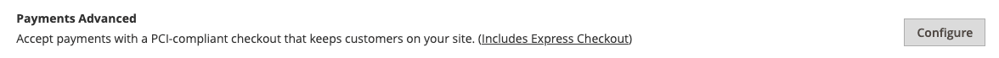
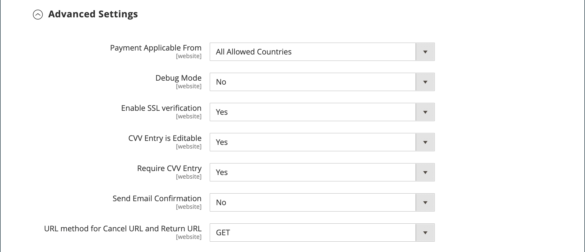
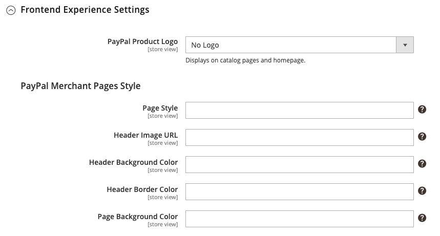
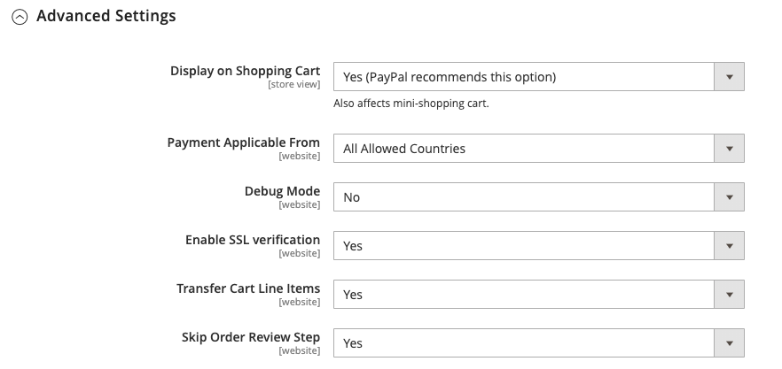

# PayPal Payments Advanced

[PayPal Payments Advanced][4] is a [PCI-compliant](../getting-started/compliance-pci.md) solution that lets your customers pay by debit or credit card without leaving your site. It includes an embedded checkout page that can be customized to create a seamless and secure checkout experience.

Even customers without a PayPal account can make purchases through the PayPal secure payment gateway. Accepted cards include Visa, MasterCard, Switch/Maestro, and Solo credit cards in the United States and United Kingdom. For additional convenience, PayPal Express Checkout is included with PayPal Payments Advanced.

>[!IMPORTANT]
>
>**PSD2 Requirements:**  
>As of September 14, 2019, European banks might decline payments that do not meet [PSD2](../getting-started/compliance-payment-services-directive.md) requirements. To comply with PSD2, PayPal Payments Advanced must be integrated with a third-party plugin. To learn more, see [3-D Secure for Payflow](https://developer.paypal.com/api/nvp-soap/payflow/3d-secure-mpi/).

>[!NOTE]
>
>PayPal Payments Advanced cannot be used for orders created from the Admin of your store.

## Requirements

- [PayPal business account][1]
- If you manage multiple Adobe Commerce and Magento Open Source websites, you must have a separate PayPal merchant account for each website.

## Checkout workflow

1. **Customer chooses payment method** - During checkout, the customer chooses to pay with PayPal Payments Advanced. The Pay Now button appears instead of the Place Order button.

1. **Pay Now** - The customer clicks/taps _Pay Now_, and a PayPal-hosted form appears. The customer enters the card information, and the card is verified. If successful, the order confirmation page appears.

   **Pay with PayPal** - The form also includes the _Pay with PayPal_ button, which redirects the customer to the PayPal site, where payment can be made with PayPal Express Checkout.

1. **Troubleshooting** - If the transaction fails for any reason, an error message appears on the checkout page and the customer is instructed to try again. Any issues are managed by PayPal.

## Order processing workflow

Processing orders with PayPal Payments Advanced is the same as for any regular PayPal order. Orders are invoiced and shipped, and credit memos generated for both online and offline refunds. However, multiple online refunds are not available for orders paid with PayPal Payments Advanced.

1. **Customer places order** - In the final stage of checkout, the customer taps the Place Order button.

1. **PayPal responds** - PayPal evaluates the request. If it is found to be valid, PayPal processes the transaction.

1. **Commerce sets order status** - Commerce receives response from PayPal, and sets the order status to one of the following:

   - **Processing** - The transaction was successful.
   - **Pending Payment** - The system did not receive any response from PayPal.
   - **Canceled** - The transaction was not successful for some reason
   - **Suspected Fraud** -  The transaction did not pass some of the [PayPal fraud filters](paypal.md#paypal-fraud-management-filters). The system receives the response from PayPal that the transaction is under review by Fraud Service.

1. **Merchant fulfills order** - The merchant invoices and ships the order.

## Configure your PayPal account

Before you set up PayPal Payments Advanced in Commerce, you must configure your account on the PayPal website.

1. Log in to your [PayPal business account][2].

1. Go to **[!UICONTROL Service Settings]** > **[!UICONTROL Hosted Checkout Pages]** > **[!UICONTROL Set Up Menu]** and complete the following settings:

   - **[!UICONTROL AVS]**: `No`
   - **[!UICONTROL CSC]**: `No`
   - **[!UICONTROL Enable Secure Token]**: `Yes`

1. **[!UICONTROL Save]** the settings.

   >[!NOTE]
   >
   >If you have multiple Commerce websites, you must create a separate PayPal Payments Advanced account for each.

1. When prompted to create a layout, do the following:

   - At the top of the page, click **[!UICONTROL Customize]**.

   - Choose **[!UICONTROL Layout C]**.

   - Click **[!UICONTROL Save and Publish]**.

1. Set up another user (recommended by PayPal):

   - Log in to your [PayPal business account][2].

   - To set up another user, follow the instructions.

   - **[!UICONTROL Save]** the changes.

## Set up PayPal Payments Advanced in Commerce

>[!NOTE]
>
>You can have two PayPal solutions active at the same time: Express Checkout, plus any All-In-One or Payment Gateway solution. If you change payment solutions, the one that was used previously is disabled.

>[!TIP]
>
>Click **[!UICONTROL Save Config]** at any time to save your progress.

### Step 1: Begin the configuration

1. On the _Admin_ sidebar, go to **[!UICONTROL Stores]** > _[!UICONTROL Settings]_ > **[!UICONTROL Configuration]**.

1. In the left panel, expand **[!UICONTROL Sales]** and choose **[!UICONTROL Payment Methods]**.

1. If your Commerce installation has multiple websites, stores, or views, set **[!UICONTROL Store View]** to the store view where you want to apply this configuration.

1. In the _[!UICONTROL Merchant Location]_ section, select the **[!UICONTROL Merchant Country]** where your business is located.

   This setting determines the selection of PayPal Solutions that appear in the configuration.

   {width="600" zoomable="yes"}

1. Expand **[!UICONTROL PayPal All-in-One Payment Solution]** and click **[!UICONTROL Configure]** for **[!UICONTROL Payments Advanced]**.

   {width="600" zoomable="yes"}

### Step 2: Complete the required settings

1. Expand  the **[!UICONTROL Required PayPal Settings]** section, if needed.

   {width="600" zoomable="yes"}

1. (Optional) Enter the **[!UICONTROL Email Associated with your PayPal Merchant Account]**.

   >[!IMPORTANT]
   >
   >Email addresses are case-sensitive. To receive payment, the email address must match the email address specified in your PayPal merchant account.

   If you do not have a PayPal account, click **[!UICONTROL Start accepting payments via PayPal]**.

1. Enter one of the following credentials that you use to log in to your PayPal merchant account:

   - **[!UICONTROL Partner]** - Your PayPal Partner ID.
   - **[!UICONTROL Vendor]** - Your PayPal user login name.
   - **[!UICONTROL User]** - The ID of another user who is set up on your PayPal account.

1. Enter the **[!UICONTROL Password]** that is associated with your PayPal account.

1. To run test transactions, set **[!UICONTROL Test Mode]** to `Yes`.

   When testing the configuration in a sandbox, use only [credit card numbers][3] that are recommended by PayPal. When you are ready to go to production, return to the configuration and set Test Mode to `No`.

1. If your system uses a proxy server to establish the connection to the PayPal system, set **[!UICONTROL Use Proxy]** to `Yes` and do the following:

   - Enter the IP address of the **[!UICONTROL Proxy Host]**.

   - Enter the port number of the **[!UICONTROL Proxy Port]**.

      A proxy is used when the server firewall prevents direct access to the PayPal server. In this case, a third-party server is used to relay traffic.

1. Set **[!UICONTROL Enable this Solution]** to `Yes`.

1. If you want to offer [PayPal Credit](paypal.md#paypal-credit-and-pay-later) to your customers, set **[!UICONTROL Enable PayPal Credit]** to `Yes`.

### Step 3: Set up Advertise PayPal Credit / Advertise PayPal PayLater (optional)

Starting with the 2.4.3 release, PayPal PayLater is supported in deployments that include PayPal. This feature allows shoppers to pay for an order in bi-weekly installments instead of paying the full amount at time of purchase. The PayPal Credit experience is deprecated.

Set **[!UICONTROL Enable PayPal PayLater Experience]** to one of the following:

- `Yes` - To set up Advertise PayPal PayLater
- `No` - To set up Advertise PayPal Credit

#### Advertise PayPal Credit

1. Expand  the **[!UICONTROL Advertise PayPal Credit]** section.

   {width="600" zoomable="yes"}

1. To get your account information, click **[!UICONTROL Get Publisher ID from PayPal]** and follow the instructions.

1. Enter your **[!UICONTROL Publisher ID]**.

1. Expand  the **[!UICONTROL Home Page]** section.

1. To place a banner on the page, set **[!UICONTROL Display]** to `Yes`.

1. Set **[!UICONTROL Position]** to one of the following:

   - `Header (center)`
   - `Sidebar (right)`

1. Set **[!UICONTROL Size]** to one of the following:

   - `190 x 100`
   - `234 x 60`
   - `300 x 50`
   - `468 x 60`
   - `728 x 90`
   - `800 x 66`

    {width="600" zoomable="yes"}

1. Expand  the remaining sections and repeat the previous steps:

   - **[!UICONTROL Catalog Category Page]**
   - **[!UICONTROL Catalog Product Page]**
   - **[!UICONTROL Checkout Cart Page]**

#### Advertise PayPal PayLater

1. Expand  the **[!UICONTROL Advertise PayPal PayLater]** section.

1. Set **[!UICONTROL Enable PayPal PayLater]** to `Yes`.

1. Expand  the **[!UICONTROL Home Page]** section.

1. To place a banner on the page, set **[!UICONTROL Display]** to `Yes`.

1. Set **[!UICONTROL Position]** to one of the following:

   - `Header (center)`
   - `Sidebar`

1. Set **[!UICONTROL Style Layout]** to one of the following:

   - `Text`
   - `Flex`

1. For [!UICONTROL Style Layout] **[!UICONTROL Text]** only, set **[!UICONTROL Logo Type]** to one of the following:

   - `Primary`
   - `Alternative`
   - `Inline`
   - `None`

1. For [!UICONTROL Style Layout] **[!UICONTROL Text]** only, set **[!UICONTROL Logo Position]** to one of the following:

   - `Left`
   - `Right`
   - `Top`

1. For [!UICONTROL Style Layout] **[!UICONTROL Text]** only, set **[!UICONTROL Text Color]** to one of the following:

   - `Black`
   - `White`
   - `Monochrome`
   - `Grayscale`

1. For [!UICONTROL Style Layout] **[!UICONTROL Text]** only, set **[!UICONTROL Text Size]** to one of the following:

   - `10px`
   - `11px`
   - `12px`
   - `13px`
   - `14px`
   - `15px`
   - `16px`

1. For [!UICONTROL Style Layout] **[!UICONTROL Flex]** only, set **[!UICONTROL Ratio]** to one of the following:

   - `1x1`
   - `1x4`
   - `8x1`
   - `20x1`

1. For [!UICONTROL Style Layout] **[!UICONTROL Flex]** only, set **[!UICONTROL Color]** to one of the following:

   - `Blue`
   - `Black`
   - `White`
   - `White No Border`
   - `Gray`
   - `Monochrome`
   - `Grayscale`

   {width="600" zoomable="yes"}

1. Expand  the remaining sections and repeat the previous steps:

   - **[!UICONTROL Catalog Product Page]**
   - **[!UICONTROL Checkout Cart Page]**
   - **[!UICONTROL Checkout Payment Step]**
   - **[!UICONTROL Catalog Category Page]**

### Step 4: Complete the basic settings

1. Expand  the **[!UICONTROL Basic Settings - PayPal Payments Advanced]** section, if needed.

   {width="600" zoomable="yes"}

1. To identify PayPal Payments Advanced during checkout, enter a **[!UICONTROL Title]**.

   It is recommended that you use the title _Debit or Credit Card_.

1. If you offer multiple payment methods, enter a number for **[!UICONTROL Sort Order]** to determine the sequence in which PayPal Payments Advanced appears when listed with other payment methods during checkout.

   This number is relative to the other payment methods. (`0` = first, `1` = second, `2` = third, and so on.)

1. Set **[!UICONTROL Payment Action]** to one of the following:

   - `Authorization` - Approves the purchase, but puts a hold on the funds. The amount is not withdrawn until it is _captured_ by the merchant.
   - `Sale` - The amount of the purchase is authorized and immediately withdrawn from the customer's account.

### Step 5: Complete the advanced settings

1. Expand  the **[!UICONTROL Advanced Settings]** section.

   {width="600" zoomable="yes"}

1. Set **[!UICONTROL Payment Applicable From]** to one of the following:

   - `All Allowed Countries` - Customers from all [countries](../getting-started/store-details.md#country-options) specified in your store configuration can use this payment method.
   - `Specific Countries` - After choosing this option, the _[!UICONTROL Payment from Specific Countries]_ list appears. Hold down the Ctrl key (PC) or the Command key (Mac) and select each country in the list where customers can make purchases from your store.

1. To write communications with the payment system into the log file, set **[!UICONTROL Debug Mode]** to `Yes`.

   The log file for PayPal Payments Advanced is `payments_payflow_advanced.log`.

   >[!NOTE]
   >
   >In accordance with PCI Data Security Standards, credit card information is not recorded in the log file.

1. To enable host authenticity verification, set **[!UICONTROL Enable SSL Verification]** to `Yes`.

1. To allow the customer to correct their entry of the three-digit CVV security code from the back of a credit card, set **[!UICONTROL CVV Entry is Editable]** to `Yes`.

1. To require customers to enter a CVV code, set **[!UICONTROL Require CVV Entry]** to `Yes`.

1. To send a confirmation of the payment to the customer, set **[!UICONTROL Send Email Confirmation]** to `Yes`.

1. To determine the method that is used to exchange information with the PayPal server during a transaction, set the **[!UICONTROL URL method for Cancel URL and Return URL]** to one of the following:

   - `GET` - (Default) Retrieves information that is the result of a process.
   - `POST` - Provides a block of data, such as data entered into a form, to a data handling process.

   The _Cancel URL_ and _Return URL_ refer to the page where the customer returns after completing or canceling the payment part of the checkout process on the PayPal server.

1. Complete the following sections, as needed for your store:

   - [Settlement Report Settings](#settlement-report-settings)
   - [Frontend Experience Settings](#frontend-experience-settings)

#### Settlement Report Settings

1. Expand  the **[!UICONTROL Settlement Report Settings]** section.

   {width="600" zoomable="yes"}

1. For **[!UICONTROL SFTP Credentials]**, do the following:

   - If you have signed up for PayPal's Secure FTP Server, enter the following SFTP login credentials:

      - Login
      - Password

   - To run test reports before going live, set **[!UICONTROL Sandbox Mode]** to `Yes`.

   - Enter the **[!UICONTROL Custom Endpoint Hostname or IP Address]**.

      By default, the value is `reports.paypal.com`.

   - Enter the **[!UICONTROL Custom Path]** where reports are saved.

      By default, the value is `/ppreports/outgoing`.

1. To generate reports according to a schedule, complete the **[!UICONTROL Scheduled Fetching]** settings:

   - Set **[!UICONTROL Enable Automatic Fetching]** to `Yes`.

   - Set **[!UICONTROL Schedule]** to one of the following:

      - `Daily`
      - `Every 3 Days`
      - `Every 7 Days`
      - `Every 10 Days`
      - `Every 14 Days`
      - `Every 30 Days`
      - `Every 40 Days`

      PayPal retains each report for 45 days.

   - Set **[!UICONTROL Time of Day]** to the hour, minute, and second when you want the reports to be generated.

#### Frontend Experience Settings

Use the _[!UICONTROL Frontend Experience Settings]_ to choose which PayPal logos appear on your site and to customize the appearance of your PayPal merchant pages.

1. Expand  the **[!UICONTROL Frontend Experience Settings]** section.

   {width="600" zoomable="yes"}

1. Select the **[!UICONTROL PayPal Product Logo]** that you want to appear in the PayPal block in your store.

   The PayPal logos are available in four styles and two sizes:

   - `No Logo`
   - `We Prefer PayPal (150 x 60 or 150 x 40)`
   - `Now Accepting PayPal (150 x 60 or 150 x 40)`
   - `Payments by PayPal (150 x 60 or 150 x 40)`
   - `Shop Now Using PayPal (150 x 60 or 150 x 40)`

1. To customize the appearance of your PayPal merchant pages:

   - Enter the name of the **[!UICONTROL Page Style]** that you want to apply to your PayPal merchant pages:

      - `paypal` - Uses the PayPal page style.
      - `primary` - Uses the page style that you identified as the _primary_ style in your account profile.
      - `your_custom_value` - Uses a custom payment page style, which is specified in your account profile.

   - For **[!UICONTROL Header Image URL]**, enter the URL of the image that you want to appear in the upper-left corner of the payment page. The maximum file size is 750 pixels wide by 90 pixels high.

   >[!NOTE]
   >
   >PayPal recommends that the image resides on a secure (https) server. Otherwise, a browser may warn that _the page contains both secure and nonsecure items_.

   - To set the color for your pages, enter the six-character hexadecimal code, without the `#` symbol, for each of the following:

      - **[!UICONTROL Header Background Color]** - Background color for the checkout page header.
      - **[!UICONTROL Header Border Color]** - Color for two-pixel border around the header.
      - **[!UICONTROL Page Background Color]** - Background color for the checkout page and around the header and payment form.

### Step 6: Complete basic settings for PayPal Express Checkout

1. Expand  the **[!UICONTROL Basic Settings - PayPal Express Checkout]** section.

   {width="600" zoomable="yes"}

1. For **[!UICONTROL Title]**, enter a title that identifies this payment method during checkout.

   Setting the title to _PayPal_ for each store view is recommended.

1. If you offer multiple payment methods, enter a number for **[!UICONTROL Sort Order]** to determine the sequence in which PayPal Express Checkout appears when listed with the other payment methods.

   This number is relative to the other payment methods. (`0` = first, `1` = second, `2` = third, and so on.)

1. Set **[!UICONTROL Payment Action]** to one of the following:

   - `Authorization` - Approves the purchase and puts a hold on the funds. The amount is not withdrawn until it is _captured_ by the merchant.
   - `Sale` - The amount of the purchase is authorized and immediately withdrawn from the customer's account.

1. To display the _[!UICONTROL Check out with PayPal]_ button on the product page, set **[!UICONTROL Display on Product Details Page]** to `Yes`.

### Step 7: Complete Advanced Settings - PayPal Express Checkout

1. Expand  the **[!UICONTROL Advanced Settings]** section.

   {width="600" zoomable="yes"}

1. To make PayPal Express Checkout available from both the shopping cart and mini cart, set **[!UICONTROL Display on Shopping Cart]** to `Yes`.

1. Set **[!UICONTROL Payment Applicable From]** to one of the following:

   - `All Allowed Countries` - Customers from all [countries](../getting-started/store-details.md#country-options) specified in your store configuration can use this payment method.
   - `Specific Countries` |After choosing this option, the _Payment from Specific Countries list_ appears. Hold down the Ctrl key (PC) or the Command key (Mac) and click each country in the list where customers can make purchases from your store.

1. To write communications with the payment system into the log file, set **[!UICONTROL Debug Mode]** to `Yes`.

   >[!NOTE]
   >
   >In accordance with [PCI Data Security Standards](../getting-started/compliance-pci.md), credit card information is not recorded in the log file.

1. To enable host authenticity verification, set **[!UICONTROL Enable SSL Verification]** to `Yes`.

1. To display a full summary of the customer's order by line item from the PayPal site, set **[!UICONTROL Transfer Cart Line Items]** to `Yes`.

1. To allow the customer to complete the transaction from the PayPal site without returning to your store for Order Review, set **[!UICONTROL Skip Order Review Step]** to `Yes`.

1. When complete, click **[!UICONTROL Save Config]**.

[1]: https://www.paypal.com/webapps/mpp/how-to-sell-online
[2]: https://manager.paypal.com/
[3]: https://www.paypalobjects.com/en_AU/vhelp/paypalmanager_help/credit_card_numbers.htm
[4]: https://developer.paypal.com/docs/payflow/gs-ppa-hosted-pages/
