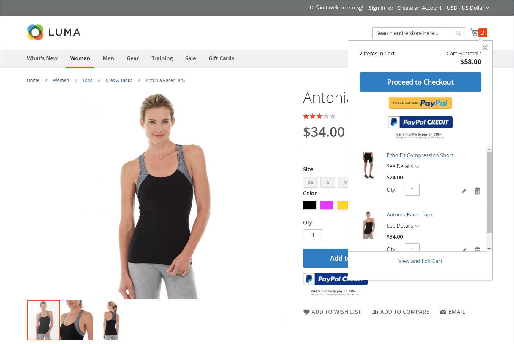
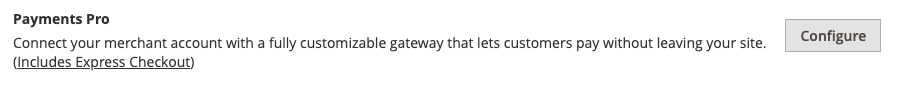
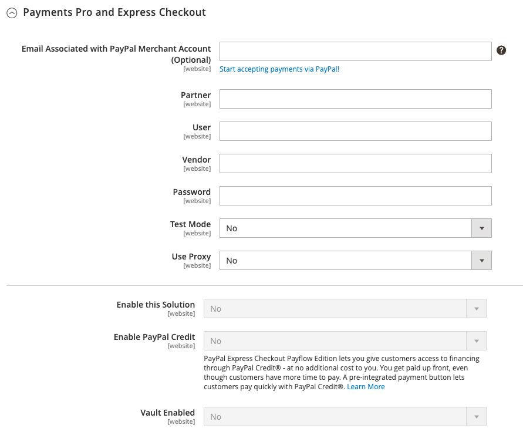
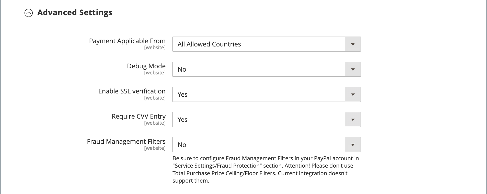
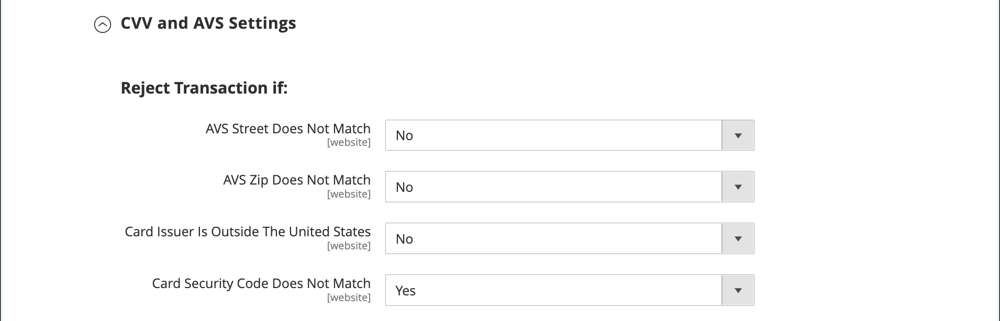

# PayPal Payments Pro

[PayPal Payments Pro][3] brings you all the benefits of a merchant account and payment gateway in one, plus the ability to create your own, fully customized checkout experience. PayPal Express Checkout is automatically enabled with PayPal Payments Pro, so you can tap into more than 110 million active PayPal users.

<!-- zoom -->

>[!IMPORTANT]
>
>**PSD2 Requirements:**  
>As of September 14, 2019, European banks might decline payments that do not meet [PSD2](../getting-started/compliance-payment-services-directive.md) requirements. To comply with PSD2, PayPal Payments Pro must be integrated with a third-party plugin.

>[!NOTE]
>
>Currently, PayPal Payments Pro is available in the US, UK, and Canada.

## Requirements

- [PayPal Merchant Account][1] (with Direct Payments activated)

## Checkout workflow

1. **Customer goes to checkout** - Customer adds products to cart, and clicks/taps _Proceed to Checkout_.|
1. **Customer chooses payment method** - During checkout, customer chooses the _PayPal Direct Payment_ option, and enters the credit card information.
   - If paying with PayPal Payments Pro, the customer stays on your site during the checkout process.
   - If paying with  PayPal Express Checkout, the customer is redirected to the PayPal site to complete the transaction.

At the customer's request, the store administrator can also create an order from the Admin and process the transaction with PayPal Payments Pro.

## Order processing workflow

1. **Order placed** - The order can be processed either the Admin of your store, or from your PayPal merchant account.

1. **[!UICONTROL Payment Action]** - The payment action specified in the configuration is applied to the order. Options include:

   - **Authorize** - Commerce creates a sales order with the _Processing_ status. In this case, the amount of money to be authorized is pending approval.
   - **Sale** - Commerce creates both a sales order and invoice.
   - **Capture** - PayPal transfers the order amount from the customer balance, bank account, or credit card to the merchant account.

1. **Invoicing** - An invoice is created in Commerce after PayPal sends an instant payment notification message to Commerce.

   Make sure that instant payment notifications are enabled in your PayPal merchant account.
   
   >[!NOTE]
   >
   >If necessary, an order can be partially invoiced for a specified quantity of products. For each partial invoice submitted, a separate Capture transaction with a unique ID becomes available, and a separate invoice is generated.
   
   Authorization-only payment transactions are closed only after the full order amount is captured.
   
   An order can be voided online at any time until the order amount is fully invoiced.

1. **Returns** - If the customer returns the purchased products and claims a refund, as with order amount capturing and invoice creation, you can create an online refund either from the Admin or from your PayPal merchant account.

## Configure your PayPal account

Before you set up PayPal Payments Pro in Commerce, you must configure your merchant account on the PayPal website.

1. Log in to your [PayPal business account](https://manager.paypal.com/).

1. In the PayPal Manager menu, choose **[!UICONTROL Service Settings]**.

1. Under **[!UICONTROL Hosted Checkout Pages]**, click **[!UICONTROL Set Up]**.

1. Under **[!UICONTROL Choose your settings]**, set **[!UICONTROL Transaction Process Mode]** to `Live`.

1. Under **[!UICONTROL Display options on payment page]**, set **[!UICONTROL Cancel URL Method]** to `POST`.

1. Under **[!UICONTROL Billing Information]**, select the card security code **[!UICONTROL CSC]** checkboxes for both required and editable fields.

1. Under **[!UICONTROL Payment Confirmation]**, set **[!UICONTROL Return URL Method]** to `POST`.

1. Under **[!UICONTROL Security Options]**, configure the following:

   - **[!UICONTROL AVS]**: `No`
   - **[!UICONTROL CSC]**: `No`
   - **[!UICONTROL Enable Secure Token]**: `Yes`

1. Click **[!UICONTROL Save Changes]**.

1. In the _PayPal Manager_ menu, choose **[!UICONTROL Service Settings]** and under _Hosted Checkout Pages_, choose **[!UICONTROL Customize]**.

1. Choose **[!UICONTROL Layout C]**.

   Layout C shows only credit and debit card fields, and can either be framed on your site or used as a stand-alone popup. The size is fixed at 490 x 565 pixels, with extra space for error messages. On some systems, this setting corrects an issue with transparent redirect.

1. Click **[!UICONTROL Save and Publish]**.

1. In the PayPal Manager menu, choose **[!UICONTROL Account Administration]**. Under **[!UICONTROL Manage Security]**, click **[!UICONTROL Transaction Settings]**.

1. Set **[!UICONTROL Allow reference transactions]** to `Yes`.

1. Click **[!UICONTROL Confirm]**.

   >[!NOTE]
   >
   >If you have multiple Commerce websites, you must create a separate PayPal Payments Pro account for each.

1. Set up another user (recommended by PayPal):

   - In the second row of the main menu, click **[!UICONTROL Manage Users]**.

   - To add another user to the account, click **[!UICONTROL Add User]**. The link is located just above the Manage Users title.

   - Complete the required fields in the following sections of the _[!UICONTROL Add User]_ form:

      - [!UICONTROL Admin Confirmation]
      - [!UICONTROL User Information]
      - [!UICONTROL User Login Information]
      - [!UICONTROL Assign Privilege to User]

   - Click **[!UICONTROL Update]**.

1. Make sure to log out of your PayPal account.

## Set up PayPal Payments Pro in Commerce

>[!NOTE]
>
>You can have two PayPal solutions active at the same time: [PayPal Express Checkout](paypal-express-checkout.md), plus any one of the [all-in-one solutions](paypal.md#paypal-all-in-one-payment-solutions). If you change payment solutions, the one used previously is automatically disabled.

>[!TIP]
>
>Click **[!UICONTROL Save Config]** at any time to save your progress.

### Step 1: Begin the configuration

1. On the _Admin_ sidebar, go to **[!UICONTROL Stores]** > _[!UICONTROL Settings]_ > **[!UICONTROL Configuration]**.

1. In the left panel, expand **[!UICONTROL Sales]** and choose **[!UICONTROL Payment Methods]**.

1. If your Commerce installation has multiple websites, stores, or views, set **[!UICONTROL Store View]** to the store view where you want to apply this configuration.

1. In the _[!UICONTROL Merchant Location]_ section, select the **[!UICONTROL Merchant Country]** where your business is located.

   This setting determines the selection of PayPal Solutions that appear in the configuration.

   <!-- zoom -->

1. Expand **[!UICONTROL PayPal All-in-One Payment Solution]** and click **[!UICONTROL Configure]** for **[!UICONTROL Payments Pro]**.

   <!-- zoom -->

### Step 2: Complete the required PayPal settings

1. Expand  the **[!UICONTROL Payments Pro and Express Checkout]** section.

   <!-- zoom -->

1. (Optional) Enter the **[!UICONTROL Email Associated with your PayPal Merchant Account]**.

   >[!IMPORTANT]
   >
   >Email addresses are case-sensitive. To receive payment, the email address must match the email address specified in your PayPal merchant account.

   If you do not have a PayPal account, click **[!UICONTROL Start accepting payments via PayPal]**.

1. Enter one of the following credentials that you use to log in to your PayPal merchant account:

   - **[!UICONTROL Partner]** - Your PayPal Partner ID.
   - **[!UICONTROL Vendor]** - Your PayPal user login name.
   - **[!UICONTROL User]** - The ID of another user who is set up on your PayPal account.

1. Enter the **[!UICONTROL Password]** that is associated with your PayPal account.

1. To run test transactions, set **[!UICONTROL Test Mode]** to `Yes`.

   When testing the configuration in a sandbox, use only [credit card numbers][2] that are recommended by PayPal. When you are ready to go to production, return to the configuration and set Test Mode to `No`.

1. If your system uses a proxy server to establish the connection to the PayPal system, set **[!UICONTROL Use Proxy]** to `Yes` and do the following:

   - Enter the IP address of the **[!UICONTROL Proxy Host]**.

   - Enter the port number of the **[!UICONTROL Proxy Port]**.

   A proxy is used when the server firewall prevents direct access to the PayPal server. In such a case, a third-party server is used to relay traffic.

1. Set **[!UICONTROL Enable this Solution]** to `Yes`.

1. If you want to offer [PayPal Credit](paypal.md#paypal-credit-and-pay-later) to your customers, set **[!UICONTROL Enable PayPal Credit]** to `Yes`.

1. If you want to securely store customer payment/credit card details, so customers do not have to reenter payment information each time, set **[!UICONTROL Vault Enabled]** to `Yes`.

### Step 3: Set up Advertise PayPal Credit / Advertise PayPal PayLater (optional)

Starting with the 2.4.3 release, PayPal Pay Later is supported in deployments that include PayPal. This feature allows shoppers to pay for an order in bi-weekly installments instead of paying the full amount at time of purchase. The PayPal Credit experience is deprecated.

Set **[!UICONTROL Enable PayPal PayLater Experience]** to one of the following:

- `Yes` - To set up Advertise PayPal PayLater
- `No` - To set up Advertise PayPal Credit

#### Advertise PayPal Credit

1. Expand  the **[!UICONTROL Advertise PayPal Credit]** section.

   <!-- zoom -->

1. Click **[!UICONTROL Get Publisher ID from PayPal]** and follow the instructions to get your account information.

1. Enter your **[!UICONTROL Publisher ID]**.

1. Expand  the **[!UICONTROL Home Page]** section.

   <!-- zoom -->

1. To place a banner on the page, set **[!UICONTROL Display]** to `Yes`.

1. Set **[!UICONTROL Position]** to one of the following:

   - `Header (center)`
   - `Sidebar (right)`

1. Set **[!UICONTROL Size]** to one of the following:

   - `190 x 100`
   - `234 x 60`
   - `300 x 50`
   - `468 x 60`
   - `728 x 90`
   - `800 x 66`

1. Expand  the remaining sections and repeat the previous steps:

   - **[!UICONTROL Catalog Category Page]**
   - **[!UICONTROL Catalog Product Page]**
   - **[!UICONTROL Checkout Cart Page]**

#### Advertise PayPal Pay Later

1. Expand  the **[!UICONTROL Advertise PayPal PayLater]** section.

1. Set **[!UICONTROL Enable PayPal PayLater]** to `Yes`.

1. Expand  the **[!UICONTROL Home Page]** section.

   <!-- zoom -->

1. To place a banner on the page, set **[!UICONTROL Display]** to `Yes`.

1. Set **[!UICONTROL Position]** to one of the following:

   - `Header (center)`
   - `Sidebar`

1. Set **[!UICONTROL Style Layout]** to one of the following:

   - `Text`
   - `Flex`

1. For [!UICONTROL Style Layout] **[!UICONTROL Text]** only, set **[!UICONTROL Logo Type]** to one of the following:

   - `Primary`
   - `Alternative`
   - `Inline`
   - `None`

1. For [!UICONTROL Style Layout] **[!UICONTROL Text]** only, set **[!UICONTROL Logo Position]** to one of the following:

   - `Left`
   - `Right`
   - `Top`

1. For [!UICONTROL Style Layout] **[!UICONTROL Text]** only, set **[!UICONTROL Text Color]** to one of the following:

   - `Black`
   - `White`
   - `Monochrome`
   - `Grayscale`

1. For [!UICONTROL Style Layout] **[!UICONTROL Text]** only, set **[!UICONTROL Text Size]** to one of the following:

   - `10px`
   - `11px`
   - `12px`
   - `13px`
   - `14px`
   - `15px`
   - `16px`

1. For [!UICONTROL Style Layout] **[!UICONTROL Flex]** only, set **[!UICONTROL Ratio]** to one of the following:

   - `1x1`
   - `1x4`
   - `8x1`
   - `20x1`

1. For [!UICONTROL Style Layout] **[!UICONTROL Flex]** only, set **[!UICONTROL Color]** to one of the following:

   - `Blue`
   - `Black`
   - `White`
   - `White No Border`
   - `Gray`
   - `Monochrome`
   - `Grayscale`

1. Expand  the remaining sections and repeat the previous steps:

   - **[!UICONTROL Catalog Product Page]**
   - **[!UICONTROL Checkout Cart Page]**
   - **[!UICONTROL Checkout Payment Step]**
   - **[!UICONTROL Catalog Category Page]**

### Step 4: Complete the basic settings

1. Expand  the **[!UICONTROL Basic Settings - PayPal Payments Pro]** section.

   <!-- zoom -->

1. Enter a **[!UICONTROL Title]** to identify PayPal Payments Pro during checkout.

   It is recommended that you use the title _Debit or Credit Card_.

1. If you offer multiple payment methods, enter a number for **[!UICONTROL Sort Order]** to determine the sequence in which PayPal Payments Pro appears when listed with other payment methods during checkout.

   This is relative to the other payment methods. (`0` = first, `1` = second, `2` = third, and so on.)

1. Set **[!UICONTROL Payment Action]** to one of the following:

   - `Authorization` - Approves the purchase, but puts a hold on the funds. The amount is not withdrawn until it is _captured_ by the merchant.
   - `Sale` - The amount of the purchase is authorized and immediately withdrawn from the customer account.

1. For **[!UICONTROL Credit Card Settings]**, select the credit cards that you accept for payment in your store.

   To select multiple cards, hold down the Ctrl key (PC) or the Command key (Mac) and click each one.

   >[!NOTE]
   >
   >American Express requires an extra agreement.

### Step 5: Complete the advanced settings

1. Expand  the **[!UICONTROL Advanced Settings]** section.

   <!-- zoom -->

1. Set **[!UICONTROL Payment Applicable From]** to one of the following:

   - `All Allowed Countries` - Customers from all [countries](../getting-started/store-details.md#country-options) specified in your store configuration can use this payment method.
   - `Specific Countries` - After choosing this option, the _[!UICONTROL Payment from Specific Countries]_ list appears. Hold down the Ctrl key (PC) or the Command key (Mac) and select each country in the list where customers can make purchases from your store.

1. To write communications with the payment system into the log file, set **[!UICONTROL Debug Mode]** to `Yes`.

   >[!NOTE]
   >
   >In accordance with PCI Data Security Standards, credit card information is not recorded in the log file.

1. To enable host authenticity verification, set **[!UICONTROL Enable SSL Verification]** to `Yes`.

1. To require customers to enter a CVV code, set **[!UICONTROL Require CVV Entry]** to `Yes`.

1. Expand  the **[!UICONTROL CVV and AVS Settings]** section.

1. To determine when a transaction should be rejected when the Address Verification System identifies a mismatch, specify how to handle each of the following scenarios:

   - To reject a transaction based on a mismatched street mismatch, set **[!UICONTROL AVS Street Does Not Match]** to `Yes`.

   - To reject a transaction based on a mismatched ZIP code, set **[!UICONTROL AVS Zip Does Not Match]** to `Yes`.

   - To reject a transaction based on a mismatched country identifier, set **[!UICONTROL International AVS Indicator Does Not Match]** to `Yes`.

   - To reject a transaction based on a mismatched CVV code, set **[!UICONTROL International Card Security Code Does Not Match]** to `Yes`.

   <!-- zoom -->

1. Complete the following sections, as needed for your store:

   - [Settlement Report Settings](#settlement-report-settings)
   - [Frontend Experience Settings](#frontend-experience-settings)

#### Settlement Report Settings

1. Expand  the **[!UICONTROL Settlement Report Settings]** section.

   <!-- zoom -->

1. For **[!UICONTROL SFTP Credentials]**, do the following:

   - If you have signed up for PayPal's Secure FTP Server, enter the following SFTP login credentials:

      - Login
      - Password

   - To run test reports before going live with Payments Pro on your site, set **[!UICONTROL Sandbox Mode]** to `Yes`.

   - Enter the **[!UICONTROL Custom Endpoint Hostname or IP Address]**.

      By default, the value is `reports.paypal.com`.

   - Enter the **[!UICONTROL Custom Path]** where reports are saved.

      By default, the value is `/ppreports/outgoing`.

1. To generate reports according to a schedule, complete the **[!UICONTROL Scheduled Fetching]** settings:

   - Set **[!UICONTROL Enable Automatic Fetching]** to `Yes`.

   - Set **[!UICONTROL Schedule]** to one of the following:

      - `Daily`
      - `Every 3 Days`
      - `Every 7 Days`
      - `Every 10 Days`
      - `Every 14 Days`
      - `Every 30 Days`
      - `Every 40 Days`

      PayPal retains each report for 45 days.

   - Set **[!UICONTROL Time of Day]** to the hour, minute, and second when you want the reports to be generated.

#### Frontend Experience Settings

Use the _[!UICONTROL Frontend Experience Settings]_ to choose which PayPal logos appear on your site, and to customize the appearance of your PayPal merchant pages.

1. Expand  the **[!UICONTROL Frontend Experience Settings]** section.

   <!-- zoom -->

1. Select the **[!UICONTROL PayPal Product Logo]** that you want to appear in the PayPal block in your store.

   The PayPal logos are available in four styles and two sizes:

   - `No Logo`
   - `We Prefer PayPal (150 x 60 or 150 x 40)`
   - `Now Accepting PayPal (150 x 60 or 150 x 40)`
   - `Payments by PayPal (150 x 60 or 150 x 40)`
   - `Shop Now Using PayPal (150 x 60 or 150 x 40)`

1. To customize the appearance of your PayPal merchant pages, do the following:

   - Enter the name of the **[!UICONTROL Page Style]** that you want to apply to your PayPal merchant pages:

      - `paypal` - Uses the PayPal page style.
      - `primary` - Uses the page style that you identified as the _primary_ style in your account profile.
      - `your_custom_value` - Uses a custom payment page style, which is specified in your account profile.

   - For **[!UICONTROL Header Image URL]**, enter the URL of the image that you want to appear in the upper-left corner of the payment page. The maximum file size is 750 pixels wide by 90 pixels high.

      >[!NOTE]
      >
      >PayPal recommends that the image resides on a secure (https) server. Otherwise, a browser may warn that _the page contains both secure and nonsecure items_.

   - To set the color for your pages, enter the six-character hexadecimal code, without the `#` symbol, for each of the following:

      - **[!UICONTROL Header Background Color]** - Background color for the checkout page header.
      - **[!UICONTROL Header Border Color]** - Color for two-pixel border around the header.
      - **[!UICONTROL Page Background Color]** - Background color for the checkout page and around the header and payment form.

### Step 6: Complete the basic settings for PayPal Express Checkout

1. Expand  the **[!UICONTROL Basic Settings - PayPal Express Checkout]** section.

   <!-- zoom -->

1. Enter a **[!UICONTROL Title]** to identify this payment method during checkout.

   Setting the title to _PayPal_ for each store view is recommended.

1. If you offer multiple payment methods, enter a number for **[!UICONTROL Sort Order]** to determine the sequence in which PayPal Express Checkout appears when listed with the other payment methods.

   This is relative to the other payment methods. (`0` = first, `1` = second, `2` = third, and so on.)

1. Set **[!UICONTROL Payment Action]** to one of the following:

   - `Authorization` - Approves the purchase and puts a hold on the funds. The amount is not withdrawn until it is _captured_ by the merchant.
   - `Sale` - The amount of the purchase is authorized and immediately withdrawn from the customer's account.

1. To display the _[!UICONTROL Check out with PayPal]_ button on the product page, set **[!UICONTROL Display on Product Details Page]** to `Yes`.

### Step 7: Complete the advanced settings for PayPal Express Checkout

1. Expand  the **[!UICONTROL Advanced Settings]** section.

   <!-- zoom -->

1. Set **[!UICONTROL Display on Shopping Cart]** to `Yes`.

1. Set **[!UICONTROL Payment Applicable From]** to one of the following:

   - `All Allowed Countries` - Customers from all [countries](../getting-started/store-details.md#country-options) specified in your store configuration can use this payment method.
   - `Specific Countries` - After choosing this option, the _[!UICONTROL Payment from Specific Countries]_ list appears. To select multiple countries, hold down the Ctrl key (PC) or the Command key (Mac) and click each item.

1. To write communications with the payment system into the log file, set **[!UICONTROL Debug Mode]** to `Yes`.

   >[!NOTE]
   >
   >In accordance with PCI Data Security Standards, credit card information is not recorded in the log file.

1. To enable host authenticity verification, set **[!UICONTROL Enable SSL Verification]** to `Yes`.

1. To display a full summary of the customer order by line item from the PayPal site, set **[!UICONTROL Transfer Cart Line Items]** to `Yes`.

1. To allow the customer to complete the transaction from the PayPal site without returning to your store for Order Review, set **[!UICONTROL Skip Order Review Step]** to `Yes`.

1. When complete, click **[!UICONTROL Save Config]**.

[1]: https://www.paypal.com/webapps/mpp/how-to-sell-online
[2]: https://www.paypalobjects.com/en_AU/vhelp/paypalmanager_help/credit_card_numbers.htm
[3]: https://developer.paypal.com/docs/paypal-payments-pro/
