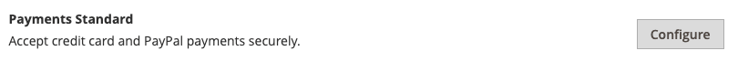
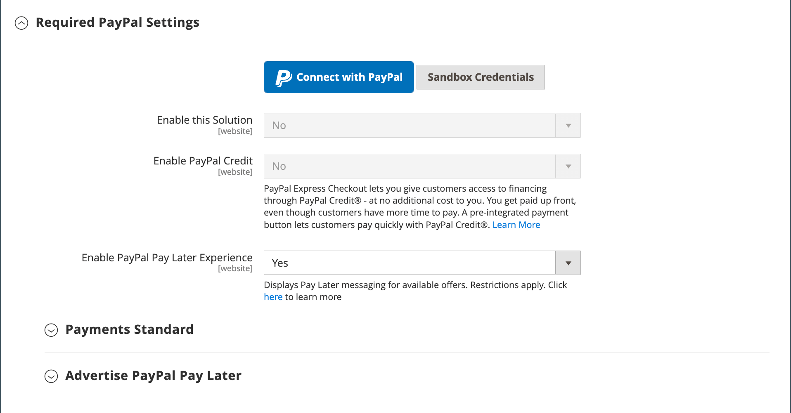
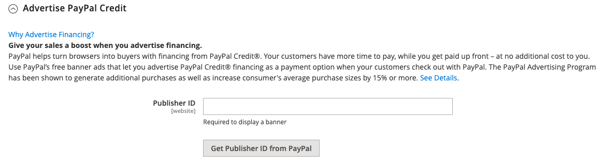

# PayPal Payments Standard

[PayPal Payments Standard](https://developer.paypal.com/docs/paypal-payments-standard/mobile-paypal-payments-standard/) is the easiest way to accept payments online. You can offer your customers the convenience of payment both by credit card and PayPal by simply adding a checkout button to your store.

>[!NOTE]
>
>For merchants outside the US, it is called _PayPal Website Payments Standard_.

With PayPal Payments Standard, you can swipe credit cards on mobile devices. There is no monthly fee and you can get paid through eBay. Supported credit cards include Visa, MasterCard, Discover, and American Express. In addition, customers can pay directly from their personal PayPal accounts. PayPal Payments Standard is available in all countries on the PayPal worldwide reference list.

>[!IMPORTANT]
>
>**PSD2 Requirements:**  
>As of September 14, 2019, European banks might decline payments that do not meet [PSD2](../getting-started/compliance-payment-services-directive.md) requirements. No action is needed for PayPal Payments Standard to comply with PSD2 because all requirements are handled by PayPal.

## Merchant requirements

- [PayPal Business Account](https://www.paypal.com/webapps/mpp/how-to-sell-online)

## Checkout workflow

For customers, PayPal Payments Standard is a one-step process if the credit card information on their personal PayPal accounts is up to date.

1. **Customer Places Order** - The customer clicks/taps the _Pay Now_ button to complete the purchase.

1. **PayPal Processes the Transaction** - The customer is redirected to the PayPal site to complete the transaction.

## Set up PayPal Payments Standard

>[!NOTE]
>
>PayPal Payments Standard cannot be used simultaneously with any other PayPal method, including Express Checkout. If you change payment solutions, the one used previously is disabled.

>[!TIP]
>
>Click **[!UICONTROL Save Config]** at any time to save your progress.

### Step 1: Begin the configuration

This setup method assumes you have an existing PayPal account.

1. On the _Admin_ sidebar, go to **[!UICONTROL Stores]** > _[!UICONTROL Settings]_ > **[!UICONTROL Configuration]**.

1. In the left panel, expand **[!UICONTROL Sales]** and choose **[!UICONTROL Payment Methods]**.

1. If your Commerce installation has multiple websites, stores, or views, set **[!UICONTROL Store View]** to the store view where you want to apply this configuration.

1. In the _[!UICONTROL Merchant Location]_ section, select the **[!UICONTROL Merchant Country]** where your business is located.

   This setting determines the selection of PayPal Solutions that appear in the configuration.

   {width="600" zoomable="yes"}

1. Expand **[!UICONTROL PayPal All-in-One Payment Solutions]** and click **[!UICONTROL Configure]** for **[!UICONTROL Payments Standard]**.

   {width="700" zoomable="yes"}

### Step 2: Enable and connect your PayPal account

{width="600" zoomable="yes"}

1. Connect your account for test or production:

   - For testing (development) mode, click **[!UICONTROL Sandbox Credentials]** and enter your [PayPal sandbox](https://developer.paypal.com/docs/api-basics/sandbox/) credentials.
   - For production mode, click **[!UICONTROL Connect with PayPal]** and enter you production account credentials.

   When your connection is validated, you can proceed.

1. Set **[!UICONTROL Enable this Solution]** to `Yes`.

1. If you want to offer [PayPal Credit](paypal.md#paypal-credit-and-pay-later) to your customers, set **[!UICONTROL Enable PayPal Credit]** to `Yes`.

### Step 3: Complete the Payments Standard settings

1. Expand  the **[!UICONTROL Payments Standard]** section.

   {width="600" zoomable="yes"}

1. Enter the **[!UICONTROL Email Associated with your PayPal Merchant Account]**.

   >[!IMPORTANT]
   >
   >Email addresses are case-sensitive. To receive payment, the email address you enter must match the email address specified in your PayPal merchant account.

   If you do not have a PayPal account, click **[!UICONTROL Start accepting payments via PayPal]**.

1. Set **[!UICONTROL API Authentication Methods]** to one of the following:

   - `API Signature` - This PayPal authentication method is the easiest to implement, and is based on your user name, password, and a unique string of characters and numbers that identifies your account. API Signature credentials do not expire.
   - `API Certificate` - This PayPal authentication method is more secure, is based on your user name, password, and a downloadable certificate. API Credentials expire after three years, and must be renewed.

   If necessary, complete the following:

   - **[!UICONTROL API Username]**
   - **[!UICONTROL API Password]**
   - **[!UICONTROL API Signature]**

1. If you are using credentials from your sandbox account, set **[!UICONTROL Sandbox Mode]** to `Yes`.

   When testing the configuration in a sandbox, use only [credit card numbers](https://www.paypalobjects.com/en_AU/vhelp/paypalmanager_help/credit_card_numbers.htm) that are recommended by PayPal. When you are ready to go to production, return to the configuration and set Sandbox Mode to `No` and connect to your production PayPal account.

1. If your system uses a proxy server to establish the connection between Adobe Commerce or Magento Open Source and the PayPal payment system, set **[!UICONTROL API Uses Proxy]** to `Yes` and complete the following:

   - **[!UICONTROL Proxy Host]**
   - **[!UICONTROL Proxy Port]**

### Step 4: Set up Advertise PayPal Credit / Advertise PayPal PayLater (optional)

Starting with the 2.4.3 release, PayPal PayLater is supported in deployments that include PayPal. This feature allows shoppers to pay for an order in bi-weekly installments instead of paying the full amount at time of purchase. The PayPal Credit experience is deprecated.

Set **[!UICONTROL Enable PayPal PayLater Experience]** to one of the following:

- `Yes` - To set up Advertise PayPal PayLater
- `No` - To set up Advertise PayPal Credit

#### Advertise PayPal Credit

1. Expand  the **[!UICONTROL Advertise PayPal Credit]** section.

   {width="600" zoomable="yes"}

1. To get your account information, click **[!UICONTROL Get Publisher ID from PayPal]** and follow the instructions.

1. Enter your **[!UICONTROL Publisher ID]**.

   {width="600" zoomable="yes"}

1. Expand  the **[!UICONTROL Home Page]** section.

1. To place a banner on the page, set **[!UICONTROL Display]** to `Yes`.

1. Set **[!UICONTROL Position]** to one of the following:

   - `Header (center)`
   - `Sidebar (right)`

1. Set **[!UICONTROL Size]** to one of the following:

   - `190 x 100`
   - `234 x 60`
   - `300 x 50`
   - `468 x 60`
   - `728 x 90`
   - `800 x 66`

1. Expand  the remaining sections and repeat the previous steps:

   - **[!UICONTROL Catalog Category Page]**
   - **[!UICONTROL Catalog Product Page]**
   - **[!UICONTROL Checkout Cart Page]**

#### Advertise PayPal PayLater

1. Expand  the **[!UICONTROL Advertise PayPal PayLater]** section.

1. Set **[!UICONTROL Enable PayPal PayLater]** to `Yes`.

1. Expand  the **[!UICONTROL Home Page]** section.

   {width="600" zoomable="yes"}

1. To place a banner on the page, set **[!UICONTROL Display]** to `Yes`.

1. Set **[!UICONTROL Position]** to one of the following:

   - `Header (center)`
   - `Sidebar`

1. Set **[!UICONTROL Style Layout]** to one of the following:

   - `Text`
   - `Flex`

1. For [!UICONTROL Style Layout] **[!UICONTROL Text]** only, set **[!UICONTROL Logo Type]** to one of the following:

   - `Primary`
   - `Alternative`
   - `Inline`
   - `None`

1. For [!UICONTROL Style Layout] **[!UICONTROL Text]** only, set **[!UICONTROL Logo Position]** to one of the following:

   - `Left`
   - `Right`
   - `Top`

1. For [!UICONTROL Style Layout] **[!UICONTROL Text]** only, set **[!UICONTROL Text Color]** to one of the following:

   - `Black`
   - `White`
   - `Monochrome`
   - `Grayscale`

1. For [!UICONTROL Style Layout] **[!UICONTROL Text]** only, set **[!UICONTROL Text Size]** to one of the following:

   - `10px`
   - `11px`
   - `12px`
   - `13px`
   - `14px`
   - `15px`
   - `16px`

1. For [!UICONTROL Style Layout] **[!UICONTROL Flex]** only, set **[!UICONTROL Ratio]** to one of the following:

   - `1x1`
   - `1x4`
   - `8x1`
   - `20x1`

1. For [!UICONTROL Style Layout] **[!UICONTROL Flex]** only, set **[!UICONTROL Color]** to one of the following:

   - `Blue`
   - `Black`
   - `White`
   - `White No Border`
   - `Gray`
   - `Monochrome`
   - `Grayscale`

1. Expand  the remaining sections and repeat the previous steps:

   - **[!UICONTROL Catalog Product Page]**
   - **[!UICONTROL Checkout Cart Page]**
   - **Checkout Payment Step**
   - **[!UICONTROL Catalog Category Page]**

### Step 5: Complete the basic settings

1. Expand  the **[!UICONTROL Basic Settings - PayPal Website Payments Standard]** section.

   {width="600" zoomable="yes"}

1. For **[!UICONTROL Title]**, enter a title that identifies this payment method during checkout.

   It is recommended that you use the title _PayPal_ for all store views.

1. If you offer multiple payment methods, enter a number for **[!UICONTROL Sort Order]** to determine the sequence in which PayPal Payments Standard appears when listed with the other payment methods.

   This number is relative to the other payment methods. (`0` = first, `1` = second, `2` = third, and so on.)

1. Set **[!UICONTROL Payment Action]** to one of the following:

   - `Authorization` - Approves the purchase and puts a hold on the funds. The amount is not withdrawn until it is captured by the merchant.
   - `Sale` - The amount of the purchase is authorized and immediately withdrawn from the customer's account.

1. To display the _[!UICONTROL Check out with PayPal]_ button on the product page, set **[!UICONTROL Display on Product Details Page]** to `Yes`.

### Step 6: Complete the advanced Settings

1. Expand  the **[!UICONTROL Advanced Settings]** section.

   {width="600" zoomable="yes"}

1. To make PayPal Payments Standard available from both the shopping cart and mini cart, set **[!UICONTROL Display on Shopping Cart]** to `Yes`.

1. Set **[!UICONTROL Payment from Applicable Countries]** to one of the following:

   - `All Allowed Countries` - Customers from all [countries](../getting-started/store-details.md#country-options) specified in your store configuration can use this payment method.
   - `Specific Countries` - After you choose this option, the _[!UICONTROL Payment from Specific Countries]_ list appears. To select multiple countries, hold down the Ctrl key (PC) or the Command key (Mac) and click each option.

1. To record communications with the payment system in the log file, set **[!UICONTROL Debug Mode]** to `Yes`.

   >[!NOTE]
   >
   >The log file is stored on the server and is accessible only to developers. In accordance with PCI Data Security Standards, credit card information is not recorded in the log file.

1. To enable SSL verification, set **[!UICONTROL Enable SSL Verification]** to `Yes`.

1. To display a summary of each line item in the order on your PayPal payments page, set **[!UICONTROL Transfer Cart Line Items]** to `Yes`.

   To include up to ten shipping options in the summary, set **[!UICONTROL Transfer Shipping Options]** to `Yes`. (This option appears only if line items are set to transfer.)

1. To determine the type of image that is used for the PayPal acceptance button, set **[!UICONTROL Shortcut Buttons Flavor]** to one of the following:

   - `Dynamic` - (Recommended) Displays an image that can be dynamically changed from the PayPal server.
   - `Static` - Displays a specific image that cannot be dynamically changed.

1. To allow customers who do not have a PayPal account to make a purchase with this method, set **[!UICONTROL Enable PayPal Guest Checkout]** to `Yes`.

1. Set **[!UICONTROL Require Customer's Billing Address]** to one of the following:

   - `Yes` - Requires the customer billing address for all purchases.
   - `No` - Does not require the customer billing address for any purchases.
   - `For Virtual Quotes Only` - Requires the customer billing address for virtual quotes only.

1. To allow a customer to enter into a [PayPal billing agreement](paypal-billing-agreements.md) with your store when there are no active billing agreements available in the customer account, set **[!UICONTROL Billing Agreement Signup]** to one of the following:

   - `Auto` - The customer can either enter into a billing agreement during the Express Checkout flow or use another method of payment.
   - `Ask Customer` - The customer can decide whether to enter into a billing agreement during the Express Checkout workflow.
   - `Never` - The customer cannot enter into a billing agreement during the Express Checkout workflow.

   >[!NOTE]
   >
   >Merchants must request PayPal Merchant Technical Support to enable billing agreements in their accounts. The _Billing Agreement Signup_ parameter can be enabled only after PayPal confirms that billing agreements are enabled for your merchant account.

1. To allow the customer to complete the transaction from the PayPal site without returning to your store for Order Review, set **[!UICONTROL Skip Order Review Step]** to `Yes`.

### Step 7: Complete and save the configuration settings

1. Complete the following sections, as needed for your store:

   - [PayPal Billing Agreement Settings](#paypal-billing-agreement-settings)
   - [Settlement Report Settings](#settlement-report-settings)
   - [Frontend Experience Settings](#frontend-experience-settings)

1. When complete, click **[!UICONTROL Save Config]**.

#### PayPal Billing Agreement Settings

A [billing agreement](paypal-billing-agreements.md) is a sales agreement between the merchant and customer that has been authorized by PayPal for use with multiple orders. During the checkout process, the Billing Agreement payment option appears only for customers who have already entered into a billing agreement with your company. After PayPal authorizes the agreement, the payment system issues a unique reference ID to identify each order that is associated with the agreement. Similar to a purchase order, there is no limit to the number of billing agreements a customer can set up with your company.

1. Expand  the **[!UICONTROL PayPal Billing Agreement Settings]** section.

   {width="600" zoomable="yes"}

1. Set **[!UICONTROL Enabled]** to `Yes`.

1. For **[!UICONTROL Title]**, enter a title that identifies the PayPal Billing Agreement method during checkout.

1. If you offer multiple payment methods, enter a number in the **[!UICONTROL Sort Order]** field to determine the sequence in which Billing Agreement appears when listed with other payment methods during checkout.

1. Set **[!UICONTROL Payment Action]** to one of the following:

   - `Authorization` - Approves the purchase and puts a hold on the funds. The amount is not withdrawn until it is "captured" by the merchant.
   - `Sale` - The amount of the purchase is authorized and immediately withdrawn from the customer's account.

1. Set **[!UICONTROL Payment Applicable From]** to one of the following:

   - `All Allowed Countries` - Customers from all countries specified in your store configuration can use this payment method.
   - `Specific Countries` - After choosing this option, the _[!UICONTROL Payment from Specific Countries]_ list appears. To select multiple countries, hold down the Ctrl key (PC) or the Command key (Mac) and click each one.

1. To record communications with the payment system in the log file, set **[!UICONTROL Debug Mode]** to `Yes`.

   >[!NOTE]
   >
   >The log file is stored on the server and is accessible only to developers. In accordance with PCI Data Security Standards, credit card information is not recorded in the log file.

1. To enable SSL verification, set **[!UICONTROL Enable SSL Verification]** to `Yes`.

1. To display a summary of each line item in the customer's order on your PayPal payments page, set **[!UICONTROL Transfer Cart Line Items]** to `Yes`.

1. To allow customers to initiate a billing agreement from the dashboard of their customer account, set **[!UICONTROL Allow in Billing Agreement Wizard]** to `Yes`.

#### Settlement Report Settings

1. Expand  the **[!UICONTROL Settlement Report Settings]** section.

   {width="600" zoomable="yes"}

1. For **[!UICONTROL SFTP Credentials]**, do the following:

   - If you have signed up for the PayPal Secure FTP Server, enter the following SFTP login credentials:

      - Login
      - Password

   - To run test reports before going live with Express Checkout on your site, set **[!UICONTROL Sandbox Mode]** to `Yes`.

   - Enter the **[!UICONTROL Custom Endpoint Hostname or IP Address]**.

      By default, the value is `reports.paypal.com`.

   - Enter the **[!UICONTROL Custom Path]** where reports are saved.

      By default, the value is `/ppreports/outgoing`.

1. To generate reports according to a schedule, complete the **[!UICONTROL Scheduled Fetching]** settings:

   - Set **[!UICONTROL Enable Automatic Fetching]** to `Yes`.

   - Set **[!UICONTROL Schedule]** to one of the following:

      - `Daily`
      - `Every 3 Days`
      - `Every 7 Days`
      - `Every 10 Days`
      - `Every 14 Days`
      - `Every 30 Days`
      - `Every 40 Days`

      PayPal retains each report for 45 days.

   - Set **[!UICONTROL Time of Day]** to the hour, minute, and second when you want the reports to be generated.

#### Frontend Experience Settings

Use the _[!UICONTROL Frontend Experience Settings]_ to choose which PayPal logos appear on your site, and to customize the appearance of your PayPal merchant pages.

1. Expand  the **[!UICONTROL Frontend Experience Settings]** section.

   {width="600" zoomable="yes"}

1. Select the **[!UICONTROL PayPal Product Logo]** that you want to appear in the PayPal block in your store.

   The PayPal logos are available in four styles and two sizes:

   - `No Logo`
   - `We Prefer PayPal (150 x 60 or 150 x 40)`
   - `Now Accepting PayPal (150 x 60 or 150 x 40)`
   - `Payments by PayPal (150 x 60 or 150 x 40)`
   - `Shop Now Using PayPal (150 x 60 or 150 x 40)`

1. To customize the appearance of your PayPal merchant pages:

   - Enter the name of the **[!UICONTROL Page Style]** that you want to apply to your PayPal merchant pages:

      - `paypal` - Uses the PayPal page style.
      - `primary` - Uses the page style that you identified as the _primary_ style in your account profile.
      - `your_custom_value` - Uses a custom payment page style, which is specified in your account profile.

   - For **[!UICONTROL Header Image URL]**, enter the URL of the image that you want to appear in the upper-left corner of the payment page. The maximum file size is 750 pixels wide by 90 pixels high.

      >[!NOTE]
      >
      >PayPal recommends that the image resides on a secure (https) server. Otherwise, a browser may warn that _the page contains both secure and nonsecure items_.

   - To set the color for your pages, enter the six-character hexadecimal code, without the `#` symbol, for each of the following:

      - **[!UICONTROL Header Background Color]** - Background color for the checkout page header.
      - **[!UICONTROL Header Border Color]** - Color for two-pixel border around the header.
      - **[!UICONTROL Page Background Color]** - Background color for the checkout page and around the header and payment form.
