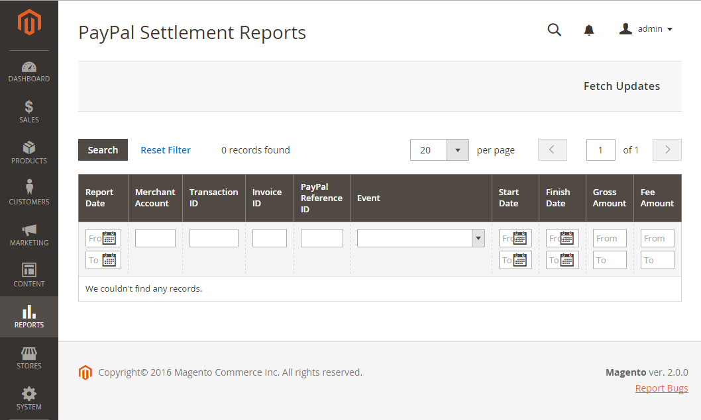

# PayPal Settlement report

The PayPal Settlement report provides merchants with the information about each transaction that affects the settlement of funds.

>[!NOTE]
>
>Before generating settlement reports, the store administrator must request PayPal Merchant Technical Services to create an SFTP user account, enable settlement reports generation, and enable SFTP in their PayPal business account.

After configuring and enabling settlement reports in the PayPal merchant account, Adobe Commerce and Magento Open Source will start generating reports during the following 24 hours. The list of available settlement reports can be viewed from the Admin.

<!-- zoom -->

**_To view settlement reports:_**

1. On the _Admin_ sidebar, go to **[!UICONTROL Reports]** > _[!UICONTROL Sales]_ > **[!UICONTROL PayPal Settlement]**.

1. For the most recent updates, click **[!UICONTROL Fetch Updates]** in the upper-right corner.

   The system connects to the PayPal SFTP server to fetch the reports. When the process is complete, a message appears with the number of reports fetched. The report includes the following information for each transaction:

   |Report column | Description |
   | ------------ | ----------- |
   | [!UICONTROL PayPal Reference ID Type] | One of the following reference codes: - Order IDT - Transaction ID - Subscription ID |
   | [!UICONTROL Preapproved Payment ID] | **[!UICONTROL Custom]** - The text entered by the merchant on the transaction at PayPal. **[!UICONTROL Transaction Debit or Credit]** - The direction of money movement of gross amount. **[!UICONTROL Fee Debit or Credit]** - The direction of money movement for fee. |

   {style="table-layout:auto"}
