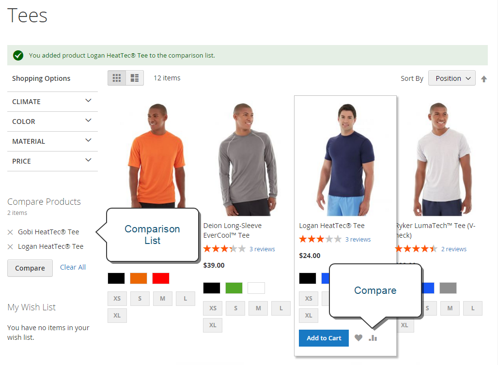
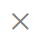
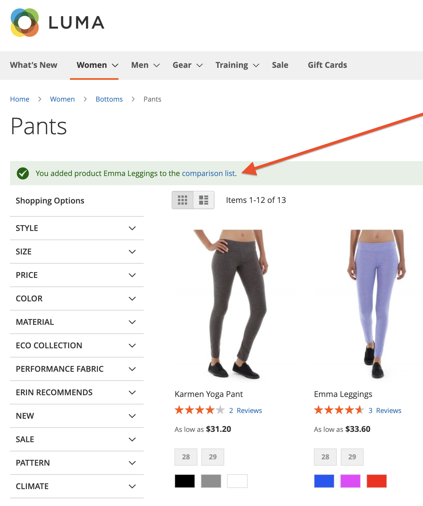
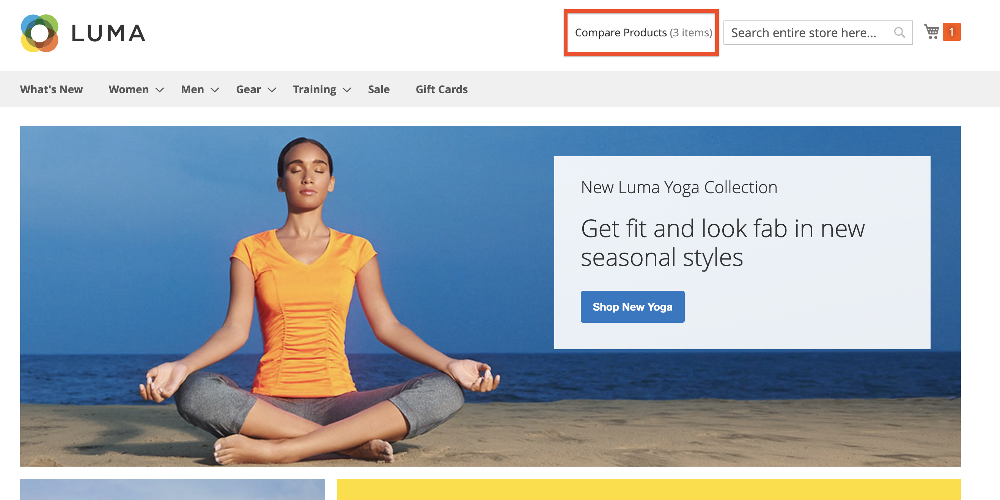
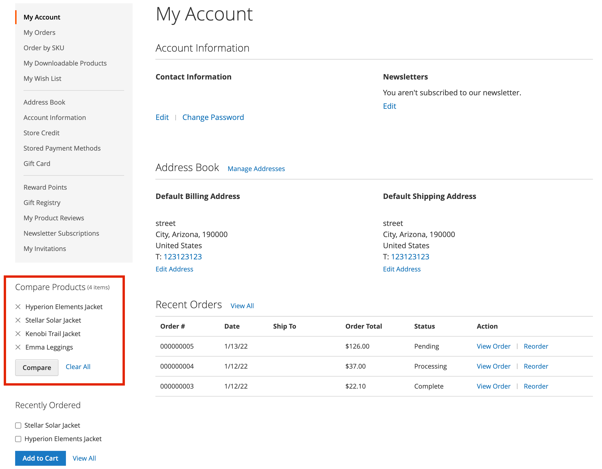

# Compare products

Compare Products generates a detailed, side-by-side comparison of two or more products. Depending on the theme, the Add to Compare link might be represented by an icon or text. The _Compare Products_ block usually appears in either the left or right sidebar of a catalog page.

{width="700" zoomable="yes"}

Unlike the [Recently Viewed / Compared Products ](products-viewed-compared.md) block, the Admin does not include additional configuration settings for Compare Products.

## Compare products on the storefront

There are a few ways to use comparison list on the storefront.

### From catalog pages

1. The customer finds the products that they want to compare and clicks the **[!UICONTROL Add to Compare]** link for each.

1. Navigates to an associated category page.

   Depending on the theme and page layout, there might be a _Compare Products_ block in the sidebar. If so, the items in the category that are marked for comparison are listed.

   The customer can click _Delete_ (  ) for any product to remove it from the comparison report, or click **[!UICONTROL Clear All]** to remove all items and start over with your compare selections.

1. Clicks **[!UICONTROL Compare]**.

1. To print the comparison information, clicks **[!UICONTROL Print This Page]**.

1. To remove a single product from the comparison page, clicks _Delete_ (  ).

### From a notification message

1. After a customer adds a product to a comparison list, the page displays a notification message.

1. In the displayed top message notification, click the _comparison list_ link.

   {width="700" zoomable="yes"}

This action redirects the customer to the comparison list where they can access additional actions.

### From the _Compare Products_ block

1. The customer finds the products that they want to compare and clicks the **[!UICONTROL Add to Compare]** link for each.

1. In the header near the search field, clicks the _Compare Products_ link.

   {width="700" zoomable="yes"}

### From the My Account dashboard

1. The customer adds needed products to the comparison list.

1. Navigates to **[!UICONTROL My Account]**.

1. In the _Compare Products_ block, clicks **[!UICONTROL Compare]**.

   {width="700" zoomable="yes"}

## Additional comparison list actions

|[!UICONTROL Action]|Description|
|------|-----------|
| | Deletes a single item from comparison list.|
|**[!UICONTROL Add to Cart]** | Adds product into shopping cart. If the product has any configurations, the page redirects the customer to the product page where they select the configurable options and then click **[!UICONTROL Add to Cart]**.|
|_Wishlist icon_ | Adds product into wishlist (requires wishlist functionality enabled in store configuration).|
|_Print This Page_ | Prints comparison list page.|

{style="table-layout:auto"}
